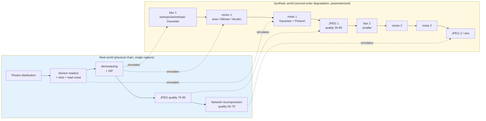
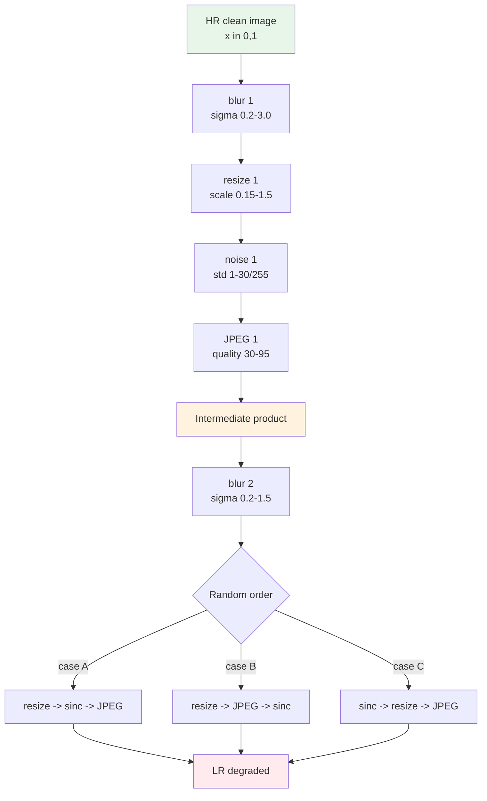
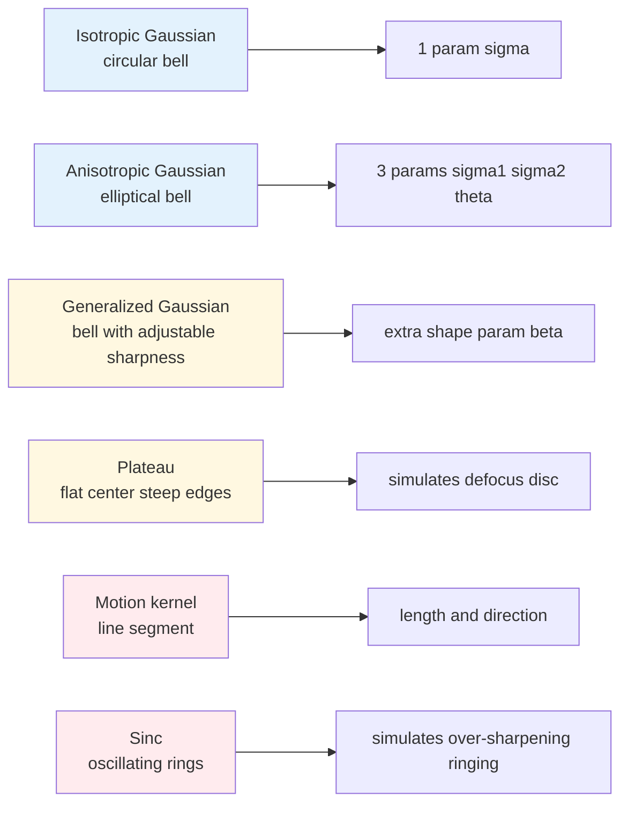
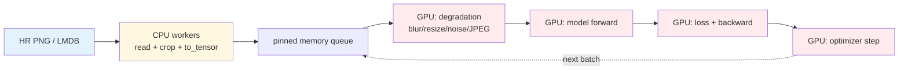

# Chapter 5 · Data and Degradation Synthesis

> In image restoration, an enduring engineering maxim holds: **the defining contribution of Real-ESRGAN was not its network architecture, but its synthetic data pipeline**.
>
> This chapter provides a complete breakdown of that principle.

## 5.0 Reading Notes

This chapter concludes Part I (Foundations) and represents the most implementation-focused section of this book. The theoretical principles established across the preceding four chapters translate here directly into PyTorch data pipelines, GPU acceleration workflows, and training loop designs.

This chapter builds upon several foundational concepts:

- The compound degradation operator $D$ formulated as a stochastic composition of heterogeneous distortions (introduced in Section 1.5).
- The distinction between pixel, feature, and latent representation spaces (Chapters 2 and 3).
- The evaluation methodologies and dataset biases analyzed in Chapter 4.

**Key Terminology Introduced in This Chapter:**

- **Real-ESRGAN**: A landmark blind super-resolution system (Wang et al., 2021) demonstrating that stochastic second-order degradation pipelines drive real-world generalization.
- **BSRGAN** (Blind Super-Resolution GAN): A contemporaneous framework (Zhang et al., 2021) that randomized the operational order of degradation primitives.
- **SRMD** (Super-Resolution with Multiple Degradations): An early non-blind architecture that accepted degradation parameter maps as auxiliary conditioning inputs.
- **KernelGAN**: An internal-learning framework estimating instance-specific blur kernels directly from test images.
- **RRDB** (Residual-in-Residual Dense Block): The deep residual backbone established in ESRGAN and retained in Real-ESRGAN (analyzed in Chapter 6).
- **DiffJPEG**: A differentiable GPU implementation of JPEG compression enabling batched online codec simulation.
- **LMDB** (Lightning Memory-Mapped Database): A high-throughput key-value storage engine used to eliminate disk I/O bottlenecks during large-scale training.
- **USM** (Unsharp Mask): A classical spatial sharpening operator that isolates and amplifies high-frequency image gradients.
- **Chroma Subsampling**: The lossy decimation of color chrominance channels ($\text{Cb}/\text{Cr}$) standard in JPEG and digital video codecs.

## 5.1 The Data-Centric Paradigm in Image Restoration

From 2014 through 2020, restoration research followed a consistent structural pattern:
1. Synthesize low-resolution inputs via deterministic bicubic downsampling.
2. Optimize deep neural architectures on these idealized datasets.
3. Deploy models into production, where they underperform on physical camera captures.

Real-ESRGAN (2021) demonstrated the impact of data formulation through a controlled experiment:

| Model Architecture | Training Data Synthesis Pipeline | Real-World Capture PSNR | Visual Restoration Quality |
|-------------------|----------------------------------|-------------------------|----------------------------|
| ESRGAN (RRDB Backbone) | Deterministic Bicubic Decimation | 18.2 dB | Severe failure; noise amplification |
| **Real-ESRGAN (Identical RRDB Backbone)** | **Stochastic Second-Order Degradation** | **23.8 dB** | **Sharp, robust detail recovery** |

Holding the network architecture constant while redesigning the synthetic data pipeline transformed model behavior from unusable to production-ready.

This pattern recurs across restoration sub-domains:
- Denoising models optimized exclusively on synthetic AWGN fail on physical CMOS readouts; fine-tuning on calibrated sensor datasets (such as SIDD) restores performance.
- Modern generative restoration backbones (such as SUPIR) rely on web-scale photographic corpora paired with randomized multi-stage degradation synthesis.

Engineering takeaway:

> In real-world image restoration, **the data synthesis pipeline establishes the functional capability ceiling of the model**.
>
> An advanced architecture trained on naive synthetic data fails on real-world inputs; an established architecture trained on comprehensive composite degradations generalizes reliably.

## 5.2 Training Data Paradigms: Synthetic vs. Real-World Pairs

### Synthetic Data Generation

High-resolution ground-truth images ($x$) are passed through stochastic forward degradation operators in software to generate synthetic low-quality inputs ($y$):

```python
# Conceptual data generation loop
for hr in high_quality_images:
    lr = degradation_pipeline(hr)
    yield (lr, hr)
```

Advantages:
- **Unlimited Volume**: Pairs can be generated dynamically from arbitrary high-resolution image collections.
- **Cost Efficiency**: Bypasses expensive multi-camera optical calibration rigs.
- **Parametric Controllability**: Individual degradation parameters can be balanced, ablated, and modulated programmatically.

Limitations:
- Synthetic models risk domain mismatch if unmodeled physical capture artifacts are omitted.

### Physical Real-World Capture Pairs

Paired captures $(x, y)$ are acquired physically via synchronized hardware setups:
- **Optical Focal Length Stepping** (e.g., RealSR, DRealSR): Capturing a static scene using a telephoto lens (for ground truth $x$) and a wide-angle lens (for low-resolution $y$).
- **Multi-Device Optical Beam Splitters** (e.g., DPED): Co-aligning a high-end DSLR alongside a mobile smartphone sensor via optical prisms.

Advantages:
- Incorporates physical photon noise, lens aberrations, and hardware ISP processing pipelines.

Limitations:
- Small dataset scale (typically restricted to hundreds or thousands of static frames).
- Susceptible to sub-pixel spatial misalignments, geometric parallax, and lighting fluctuations between exposures.
- Overfits to the specific sensor profiles of the capture hardware.

Production standard: **train primary representations on large-scale synthetic pipelines, followed by domain fine-tuning on calibrated real-world datasets**.

## 5.3 Limitations of Idealized Bicubic Downsampling

Real-world smartphone captures undergo a complex chain of physical and digital operations:

```
Physical smartphone capture pipeline:
  Scene Irradiance 
    → Sensor Transduction (Poisson shot noise + electronic read noise)
    → Hardware ISP (Demosaicing + bad-pixel correction + local tone mapping + sharpening)
    → Primary JPEG Compression (Quality Factor 75–95)
    → Social Platform Ingestion (Downscaling + recompression, Quality Factor 50–70)
    → Local Display Caching (Potential secondary color-space conversion)
```

Demosaicing interpolates raw Bayer-pattern sensor arrays (where each pixel records only a single color component) into three-channel RGB tensors, introducing localized inter-channel correlations.

Bicubic decimation models none of these physical behaviors. It assumes input signals undergo continuous anti-aliased linear spatial filtering. When an inverse model trained exclusively on bicubic data processes a real smartphone capture, it misidentifies sensor noise and JPEG quantization boundaries as high-frequency edge structures, amplifying artifacts into severe visual distortions.



## 5.4 The Real-ESRGAN Second-Order Degradation Pipeline

Real-ESRGAN resolves domain mismatch through two architectural principles:

1. **Continuous Parameter Randomization**: Degradation parameters (blur bandwidth, noise variance, decimation scaling, and codec quality) are sampled continuously across broad statistical distributions.
2. **Second-Order Degradation Modeling**: The entire forward degradation sequence is applied iteratively across two consecutive stages, simulating cascaded in-device capture and subsequent network recompression.

```
First-order degradation (simulating in-camera capture):
  HR Ground Truth → Blur₁ → Decimation₁ → Noise₁ → JPEG₁ → Intermediate Tensor

Second-order degradation (simulating network transmission and recompression):
  Intermediate Tensor → Blur₂ → Decimation₂ → Noise₂ → JPEG₂ / Sinc Filtering → LR Input
```

Stage parameters are configured with distinct physical characteristics:
- First-order blur uses a wider kernel bandwidth to model camera defocus and motion.
- Second-order blur uses smaller kernels to avoid over-degrading training signals.
- Sinc filtering is introduced in the second stage to model ringing artifacts induced by upstream unsharp masking and aggressive digital sharpening.
- The operational sequence of the final decimation, sinc filtering, and JPEG stages is randomized at each training iteration.



### Reference Implementation of the Synthetic Pipeline

```python
import random
import torch
import torch.nn.functional as F
from typing import Optional


class RealESRGANDegradation:
    """Simplified implementation of the Real-ESRGAN second-order degradation pipeline.
    Input: High-resolution clean tensor (B, 3, H, W) normalized in [0, 1].
    Output: Low-resolution degraded tensor (B, 3, H/scale, W/scale).
    """

    def __init__(self, scale: int = 4):
        self.scale = scale

        # First-order degradation parameter distributions
        self.blur1_sigma_range = (0.2, 3.0)
        self.noise1_range = (1, 30)         # Standard deviation scaled to [0, 255]
        self.jpeg1_range = (30, 95)
        self.resize1_range = (0.15, 1.5)

        # Second-order degradation parameter distributions (attenuated bandwidth)
        self.blur2_sigma_range = (0.2, 1.5)
        self.noise2_range = (1, 25)
        self.jpeg2_range = (30, 95)
        self.resize2_range = (0.3, 1.2)

    # ============= Blur Operator =============
    def random_gaussian_blur(self, x: torch.Tensor,
                             sigma_range: tuple) -> torch.Tensor:
        sigma = random.uniform(*sigma_range)
        ksize = max(3, 2 * int(3 * sigma) + 1)
        kernel = self._gaussian_kernel_2d(ksize, sigma).to(x)
        kernel = kernel.expand(x.shape[1], 1, ksize, ksize)
        pad = ksize // 2
        return F.conv2d(
            F.pad(x, [pad] * 4, mode='reflect'),
            kernel,
            groups=x.shape[1]
        )

    @staticmethod
    def _gaussian_kernel_2d(ksize: int, sigma: float) -> torch.Tensor:
        ax = torch.arange(ksize).float() - ksize // 2
        gauss = torch.exp(-(ax ** 2) / (2 * sigma ** 2))
        kernel = gauss[:, None] * gauss[None, :]
        kernel = kernel / kernel.sum()
        return kernel.unsqueeze(0).unsqueeze(0)

    # ============= Decimation Operator =============
    def random_resize(self, x: torch.Tensor, target_size: tuple,
                      scale_range: tuple) -> torch.Tensor:
        s = random.uniform(*scale_range)
        h, w = target_size
        new_h = max(1, int(h * s))
        new_w = max(1, int(w * s))
        mode = random.choice(['bilinear', 'bicubic', 'area'])
        kw = {'mode': mode}
        if mode in ('bilinear', 'bicubic'):
            kw['align_corners'] = False
        return F.interpolate(x, size=(new_h, new_w), **kw)

    # ============= Noise Injection Operator =============
    def random_noise(self, x: torch.Tensor,
                     sigma_range_255: tuple) -> torch.Tensor:
        choice = random.random()
        sigma_max = random.uniform(*sigma_range_255) / 255.0

        if choice < 0.4:
            # Independent multi-channel Gaussian noise
            return (x + torch.randn_like(x) * sigma_max).clamp(0, 1)
        elif choice < 0.7:
            # Grayscale Gaussian noise (spatially identical across channels)
            n = torch.randn(x.shape[0], 1, x.shape[2], x.shape[3], device=x.device)
            return (x + n * sigma_max).clamp(0, 1)
        else:
            # Poisson shot noise simulation
            scale = random.uniform(80, 1000)
            photons = (x * scale).clamp(min=0)
            return (torch.poisson(photons) / scale).clamp(0, 1)

    # ============= Differentiable JPEG Placeholder =============
    def random_jpeg(self, x: torch.Tensor, quality_range: tuple) -> torch.Tensor:
        # In production pipelines, replace with DiffJPEG GPU module
        return x

    def first_order(self, hr: torch.Tensor, target_size: tuple) -> torch.Tensor:
        x = self.random_gaussian_blur(hr, self.blur1_sigma_range)
        x = self.random_resize(x, target_size, self.resize1_range)
        x = self.random_noise(x, self.noise1_range)
        x = self.random_jpeg(x, self.jpeg1_range)
        return x

    def second_order(self, x: torch.Tensor, target_size: tuple) -> torch.Tensor:
        x = self.random_gaussian_blur(x, self.blur2_sigma_range)
        x = self.random_resize(x, target_size, self.resize2_range)
        x = self.random_noise(x, self.noise2_range)
        x = self.random_jpeg(x, self.jpeg2_range)
        return x

    def __call__(self, hr: torch.Tensor) -> torch.Tensor:
        b, c, h, w = hr.shape
        out_h, out_w = h // self.scale, w // self.scale

        # Execute two-stage forward degradation
        intermediate = self.first_order(hr, target_size=(out_h, out_w))
        lr = self.second_order(intermediate, target_size=(out_h, out_w))

        # Enforce final spatial dimensions
        lr = F.interpolate(lr, size=(out_h, out_w),
                           mode='bicubic', align_corners=False)
        return lr.clamp(0, 1)
```

## 5.5 Advanced Blur Kernel Modeling

Real-world optical systems introduce non-Gaussian blur profiles:



### Anisotropic Gaussian Kernels

$$
k(u, v) \propto \exp\left(-\frac{1}{2} \begin{pmatrix} u \\ v \end{pmatrix}^T \Sigma^{-1} \begin{pmatrix} u \\ v \end{pmatrix}\right), \quad \Sigma = R(\theta) \begin{pmatrix} \sigma_1^2 & 0 \\ 0 & \sigma_2^2 \end{pmatrix} R(\theta)^T
$$

Parameterized by rotation angle $\theta$ and directional scales $\sigma_1, \sigma_2$, anisotropic Gaussians model directional motion jitter and optical astigmatism.

### Generalized Gaussian and Plateau Kernels

$$
k(u, v) \propto \exp\left(-\left( \frac{u^2}{\sigma_x^2} + \frac{v^2}{\sigma_y^2} \right)^\beta\right)
$$

Varying shape factor $\beta$ transitions between heavy-tailed distributions ($\beta < 1$) and flat-top disc approximations ($\beta > 1$), simulating out-of-focus aperture discs.

### Trajectory-Based Motion Blur Kernels

Linear camera or subject motion sweeps point sources into directional line segments:

```python
import numpy as np
import torch

def motion_blur_kernel(length: int, angle_deg: float) -> torch.Tensor:
    """Generates a normalized 2D linear motion blur kernel."""
    kernel = np.zeros((length, length), dtype=np.float32)
    angle = np.deg2rad(angle_deg)
    cx, cy = length // 2, length // 2
    for i in range(length):
        dx = int(round(cx + (i - cx) * np.cos(angle)))
        dy = int(round(cy + (i - cx) * np.sin(angle)))
        if 0 <= dx < length and 0 <= dy < length:
            kernel[dy, dx] = 1.0
    kernel /= kernel.sum()
    return torch.from_numpy(kernel).unsqueeze(0).unsqueeze(0)
```

### Sinc Filtering and Ringing Simulation

Truncated sinc filters approximate ideal frequency band-limiting, inducing spatial Gibbs oscillations:

$$
k(u, v) = \frac{\omega_c}{2\pi r} J_1(\omega_c r), \quad r = \sqrt{u^2 + v^2}
$$

Including sinc filtering prevents restoration models from mistaking digital over-sharpening halos for genuine structural scene details.

## 5.6 Frequency Dynamics of Decimation Operators

Different spatial decimation operators exhibit distinct frequency-domain responses:

| Decimation Algorithm | Frequency Passband Profile | Structural Artifact Signature | Operational Context |
|----------------------|---------------------------|-------------------------------|---------------------|
| Nearest Neighbor | Unfiltered high-frequency pass | Prominent spatial aliasing / step edges | Low-quality screen rasterization |
| Bilinear Interpolation | Triangular smoothing filter | Moderate attenuation of high frequencies | Balanced real-time scaling |
| Bicubic Decimation | Approximates cubic spline low-pass | Sharp transitions with minor overshoot | Standard academic benchmark |
| Area Averaging (Box) | Rectangular spatial integration | Smooth anti-aliased output | Physical sensor photon accumulation |

Randomly sampling decimation modes ensures networks generalize across heterogeneous scaling algorithms encountered in production.

## 5.7 Physical Sensor Noise Synthesis

Physical CMOS and CCD sensor noise combines signal-dependent photon fluctuations, thermal currents, and analog readout variances:

```python
def realistic_sensor_noise(
    x: torch.Tensor,
    iso: int = 1600,
    quantum_efficiency: float = 0.5,
    read_noise_sigma: float = 0.005,
    dark_current: float = 0.001,
    quant_step: float = 1/255.0,
) -> torch.Tensor:
    """Simulates physical sensor noise across variable analog gain (ISO)."""
    gain = iso / 100.0

    # 1. Poisson shot noise (photon arrival statistics)
    photons = x * 1000 / gain
    photons_noisy = torch.poisson(photons.clamp(min=0))
    shot = photons_noisy / 1000 * gain

    # 2. Thermal dark current noise
    dark = torch.poisson(torch.full_like(x, dark_current * gain)) / 1000

    # 3. Electronic read noise (signal-independent Gaussian)
    read = torch.randn_like(x) * read_noise_sigma * gain

    # 4. Digital ADC quantization
    out = shot + dark + read
    out = (out / quant_step).round() * quant_step
    return out.clamp(0, 1)
```

## 5.8 GPU-Accelerated Differentiable Codec Simulation

JPEG compression partitions images into $8 \times 8$ pixel blocks, computes spatial 2D Discrete Cosine Transforms (DCT), applies coefficient quantization matrices, and encodes residuals.

Executing standard CPU JPEG encoding per sample creates severe dataloader bottlenecks. Production systems employ **DiffJPEG**, performing batched forward codec simulation entirely within GPU memory:

```python
from DiffJPEG import DiffJPEG

# Initialize differentiable GPU JPEG module
jpeg_module = DiffJPEG(differentiable=False, quality=80).to('cuda')

def apply_gpu_jpeg(x: torch.Tensor, quality_range=(30, 95)) -> torch.Tensor:
    """Applies online batched JPEG compression directly on GPU tensors."""
    quality = random.randint(*quality_range)
    return DiffJPEG(differentiable=False, quality=quality).to(x.device)(x)
```

Second-order JPEG compression models non-aligned quantization grids: when intermediate decimation shifts spatial coordinates, subsequent JPEG passes impose secondary $8 \times 8$ block grids that do not align with the initial compression boundaries.

## 5.9 Training Corpora Selection

| Dataset | Sample Count | Spatial Resolution | Domain Characteristics | Primary Application |
|---------|--------------|--------------------|------------------------|---------------------|
| **DIV2K** | 800 Train / 100 Val | 2K ($2048 \times 1080$) | High-fidelity natural photography | Academic benchmark baseline |
| **Flickr2K** | 2,650 | Multi-resolution | Diverse photographic content | Paired with DIV2K (DF2K) |
| **LSDIR** | 84,991 Train / 250 Val | High-resolution | Expansive real-world diversity | Modern large-scale pretraining |
| **FFHQ** | 70,000 | $1024 \times 1024$ | Curated facial portraiture | Blind facial restoration |
| **RealSR / DRealSR** | ~600–800 Pairs | Optical focal pairs | Physical camera captures | Real-world domain fine-tuning |

## 5.10 Constrained Data Augmentation in Low-Level Vision

Data augmentation in low-level vision must preserve the mathematical integrity of the forward degradation model:

- **Permitted Operations**: Horizontal flips, vertical flips, and orthogonal $90^\circ$ spatial rotations (preserving grid coordinates and pixel alignment).
- **Prohibited Operations**: Continuous-angle spatial rotations (which introduce unmodeled interpolation blur), random color jitter (which alters chromatic degradation baselines), and Mixup/CutMix (which violate physical irradiance assumptions).

```python
import torchvision.transforms.functional as TF

def safe_low_level_augment(hr: torch.Tensor, lr: torch.Tensor):
    """Applies coordinate-safe spatial transformations synchronously across paired tensors."""
    if random.random() < 0.5:
        hr, lr = TF.hflip(hr), TF.hflip(lr)
    if random.random() < 0.5:
        hr, lr = TF.vflip(hr), TF.vflip(lr)
    if random.random() < 0.5:
        k = random.choice([1, 2, 3])
        hr, lr = torch.rot90(hr, k, dims=[-2, -1]), torch.rot90(lr, k, dims=[-2, -1])
    return hr, lr
```

## 5.11 Pipeline Optimization and GPU Batching



To eliminate CPU bottlenecks when processing complex synthetic pipelines:
1. CPU worker threads restrict operations to reading high-resolution images, cropping random spatial patches, and loading pinned memory buffers.
2. Pinned tensors transfer to GPU via asynchronous DMA.
3. Degradation operators (blur convolutions, decimation interpolations, noise injection, and DiffJPEG compression) execute in parallel on GPU before feeding the forward model.

## 5.12 Real-World Fine-Tuning Protocols

Production systems leverage a two-stage training strategy:

```
Stage 1: Large-Scale Synthetic Pretraining
  - Datasets: DF2K + LSDIR (80K+ images)
  - Degradation: Stochastic Second-Order Real-ESRGAN Pipeline
  - Duration: 500K–1M iterations
  - Objective: Establish robust general restoration capability

Stage 2: Real-World Paired Domain Fine-Tuning
  - Datasets: Calibrated real captures (e.g., RealSR, DRealSR)
  - Duration: 10K–50K iterations
  - Learning Rate: Reduced by 10× relative to Stage 1 baseline
  - Objective: Calibrate model weights to physical sensor distributions
```

## 5.13 Training Data Quality Auditing

Prior to training, audit source corpora for systemic defects:
- **Pre-existing Compression Traces**: Detect $8 \times 8$ boundary discontinuities in source ground truth to prevent models from learning residual JPEG artifacts as valid targets.
- **Semantic Distribution Coverage**: Extract CLIP embeddings across training corpora and apply $k$-means clustering to verify balanced representation across scene types (ensuring models do not underperform on documents, night captures, or specific demographics).
- **Non-Uniform Degradation Parameter Sampling**: Use log-uniform distributions when sampling noise and blur variances to prevent models from over-indexing on rare extreme degradations at the expense of common subtle defects.

```python
import math
import random

def log_uniform(low: float, high: float) -> float:
    """Samples from a log-uniform distribution, biasing probability mass toward subtle degradations."""
    return math.exp(random.uniform(math.log(low), math.log(high)))
```

## 5.14 Chapter Summary

1. **The Data-Centric Foundation**: In real-world image restoration, the fidelity of the degradation pipeline dictates the model's operational ceiling.
2. **The Second-Order Paradigm**: Iterative two-stage degradation synthesis models the composite interactions of in-camera capture and subsequent digital recompression.
3. **Comprehensive Degradation Primitives**: Incorporates parameterized anisotropic Gaussians, plateau kernels, motion trajectories, sinc ringing filters, heteroscedastic noise, and differentiable JPEG codecs.
4. **GPU Pipeline Execution**: Shifting online degradation synthesis to GPU eliminates CPU dataloader bottlenecks.
5. **Two-Stage Curriculum**: Large-scale synthetic pretraining establishes structural priors, while targeted real-world fine-tuning aligns representations with physical sensor characteristics.

This concludes **Part I: Foundations**.

---

> Next: [The CNN Era](06-cnn.md) begins Part II (Architectures), tracing the evolution of convolutional restoration backbones from SRCNN to NAFNet.
