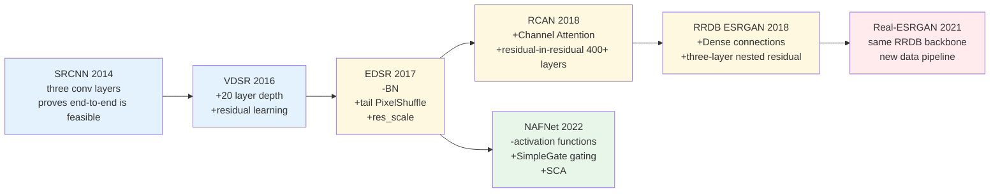
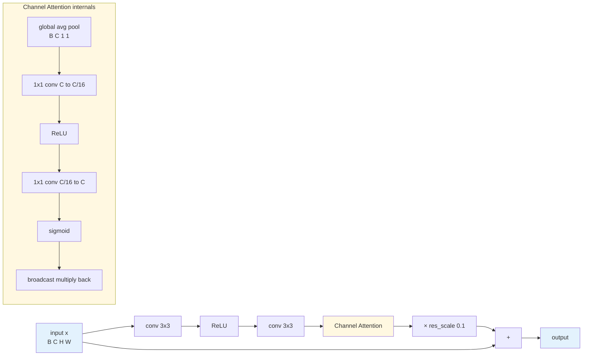
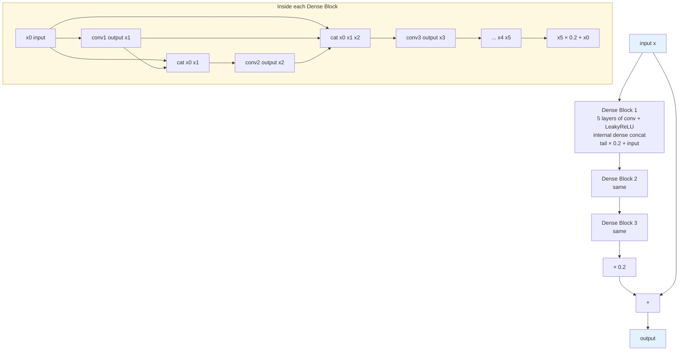

# Chapter 6 · The CNN Era

> From 2014 to 2022, CNNs walked a distinctive path through low-level vision:
>
> from imitating sparse coding (SRCNN) → going deeper plus residual (VDSR/EDSR) → introducing attention (RCAN) → dense connections (RRDB) → reverse simplification (NAFNet).
>
> These eight years are the "classical mechanics" of this field — once you understand them, you can find the corresponding ideas in Transformers and diffusion.

## 6.0 Reading Notes

This chapter is the first stop of Part II. The goal is to lay out the CNN line's eight-year evolution from 2014 to 2022 clearly. After reading you should be able to:

- See a CNN enhancement network's diagram and immediately tell which generation it belongs to (SRCNN-style, EDSR-style, RCAN-style, ESRGAN/Real-ESRGAN-style, NAFNet-style) and the corresponding design philosophy
- Know the basis for every design decision when tackling a new task (depth or width, which upsampling, which normalization, whether to add attention)
- Explain clearly why Batch Normalization is in fact harmful in low-level vision

This chapter assumes you have already mastered:

- The central equation $y = D(x) + n$ from Chapter 1, with "$D$ is a stack of random compositions"
- The distinction between pixel space and feature space from Chapter 2
- The basic roles of L1 / Charbonnier / VGG / GAN losses from Chapter 3
- The existence and meaning of the Real-ESRGAN-style degradation pipeline from Chapter 5

It does not assume you have read the original SRCNN/EDSR/RCAN/ESRGAN/NAFNet papers, nor that you have written a full SR training loop. The code in this chapter starts from the simplest runnable form.

**Abbreviations first appearing in this chapter or used repeatedly.** Listed upfront to avoid jargon stalls; when specific terms come up later, they are unpacked again in one sentence:

- **SRCNN** (Super-Resolution Convolutional Neural Network): the 2014 three-layer CNN super-resolution network by Dong et al., the first to apply end-to-end learning to SR
- **VDSR** (Very Deep Super-Resolution): proposed by Kim et al. in 2016, a 20-layer VGG-style stack + residual learning, proving that introducing both "depth" and "residual" together yields large gains
- **EDSR** (Enhanced Deep Super-Resolution): proposed by Lim et al. in 2017, removing Batch Normalization inside residual blocks and moving upsampling to the network tail; the "engineering baseline" of low-level vision CNNs
- **RCAN** (Residual Channel Attention Network): proposed by Zhang et al. in 2018, bringing channel attention to SR and stabilizing 400+ layer training with residual-in-residual structure
- **ESRGAN** (Enhanced Super-Resolution GAN): proposed by Wang et al. in 2018, introducing the RRDB block and training with RaGAN loss; defined the visual benchmark of the perceptual SR camp
- **RRDB** (Residual in Residual Dense Block): the core block of ESRGAN—three nested dense blocks + three layers of residual; still used by Real-ESRGAN
- **Real-ESRGAN**: the representative 2021 "real-scene" SR model, covered at length in Chapter 5; this chapter focuses on the RRDB backbone it reuses
- **NAFNet** (Non-linear Activation Free Network): proposed by Chen et al. in 2022, a counter-trend simplification—remove all ReLU/GELU, replace with gated multiplication—outperforming complex architectures on denoising / deblurring
- **CA** (Channel Attention): learn a scalar weight per channel and multiply; lets the model adaptively amplify or suppress different channels
- **SE** (Squeeze-and-Excitation): the 2018 general form of channel attention—global average pool to compress spatial into a scalar, then a two-layer MLP computes the weight
- **ECA** (Efficient Channel Attention): a 2020 channel-attention refinement that replaces the two-layer MLP with a 1D convolution, dropping parameters from $O(C^2)$ to $O(k)$
- **SCA** (Simplified Channel Attention): NAFNet's minimal channel attention—keeps only average pool + 1×1 convolution, even drops sigmoid
- **CBAM** (Convolutional Block Attention Module): channel attention + spatial attention in series, but the spatial part has limited gains in low-level vision
- **PixelShuffle / subpixel convolution**: the operation that rearranges a tensor with $r^2$ times the channels into one with $r$ times the spatial resolution; the de facto upsampling standard since EDSR
- **ICNR** (Initialization for Convolutional NN with Sub-pixel Convolutions): an initialization for the convolution before PixelShuffle, avoiding checkerboard artifacts in early training
- **BN / LN / GN / IN** (Batch / Layer / Group / Instance Normalization): the four main normalization variants, each acting along a different dimension; §6.9 compares them in detail
- **PReLU** (Parametric ReLU): a ReLU variant with a learnable negative-side slope
- **SiLU / Swish**: activation functions of the form $x \cdot \sigma(x)$, one of the modern defaults
- **GELU** (Gaussian Error Linear Unit): $x \cdot \Phi(x)$, the standard activation in Transformers
- **FLOPs** (Floating-Point Operations): the common unit for measuring compute budget
- **NPU** (Neural Processing Unit): mobile-device neural-network accelerator; CNN optimizations on NPUs are the most mature

## 6.1 Why start with CNNs

Transformers began making their mark in low-level vision from 2021 (SwinIR, Restormer, HAT), and diffusion has occupied the generative SOTA since 2023 (StableSR, SUPIR). It looks as if CNNs are already a thing of the past.

**That is not actually the case.** A few facts:

- NAFNet (2022, pure CNN) is still the de facto benchmark for denoising / deblurring tasks; papers in 2023-2025 still cite it as a baseline
- Real-ESRGAN still uses RRDB (a CNN architecture from 2018); published in 2021, it is still the de facto open-source real-SR standard in 2026
- The patch embedding, upsample heads, and bottlenecks of nearly all Transformer models are still convolutions; pure Transformers are rare in low-level vision
- 99% of enhancement models deployed on mobile are pure CNNs; Chapter 15 will expand the reasons (NPU support for attention is immature, softmax and reshape are expensive on-device)

So the first stop in Part II must be CNNs. This chapter clarifies three things:

1. The evolutionary logic of CNNs in low-level vision—which designs are gradual refinements, which are paradigm shifts
2. What concrete problem each era's representative network is solving
3. When designing your own CNN enhancement network, the order in which to consider what to choose and not choose

To keep the upcoming discussion of six or seven networks from blurring together in your head, here is one diagram organizing the line. Each cell is one generation's "headline new design," and the color indicates which class of bottleneck it solves.



Color groups reflect "contribution type." The blue group (SRCNN/VDSR) is "foundational," establishing end-to-end learning and residual learning as paradigms. The yellow group (EDSR/RCAN/RRDB) is "module innovation," proposing reusable sub-structures (residual block, CA, dense block). The red group (Real-ESRGAN) contributes entirely on the data-pipeline side, not the network. The green group (NAFNet) is reverse simplification, removing some of the additions of the prior generations. The last two cells of the line are read in reverse—this is the most memorable counter-trend story of the CNN era in low-level vision.

## 6.2 SRCNN (2014) — the starting point

The first deep-learning super-resolution paper. Dong et al. mapped the traditional sparse-coding super-resolution pipeline to a three-layer CNN:

```
Layer 1 (9×9 conv, 64 ch)  ←→ Patch extraction & representation
Layer 2 (1×1 conv, 32 ch)  ←→ Non-linear mapping
Layer 3 (5×5 conv,  3 ch)  ←→ Reconstruction
```

Input: LR upsampled to target size by bicubic
Output: HR estimate

```python
import torch.nn as nn

class SRCNN(nn.Module):
    """SRCNN, 2014. The pioneering work, a three-layer CNN."""
    def __init__(self):
        super().__init__()
        self.conv1 = nn.Conv2d(3, 64, kernel_size=9, padding=4)
        self.conv2 = nn.Conv2d(64, 32, kernel_size=1)
        self.conv3 = nn.Conv2d(32, 3, kernel_size=5, padding=2)
        self.relu = nn.ReLU(inplace=True)

    def forward(self, x):
        # x is the bicubic-upsampled LR, its shape already equals HR
        x = self.relu(self.conv1(x))
        x = self.relu(self.conv2(x))
        x = self.conv3(x)
        return x
```

Performance: about 30.5 dB on Set5 4× (bicubic gives 28.4 dB).

**The value of SRCNN is not in its results**, but in the fact that it **proved end-to-end learning was viable**. Before it, all super-resolution methods were multi-stage pipelines of "first sparse dictionary learning, then patch classification, then reconstruction," with each stage optimized separately, non-differentiable between stages, and impossible to tune end-to-end. SRCNN turned all of this into a single CNN, so a standard SGD backward pass trains all the parameters together, opening up the next decade of development.

**Limitations of SRCNN**:

- **Too shallow**: only 3 layers, with an effective receptive field of about 13×13, unable to capture structures at the tens-of-pixels scale of natural images
- **Upsampling first wastes computation**: all computation is performed at HR size; at 4× SR the FLOPs are 16× the LR-space cost
- **Large convolution kernels (9×9) are inefficient**: many parameters but a limited effective receptive field; the parameter budget is largely consumed by the first layer
- **No residual**: must directly regress all pixels of HR from input; the optimization objective has large variance, training is slow

All subsequent work was solving these problems. Sections 6.3 to 6.7 can be read as "removing SRCNN's limitations one by one."

## 6.3 VDSR (2016) — depth + residual

Kim et al. proposed VDSR (Very Deep Super-Resolution), with two core contributions.

### Going deeper to 20 layers

VGG-style stacked 3×3 convolutions. The receptive field of 20 layers can theoretically cover 41×41 of the input, much larger than SRCNN's, letting it leverage broader context.

Going deeper also brings training difficulties: stacking 20 conv layers directly causes gradients to easily amplify or vanish during backpropagation, and the "small learning rate + careful initialization" of the VGG era is still unstable on SR tasks. VDSR's second contribution—residual learning—solves both the expressive-power problem and the optimization stability simultaneously.

### Residual learning

Instead of directly learning HR, learn the **residual** $r = x - y_{\text{up}}$, i.e. HR minus the upsampled LR.

Why is residual learning especially important in low-level vision? From four angles:

1. **The target low frequency is already in the input**: after bicubic upsampling, $y_{\text{up}}$ is already close to the low-frequency component of HR, so the model only needs to learn the **high-frequency complement**, rather than relearning the entire image.
2. **Smaller residual variance makes optimization easier**: high-frequency components in natural images have absolute values far smaller than the pixels themselves; the residual is mostly close to 0, and the regression-target variance drops by one or two orders of magnitude.
3. **Sparser gradients**: the residual is nearly zero in flat regions, so the model only needs to invest capacity on edges and texture regions; parameter utilization is high.
4. **Cross-layer shortcut**: there is an additive shortcut from input to output, allowing backpropagation gradients to bypass the main trunk straight to the input side and avoid vanishing.

```python
class VDSR(nn.Module):
    """VDSR, 2016. Deep + residual learning."""
    def __init__(self, num_layers: int = 20, base_ch: int = 64):
        super().__init__()
        layers = [nn.Conv2d(3, base_ch, 3, padding=1), nn.ReLU(inplace=True)]
        for _ in range(num_layers - 2):
            layers += [nn.Conv2d(base_ch, base_ch, 3, padding=1),
                       nn.ReLU(inplace=True)]
        layers.append(nn.Conv2d(base_ch, 3, 3, padding=1))
        self.body = nn.Sequential(*layers)

    def forward(self, x):
        # x is the bicubic-upsampled LR
        return x + self.body(x)  # residual learning: output = input + learned residual
```

Performance: about 31.4 dB on Set5 4×, an improvement of about 0.9 dB over SRCNN.

**Residual learning has since become the de facto standard in low-level vision**. Every subsequent network (EDSR, RCAN, RRDB, NAFNet, SwinIR, Restormer, all the way through to the UNets used in diffusion) uses residuals; the only differences are how the residual is nested and whether it carries a scale coefficient.

**Limitations of VDSR**:

- It still goes through the network only after bicubic upsampling, wasting a lot of computation (at 4×, the computation is 16× the LR-space cost)
- No normalization and no scale coefficient: numerical values drift easily in deep networks
- The residual is a "global residual" with no block-internal residual; further depth quickly hits training-stability problems

## 6.4 EDSR (2017) — removing BN, standardizing the residual block

Lim et al. proposed EDSR (Enhanced Deep Residual Super-Resolution), the "engineering baseline" network for low-level vision. Several decisions in EDSR have influenced all subsequent CNN work.

### Decision one: remove Batch Normalization

The standard ResNet residual block is `Conv → BN → ReLU → Conv → BN`. The EDSR paper found that **removing BN actually works better in low-level vision**.

This section is expanded a bit, because this is one critical difference between low-level and high-level vision that has been chronically confused.

**What BN does.** Batch Normalization gathers all pixel values of one channel across the current mini-batch, computes the mean $\mu$ and variance $\sigma^2$, then performs $\hat{x} = (x - \mu) / \sigma$, and finally uses learnable $\gamma, \beta$ to restore some scale degrees of freedom. Physically it means "normalize this channel's activation distribution to zero mean and unit variance."

**Why it works for high-level vision.** The final classification objective is invariant—adding a global brightness layer to a cat is still a cat. BN normalizes away absolute brightness information, letting the network focus on the genuinely discriminative features. And at large batch sizes, $\mu, \sigma$ estimates are stable, so training and test behaviors match.

**Why it does not work for low-level vision, in four points.**

1. **The target is the pixels themselves**. SR / denoising / deblurring outputs are pixel values, and normalization breaks the "absolute scale" relation between input and output, forcing the model to spend capacity learning the relation back.
2. **Sensitive to in-batch statistics**. Low-level vision training patches are often very small (typical 48×48 or 64×64), and batch sizes are limited by memory (4-16 typical). Under "small batch + small patch," the variance of $\mu, \sigma$ is high, and the normalization target seen at each step jitters.
3. **Train-test mismatch**. At test time BN switches to whole-dataset EMA statistics, different from the mini-batch statistics during training. The output then has a small but stable color shift, hurting pixel-level metrics like PSNR.
4. **Restricts model size**. BN's intermediate tensors require extra memory for means/variances/scales, tightening already-tight SR memory budgets; skipping BN frees memory for more residual blocks or wider channels.

**After removing BN**:

- The model becomes more accurate in low-contrast or solid-color regions, because there is no color drift from normalization
- A larger network can be used; the saved memory can be invested in depth or width
- Training stability actually improves, because there is no longer batch-to-batch statistical jitter

This is a **very important difference** between low-level and high-level vision: BN/LayerNorm are essential in high-level vision, but in low-level vision they are often harmful. LayerNorm is fine in Transformer-based low-level vision; §6.9 addresses why separately.

### Decision two: compute in LR space + PixelShuffle upsampling at the end

EDSR fixes the waste of computing in HR space that VDSR suffered from: all feature extraction is done in LR space, and the final upsampling uses **PixelShuffle** (sub-pixel convolution) in a one-shot upsample at the tail.

The essence of PixelShuffle: it converts the channel dimension into the spatial dimension. It rearranges $(B, r^2 C, H, W)$ into $(B, C, rH, rW)$. Concretely, the same pixel position from every $r^2$ adjacent channels is placed into one $r \times r$ small block. What used to be "many channels representing many kinds of detail at the same spatial position" is reinterpreted as "the same channel representing detail on a denser spatial grid."

Why this is key for saving compute: every convolution happens on $(H, W)$ low-resolution feature maps; FLOPs scale with $HW$, while PixelShuffle itself is an $O(1)$ in-memory rearrangement with no multiplies-adds. By contrast, VDSR feeds full HR-sized tensors into each conv, so per-layer FLOPs are $r^2$ times the LR version.

```python
# PyTorch has built-in PixelShuffle, but understand the math:
# Input  (B, r^2 * C, H, W)
# Output (B, C, rH, rW)
# Rearrangement: every r^2 channels → an r×r spatial block
import torch.nn as nn

class UpsampleBlock(nn.Module):
    """EDSR-style upsample module.
    Supports 2/3/4×. 4× = two 2× steps."""
    def __init__(self, in_ch: int, scale: int):
        super().__init__()
        layers = []
        if scale in (2, 3):
            layers += [
                nn.Conv2d(in_ch, in_ch * scale * scale, 3, padding=1),
                nn.PixelShuffle(scale),
            ]
        elif scale == 4:
            for _ in range(2):
                layers += [
                    nn.Conv2d(in_ch, in_ch * 4, 3, padding=1),
                    nn.PixelShuffle(2),
                ]
        else:
            raise NotImplementedError(f"scale={scale} not supported")
        self.up = nn.Sequential(*layers)

    def forward(self, x):
        return self.up(x)
```

Why PixelShuffle is the de facto standard, compared with several other upsampling schemes:

- **Transposed conv** (deconvolution): learns upsampling directly via a stride-greater-than-1 deconvolution. The problem is **checkerboard artifacts** when stride and kernel size do not match—periodic small brightness variations every $r$ pixels, visible to the eye and hard to remove.
- **Nearest + conv** or **bilinear + conv**: upscale first with a fixed interpolation, then convolve. Works, but completely decouples upsampling from the subsequent conv, so the model can only "fine-tune on top of a frequency response shape determined by the interpolation kernel"; parameter efficiency is low.
- **PixelShuffle**: a learned reorder via a convolution with $r^2$ times the channels—the most parameter-efficient, free of checkerboard artifacts (provided ICNR initialization is used), and integrates naturally with the LR-space convolution trunk.

In real engineering PixelShuffle is the **default choice**. Unless there is a special reason—e.g. the deployment platform does not support channel-to-space ops, or you need arbitrary scale rather than 2/3/4×—do not use transposed conv.

### Decision three: standardizing the residual block

The EDSR residual block is just `Conv → ReLU → Conv` + residual, **with no normalization**. This seemingly austere design became the standard for the years that followed.

```python
class ResidualBlock(nn.Module):
    """EDSR-style residual block: no BN, no activation at the tail of the residual path."""
    def __init__(self, ch: int = 64, res_scale: float = 1.0):
        super().__init__()
        self.body = nn.Sequential(
            nn.Conv2d(ch, ch, 3, padding=1),
            nn.ReLU(inplace=True),
            nn.Conv2d(ch, ch, 3, padding=1),
        )
        self.res_scale = res_scale

    def forward(self, x):
        return x + self.body(x) * self.res_scale


class EDSR(nn.Module):
    """EDSR, 2017. The engineering baseline of low-level vision."""
    def __init__(self, scale: int = 4, num_blocks: int = 16,
                 ch: int = 64, res_scale: float = 0.1):
        super().__init__()
        self.head = nn.Conv2d(3, ch, 3, padding=1)
        self.body = nn.Sequential(*[
            ResidualBlock(ch, res_scale) for _ in range(num_blocks)
        ])
        self.body_tail = nn.Conv2d(ch, ch, 3, padding=1)
        self.upsample = UpsampleBlock(ch, scale)
        self.tail = nn.Conv2d(ch, 3, 3, padding=1)

    def forward(self, x):
        # x: LR (B, 3, H, W)
        feat = self.head(x)
        body = self.body_tail(self.body(feat)) + feat   # global residual
        out = self.tail(self.upsample(body))
        return out
```

**res_scale = 0.1** is a small engineering detail: it shrinks the output of the residual path by a factor of 10 before adding it back to the trunk, preventing residual accumulation in deep networks from causing numerical divergence. Intuitively: if each residual block's output has variance $\sigma^2$, then without scale the variance after $N$ layers is roughly $N \sigma^2$; with a 0.1 scale, variance grows only by $0.01 N \sigma^2$. For 16-32-layer networks this is a notable difference. The trick has been widely adopted since EDSR; RCAN/ESRGAN/RRDB all use similar "residual path × small constant."

Drawing the structural difference among SRCNN/VDSR/EDSR makes it more directly visible how "do the work in LR space + final-stage PixelShuffle" compresses the compute back:

```mermaid
graph TD
    subgraph SRCNN["SRCNN 2014 (in HR space)"]
        S1[LR bicubic upsampled to HR]
        S2[conv 9x9 64]
        S3[conv 1x1 32]
        S4[conv 5x5 3]
        S5[HR output]
        S1 --> S2 --> S3 --> S4 --> S5
    end

    subgraph VDSR["VDSR 2016 (HR space + residual)"]
        V1[LR bicubic to HR]
        V2[20 layers of 3x3 conv]
        V3[+ input residual]
        V4[HR output]
        V1 --> V2 --> V3 --> V4
        V1 -.skip.-> V3
    end

    subgraph EDSR["EDSR 2017 (LR space + tail PixelShuffle)"]
        E1[LR input]
        E2[head conv 64]
        E3[16 residual blocks<br/>no BN res_scale 0.1]
        E4[+ feat global residual]
        E5[PixelShuffle upsample]
        E6[tail conv 3]
        E7[HR output]
        E1 --> E2 --> E3 --> E4 --> E5 --> E6 --> E7
        E2 -.skip.-> E4
    end

    style SRCNN fill:#e3f2fd
    style VDSR fill:#fff8e1
    style EDSR fill:#e8f5e9
```



The three sub-diagrams are arranged from top to bottom in increasing closeness to modern design. The blue SRCNN runs its whole chain at HR size with no skip. The yellow VDSR adds an overall skip but still works in HR space. The green EDSR is the prototype of modern SR: all feature extraction in LR space, one-shot upsample at the tail, each residual block with its own scale. All later, more complex networks (RCAN, RRDB, NAFNet) inherit this third skeleton; only the block internals get more refined.

## 6.5 RCAN (2018) — introducing attention

One direction after EDSR is to bring **attention mechanisms** into low-level vision. Zhang et al.'s RCAN (Residual Channel Attention Network) is the representative.

### What is Channel Attention

Different channels learn different features—some channels are sensitive to **textures**, some to **edges**, some to **low-frequency color**, and some may be redundant. Channel Attention lets the model learn a **channel weight vector** that automatically amplifies important channels and suppresses unimportant ones, with the weights adaptively decided by the current input features.

The specific Squeeze-and-Excitation–style channel attention has four steps:

1. **Squeeze**: global average pool per channel, turning $(B, C, H, W)$ into $(B, C, 1, 1)$. This step compresses the spatial distribution into one scalar representing the channel's average activation strength over the image.
2. **Excitation compress**: a 1×1 conv squeezes the channel count to $C / r$ ($r = 16$ typical), with a non-linear mapping. This forces the model to express "inter-channel relations" through a low-dimensional bottleneck.
3. **Excitation restore**: another 1×1 conv brings the channel count back to $C$, followed by sigmoid, giving $(B, C, 1, 1)$ weights—one number per channel in $[0, 1]$.
4. **Rescale**: broadcast-multiply these weights back to the original features.

```python
class ChannelAttention(nn.Module):
    """SE-style channel attention used by RCAN."""
    def __init__(self, ch: int, reduction: int = 16):
        super().__init__()
        self.avg_pool = nn.AdaptiveAvgPool2d(1)
        self.fc = nn.Sequential(
            nn.Conv2d(ch, ch // reduction, 1),
            nn.ReLU(inplace=True),
            nn.Conv2d(ch // reduction, ch, 1),
            nn.Sigmoid(),
        )

    def forward(self, x):
        # global average pool -> channel squeeze -> channel restore -> sigmoid normalize
        # Produces per-channel weights (B, C, 1, 1) and broadcast-multiplies them back
        w = self.fc(self.avg_pool(x))
        return x * w
```

The concrete role of channel attention in low-level vision:

- **Suppressing noise channels**: noise features concentrate in certain channels, attention automatically downweights them, preventing the noise from being amplified by subsequent layers
- **Amplifying edge channels**: edges are crucial to reconstruction, attention gives them larger weights—a soft gate on "important features"
- **Adapting to input content**: an image rich in textures and a flat image need different channel weights; fixed-weight plain conv has no such adaptive ability
- **Nearly free**: each CA module adds only $2 C^2 / r$ parameters, a tiny impact on total parameter count

### Residual in Residual

RCAN nests residual blocks: each RCAB (a residual block with channel attention) is wrapped with another residual; multiple RCABs form a group; the group is wrapped again with a residual; and the entire body has a global residual on top of all of that. This "residual in residual" structure can train networks of more than 400 layers stably.

```python
class RCAB(nn.Module):
    """Residual Channel Attention Block. The basic unit of RCAN."""
    def __init__(self, ch: int = 64, reduction: int = 16,
                 res_scale: float = 1.0):
        super().__init__()
        self.body = nn.Sequential(
            nn.Conv2d(ch, ch, 3, padding=1),
            nn.ReLU(inplace=True),
            nn.Conv2d(ch, ch, 3, padding=1),
            ChannelAttention(ch, reduction),
        )
        self.res_scale = res_scale

    def forward(self, x):
        return x + self.body(x) * self.res_scale
```

Drawing the data flow inside RCAB makes it easier to compare with the RRDB / NAFNet blocks later:



Performance: about 32.6 dB on Set5 4×, an improvement of about 0.5 dB over EDSR. On the PSNR side of SR, RCAN is still a strong reference today.

## 6.6 RRDB (ESRGAN, 2018) — dense connections

Wang et al. proposed RRDB (Residual in Residual Dense Block) in ESRGAN. This is the **backbone Real-ESRGAN still uses to this day**.

### What is a Dense Block

ResNet uses residual connections (add); DenseNet uses dense connections (concat). At each layer, the outputs of all previous layers are concatenated as input:

$$
x_{l+1} = H([x_0, x_1, \dots, x_l])
$$

Advantages:

- **Maximum feature reuse**: every layer directly sees all previous features, without needing "residual accumulation" to indirectly pass them along
- **Mitigating gradient vanishing**: gradients can pass through any layer directly back to the input, even more thoroughly than plain residual
- **Parameter efficiency**: the per-layer output channel count is small (growth rate $k$, typical $k = 32$), but features are rich because later layers can concat all earlier ones

Drawbacks to call out: each layer's input channel count grows linearly, so by layer $L$ it is $C_0 + L k$ channels, and the 1×1 conv cost is non-trivial; memory footprint exceeds pure residual. RRDB's compromise is to use dense only at small scale (5-layer dense blocks) and residual between blocks.

### The specific design of RRDB

Each RRDB contains 3 dense blocks; each dense block consists of 5 conv + LeakyReLU layers. There are dense connections inside each block, residual connections between blocks, and one more residual wrapping the whole RRDB. That is, residual appears in three nested layers—this is the origin of the name "Residual in Residual."

```python
class DenseBlock(nn.Module):
    """The 5-layer dense block used by ESRGAN."""
    def __init__(self, ch: int = 64, growth: int = 32):
        super().__init__()
        self.conv1 = nn.Conv2d(ch + 0 * growth, growth, 3, padding=1)
        self.conv2 = nn.Conv2d(ch + 1 * growth, growth, 3, padding=1)
        self.conv3 = nn.Conv2d(ch + 2 * growth, growth, 3, padding=1)
        self.conv4 = nn.Conv2d(ch + 3 * growth, growth, 3, padding=1)
        self.conv5 = nn.Conv2d(ch + 4 * growth, ch, 3, padding=1)
        self.lrelu = nn.LeakyReLU(0.2, inplace=True)

    def forward(self, x):
        x1 = self.lrelu(self.conv1(x))
        x2 = self.lrelu(self.conv2(torch.cat([x, x1], 1)))
        x3 = self.lrelu(self.conv3(torch.cat([x, x1, x2], 1)))
        x4 = self.lrelu(self.conv4(torch.cat([x, x1, x2, x3], 1)))
        x5 = self.conv5(torch.cat([x, x1, x2, x3, x4], 1))
        return x5 * 0.2 + x   # residual scale + residual


class RRDB(nn.Module):
    """Residual in Residual Dense Block."""
    def __init__(self, ch: int = 64, growth: int = 32):
        super().__init__()
        self.db1 = DenseBlock(ch, growth)
        self.db2 = DenseBlock(ch, growth)
        self.db3 = DenseBlock(ch, growth)

    def forward(self, x):
        out = self.db1(x)
        out = self.db2(out)
        out = self.db3(out)
        return out * 0.2 + x   # one more residual
```

Drawing RRDB's "three-layer nesting" clearly:



ESRGAN stacks 23 RRDBs in total, with about 17M parameters. This network is slightly lower than RCAN on the PSNR metric, but combined with GAN training its **visual quality** is far better than the pure-PSNR-optimized RCAN—this is the split between the PSNR camp and the perceptual camp, already discussed in detail in §4.8.

Real-ESRGAN reuses the RRDB network and only swaps the data pipeline and training losses, with completely transformed results. **This once again validates the conclusion of §5.1: data > network.** The same RRDB, trained on bicubic data, gives 18.2 dB PSNR on real images (barely working); trained on Real-ESRGAN pipeline data, it gives 23.8 dB (usable)—without changing a single line of network code.

## 6.7 NAFNet (2022) — counter-trend simplification

The trend in low-level vision from 2018 to 2022 was "adding more bells and whistles": Transformer blocks, all sorts of attention, complex normalization, hybrid architectures. Chen et al.'s NAFNet went the other way—**removing everything that is not necessary**—and yet achieved SOTA on denoising / deblurring. The paper title's "Non-linear Activation Free" openly declares the counter-trend stance.

### Removal list

- **Batch Normalization**: removed
- **GELU / Swish**: removed, replaced by the simpler SimpleGate
- **Self-Attention**: removed, only an extremely simple channel attention is kept
- **ReLU**: in the "Plain net," no activation function is used at all

Note: NAFNet **keeps a simplified LayerNorm2d** (once at the start of each block's spatial path and once at the start of the channel path); it does not remove all normalization layers. What it removes are the two "fancy architecture" categories of nonlinearity + attention; normalization is in fact essential for stable training.

### SimpleGate (replacing GELU)

GELU is $x \cdot \Phi(x)$ (input multiplied by the Gaussian CDF). NAFNet noticed that this is essentially "input multiplied by a gating signal"—$\Phi(x)$ takes values in $[0, 1]$ and acts as a soft gate. If the gating signal itself can be learned adaptively from the features, there is no need to use $\Phi(x)$ as a fixed function.

Concretely, split the input in half along the channel dimension and multiply element-wise:

$$
\text{SimpleGate}(x) = x_1 \odot x_2
$$

where $x = [x_1, x_2]$ is split along the channel dimension. $x_2$ plays the role of the gate, but its value range is determined by the features themselves, not constrained to $[0, 1]$.

```python
class SimpleGate(nn.Module):
    def forward(self, x):
        x1, x2 = x.chunk(2, dim=1)
        return x1 * x2
```

Visual impact: nonlinear capability similar to GELU, **with no learnable parameters and cheaper than GELU**—just chunk + element-wise multiplication, no erf/exp approximation. The cost is that the channel count is halved, so the preceding conv needs to expand channels by 2×.

### Simplified Channel Attention (SCA)

```python
class SCA(nn.Module):
    """NAFNet's simplified channel attention - keeps only average pool + 1x1 conv."""
    def __init__(self, ch):
        super().__init__()
        self.pool = nn.AdaptiveAvgPool2d(1)
        self.conv = nn.Conv2d(ch, ch, 1)

    def forward(self, x):
        return x * self.conv(self.pool(x))
```

Note:

- No reduction (RCAN uses $C \to C/16 \to C$)
- No ReLU
- No sigmoid (multiplied directly, the weights are not normalized)

This "looks wrong" design actually works—it is a counter-intuitive finding from the NAFNet paper. Intuitively, without sigmoid, the multiplicative coefficients can be arbitrarily large or negative, and training looks like it should be unstable. A plausible explanation for why it works is that LayerNorm2d has already normalized the input into a reasonable range, and SCA's output "weight" combined with LayerNorm's constraint is in fact already bounded in amplitude.

### The full NAFBlock

```python
class NAFBlock(nn.Module):
    """The core block of NAFNet."""
    def __init__(self, ch: int, dw_expand: int = 2, ffn_expand: int = 2):
        super().__init__()
        # Spatial mixing
        self.norm1 = LayerNorm2d(ch)
        self.conv1 = nn.Conv2d(ch, ch * dw_expand, 1)
        # Depthwise
        self.dwconv = nn.Conv2d(ch * dw_expand, ch * dw_expand, 3,
                                padding=1, groups=ch * dw_expand)
        self.gate1 = SimpleGate()  # output channels halved
        self.sca = SCA(ch * dw_expand // 2)
        self.conv2 = nn.Conv2d(ch * dw_expand // 2, ch, 1)

        # Channel mixing (FFN)
        self.norm2 = LayerNorm2d(ch)
        self.conv3 = nn.Conv2d(ch, ch * ffn_expand, 1)
        self.gate2 = SimpleGate()
        self.conv4 = nn.Conv2d(ch * ffn_expand // 2, ch, 1)

        # Trainable scale
        self.beta  = nn.Parameter(torch.zeros((1, ch, 1, 1)))
        self.gamma = nn.Parameter(torch.zeros((1, ch, 1, 1)))

    def forward(self, x):
        # Spatial path
        y = self.norm1(x)
        y = self.conv1(y)
        y = self.dwconv(y)
        y = self.gate1(y)
        y = self.sca(y)
        y = self.conv2(y)
        x = x + y * self.beta

        # Channel path (FFN)
        y = self.norm2(x)
        y = self.conv3(y)
        y = self.gate2(y)
        y = self.conv4(y)
        return x + y * self.gamma


class LayerNorm2d(nn.Module):
    """Channel-wise LayerNorm for 2D feature maps."""
    def __init__(self, ch):
        super().__init__()
        self.weight = nn.Parameter(torch.ones(ch))
        self.bias = nn.Parameter(torch.zeros(ch))
        self.eps = 1e-6

    def forward(self, x):
        # (B, C, H, W) -> normalize over C
        mu = x.mean(dim=1, keepdim=True)
        var = x.var(dim=1, keepdim=True, unbiased=False)
        x = (x - mu) / torch.sqrt(var + self.eps)
        return x * self.weight.view(1, -1, 1, 1) + self.bias.view(1, -1, 1, 1)
```

NAFBlock has two paths: the spatial path does a depthwise-separable-style "spatial mixing," and the channel path resembles a Transformer FFN for "channel mixing." Both paths have LayerNorm2d at the front, SimpleGate as nonlinearity, and learnable $\beta / \gamma$ scaling the residual amplitude. The overall structure mirrors a Transformer block's "Attention + FFN" closely, but attention is simplified into the combination of SCA + depthwise conv.

To compare side-by-side with EDSR's ResidualBlock, RCAN's RCAB, and ESRGAN's RRDB, here are the four generations of core block internals on one diagram:

```mermaid
graph TD
    subgraph EDSRb["EDSR ResidualBlock 2017"]
        e1[x] --> e2[conv 3x3]
        e2 --> e3[ReLU]
        e3 --> e4[conv 3x3]
        e4 --> e5[× 0.1]
        e5 --> e6[+]
        e1 --> e6
        e6 --> e7[out]
    end

    subgraph RCANb["RCAN RCAB 2018"]
        r1[x] --> r2[conv 3x3]
        r2 --> r3[ReLU]
        r3 --> r4[conv 3x3]
        r4 --> r5[ChannelAttention<br/>pool + MLP + sigmoid]
        r5 --> r6[× scale]
        r6 --> r7[+]
        r1 --> r7
        r7 --> r8[out]
    end

    subgraph RRDBb["ESRGAN RRDB 2018"]
        d1[x] --> d2[DenseBlock × 3<br/>each internal 5-layer dense concat]
        d2 --> d3[× 0.2]
        d3 --> d4[+]
        d1 --> d4
        d4 --> d5[out]
    end

    subgraph NAFb["NAFNet NAFBlock 2022"]
        n1[x] --> n2[LayerNorm2d]
        n2 --> n3[1x1 conv expand 2]
        n3 --> n4[depthwise 3x3]
        n4 --> n5[SimpleGate split mul]
        n5 --> n6[SCA pool + 1x1 mul]
        n6 --> n7[1x1 conv]
        n7 --> n8[× beta]
        n8 --> n9[+]
        n1 --> n9
        n9 --> n10[FFN: LN -> 1x1 -> SimpleGate -> 1x1 × gamma]
        n10 --> n11[+]
        n9 --> n11
        n11 --> n12[out]
    end

    style EDSRb fill:#e3f2fd
    style RCANb fill:#fff8e1
    style RRDBb fill:#fff8e1
    style NAFb fill:#e8f5e9
```



Placing the four blocks together makes the eight-year evolution easier to feel: EDSR's pure two-layer conv plus residual; RCAN's added channel attention at the tail; RRDB's replacing the "conv chain" with "three-layer nested residual wrapping dense blocks"; NAFNet's return to "two simple paths" form but with the nonlinearity replaced by gating. Design complexity rises first then falls, settling at a point that is simpler than RRDB but more refined than EDSR.

### What NAFNet teaches us

The most interesting part of the NAFNet paper is not its specific design but its **ablation study**:

- Replacing SE with SCA: no change in quality
- Replacing GELU with SimpleGate: no change in quality
- Removing all LayerNorms: a slight drop, but small
- Removing channel attention entirely: a drop, but limited
- Replacing the spatial path's depthwise with ordinary 3×3: no change in quality

Conclusion:

> **The key for low-level vision is the allocation of compute budget, not fancy architecture.**
>
> Given the same FLOPs, simple and complex networks differ very little in quality;
> the "complexity" of complex networks mostly brings training instability and deployment difficulty.

This conclusion has a major impact on engineering practice — **prefer simple CNNs in production environments**, unless there is clear evidence that a complex network brings a qualitative leap. The NAFNet paper's "simple does not lose to complex" is also why NAFNet remains a frequently-appearing baseline in 2024-2025 denoising / deblurring benchmarks—it is not surpassed; it is "good enough and easy to deploy."

## 6.8 Comparison of upsampling methods

The position and method of upsampling are critical design decisions in low-level vision. Comparing the methods side by side.

| Method | Description | Pros | Cons |
|------|------|------|------|
| **bicubic + conv** | Input is bicubic-upsampled to HR, then CNN | Simple | Computation in HR space is expensive |
| **transpose conv** | Deconvolution | Learns upsampling | Checkerboard artifacts |
| **nearest + conv** | Nearest-neighbor copy + convolution | No artifacts | Poor parameter efficiency |
| **bilinear + conv** | Bilinear + convolution | Smooth | Slightly blurry |
| **PixelShuffle** | Sub-pixel conv | Highest parameter efficiency | Possible checkerboard early in training |
| **PixelShuffle (ICNR init)** | Initialization fix | Fixes the checkerboard issue | Slightly more complex implementation |

**How are checkerboard artifacts produced?** With transposed conv, stride $s$ and kernel size $k$, each input pixel "spreads" into $k$ output pixels, but the spread windows of adjacent input pixels overlap $k - s$ times in some positions and $k - s - 1$ times in others, so adjacent output pixels accumulate different numbers of "contributions," producing periodic brightness ripples with period $s$—visible to the eye as a checkerboard. PixelShuffle does not have this problem in principle, but if the preceding conv is poorly initialized, "the $r^2$ channels remapped into the same $r \times r$ block" can have very different initial values, and adjacent pixels after rearrangement also differ visibly, producing checkerboard early in training.

**ICNR initialization** (Initialization for Convolutional NN with sub-pixel convolutions) solves PixelShuffle's initialization problem:

```python
def icnr_init(tensor: torch.Tensor, scale: int = 2):
    """Convolution weight initialization before PixelShuffle, avoids checkerboard
    artifacts in the early stages of training.
    Essence: make the initial weights of the r^2 sub-groups identical."""
    out_ch = tensor.shape[0]
    sub_ch = out_ch // (scale ** 2)
    sub_kernel = torch.zeros(sub_ch, *tensor.shape[1:])
    nn.init.kaiming_normal_(sub_kernel)
    sub_kernel = sub_kernel.repeat(scale ** 2, 1, 1, 1)
    tensor.copy_(sub_kernel)
    return tensor
```

Concretely: first initialize $C$ channels of weights with Kaiming normal, then replicate each of those $C$ channels $r^2$ times to obtain $C r^2$ identical channels. After PixelShuffle rearrangement, "the $r^2$ channels mapped into the same $r \times r$ block" produce identical features at initialization, so adjacent pixel brightness is identical and the checkerboard vanishes. During training, the $r^2$ channels gradually diverge, letting the upsample actually work.

Engineering experience: **PixelShuffle + ICNR initialization by default**, the artifact problem is essentially eliminated.

## 6.9 Choice of normalization layer

The choice of normalization layer is very different in low-level vision than in high-level vision.

| Norm | Dim | In low-level vision | Recommendation |
|-------|---------|-------------|-------|
| **BatchNorm** | $(B, H, W)$ | Harmful (breaks scale, unstable at test) | Don't use |
| **GroupNorm** | $(G, H, W)$ per channel group | Acceptable | Acceptable |
| **InstanceNorm** | $(H, W)$ per channel | Used for style transfer, not suitable for denoising | Use with caution |
| **LayerNorm 2d** | $(C)$ per pixel | Modern Transformer standard | Recommended |
| **No Norm** | none | NAFNet/EDSR, etc. | Recommended |

The action dimensions of the four norms can be distinguished as follows:

- **BatchNorm** computes mean/variance across $(B, H, W)$, one set of statistics per channel. Sensitive to batch size and to train/test consistency.
- **GroupNorm** splits channels into $G$ groups, each group's mean/variance computed over $(H, W)$. Batch-independent, more stable than BN when batch sizes are small.
- **InstanceNorm** is GroupNorm's $G = C$ limit—each channel's spatial mean/variance computed alone. Useful in style transfer because it removes the "image's overall color style"; but in denoising / super-resolution that is exactly the information you want to preserve.
- **LayerNorm 2d** is GroupNorm's $G = 1$ limit—all channels together do "per-pixel normalization." Used in NAFNet/SwinIR/Restormer.

**Why is LayerNorm OK in Transformer-based low-level vision while BN is not?**

- BN normalizes across the batch dimension—the same pixel of the same image behaves differently in different batches, and at test time switching to EMA statistics shifts behavior again
- LayerNorm normalizes across the channel dimension—it only looks at the feature vector of the current pixel; each image is independent, each pixel is independent

LayerNorm is deterministic for a single image, **with no train-test mismatch**. Attention inside a Transformer block already scrambles the "per-token feature scale" heavily, so a normalization at each block's entry to pull the scale back is needed; LayerNorm fills that role without introducing BN's problems.

Engineering practice:

- Pure CNN networks: **No Norm** (EDSR/NAFNet style)
- Transformer-based or hybrid networks with attention: **LayerNorm** (SwinIR/Restormer style)
- Never use BN

## 6.10 Choice of activation function

| Activation | Form | In low-level vision |
|------|------|-------------|
| **ReLU** | $\max(0, x)$ | Used by EDSR, simple and stable |
| **LeakyReLU** | $\max(0.01x, x)$ | Used by ESRGAN, avoids dead neurons |
| **PReLU** | $\max(a x, x)$, $a$ learnable | Used in early SR, slightly more parameters |
| **GELU** | $x \cdot \Phi(x)$ | Standard for Transformers |
| **SiLU/Swish** | $x \cdot \sigma(x)$ | Modern default |
| **SimpleGate** | $x_1 \odot x_2$ | NAFNet, zero compute |

Several worth expanding. **LeakyReLU**'s negative slope (typical 0.01 or 0.2) solves ReLU's "dead neuron" problem—plain ReLU has zero gradient whenever a neuron has been outputting negative values long enough that its parameters are frozen; LeakyReLU gives the negative side a small slope so the gradient is always non-zero. LeakyReLU is essentially the default in GAN training, because GAN discriminators easily fall into "output is long-term negative" local modes.

**GELU** nearly monopolizes Transformers, because its curve transitions smoothly around 0 (unlike ReLU's kink at 0), making attention-based network optimization more stable. In plain CNNs the difference between GELU and ReLU is small, but compute is slightly higher.

**SiLU / Swish** is $x \cdot \sigma(x)$, with a curve nearly identical to GELU but simpler to implement; it is the de facto default in modern large models. In low-level vision it is commonly interchangeable with GELU.

Engineering experience:

- **Conservative choice**: LeakyReLU(0.2). Stable in all GAN-style training, avoids gradient death
- **For efficiency**: SimpleGate—zero parameters, zero extra compute
- **For quality**: SiLU/Swish

## 6.11 Evolution of attention modules

Attention in CNNs is mainly channel attention. The evolution path:

| Module | Complexity | Origin |
|------|-------|------|
| **SE** | $C^2/r$ params | Squeeze-Excitation, 2018 |
| **CA (RCAN)** | Same as SE | Brought into low-level vision |
| **ECA** | $k$ params (k=3 or 5) | Efficient CA, 2020 |
| **SCA** | $C^2$ params, no reduction | NAFNet, 2022 |
| **Sim-AM** | 0 params | Energy-function-based |

**ECA (Efficient Channel Attention)** replaces SE's two FC layers with a 1D convolution:

```python
class ECA(nn.Module):
    """Efficient Channel Attention. Almost no parameters."""
    def __init__(self, ch: int, k_size: int = 3):
        super().__init__()
        self.avg_pool = nn.AdaptiveAvgPool2d(1)
        self.conv = nn.Conv1d(1, 1, kernel_size=k_size,
                              padding=(k_size - 1) // 2, bias=False)

    def forward(self, x):
        # x: (B, C, H, W)
        y = self.avg_pool(x).squeeze(-1).squeeze(-1)  # (B, C)
        y = y.unsqueeze(1)                             # (B, 1, C)
        y = self.conv(y).squeeze(1)                    # (B, C)
        y = torch.sigmoid(y).unsqueeze(-1).unsqueeze(-1)
        return x * y
```

ECA's design premise is that "inter-channel dependencies are mostly local"—neighbor channels are more correlated, distant channels weakly related. A single 1D conv looking at $k$ neighbors is enough; SE's full connection is unnecessary. In low-level vision benchmarks, ECA and SE are essentially tied, but parameters drop from $C^2 / r$ to $k = 3$ or $5$.

### Spatial Attention in low-level vision

Modules like CBAM add spatial attention—letting the model learn an $(H, W)$ weight map and broadcast it across all channels. It works well in classification and detection, but **gains are limited in low-level vision**. Reasons:

- Low-level vision outputs are per-pixel; pixels at any position matter—there is no "position to ignore"
- Spatial attention's weight map has smoothness, effectively adding a low-pass filter on the output, which hurts sharpness
- Genuinely useful long-range spatial dependency is captured by self-attention, not by simple spatial attention

In real engineering, channel attention is the mainstream and spatial attention is rarely used. The self-attention of Chapter 7's Transformer is the real spatial-information modeling.

## 6.12 A complete EDSR-style model

Putting the above concepts together into a production-ready SR network. **This is the engineering baseline** — when you tackle a new task and don't know what to choose, start with this.

```python
import torch
import torch.nn as nn


class ResidualBlock(nn.Module):
    def __init__(self, ch: int, res_scale: float = 0.1):
        super().__init__()
        self.body = nn.Sequential(
            nn.Conv2d(ch, ch, 3, padding=1),
            nn.LeakyReLU(0.2, inplace=True),
            nn.Conv2d(ch, ch, 3, padding=1),
        )
        self.res_scale = res_scale

    def forward(self, x):
        return x + self.body(x) * self.res_scale


class UpsampleBlock(nn.Module):
    def __init__(self, ch: int, scale: int):
        super().__init__()
        layers = []
        if scale == 4:
            for _ in range(2):
                layers += [nn.Conv2d(ch, ch * 4, 3, padding=1),
                           nn.PixelShuffle(2)]
        elif scale in (2, 3):
            layers += [nn.Conv2d(ch, ch * scale * scale, 3, padding=1),
                       nn.PixelShuffle(scale)]
        self.up = nn.Sequential(*layers)

    def forward(self, x):
        return self.up(x)


class SRBaseline(nn.Module):
    """Production-ready SR baseline.
    Depth: 16 residual blocks + 64 channels, about 1.5M parameters.
    Real-world performance: on RealESRGAN-pipeline data, with L1+VGG+RaGAN losses,
            it reaches visual quality close to ESRGAN, with 2-3× faster training.
    """

    def __init__(self, scale: int = 4, num_blocks: int = 16,
                 ch: int = 64, res_scale: float = 0.1):
        super().__init__()
        self.head = nn.Conv2d(3, ch, 3, padding=1)
        self.body = nn.Sequential(
            *[ResidualBlock(ch, res_scale) for _ in range(num_blocks)]
        )
        self.body_tail = nn.Conv2d(ch, ch, 3, padding=1)
        self.up = UpsampleBlock(ch, scale)
        self.tail = nn.Conv2d(ch, 3, 3, padding=1)

        # ICNR initialization for the conv before PixelShuffle
        # Note on scale: 4× total uses two ×2 steps, so ICNR scale=2 here matches
        # the per-step scale inside UpsampleBlock. For ×3 direct upscaling, pass scale=3.
        per_step_scale = 2 if scale == 4 else scale
        for m in self.up.modules():
            if isinstance(m, nn.Conv2d):
                self._icnr_init(m.weight, scale=per_step_scale)

    @staticmethod
    def _icnr_init(weight, scale: int = 2):
        """ICNR: initialize the convolution weights before PixelShuffle so that
        the r^2 sub-groups have identical initial weights.
        scale must equal the upsampling factor of PixelShuffle.
        """
        out_ch = weight.shape[0]
        sub_ch = out_ch // (scale * scale)
        sub_kernel = torch.empty(sub_ch, *weight.shape[1:])
        nn.init.kaiming_normal_(sub_kernel)
        sub_kernel = sub_kernel.repeat(scale * scale, 1, 1, 1)
        weight.data.copy_(sub_kernel)

    def forward(self, x):
        feat = self.head(x)
        body = self.body_tail(self.body(feat)) + feat
        out = self.tail(self.up(body))
        return out
```

This network, trained on RealESRGAN-pipeline synthetic data with L1 + VGG + RaGAN losses, can reach visual quality close to ESRGAN, with about 1.5M parameters—far smaller than ESRGAN's 17M. It is the "use this until you know what to choose" fallback.

## 6.13 Engineering experience for designing an SR network

If you want to design a CNN enhancement network for a new task from scratch, consider the following in this order.

### Step 1: set the compute budget

- On-device (phone NPU): FLOPs ceiling ~0.5 GFLOPs, params < 1M
- Real-time on a desktop GPU: FLOPs ceiling ~50 GFLOPs
- Backend service (A100): up to 200 GFLOPs and beyond
- Offline processing: no limit

Pick budget first, then architecture. Trying to choose architecture first and squeeze budget after is almost guaranteed to require a rewrite.

### Step 2: allocate the budget between depth and width

Experience: **add depth before width**. Depth contributes more to receptive field and expressive power; width is just more channels and the marginal benefit decreases quickly. Concretely, increasing depth $L \to 2L$ grows receptive field and parameters linearly; increasing width $C \to 2C$ quadruples parameters with limited expressive-power gain.

Typical configurations:

- 1M params: 32 channels × 16 blocks
- 5M params: 64 channels × 16 blocks
- 16M params: 64 channels × 23 blocks (the ESRGAN configuration)
- 50M params or more: consider switching to a Transformer architecture

### Step 3: choose the upsampling location and method

- 99% use PixelShuffle, placed at the tail of the network
- Global residual from input LR to output HR, so the network only learns the high-frequency complement
- ICNR initialization is essentially free; include it

### Step 4: choose attention

- Generic tasks: add an SCA or ECA (extremely low overhead, gains 0.1-0.2 dB in PSNR)
- Tasks that especially need attention (faces, specific textures): consider CBAM or switching directly to a Transformer block
- On-device deployment: skip attention if you can; softmax is expensive on NPUs

### Step 5: training loss

- PSNR-oriented: a single Charbonnier loss
- Real-world SR: L1 + VGG + RaGAN (see Chapter 3)
- Perception-oriented: lower the L1 weight, raise the VGG weight

## 6.14 Summary

1. **The evolution of CNNs in low-level vision is gradual**: SRCNN → VDSR (depth + residual) → EDSR (no BN + tail PixelShuffle) → RCAN (CA + residual-in-residual) → RRDB (dense + three-layer nested residual) → NAFNet (simplification + gating)
2. **Residual learning is the de facto standard in low-level vision** — every modern network uses it
3. **Batch Normalization is harmful in low-level vision** — it breaks scale, train-test mismatch; just remove it
4. **PixelShuffle + ICNR initialization is the de facto standard for upsampling**
5. **Channel Attention is an effective small improvement** (0.2-0.5 dB); SCA/ECA are low-overhead choices
6. **NAFNet's lesson**: in low-level vision, what matters is compute-budget allocation, not fancy architecture
7. **The order for designing a new network**: set budget → depth > width → PixelShuffle → add SCA → choose loss
8. **The success of Real-ESRGAN proves**: using 2018's RRDB + 2021's data pipeline outperforms using a 2022 new architecture + old data

The CNN story ends here. The next chapter brings Transformers into low-level vision and adds a new dimension to think about — **long-range dependency**. The receptive field of a CNN is local; the self-attention of a Transformer lets every pixel see every other pixel. This has different engineering consequences for denoising, deblurring, and super-resolution.

---

> Next chapter [Transformers in low-level vision](07-transformer.md) → SwinIR, Restormer, HAT, and how attention mechanisms take over part of the CNN's role.
