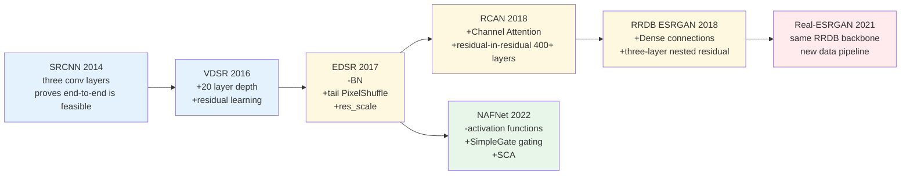
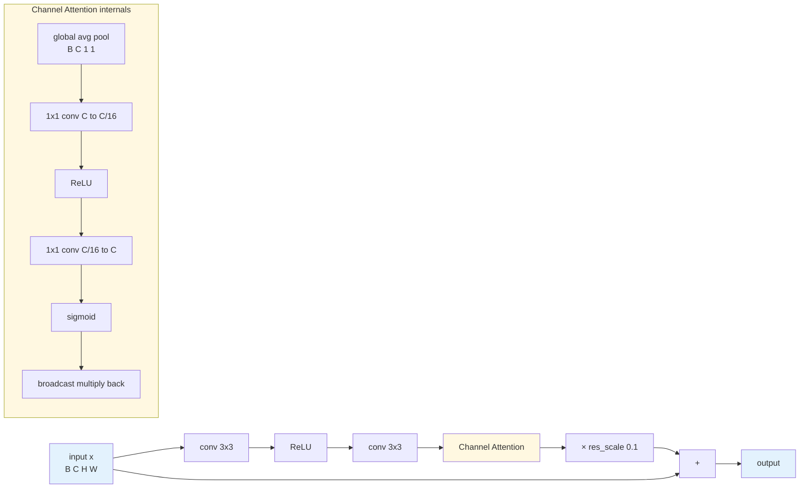
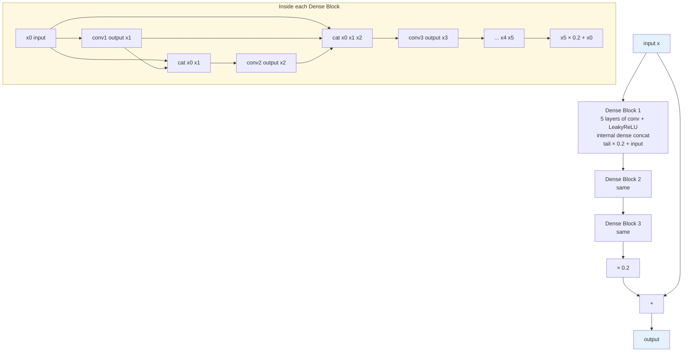

```mermaid
graph TD
    subgraph SRCNN["SRCNN 2014 (in HR space)"]
        S1[LR bicubic upsampled to HR]
        S2[conv 9x9 64]
        S3[conv 1x1 32]
        S4[conv 5x5 3]
        S5[HR output]
        S1 --> S2 --> S3 --> S4 --> S5
    end

    subgraph VDSR["VDSR 2016 (HR space + residual)"]
        V1[LR bicubic to HR]
        V2[20 layers of 3x3 conv]
        V3[+ input residual]
        V4[HR output]
        V1 --> V2 --> V3 --> V4
        V1 -.skip.-> V3
    end

    subgraph EDSR["EDSR 2017 (LR space + tail PixelShuffle)"]
        E1[LR input]
        E2[head conv 64]
        E3[16 residual blocks<br/>no BN res_scale 0.1]
        E4[+ feat global residual]
        E5[PixelShuffle upsample]
        E6[tail conv 3]
        E7[HR output]
        E1 --> E2 --> E3 --> E4 --> E5 --> E6 --> E7
        E2 -.skip.-> E4
    end

    style SRCNN fill:#e3f2fd
    style VDSR fill:#fff8e1
    style EDSR fill:#e8f5e9
```

# Chapter 6 · The CNN Era

> From 2014 through 2022, convolutional architectures established the foundation of modern deep image restoration:
>
> Sparse-coding emulation (SRCNN) $\to$ Very deep residual learning (VDSR / EDSR) $\to$ Channel attention mechanisms (RCAN) $\to$ Dense feature reuse (RRDB) $\to$ Minimalist nonlinear gating (NAFNet).
>
> These eight years represent the classical mechanics of low-level vision: mastering their architectural principles provides the intuition needed to understand modern Transformers and diffusion pipelines.

## 6.0 Reading Notes

This chapter begins Part II (Architectural Paradigms), charting the eight-year evolutionary trajectory of convolutional networks in image restoration.

Key takeaways:

- How to identify the architectural lineage and design principles of any restoration CNN (SRCNN, EDSR, RCAN, ESRGAN/Real-ESRGAN, or NAFNet).
- The trade-offs governing network depth versus width, spatial upsampling operators, normalization layers, and attention mechanisms.
- The mathematical and statistical reasons why Batch Normalization degrades low-level pixel regression.

**Prerequisites.** Familiarity with the forward degradation formulation $y = D(x) + n$ (Chapter 1), representation spaces (Chapter 2), objective loss formulations (Chapter 3), and synthetic degradation pipelines (Chapter 5).

**Key Terminology Introduced in This Chapter:**

- **SRCNN** (Super-Resolution Convolutional Neural Network): The pioneering 3-layer architecture (Dong et al., 2014) establishing end-to-end differentiable mapping for super-resolution.
- **VDSR** (Very Deep Super-Resolution): A 20-layer architecture (Kim et al., 2016) introducing global residual learning to stabilize deep convolutional optimization.
- **EDSR** (Enhanced Deep Super-Resolution): The definitive baseline architecture (Lim et al., 2017) that eliminated Batch Normalization and shifted feature extraction to low-resolution space.
- **RCAN** (Residual Channel Attention Network): Introduced channel attention (Zhang et al., 2018) and residual-in-residual modularity, enabling stable training of 400+ layer backbones.
- **RRDB** (Residual-in-Residual Dense Block): The multi-level residual and dense-connection block introduced in ESRGAN (Wang et al., 2018) and retained in Real-ESRGAN.
- **NAFNet** (Nonlinear Activation Free Network): A minimalist architecture (Chen et al., 2022) replacing standard activations (ReLU/GELU) with channel-split multiplication gates (SimpleGate).
- **PixelShuffle**: Sub-pixel convolution rearranging depth channels $(B, r^2 C, H, W)$ into spatial dimensions $(B, C, rH, rW)$.
- **ICNR** (Initialization for Sub-Pixel Convolution): Weight initialization scheme that prevents checkerboard artifacts during early training.



## 6.1 The Enduring Role of Convolutional Backbones

While Vision Transformers (SwinIR, Restormer, HAT) and diffusion models (StableSR, SUPIR) dominate academic frontiers, convolutional architectures remain essential across production deployments:

- NAFNet (2022) remains a competitive baseline on denoising and deblurring benchmarks due to its exceptional compute efficiency.
- Real-ESRGAN relies on the 2018 RRDB convolutional backbone, demonstrating that data synthesis pipelines often dictate performance more than architectural updates.
- Edge accelerators (mobile NPUs, DSPs) achieve peak hardware utilization on regular 2D convolutions, whereas dynamic self-attention and tensor reshaping operations incur substantial latency overhead.

## 6.2 SRCNN (2014): Establishing End-to-End Learning

Dong et al. reformulated classical sparse-coding super-resolution into a three-layer convolutional mapping:

```
Layer 1 (9×9 Conv, 64 channels)  ←→ Patch extraction and dictionary representation
Layer 2 (1×1 Conv, 32 channels)  ←→ Non-linear feature mapping
Layer 3 (5×5 Conv, 3 channels)   ←→ High-resolution reconstruction
```

```python
import torch
import torch.nn as nn

class SRCNN(nn.Module):
    """SRCNN (Dong et al., 2014). The foundational 3-layer super-resolution network."""
    def __init__(self):
        super().__init__()
        self.conv1 = nn.Conv2d(3, 64, kernel_size=9, padding=4)
        self.conv2 = nn.Conv2d(64, 32, kernel_size=1)
        self.conv3 = nn.Conv2d(32, 3, kernel_size=5, padding=2)
        self.relu = nn.ReLU(inplace=True)

    def forward(self, x: torch.Tensor) -> torch.Tensor:
        # x is the bicubic-upsampled LR input matching target HR dimensions
        x = self.relu(self.conv1(x))
        x = self.relu(self.conv2(x))
        return self.conv3(x)
```

SRCNN demonstrated that entire multi-stage dictionary pipelines could be trained jointly via gradient descent. However, several structural bottlenecks remained:
- **Shallow Receptive Field**: With only three layers, the effective spatial receptive field ($13 \times 13$) cannot model contextual structures across natural imagery.
- **High-Resolution Compute Waste**: Processing inputs after initial bicubic upsampling forces all convolutions to execute at high resolution, multiplying FLOPs by $r^2$ for scaling factor $r$.
- **Direct Full-Image Regression**: Forcing the network to synthesize absolute pixel intensities from scratch produces high target variance and slow convergence.

## 6.3 VDSR (2016): Deep Representations and Global Residuals

Kim et al. addressed the depth limitations of SRCNN by scaling to 20 convolutional layers and introducing global residual learning:

$$
\hat{x} = y_{\text{up}} + f_{\theta}(y_{\text{up}})
$$

Where $y_{\text{up}}$ is the bicubic-interpolated low-resolution input, and $f_{\theta}$ parameterizes the high-frequency residual mapping.

### Advantages of Residual Learning in Low-Level Vision

1. **Low-Frequency Preservation**: The base input $y_{\text{up}}$ already provides the low-frequency structure; the network only needs to synthesize missing high-frequency details.
2. **Reduced Target Variance**: High-frequency residual values center tightly around zero, dropping target variance by orders of magnitude and stabilizing gradient steps.
3. **Direct Gradient Propagation**: The global identity connection provides a clean gradient highway from loss to input, mitigating gradient vanishing in deep stacks.

```python
class VDSR(nn.Module):
    """VDSR (Kim et al., 2016). Deep 20-layer residual baseline."""
    def __init__(self, num_layers: int = 20, base_ch: int = 64):
        super().__init__()
        layers = [nn.Conv2d(3, base_ch, 3, padding=1), nn.ReLU(inplace=True)]
        for _ in range(num_layers - 2):
            layers += [
                nn.Conv2d(base_ch, base_ch, 3, padding=1),
                nn.ReLU(inplace=True)
            ]
        layers.append(nn.Conv2d(base_ch, 3, 3, padding=1))
        self.body = nn.Sequential(*layers)

    def forward(self, x: torch.Tensor) -> torch.Tensor:
        return x + self.body(x)
```

## 6.4 EDSR (2017): Eliminating Batch Normalization and Refining Architecture

Lim et al. established the structural template for modern restoration CNNs through three critical design choices:



### 1. The Removal of Batch Normalization

Standard ResNet blocks apply `Conv → BN → ReLU → Conv → BN`. EDSR demonstrated that **removing Batch Normalization improves restoration fidelity**:

- **Scale Preservation**: Batch Normalization rescales activations using mini-batch statistics, destroying absolute luminance and color intensity information required for pixel regression.
- **Small-Batch Instability**: Restoration training operates on small spatial crops ($48 \times 48$ to $64 \times 64$) with small batch sizes ($4\text{ to }16$). Batch statistics exhibit high variance under these conditions, injecting noise into optimization.
- **Train-Test Inconsistency**: Switching to exponential moving average (EMA) statistics during inference introduces slight spatial color shifts that degrade PSNR.
- **Memory Efficiency**: Removing BN saves intermediate activation memory, allowing the parameter budget to be reallocated toward deeper stacks and wider channels.

### 2. Feature Extraction in Low-Resolution Space

Rather than upsampling inputs before feature extraction, EDSR performs all residual convolutions directly in low-resolution space, executing spatial upsampling in a single step at the network tail via **PixelShuffle**. This reduces per-layer FLOPs by a factor of $r^2$.

```python
class UpsampleBlock(nn.Module):
    """PixelShuffle upsampling block supporting 2x, 3x, and 4x scale factors."""
    def __init__(self, in_ch: int, scale: int):
        super().__init__()
        layers = []
        if scale in (2, 3):
            layers += [
                nn.Conv2d(in_ch, in_ch * scale * scale, 3, padding=1),
                nn.PixelShuffle(scale),
            ]
        elif scale == 4:
            for _ in range(2):
                layers += [
                    nn.Conv2d(in_ch, in_ch * 4, 3, padding=1),
                    nn.PixelShuffle(2),
                ]
        else:
            raise NotImplementedError(f"Scale factor {scale} not supported.")
        self.up = nn.Sequential(*layers)

    def forward(self, x: torch.Tensor) -> torch.Tensor:
        return self.up(x)
```

### 3. Residual Scaling (`res_scale = 0.1`)

Deep residual stacks without normalization can suffer from variance explosion across additive shortcuts. Scaling the residual path by a constant factor (e.g., $0.1$) bounds activation variance and stabilizes deep backpropagation.

```python
class ResidualBlock(nn.Module):
    """EDSR-style residual block: no normalization, res_scale variance stabilization."""
    def __init__(self, ch: int = 64, res_scale: float = 0.1):
        super().__init__()
        self.body = nn.Sequential(
            nn.Conv2d(ch, ch, 3, padding=1),
            nn.ReLU(inplace=True),
            nn.Conv2d(ch, ch, 3, padding=1),
        )
        self.res_scale = res_scale

    def forward(self, x: torch.Tensor) -> torch.Tensor:
        return x + self.body(x) * self.res_scale


class EDSR(nn.Module):
    """EDSR (Lim et al., 2017). The classic convolutional restoration baseline."""
    def __init__(self, scale: int = 4, num_blocks: int = 16,
                 ch: int = 64, res_scale: float = 0.1):
        super().__init__()
        self.head = nn.Conv2d(3, ch, 3, padding=1)
        self.body = nn.Sequential(*[
            ResidualBlock(ch, res_scale) for _ in range(num_blocks)
        ])
        self.body_tail = nn.Conv2d(ch, ch, 3, padding=1)
        self.upsample = UpsampleBlock(ch, scale)
        self.tail = nn.Conv2d(ch, 3, 3, padding=1)

    def forward(self, x: torch.Tensor) -> torch.Tensor:
        feat = self.head(x)
        body = self.body_tail(self.body(feat)) + feat
        return self.tail(self.upsample(body))
```

## 6.5 RCAN (2018): Channel Attention and Deep Hierarchies

Zhang et al. introduced **Channel Attention (CA)** into low-level vision to dynamically rescale feature channels according to global contextual cues:



```python
class ChannelAttention(nn.Module):
    """Squeeze-and-Excitation channel attention used in RCAN."""
    def __init__(self, ch: int, reduction: int = 16):
        super().__init__()
        self.avg_pool = nn.AdaptiveAvgPool2d(1)
        self.fc = nn.Sequential(
            nn.Conv2d(ch, ch // reduction, 1),
            nn.ReLU(inplace=True),
            nn.Conv2d(ch // reduction, ch, 1),
            nn.Sigmoid(),
        )

    def forward(self, x: torch.Tensor) -> torch.Tensor:
        w = self.fc(self.avg_pool(x))
        return x * w
```

By nesting Residual Channel Attention Blocks (RCAB) inside multi-level Residual Groups (RG), RCAN stabilized training across backbones exceeding 400 convolutional layers.

## 6.6 RRDB (ESRGAN, 2018): Dense Feature Reuse

Wang et al. proposed the **Residual-in-Residual Dense Block (RRDB)** in ESRGAN, replacing plain residual blocks with dense connections:

```python
class DenseBlock(nn.Module):
    """5-layer dense connection block used in RRDB."""
    def __init__(self, ch: int = 64, growth: int = 32):
        super().__init__()
        self.conv1 = nn.Conv2d(ch + 0 * growth, growth, 3, padding=1)
        self.conv2 = nn.Conv2d(ch + 1 * growth, growth, 3, padding=1)
        self.conv3 = nn.Conv2d(ch + 2 * growth, growth, 3, padding=1)
        self.conv4 = nn.Conv2d(ch + 3 * growth, growth, 3, padding=1)
        self.conv5 = nn.Conv2d(ch + 4 * growth, ch, 3, padding=1)
        self.lrelu = nn.LeakyReLU(0.2, inplace=True)

    def forward(self, x: torch.Tensor) -> torch.Tensor:
        x1 = self.lrelu(self.conv1(x))
        x2 = self.lrelu(self.conv2(torch.cat([x, x1], 1)))
        x3 = self.lrelu(self.conv3(torch.cat([x, x1, x2], 1)))
        x4 = self.lrelu(self.conv4(torch.cat([x, x1, x2, x3], 1)))
        x5 = self.conv5(torch.cat([x, x1, x2, x3, x4], 1))
        return x5 * 0.2 + x


class RRDB(nn.Module):
    """Residual-in-Residual Dense Block backbone module."""
    def __init__(self, ch: int = 64, growth: int = 32):
        super().__init__()
        self.db1 = DenseBlock(ch, growth)
        self.db2 = DenseBlock(ch, growth)
        self.db3 = DenseBlock(ch, growth)

    def forward(self, x: torch.Tensor) -> torch.Tensor:
        out = self.db1(x)
        out = self.db2(out)
        out = self.db3(out)
        return out * 0.2 + x
```

Drawing RRDB's "three-layer nesting" clearly:



ESRGAN stacks 23 RRDBs in total, with about 17M parameters. This network is slightly lower than RCAN on the PSNR metric, but combined with GAN training its **visual quality** is far better than the pure-PSNR-optimized RCAN: this is the split between the PSNR camp and the perceptual camp, already discussed in detail in §4.8.

Real-ESRGAN reuses the RRDB network and only swaps the data pipeline and training losses, with completely transformed results. **This once again validates the conclusion of §5.1: data > network.** The same RRDB, trained on bicubic data, gives 18.2 dB PSNR on real images (barely working); trained on Real-ESRGAN pipeline data, it gives 23.8 dB (usable) without changing a single line of network code.

## 6.7 NAFNet (2022): Counter-Trend Simplification

The trend in low-level vision from 2018 to 2022 was "adding more bells and whistles": Transformer blocks, all sorts of attention, complex normalization, and hybrid architectures. Chen et al.'s NAFNet went the other way, **removing everything that is not strictly necessary**, and yet achieved SOTA on denoising and deblurring. The paper title's "Non-linear Activation Free" openly declares the counter-trend stance.

### Removal list

- **Batch Normalization**: removed
- **GELU / Swish**: removed, replaced by the simpler SimpleGate
- **Self-Attention**: removed, only an extremely simple channel attention is kept
- **ReLU**: in the "Plain net," no activation function is used at all

Note: NAFNet **keeps a simplified LayerNorm2d** (once at the start of each block's spatial path and once at the start of the channel path); it does not remove all normalization layers. What it removes are the two "fancy architecture" categories of nonlinearity and attention; normalization is in fact essential for stable training.

### SimpleGate (replacing GELU)

GELU is $x \cdot \Phi(x)$ (input multiplied by the Gaussian CDF). NAFNet noticed that this is essentially "input multiplied by a gating signal", where $\Phi(x)$ takes values in $[0, 1]$ and acts as a soft gate. If the gating signal itself can be learned adaptively from the features, there is no need to use $\Phi(x)$ as a fixed function.

Concretely, split the input in half along the channel dimension and multiply element-wise:

$$
\text{SimpleGate}(x) = x_1 \odot x_2
$$

where $x = [x_1, x_2]$ is split along the channel dimension. $x_2$ plays the role of the gate, but its value range is determined by the features themselves, not constrained to $[0, 1]$.

```python
class SimpleGate(nn.Module):
    def forward(self, x):
        x1, x2 = x.chunk(2, dim=1)
        return x1 * x2
```

Visual impact: nonlinear capability similar to GELU, **with no learnable parameters and cheaper than GELU**: just chunk + element-wise multiplication, no erf/exp approximation. The cost is that the channel count is halved, so the preceding conv needs to expand channels by 2×.

### Simplified Channel Attention (SCA)

```python
class SCA(nn.Module):
    """NAFNet's simplified channel attention - keeps only average pool + 1x1 conv."""
    def __init__(self, ch):
        super().__init__()
        self.pool = nn.AdaptiveAvgPool2d(1)
        self.conv = nn.Conv2d(ch, ch, 1)

    def forward(self, x):
        return x * self.conv(self.pool(x))
```

Note:

- No reduction (RCAN uses $C \to C/16 \to C$)
- No ReLU
- No sigmoid (multiplied directly, the weights are not normalized)

This "looks wrong" design actually works: it is a counter-intuitive finding from the NAFNet paper. Intuitively, without sigmoid, the multiplicative coefficients can be arbitrarily large or negative, and training looks like it should be unstable. A plausible explanation for why it works is that LayerNorm2d has already normalized the input into a reasonable range, and SCA's output "weight" combined with LayerNorm's constraint is in fact already bounded in amplitude.

### The full NAFBlock

```python
class NAFBlock(nn.Module):
    """The core block of NAFNet."""
    def __init__(self, ch: int, dw_expand: int = 2, ffn_expand: int = 2):
        super().__init__()
        # Spatial mixing
        self.norm1 = LayerNorm2d(ch)
        self.conv1 = nn.Conv2d(ch, ch * dw_expand, 1)
        # Depthwise
        self.dwconv = nn.Conv2d(ch * dw_expand, ch * dw_expand, 3,
                                padding=1, groups=ch * dw_expand)
        self.gate1 = SimpleGate()  # output channels halved
        self.sca = SCA(ch * dw_expand // 2)
        self.conv2 = nn.Conv2d(ch * dw_expand // 2, ch, 1)

        # Channel mixing (FFN)
        self.norm2 = LayerNorm2d(ch)
        self.conv3 = nn.Conv2d(ch, ch * ffn_expand, 1)
        self.gate2 = SimpleGate()
        self.conv4 = nn.Conv2d(ch * ffn_expand // 2, ch, 1)

        # Trainable scale
        self.beta  = nn.Parameter(torch.zeros((1, ch, 1, 1)))
        self.gamma = nn.Parameter(torch.zeros((1, ch, 1, 1)))

    def forward(self, x):
        # Spatial path
        y = self.norm1(x)
        y = self.conv1(y)
        y = self.dwconv(y)
        y = self.gate1(y)
        y = self.sca(y)
        y = self.conv2(y)
        x = x + y * self.beta

        # Channel path (FFN)
        y = self.norm2(x)
        y = self.conv3(y)
        y = self.gate2(y)
        y = self.conv4(y)
        return x + y * self.gamma


class LayerNorm2d(nn.Module):
    """Channel-wise LayerNorm for 2D feature maps."""
    def __init__(self, ch):
        super().__init__()
        self.weight = nn.Parameter(torch.ones(ch))
        self.bias = nn.Parameter(torch.zeros(ch))
        self.eps = 1e-6

    def forward(self, x):
        # (B, C, H, W) -> normalize over C
        mu = x.mean(dim=1, keepdim=True)
        var = x.var(dim=1, keepdim=True, unbiased=False)
        x = (x - mu) / torch.sqrt(var + self.eps)
        return x * self.weight.view(1, -1, 1, 1) + self.bias.view(1, -1, 1, 1)
```

NAFBlock has two paths: the spatial path does a depthwise-separable-style "spatial mixing," and the channel path resembles a Transformer FFN for "channel mixing." Both paths have LayerNorm2d at the front, SimpleGate as nonlinearity, and learnable $\beta / \gamma$ scaling the residual amplitude. The overall structure mirrors a Transformer block's "Attention + FFN" closely, but attention is simplified into the combination of SCA + depthwise conv.

To compare side-by-side with EDSR's ResidualBlock, RCAN's RCAB, and ESRGAN's RRDB, here are the four generations of core block internals on one diagram:

```mermaid
graph TD
    subgraph EDSRb["EDSR ResidualBlock 2017"]
        e1[x] --> e2[conv 3x3]
        e2 --> e3[ReLU]
        e3 --> e4[conv 3x3]
        e4 --> e5[× 0.1]
```mermaid
graph TD
    subgraph EDSRb["EDSR ResidualBlock 2017"]
        e1[x] --> e2[conv 3x3]
        e2 --> e3[ReLU]
        e3 --> e4[conv 3x3]
        e4 --> e5[× 0.1]
        e5 --> e6[+]
        e1 --> e6
        e6 --> e7[out]
    end

    subgraph RCANb["RCAN RCAB 2018"]
        r1[x] --> r2[conv 3x3]
        r2 --> r3[ReLU]
        r3 --> r4[conv 3x3]
        r4 --> r5[ChannelAttention<br/>pool + MLP + sigmoid]
        r5 --> r6[× scale]
        r6 --> r7[+]
        r1 --> r7
        r7 --> r8[out]
    end

    subgraph RRDBb["ESRGAN RRDB 2018"]
        d1[x] --> d2[DenseBlock × 3<br/>each internal 5-layer dense concat]
        d2 --> d3[× 0.2]
        d3 --> d4[+]
        d1 --> d4
        d4 --> d5[out]
    end

    subgraph NAFb["NAFNet NAFBlock 2022"]
        n1[x] --> n2[LayerNorm2d]
        n2 --> n3[1x1 conv expand 2]
        n3 --> n4[depthwise 3x3]
        n4 --> n5[SimpleGate split mul]
        n5 --> n6[SCA pool + 1x1 mul]
        n6 --> n7[1x1 conv]
        n7 --> n8[× beta]
        n8 --> n9[+]
        n1 --> n9
        n9 --> n10[FFN: LN -> 1x1 -> SimpleGate -> 1x1 × gamma]
        n10 --> n11[+]
        n9 --> n11
        n11 --> n12[out]
    end

    style EDSRb fill:#e3f2fd
    style RCANb fill:#fff8e1
    style RRDBb fill:#fff8e1
    style NAFb fill:#e8f5e9
```

## 6.7 NAFNet (2022): Minimalist Nonlinear Gating

Chen et al. introduced **NAFNet (Nonlinear Activation Free Network)**, demonstrating that state-of-the-art restoration performance could be achieved while stripping away complex attention heads, GELU activations, and standard nonlinearities.

### SimpleGate Mechanism

NAFNet replaces nonlinear activation functions (GELU, ReLU) with an element-wise channel-split multiplication:

$$
\text{SimpleGate}(x) = x_1 \odot x_2, \quad \text{where } x = [x_1, x_2] \in \mathbb{R}^{B \times 2C \times H \times W}
$$

```python
class SimpleGate(nn.Module):
    """Channel-split element-wise multiplication gate."""
    def forward(self, x: torch.Tensor) -> torch.Tensor:
        x1, x2 = x.chunk(2, dim=1)
        return x1 * x2
```

### Simplified Channel Attention (SCA)

SCA eliminates the fully-connected bottleneck and sigmoid activations of standard SE modules, computing unnormalized channel multipliers directly via global average pooling and a single $1 \times 1$ convolution:

```python
class SCA(nn.Module):
    """Simplified Channel Attention."""
    def __init__(self, ch: int):
        super().__init__()
        self.pool = nn.AdaptiveAvgPool2d(1)
        self.conv = nn.Conv2d(ch, ch, 1)

    def forward(self, x: torch.Tensor) -> torch.Tensor:
        return x * self.conv(self.pool(x))
```

### Complete NAFBlock Implementation

```python
class LayerNorm2d(nn.Module):
    """2D Channel-wise Layer Normalization."""
    def __init__(self, ch: int):
        super().__init__()
        self.weight = nn.Parameter(torch.ones(ch))
        self.bias = nn.Parameter(torch.zeros(ch))
        self.eps = 1e-6

    def forward(self, x: torch.Tensor) -> torch.Tensor:
        mu = x.mean(dim=1, keepdim=True)
        var = x.var(dim=1, keepdim=True, unbiased=False)
        x = (x - mu) / torch.sqrt(var + self.eps)
        return x * self.weight.view(1, -1, 1, 1) + self.bias.view(1, -1, 1, 1)


class NAFBlock(nn.Module):
    """Core building block of NAFNet."""
    def __init__(self, ch: int, dw_expand: int = 2, ffn_expand: int = 2):
        super().__init__()
        # Spatial mixing path
        self.norm1 = LayerNorm2d(ch)
        self.conv1 = nn.Conv2d(ch, ch * dw_expand, 1)
        self.dwconv = nn.Conv2d(ch * dw_expand, ch * dw_expand, 3,
                                padding=1, groups=ch * dw_expand)
        self.gate1 = SimpleGate()
        self.sca = SCA(ch * dw_expand // 2)
        self.conv2 = nn.Conv2d(ch * dw_expand // 2, ch, 1)

        # Channel mixing path (FFN)
        self.norm2 = LayerNorm2d(ch)
        self.conv3 = nn.Conv2d(ch, ch * ffn_expand, 1)
        self.gate2 = SimpleGate()
        self.conv4 = nn.Conv2d(ch * ffn_expand // 2, ch, 1)

        # Learnable residual scale parameters
        self.beta  = nn.Parameter(torch.zeros((1, ch, 1, 1)))
        self.gamma = nn.Parameter(torch.zeros((1, ch, 1, 1)))

    def forward(self, x: torch.Tensor) -> torch.Tensor:
        # Spatial path
        y = self.conv2(self.sca(self.gate1(self.dwconv(self.conv1(self.norm1(x))))))
        x = x + y * self.beta

        # Channel path
        y = self.conv4(self.gate2(self.conv3(self.norm2(x))))
        return x + y * self.gamma
```

NAFNet demonstrated that **appropriate compute allocation and clean optimization paths matter more than architectural complexity**.

## 6.8 Spatial Upsampling Mechanics: A Comparative Analysis

| Upsampling Method | Computational Mechanism | Primary Advantage | Known Failure Mode | Recommended Context |
|-------------------|------------------------|-------------------|--------------------|---------------------|
| **Interpolation + Conv** | Fixed spatial resampling followed by conv | Straightforward implementation | High compute cost in HR space | Baseline prototyping |
| **Transposed Conv** | Stride $> 1$ learnable deconvolution | Learns direct spatial mapping | Periodic checkerboard artifacts | Avoid in modern pipelines |
| **PixelShuffle** | Channel-to-space tensor rearrangement | Peak parameter and compute efficiency | Initial checkerboard if uncalibrated | Standard modern default |
| **PixelShuffle + ICNR** | PixelShuffle with grouped kernel initialization | Completely eliminates initialization ripple | Minor initialization setup step | **Production standard** |

### ICNR Initialization Implementation

```python
def icnr_init(tensor: torch.Tensor, scale: int = 2) -> torch.Tensor:
    """Initializes convolution kernels prior to PixelShuffle to guarantee identical
    sub-pixel feature initialization, preventing checkerboard artifacts.
    """
    out_ch = tensor.shape[0]
    sub_ch = out_ch // (scale ** 2)
    sub_kernel = torch.zeros(sub_ch, *tensor.shape[1:])
    nn.init.kaiming_normal_(sub_kernel)
    sub_kernel = sub_kernel.repeat(scale ** 2, 1, 1, 1)
    tensor.copy_(sub_kernel)
    return tensor
```

## 6.9 Normalization Layers in Image Restoration

| Normalization Variant | Reduction Dimensions | Operational Behavior in Low-Level Vision | Deployment Recommendation |
|----------------------|----------------------|------------------------------------------|---------------------------|
| **Batch Normalization (BN)** | $(B, H, W)$ per channel | Destroys absolute intensity scale; high batch variance | **Prohibited** in restoration |
| **Group Normalization (GN)** | $(G, H, W)$ per channel group | Batch-independent; acceptable stability | Permitted in large backbones |
| **Instance Normalization (IN)** | $(H, W)$ per channel instance | Strips global color and contrast distribution | Restricted to style transfer |
| **Layer Normalization 2D (LN)** | $(C)$ per spatial coordinate | Deterministic per image; stabilizes attention/FFN | **Recommended** for modern backbones |
| **No Normalization (Identity)** | None | Preserves exact linear dynamic range | **Recommended** for pure CNNs |

## 6.10 Activation Functions

| Activation Function | Formulation | Operational Characteristics |
|--------------------|-------------|-----------------------------|
| **ReLU** | $\max(0, x)$ | Standard, computationally light, susceptible to dead neurons |
| **LeakyReLU** | $\max(\alpha x, x), \alpha = 0.2$ | Prevents gradient saturation; optimal for GAN discriminators |
| **SiLU / Swish** | $x \cdot \sigma(x)$ | Smooth continuous transition around zero; modern default |
| **GELU** | $x \cdot \Phi(x)$ | Standard for Vision Transformers; continuous second derivatives |
| **SimpleGate** | $x_1 \odot x_2$ | Zero extra parameters; linear scaling; optimal for NAFNet blocks |

## 6.11 Production Reference Architecture: `SRBaseline`

The following implementation provides a validated starting baseline for super-resolution tasks:

```python
import torch
import torch.nn as nn

class ResidualBlock(nn.Module):
    def __init__(self, ch: int, res_scale: float = 0.1):
        super().__init__()
        self.body = nn.Sequential(
            nn.Conv2d(ch, ch, 3, padding=1),
            nn.LeakyReLU(0.2, inplace=True),
            nn.Conv2d(ch, ch, 3, padding=1),
        )
        self.res_scale = res_scale

    def forward(self, x: torch.Tensor) -> torch.Tensor:
        return x + self.body(x) * self.res_scale


class UpsampleBlock(nn.Module):
    def __init__(self, ch: int, scale: int):
        super().__init__()
        layers = []
        if scale == 4:
            for _ in range(2):
                layers += [
                    nn.Conv2d(ch, ch * 4, 3, padding=1),
                    nn.PixelShuffle(2)
                ]
        elif scale in (2, 3):
            layers += [
                nn.Conv2d(ch, ch * scale * scale, 3, padding=1),
                nn.PixelShuffle(scale)
            ]
        self.up = nn.Sequential(*layers)

    def forward(self, x: torch.Tensor) -> torch.Tensor:
        return self.up(x)


class SRBaseline(nn.Module):
    """Production-ready convolutional super-resolution baseline (1.5M parameters)."""
    def __init__(self, scale: int = 4, num_blocks: int = 16,
                 ch: int = 64, res_scale: float = 0.1):
        super().__init__()
        self.head = nn.Conv2d(3, ch, 3, padding=1)
        self.body = nn.Sequential(*[
            ResidualBlock(ch, res_scale) for _ in range(num_blocks)
        ])
        self.body_tail = nn.Conv2d(ch, ch, 3, padding=1)
        self.up = UpsampleBlock(ch, scale)
        self.tail = nn.Conv2d(ch, 3, 3, padding=1)

        # Apply ICNR initialization across PixelShuffle projection layers
        per_step_scale = 2 if scale == 4 else scale
        for m in self.up.modules():
            if isinstance(m, nn.Conv2d):
                self._icnr_init(m.weight, scale=per_step_scale)

    @staticmethod
    def _icnr_init(weight: torch.Tensor, scale: int = 2):
        out_ch = weight.shape[0]
        sub_ch = out_ch // (scale * scale)
        sub_kernel = torch.empty(sub_ch, *weight.shape[1:])
        nn.init.kaiming_normal_(sub_kernel)
        sub_kernel = sub_kernel.repeat(scale * scale, 1, 1, 1)
        weight.data.copy_(sub_kernel)

    def forward(self, x: torch.Tensor) -> torch.Tensor:
        feat = self.head(x)
        body = self.body_tail(self.body(feat)) + feat
        return self.tail(self.up(body))
```

## 6.12 Chapter Summary

1. **Evolutionary Trajectory**: Convolutional restoration architectures evolved through systematic structural refinement: SRCNN (feasibility) $\to$ VDSR (depth + global residuals) $\to$ EDSR (removal of BN + tail PixelShuffle) $\to$ RCAN (channel attention) $\to$ RRDB (dense multi-scale feature reuse) $\to$ NAFNet (nonlinear-free gating).
2. **Residual Learning as a Universal Standard**: Residual connections isolate high-frequency modeling and stabilize deep gradient propagation across all modern backbones.
3. **Batch Normalization is Prohibited in Low-Level Vision**: Normalizing across spatial patches corrupts absolute pixel intensity scale and induces train-test distribution shifts.
4. **Spatial Upsampling Standard**: Low-resolution feature extraction paired with tail PixelShuffle and ICNR initialization maximizes compute efficiency while eliminating checkerboard artifacts.
5. **Architectural Simplicity vs. Data Scale**: NAFNet and Real-ESRGAN demonstrate that simple, well-conditioned convolutional architectures paired with robust synthetic data pipelines consistently match or exceed complex models in real-world deployment.

---

> Next: [Transformers in Low-Level Vision](07-transformer.md) examines how self-attention mechanisms capture non-local spatial correlations in SwinIR, Restormer, and HAT.
