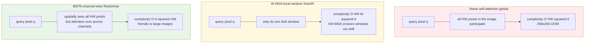
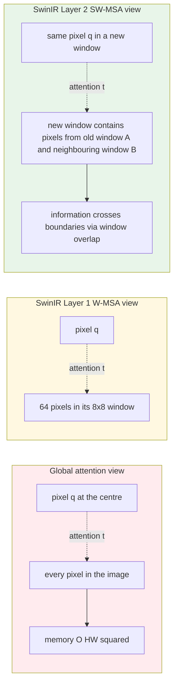

# Chapter 7 · Transformers in Low-Level Vision

> The receptive field of a CNN is local, and it obtains a large receptive field indirectly by stacking depth.
>
> The self-attention of a Transformer is global, but at the cost of $O(N^2)$ computation.
>
> How Transformers land in low-level vision has been one of the most interesting engineering stories of this field over the past three years.

## 7.0 Reading guide

This chapter is the second stop in Part II. It picks up from the CNN era of Chapter 6 and walks through four or five years of design evolution after self-attention was brought into low-level vision. By the end you should be able to:

- Understand why "long-range dependence" is genuinely useful for low-level vision, rather than rhetoric from the Transformer camp
- Read the trade-offs of the two mainstream lines: window attention (W-MSA / SW-MSA) and transposed channel attention (MDTA)
- When choosing a backbone for a new task, make an informed judgement between CNN, SwinIR, Restormer, HAT, and hybrid architectures
- Read simplified SwinIR / Restormer code and know what each line is solving

This chapter assumes you already know:

- The CNN-era evolution from Chapter 6 (especially residual blocks, PixelShuffle, and channel attention)
- The form of plain self-attention $\text{softmax}(QK^T / \sqrt{d}) V$ and its $O(N^2)$ complexity
- The difference between LayerNorm and BatchNorm (Section 6.9 in Chapter 6)

It does not assume that you have read the original ViT / Swin / SwinIR / Restormer / HAT papers, nor that you have written a CUDA implementation of attention.

**Abbreviations that appear here for the first time or recur throughout this chapter.** Listed up front; each is expanded in one sentence the first time it is used later:

- **ViT** (Vision Transformer): proposed by Dosovitskiy et al. in 2020, splits images into 16×16 patches as tokens fed to a standard Transformer; the foundational work of Transformers in vision
- **MSA** (Multi-head Self-Attention): the core operator of a standard Transformer, where multiple attention heads each look at a subspace
- **W-MSA** (Window-based Multi-head Self-Attention): attention only within $M \times M$ local windows, reducing complexity from $O((HW)^2)$ to $O(HW \cdot M^2)$
- **SW-MSA** (Shifted Window MSA): the companion of W-MSA, shifting windows by $M/2$ every other layer so that adjacent layers' window boundaries are staggered, letting information flow across windows
- **Swin Transformer**: proposed by Liu et al. in 2021, a hierarchical vision Transformer alternating W-MSA and SW-MSA
- **SwinIR** (Swin Transformer for Image Restoration): Liang et al. (2021) moved Swin to low-level vision as a unified architecture for SR / denoising / deblurring
- **RSTB** (Residual Swin Transformer Block): the mid-layer component of SwinIR, wrapping several Swin Transformer Layers in a residual
- **STL** (Swin Transformer Layer): the basic unit inside an RSTB, consisting of one W-MSA or SW-MSA + one MLP
- **Restormer** (Restoration Transformer): proposed by Zamir et al. in 2022, a universal SOTA for denoising / deblurring / deraining using channel-wise attention (MDTA) + gated FFN (GDFN)
- **MDTA** (Multi-Dconv Head Transposed Attention): the core operator of Restormer, moving self-attention from the token dimension to the channel dimension and reducing complexity from $O((HW)^2 d)$ to $O(d^2 \cdot HW)$
- **GDFN** (Gated-Dconv Feed-Forward Network): the FFN module of Restormer, adding gating + depthwise convolution
- **HAT** (Hybrid Attention Transformer): proposed by Chen et al. in 2023, combining W-MSA, Channel Attention, and Overlapping Cross-Attention
- **HAB** (Hybrid Attention Block): the base block of HAT, W-MSA + CAB in parallel
- **OCAB** (Overlapping Cross-Attention Block): an extension block of HAT that performs cross-attention on overlapping windows, compensating for the indirectness of SW-MSA
- **CAB** (Channel Attention Block): the channel-attention module used inside HAT, structurally close to RCAN's RCAB
- **LAM** (Local Attribution Map): a visualization tool showing which input pixels a model actually uses; HAT uses it to analyze SwinIR's "underused capacity" problem
- **self-similarity**: the statistical phenomenon in natural images where the same texture appears at multiple positions; the core reason attention is useful for low-level vision
- **non-local means**: a classical image-processing method that exploits self-similarity for denoising; attention can be viewed as its learnable version

## 7.1 Why Transformers came to low-level vision

In the evolution covered in Chapter 6, every step of the CNN was solving the "receptive field" problem — going deeper, adding attention, adding dense connections. But the receptive field of a CNN is limited by kernel size and depth, and **the theoretical receptive field grows linearly with depth, while in practice the effective receptive field is far smaller than the theoretical one**. Several studies have visualized the actual receptive field and found that a 20-layer ResNet's effective receptive field is only about one third of the theoretical one, and it falls off as a Gaussian — pixels farther away have weaker influence.

A counterintuitive fact in low-level vision:

> Distant pixels **are useful** in restoration tasks.

Examples:

- **Denoising**: an image often has similar textures elsewhere (a patch of grass, a wall), and the "clean copies" far away can help recover details in regions covered by noise, because averaging several noise samples reduces the noise variance
- **Super-resolution**: repeating details (a row of windows, a stretch of tiles, the same letter appearing several times in printed text) let high-frequency information be borrowed from other locations
- **Deblurring**: when the blur kernel is consistent across the whole image, information from the entire image can be used to jointly estimate the kernel — a single point does not carry enough information, distant edges need to jointly constrain the kernel
- **Dehazing / deraining**: the statistical model of haze and rain is global across the whole image; knowing the haze density in a distant sky region helps recover the colours of nearby buildings

This is the idea behind classical **non-local means** in image processing — **self-similarity** is a statistical property of natural images. Each pixel's best neighbour is not necessarily a spatially adjacent pixel but may be a "look-alike" pixel on the other side of the image. CNNs exploit this only by stacking depth, which is inefficient.

Self-attention is naturally suited to this: every pixel directly interacts with every other pixel, and self-similarity can be **captured within a single layer**.

But the cost is: **$O(H^2 W^2 \cdot C)$ computational complexity**. On a $256 \times 256$ image, the attention map is $65536 \times 65536$, and in FP32 it takes 17 GB of memory just to store one head's attention — it does not even fit in memory.

The whole story of Transformers in low-level vision is **how to make self-attention preserve its long-range capability while still being practical**.

To make the difference among "global vs window vs channel attention" concrete, here is a sketch of which other pixels a query pixel actually gets to "see" under each of the three schemes, on the same $H \times W$ feature map.



The colour grouping reflects the trade-off between "cost vs long-range capability". The red Full is the ideal one but does not run. The yellow Window does run, but each layer sees only a local patch and long-range capability has to accumulate across layers. The green Channel can both run and "see the whole image" in every layer; the cost is that attention is no longer between pixels but between channels, which requires rethinking what it is doing — Section 7.5 expands on this.

## 7.2 Problems with naive ViT

Applying Vision Transformer directly to low-level vision raises several immediate problems.

### Computation explodes

ViT splits the image into $16 \times 16$ patches. A $256 \times 256$ image gives $16 \times 16 = 256$ patches and an attention of $256 \times 256$, which is acceptable. A $1024 \times 1024$ image gives $64 \times 64 = 4096$ patches and an attention of $4096 \times 4096$, i.e. 16 million elements, **which blows up GPU memory**. The input resolution in low-level vision is usually an order of magnitude larger than in classification (224×224 for classification, often 1024×1024 or more for denoising / SR), so ViT's "classification preset" simply does not hold up.

### Patch granularity is too coarse

ViT's $16 \times 16$ patches are suited to classification (semantic level), not to pixel-level tasks. Low-level vision requires **pixel-level details** — SR has to recover every pixel, denoising has to preserve the high-frequency components of every pixel. Bundling 16×16 pixels into one token mixes the high-frequency information together before attention even starts; no amount of attention can recover it afterwards.

Transformers for low-level vision either use smaller patches (1×1 or 2×2, effectively no bundling) or preserve a pixel-level representation in some other way (e.g. SwinIR's 1×1 patch + window partition).

### Lacking inductive bias

The locality and translation equivariance of CNNs are reasonable inductive biases for low-level vision: neighbouring pixels are correlated, and the same texture appearing at different locations should be processed in the same way. ViT abandons all of them and needs more data to learn them.

Low-level vision datasets are relatively small (DF2K is just a few thousand images), nothing like the ten-million-scale ImageNet for classification. **ViT is at a clear disadvantage in low-data settings**. This is also why SwinIR chose "windows + relative position encoding" instead of pure ViT — the window partition re-injects a locality bias, and relative position encoding re-injects a translation-equivariance bias.

## 7.3 SwinIR (2021) — window attention

Liang et al. brought Swin Transformer into low-level vision and proposed SwinIR — a unified architecture for SR, denoising, and deblurring.

### Core idea: local window self-attention

Instead of doing attention over the whole image, split the image into $M \times M$ windows (typically $M = 8$), and **do self-attention independently inside each window**.

- Number of windows: $\frac{H}{M} \times \frac{W}{M}$
- Attention per window: $M^2 \times M^2$
- Total complexity: $\frac{H}{M} \times \frac{W}{M} \times M^4 \cdot C = HW \cdot M^2 \cdot C$

Compared with naive attention: $H^2 W^2 \cdot C$. With $M = 8$, the complexity drops from $O((HW)^2)$ to $O(HW \cdot 64)$, **from quadratic to linear**. On a $256 \times 256$ input, naive attention has $256^4 = 4.3 \times 10^9$ elements in the attention map, while W-MSA has $256^2 \times 64 = 4.2 \times 10^6$ — three orders of magnitude smaller.

### Shifted Window solves the window-isolation problem

A problem with W-MSA: there is no information exchange between windows. The attention in the second layer can still only see information inside the same window as the first layer, and long-range dependence cannot be established at all before depth grows large enough.

The solution: **SW-MSA** (Shifted Window MSA). Every other layer, shift the entire window partition by $M/2$ so that adjacent layers' window boundaries no longer align. A pixel that belongs to window A in layer 1 then belongs to window B in layer 2, where A and B overlap partially; information among pixels propagates through this "overlap propagation" until it covers the whole image after a few layers.

```
Layer 1 (W-MSA):           Layer 2 (SW-MSA):
+----+----+----+----+      +-+----+----+----+-+
|    |    |    |    |      | |    |    |    | |
+----+----+----+----+      +-+----+----+----+-+
|    |    |    |    |      | |    |    |    | |
+----+----+----+----+      +-+----+----+----+-+
|    |    |    |    |      | |    |    |    | |
+----+----+----+----+      +-+----+----+----+-+

Windows aligned             Windows shifted by M/2
```

After one W-MSA followed by one SW-MSA, the effective receptive field of every pixel covers a $2M \times 2M$ area. Another pair of W-MSA + SW-MSA doubles it again — in theory $\log(\max(H, W) / M)$ pairs cover the whole image, and SwinIR's 6 RSTBs × 6 STLs = 36 layers are more than enough for any position to see the entire image.

Putting "local windows + shift" and "global attention" side by side on the same feature map, the visible ranges look like this:



The red Full sees all pixels at once but cannot run; the yellow W-MSA sees only 64 per layer; the green SW-MSA makes the next layer's windows misalign with the previous layer's, so cross-boundary information builds up across layers. SwinIR's choice of "small window + shallow depth" is a memory-controllable design; HAT's OCAB pushes the window larger and allows overlap, as discussed in Section 7.6.

### Implementing window attention

```python
import torch
import torch.nn as nn
import torch.nn.functional as F


def window_partition(x: torch.Tensor, window_size: int) -> torch.Tensor:
    """Split (B, H, W, C) into (B*num_windows, M, M, C)."""
    B, H, W, C = x.shape
    x = x.view(B, H // window_size, window_size,
               W // window_size, window_size, C)
    windows = x.permute(0, 1, 3, 2, 4, 5).contiguous()
    return windows.view(-1, window_size, window_size, C)


def window_reverse(windows: torch.Tensor, window_size: int,
                   H: int, W: int) -> torch.Tensor:
    """Reverse back to (B, H, W, C)."""
    B = int(windows.shape[0] / (H * W / window_size / window_size))
    x = windows.view(B, H // window_size, W // window_size,
                     window_size, window_size, -1)
    x = x.permute(0, 1, 3, 2, 4, 5).contiguous()
    return x.view(B, H, W, -1)


class WindowAttention(nn.Module):
    """W-MSA: self-attention within a window, with relative position bias."""

    def __init__(self, dim: int, window_size: int, num_heads: int):
        super().__init__()
        self.dim = dim
        self.window_size = window_size
        self.num_heads = num_heads
        head_dim = dim // num_heads
        self.scale = head_dim ** -0.5

        self.qkv = nn.Linear(dim, dim * 3, bias=True)
        self.proj = nn.Linear(dim, dim)

        # Relative position bias: lets the model learn preferences over different
        # relative positions inside a window
        self.relative_position_bias_table = nn.Parameter(
            torch.zeros((2 * window_size - 1) ** 2, num_heads)
        )
        coords_h = torch.arange(window_size)
        coords_w = torch.arange(window_size)
        coords = torch.stack(torch.meshgrid([coords_h, coords_w], indexing='ij'))
        coords = coords.flatten(1)
        rel = coords[:, :, None] - coords[:, None, :]
        rel = rel.permute(1, 2, 0).contiguous()
        rel[:, :, 0] += window_size - 1
        rel[:, :, 1] += window_size - 1
        rel[:, :, 0] *= 2 * window_size - 1
        rel_index = rel.sum(-1)
        self.register_buffer("relative_position_index", rel_index)

    def forward(self, x: torch.Tensor) -> torch.Tensor:
        # x: (B*num_windows, M*M, C)
        B_, N, C = x.shape
        qkv = self.qkv(x).reshape(B_, N, 3, self.num_heads,
                                  C // self.num_heads).permute(2, 0, 3, 1, 4)
        q, k, v = qkv[0], qkv[1], qkv[2]   # each (B_, head, N, head_dim)

        attn = (q @ k.transpose(-2, -1)) * self.scale  # (B_, head, N, N)

        # Add relative position bias
        bias = self.relative_position_bias_table[
            self.relative_position_index.view(-1)
        ].view(N, N, -1)
        attn = attn + bias.permute(2, 0, 1).unsqueeze(0)

        attn = attn.softmax(dim=-1)
        x = (attn @ v).transpose(1, 2).reshape(B_, N, C)
        return self.proj(x)
```

**What relative position bias is doing.** Plain ViT uses absolute position encoding — a fixed position vector for every token. SwinIR uses a relative position bias — a learnable scalar for each "relative offset between two tokens inside a window", added directly to the attention scores. This bias is "translation-equivariant", which is a very natural inductive bias in low-level vision: whether the same texture appears in the top-left or bottom-right of a window, the relative position relations are unchanged.

### SwinIR architecture

SwinIR does feature extraction in LR space, where each stage is composed of several RSTBs (Residual Swin Transformer Block). Inside an RSTB, W-MSA and SW-MSA alternate.

```
LR Input
  ↓ Conv (shallow feature)
  ↓ RSTB × 6 (deep features)
  │   each RSTB:
  │     STL × 6 (Swin Transformer Layer)
  │       W-MSA → MLP
  │       SW-MSA → MLP
  ↓ Conv + global residual
  ↓ Upsample (PixelShuffle)
  ↓ Conv
HR Output
```

Performance: about 32.9 dB on Set5 4×, surpassing RCAN (32.6 dB) and all CNN models.

## 7.4 Limitations of SwinIR

W-MSA solves the computational problem of attention, but its **long-range capability is actually limited**:

- A single layer only sees the local $M = 8$ pixels
- Cross-window information has to accumulate via SW-MSA, with the windows only shifting once per layer
- True "whole-image" long-range dependence requires stacking many layers

Moreover, SwinIR's "seeing the whole image" is indirect — information has to be relayed through several attention operations, and each relay loses precision. The HAT paper, using LAM visualization, found that SwinIR actually uses only about 30% of the input pixels in its field of view; the remaining 70% are theoretically visible but the gradient signal decays to almost no effect.

Restormer (the next section) discovered a more elegant idea: **do attention along the channel dimension**, bypassing the problem that "we always have to compromise along the spatial dimension".

## 7.5 Restormer (2022) — channel-dimension attention

Zamir et al. proposed Restormer, the universal SOTA architecture for denoising / deblurring / deraining / dehazing. Its core innovation is moving self-attention from the spatial dimension to the channel dimension.

### MDTA: Multi-Dconv Head Transposed Attention

Naive self-attention:

$$
\text{attention}(Q, K, V) = \text{softmax}(QK^T / \sqrt{d}) V
$$

where $Q, K, V \in \mathbb{R}^{N \times d}$, $N = HW$ is the spatial length, and $d$ is the head dimension. $QK^T$ is $N \times N$, with **complexity $O(N^2 d)$**. The spatial dimension $N$ can be tens of thousands to hundreds of thousands on a large image, and squaring it explodes.

Restormer's transposed attention: transpose $Q, K, V$ into $\mathbb{R}^{d \times N}$. Then apply L2 normalization along the token dimension to $Q, K$ to obtain $\hat{q}, \hat{k}$, and compute:

$$
\text{attention}(Q, K, V) = V \cdot \text{softmax}\!\left( \alpha \cdot \hat{k} \hat{q}^T \right)
$$

where $\alpha$ is a learnable temperature parameter, one per head. Note that this **uses cosine similarity + temperature** instead of dividing by $\sqrt{N}$ — another difference between Restormer and vanilla attention. $\hat{k} \hat{q}^T$ is a small $d \times d$ matrix — **complexity $O(d^2 N)$**.

$d$ is usually much smaller than $N$ (typical $d / \text{head} = 24$ to 64, $N = HW = 65536$), so $d^2 \ll N^2$. Restormer can still be trained on $1024 \times 1024$ inputs where naive attention would have run out of memory long ago.

### What this attention is doing

The key to understanding MDTA is to be clear about who is computing similarity with whom.

- **Vanilla attention**: every **pixel position** computes correlation with every other pixel position; the output is a weighted sum of $V$ along the token dimension — "use other positions' features to update the current position"
- **MDTA**: every **channel** computes correlation with every other channel; the output is a weighted sum of $V$ along the channel dimension — "use other channels' features to update the current channel"

Intuitively:

- Different channels learn different features (edge channels, texture channels, noise channels, colour channels)
- These features have dependencies (when the edge channels are activated, texture channels are often activated too; colour channels often have characteristic values when a certain texture appears)
- Inter-channel attention lets the model adaptively decide which features are combined at the current location

This is essentially a **generalized version** of channel attention — SE/CA give each channel a scalar weight, while MDTA makes each channel's output a weighted sum over all channels. In other words, SE is a "diagonal-matrix"-form channel transformation, and MDTA is a "full $C \times C$ matrix"-form channel transformation, with the matrix entries adaptively computed from the input data.

**How does spatial information enter the attention?** The key is that $V$ still carries spatial dimensions — $V \in \mathbb{R}^{C \times HW}$, so every channel has a value at every pixel position. The attention matrix $\hat{k} \hat{q}^T$ is $C \times C$; multiplying by $V$ "recombines" along the channel dimension, but the recombination is done independently at every pixel position. The output therefore retains full spatial resolution $C \times HW$, only that each pixel's channel distribution has been re-organized by the full-image inter-channel correlations.

Drawing the data flow of MDTA next to naive attention makes the "dimension flip" obvious:

```mermaid
graph TD
    subgraph Vanilla["Naive self-attention along token dim"]
        V1[Q reshape C HW] --> V2[Q transpose HW C]
        V3[K reshape C HW] --> V4[K transpose HW C]
        V5[V reshape C HW] --> V6[V transpose HW C]
        V2 --> V7[Q K transpose -> HW HW matrix<br/>OOM when HW large]
        V4 --> V7
        V7 --> V8[softmax along HW]
        V8 --> V9[× V -> HW C]
        V6 --> V9
    end

    subgraph MDTA["MDTA along channel dim"]
        M1[QKV 1x1 conv -> 3C HW] --> M2[depthwise 3x3 adds local info]
        M2 --> M3[split Q K V each C HW]
        M3 --> M4[Q K L2 normalize along HW]
        M4 --> M5[Q K transpose -> C C small matrix<br/>memory independent of HW]
        M5 --> M6[softmax along C<br/>one temperature per head]
        M6 --> M7[× V -> C HW]
        M7 --> M8[1x1 conv proj_out]
    end

    style Vanilla fill:#ffebee
    style MDTA fill:#e8f5e9
```



The difference between the two pipelines is concentrated in the size of the middle attention matrix: vanilla is $HW \times HW$, MDTA is $C \times C$. For a $256 \times 256 \times 96$ feature map, vanilla needs $65536 \times 65536$ (17 GB in FP32) while MDTA needs only $96 \times 96$ (37 KB). This is the fundamental reason Restormer is usable on large images.

### Adding locality with depthwise convolution

After moving attention to the channel dimension, MDTA naturally loses "spatial locality" — inter-channel attention does not care about pixel positions, which is unfriendly to local tasks like SR / denoising. Restormer's remedy is to apply a 3×3 depthwise conv before the $Q, K, V$ projections, injecting spatial-local information into attention:

```python
class MDTA(nn.Module):
    """Multi-Dconv Head Transposed Attention (Restormer)."""

    def __init__(self, dim: int, num_heads: int, bias: bool = False):
        super().__init__()
        self.num_heads = num_heads
        self.temperature = nn.Parameter(torch.ones(num_heads, 1, 1))

        # 1x1 conv to produce QKV
        self.qkv = nn.Conv2d(dim, dim * 3, 1, bias=bias)
        # depthwise conv to inject spatial-local information into QKV
        self.qkv_dwconv = nn.Conv2d(dim * 3, dim * 3, 3, padding=1,
                                    groups=dim * 3, bias=bias)
        self.proj = nn.Conv2d(dim, dim, 1, bias=bias)

    def forward(self, x: torch.Tensor) -> torch.Tensor:
        # x: (B, C, H, W)
        B, C, H, W = x.shape
        qkv = self.qkv_dwconv(self.qkv(x))
        q, k, v = qkv.chunk(3, dim=1)

        # reshape: (B, C, H, W) -> (B, head, C/head, HW)
        q = q.view(B, self.num_heads, C // self.num_heads, H * W)
        k = k.view(B, self.num_heads, C // self.num_heads, H * W)
        v = v.view(B, self.num_heads, C // self.num_heads, H * W)

        # L2 normalize along the token dim (HW), so that K@Q^T is cosine similarity
        q = F.normalize(q, dim=-1)
        k = F.normalize(k, dim=-1)

        # Key: softmax over the channel dim, not the token dim
        attn = (q @ k.transpose(-2, -1)) * self.temperature  # (B, head, c/h, c/h)
        attn = attn.softmax(dim=-1)

        out = (attn @ v).view(B, C, H, W)
        return self.proj(out)
```

### Gated-Dconv Feed-Forward Network

Restormer also modifies the FFN — replacing the ordinary MLP with GDFN (Gated-Dconv Feed-Forward Network):

```python
class GDFN(nn.Module):
    """Gated-Dconv Feed-Forward Network."""

    def __init__(self, dim: int, ffn_expansion: float = 2.66, bias: bool = False):
        super().__init__()
        hidden = int(dim * ffn_expansion)
        self.proj_in = nn.Conv2d(dim, hidden * 2, 1, bias=bias)
        self.dwconv = nn.Conv2d(hidden * 2, hidden * 2, 3, padding=1,
                                groups=hidden * 2, bias=bias)
        self.proj_out = nn.Conv2d(hidden, dim, 1, bias=bias)

    def forward(self, x: torch.Tensor) -> torch.Tensor:
        x = self.proj_in(x)
        x = self.dwconv(x)
        x1, x2 = x.chunk(2, dim=1)
        x = F.gelu(x1) * x2          # gating
        return self.proj_out(x)
```

Note the gating in `F.gelu(x1) * x2` — it is the same idea as NAFNet's SimpleGate, letting the model adaptively decide how much each channel is activated at the current position. This "gated FFN" has become a modern default in both the Transformer and CNN camps and can be viewed as a general improvement over the vanilla FFN.

### Restormer overall

A U-Net-shaped encoder-decoder + skip connections + MDTA/GDFN blocks. Each encoder/decoder level stacks several Transformer blocks, and the levels change resolution via PixelShuffle/PixelUnshuffle. On denoising, deblurring, and deraining it was the de facto SOTA in 2022-2023, with about 0.3-0.5 dB improvement over SwinIR on real-world datasets.

Its engineering advantage is especially clear on large-image inference — under the same hardware, the largest input resolution it can run is one or two times that of SwinIR, which is critical for video denoising and high-resolution photo restoration.

## 7.6 HAT (2023) — hybrid attention

Chen et al. proposed HAT (Hybrid Attention Transformer) on top of SwinIR, which is the SOTA on the current academic SR benchmark.

### Key observation

SwinIR's W-MSA only spans $8 \times 8$. The paper's experiments show that **SwinIR uses only a small portion of the input** — visualized via LAM (Local Attribution Map), the model in fact only uses about 30% of the visible input pixels.

This means SwinIR's capacity is not fully used. HAT's goal: **let the model use more input information**.

### Combining two types of attention block

HAT's core block is not a single "three-in-one attention" but a combination at the group level of two types of blocks:

1. **HAB** (Hybrid Attention Block): W-MSA + CAB inside the same block
   - **W-MSA** (window self-attention): inheriting SwinIR's local + shifted window
   - **CAB** (Channel Attention Block): adds an RCAN-style channel attention to features, compensating for the fact that W-MSA does not focus on "important channels"
2. **OCAB** (Overlapping Cross-Attention Block): placed inside a residual group as an independent block
   - Expands the $8 \times 8$ window to $12 \times 12$ (which includes the edges of neighboring windows) and performs cross-attention inside the expanded window
   - Lets each window directly see the edge pixels of its neighbors, without relying on the indirect propagation of shifted windows

### Performance

HAT-L (the large version) reaches about 33.0-33.4 dB on Set5 4× (depending on the training setup and whether it is pretrained on ImageNet), about 0.5 dB better than SwinIR — **a very significant improvement in the SR field**.

The cost: about 40M parameters and slow inference. HAT-L is rarely used directly in production, but it **shows how much room is still left in attention design**.

## 7.7 Why attention is useful for low-level vision

Here we can summarize the concrete contributions of attention to low-level vision.

### Long-range self-similarity

Mentioned in Section 7.1: natural images have self-similarity, and similar patches in the distance can help reconstruction. CNNs do this indirectly by stacking depth; attention does it directly.

Concrete scenarios:

- **Denoising**: clean similar textures far away → priors for the denoising of the current noisy location
- **Super-resolution**: repeating edges/corners in the image → borrow high-frequency details
- **Deblurring**: different instances of the same object → jointly constrain the deblurring result

### Non-uniform degradation

In real images different positions have different degrees of degradation:

- More noise in dark regions, less in bright regions
- Sharp at the center, blurry at the edges (lens aberration)
- Subjects in focus, background out of focus
- Local overexposure mixed with locally normal exposure

CNN convolutions are **position-invariant** — the same kernel processes every position. Attention is **position-dependent** — it can let information from "lightly degraded regions" flow into "heavily degraded regions", adaptively distributing restoration effort.

### Feature aggregation along the channel dimension

What MDTA reveals: there are dependencies between channels too. Channel attention (SE/CA) is a simplified version, MDTA is the full version. This kind of inter-channel interaction has to be done indirectly via 1×1 conv layers in CNNs, which is inefficient and cannot adapt the mixing weights according to input content.

## 7.8 Computational efficiency analysis

A comparison of compute for different attentions (input $256 \times 256$, $C = 96$):

| Method | Complexity | $256 \times 256$ FLOPs | Memory (attention map) |
|------|-------|----------------------|---------------------|
| Vanilla ViT | $O((HW)^2 C)$ | ~16 TFLOPs | ~16 GB |
| SwinIR (M=8) | $O(HW \cdot M^2 C)$ | ~250 GFLOPs | ~256 MB |
| Restormer (MDTA) | $O(C^2 \cdot HW / \text{head})$ | ~500 GFLOPs | ~64 MB |
| HAT | SwinIR + CAB + OCAB | ~600 GFLOPs | ~512 MB |

Engineering implications:

- Naive ViT is completely impractical (except for small images)
- SwinIR/Restormer are both "linear complexity" (FLOPs grow linearly with $HW$)
- Restormer has the lowest memory and is friendly to large images — a key advantage in large-size applications such as video denoising

## 7.9 Attention on mobile

In theory the complexity of attention is manageable, but **the bottleneck for on-device attention is not FLOPs, it is memory bandwidth and operator support**.

### softmax is a trap

NPUs / mobile GPUs have hardware acceleration for GEMM (General Matrix Multiply) but not as much for softmax. The softmax of one attention block can be 2-3× slower than the matrix multiplication itself — hardware pipeline utilization halves at softmax.

### Reshape overhead

Attention implementations involve a lot of reshape/permute (e.g. folding $(B, C, H, W)$ into $(B, \text{head}, C/\text{head}, HW)$). On some NPUs, reshape is a memory-bound operation that has to move data from one memory layout to another, slower than floating-point computation.

### In practice

Almost all on-device enhancement models in 2026 (phone NPUs) are pure CNN, because:

- Mobile NPUs have the most mature optimization for CNNs (hardware + compiler + memory layout)
- Attention has unstable latency (depends on input size), making things harder for inference engines
- On-device OCR / AI filters are extremely latency-sensitive (< 30 ms), and the unstable latency of attention models makes that hard to satisfy

When attention is used on-device:

- **Small number of attention blocks + many CNN blocks** (hybrid architectures), letting attention appear only at low-resolution bottleneck layers
- **Inputs of fixed shape** (e.g. fixed $720 \times 1280$ video frames), where the compiler can perform static optimization
- **Linear-attention variants** (the MobileViT family), avoiding softmax

Chapter 15 will discuss on-device deployment in detail.

## 7.10 What Transformers are not good at

Transformers are not a silver bullet in low-level vision. A few **unsuitable** scenarios.

### Extremely lightweight (< 1M parameters)

Attention itself has "base overhead" — QKV projection, position encoding, relative position bias, etc. These fixed overheads take up a large fraction of small models.

Empirically: at a 1M parameter budget, pure CNNs are 0.2 dB above SwinIR-style attention models in PSNR.

### Extremely small inputs

When the input is $< 128 \times 128$, the windows of window attention barely cover anything, and efficiency is worse than direct full-image attention or direct CNN.

### Tasks extremely sensitive to sharpness

Attention has an inherent averaging nature (softmax-weighted sum). A small attention bias makes edges slightly blurry. On document enhancement, binarization and similar tasks, CNNs (especially with gradient losses) work better.

### Scenarios with little training data

Attention lacks the inductive bias of CNNs and needs more data to learn the same capability. If your training set is < 10K images, a CNN is usually better than a Transformer — a continuation of Section 7.2 on missing inductive bias.

## 7.11 Selection decision table

| Scenario | Recommendation |
|------|------|
| Generic SR / denoising / deblurring (academic benchmarks) | SwinIR / Restormer / HAT |
| Real-world degradation SR (production) | RRDB (Real-ESRGAN) or NAFNet |
| On-device deployment | NAFNet / MobileNet-style CNN |
| Video denoising / deblurring | Restormer (the U-Net shape is friendly to long sequences) |
| Extremely small inputs (< 128 px) | CNN |
| Extreme lightweight (< 1M parameters) | CNN |
| High-quality face restoration | RestoreFormer / CodeFormer (hybrid architectures) |
| Diffusion-camp enhancement | Transformer blocks inside the UNet (Chapter 8) |

## 7.12 A simplified SwinIR-style module

Putting the above concepts together into the most readable minimal Transformer block:

```python
import torch.nn as nn


class SwinTransformerBlock(nn.Module):
    """A simplified Swin Transformer Block."""

    def __init__(self, dim: int, num_heads: int, window_size: int = 8,
                 shift_size: int = 0, mlp_ratio: float = 4.0):
        super().__init__()
        self.dim = dim
        self.window_size = window_size
        self.shift_size = shift_size

        self.norm1 = nn.LayerNorm(dim)
        self.attn = WindowAttention(dim, window_size, num_heads)
        self.norm2 = nn.LayerNorm(dim)
        self.mlp = nn.Sequential(
            nn.Linear(dim, int(dim * mlp_ratio)),
            nn.GELU(),
            nn.Linear(int(dim * mlp_ratio), dim),
        )

    def forward(self, x: torch.Tensor, H: int, W: int) -> torch.Tensor:
        # x: (B, H*W, C)
        B, L, C = x.shape
        shortcut = x
        x = self.norm1(x).view(B, H, W, C)

        # Cyclic shift (SW-MSA)
        if self.shift_size > 0:
            x = torch.roll(x, shifts=(-self.shift_size, -self.shift_size),
                           dims=(1, 2))

        # Window partition + attention + reverse
        windows = window_partition(x, self.window_size)             # (B*nW, M, M, C)
        windows = windows.view(-1, self.window_size ** 2, C)
        # Note: a complete SW-MSA also needs to pass an attention mask, to prevent
        # "wrapped" pixels after the cyclic shift from attending across the real
        # image boundaries. The mask is omitted here for readability; in practice
        # SwinIR / Swin Transformer's self.attn accepts a mask parameter.
        attn_windows = self.attn(windows)
        attn_windows = attn_windows.view(-1, self.window_size,
                                         self.window_size, C)
        x = window_reverse(attn_windows, self.window_size, H, W)

        # Reverse shift
        if self.shift_size > 0:
            x = torch.roll(x, shifts=(self.shift_size, self.shift_size),
                           dims=(1, 2))
        x = x.view(B, L, C)

        # Residual + MLP
        x = shortcut + x
        x = x + self.mlp(self.norm2(x))
        return x
```

The actual SwinIR code adds attention masks on top of this (handling SW-MSA wrap-around) + RSTB (multiple STLs wrapped in a residual) + patch merging (if there are multiple stages) + an upsampling head. The complete SwinIR is about 1000 lines.

## 7.13 Summary

1. **The locality of CNNs is a reasonable bias for low-level vision**, but it limits long-range dependence
2. **Naive ViT is unusable in low-level vision** — compute explosion, coarse granularity, lack of inductive bias
3. **SwinIR uses window attention + shifted window to solve the compute problem**, providing a unified architecture for SR / denoising / deblurring
4. **Restormer uses channel-dimension attention (MDTA)** to reduce the complexity from $O(N^2)$ to $O(C^2)$, the SOTA for denoising / deblurring
5. **HAT improves further by combining three types of attention**, but at the cost of large parameter counts and slow inference
6. **Attention is useful for low-level vision**: self-similarity, non-uniform degradation, inter-channel dependence
7. **The on-device space is still CNN territory** — attention is inefficient on NPUs
8. **CNN and Transformer are not in a substitution relationship**: modern enhancement networks (especially diffusion-based) are usually hybrid architectures

This finishes the discriminative architectures (CNN + Transformer) of Part II. The next chapter enters diffusion models — the largest paradigm shift this field has seen in the past three years, extending "discriminative restoration" to "generative restoration".

---

> Next chapter [Diffusion model basics](08-diffusion.md) → from DDPM to LDM, why diffusion can "create something from nothing", and its special role in image enhancement.
