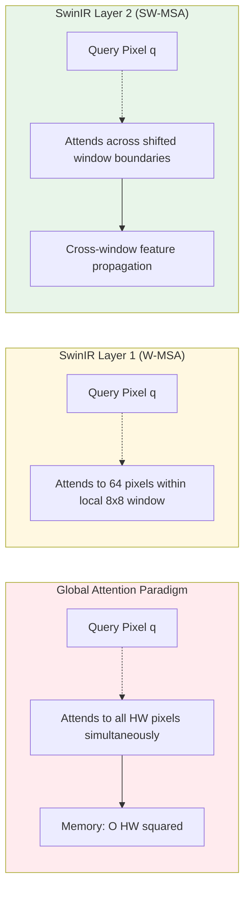

# Chapter 7 · Transformers in Low-Level Vision

> Convolutional networks operate over local receptive fields, accumulating long-range context through deep hierarchical stacking.
>
> Vision Transformers capture global context in a single layer via self-attention, but incur quadratic spatial complexity $\mathcal{O}(N^2)$.
>
> Adapting self-attention to high-resolution image restoration represents one of the most consequential architectural transitions in modern computer vision.

## 7.0 Reading Notes

This chapter examines the architectural adaptation of self-attention mechanisms to image restoration.

Key objectives:

- Understand the physical and statistical role of **non-local self-similarity** in ill-posed inverse problems.
- Analyze the two primary computational paradigms in restoration Transformers: **Window-based spatial attention (W-MSA / SW-MSA)** and **Transposed channel attention (MDTA)**.
- Evaluate the operational trade-offs governing architecture selection across CNNs, SwinIR, Restormer, and HAT.
- Implement memory-efficient attention blocks in PyTorch.

**Prerequisites.** Familiarity with convolutional baselines and residual learning from Chapter 6, standard self-attention formulations $\text{softmax}(QK^T / \sqrt{d})V$, and normalization layer properties (Section 6.9).

**Key Terminology Introduced in This Chapter:**

- **ViT** (Vision Transformer): The foundational vision architecture (Dosovitskiy et al., 2020) partitioning images into non-overlapping patches treated as sequence tokens.
- **W-MSA** (Window-based Multi-Head Self-Attention): Computes self-attention strictly within localized $M \times M$ spatial windows, reducing complexity from $\mathcal{O}((HW)^2)$ to $\mathcal{O}(HW \cdot M^2)$.
- **SW-MSA** (Shifted Window Multi-Head Self-Attention): Offsets window coordinates by $\lfloor M/2 \rfloor$ in alternating layers to facilitate inter-window message passing.
- **SwinIR** (Swin Transformer for Image Restoration): A landmark restoration backbone (Liang et al., 2021) adapting shifted-window attention to super-resolution, denoising, and deblurring.
- **Restormer** (Restoration Transformer): An efficient architecture (Zamir et al., 2022) computing transposed self-attention across channel dimensions rather than spatial coordinates.
- **MDTA** (Multi-Dconv Head Transposed Attention): Restormer's core attention mechanism, operating with linear spatial complexity $\mathcal{O}(C^2 \cdot HW)$.
- **GDFN** (Gated-Dconv Feed-Forward Network): A feed-forward network combining $3 \times 3$ depthwise convolutions with nonlinear element-wise gating.
- **HAT** (Hybrid Attention Transformer): State-of-the-art super-resolution backbone (Chen et al., 2023) integrating window self-attention, channel attention, and overlapping cross-attention.
- **LAM** (Local Attribution Map): An attribution analysis tool visualizing the spatial extent of input pixels contributing to a specific output reconstruction.
- **Non-Local Self-Similarity**: The statistical regularity wherein recurring textural patterns appear across disparate coordinates of natural scenes.

```mermaid
graph TD
    subgraph Full["Naive Self-Attention (Global Spatial)"]
        F[Query Pixel q] --- A1[Attends to all HW pixels globally]
        A1 --> Fcost[Complexity: O HW squared d<br/>Out-of-memory at high resolutions]
    end

    subgraph Window["Window Attention (SwinIR)"]
        W[Query Pixel q] --- B1[Attends strictly within local 8x8 window]
        B1 --> Wcost[Complexity: O HW M squared d<br/>Inter-window flow via SW-MSA shifts]
    end

    subgraph Channel["Transposed Channel Attention (Restormer)"]
        C[Query Pixel q] --- C1[Global spatial context aggregated into channel covariance]
        C1 --> Ccost[Complexity: O d squared HW<br/>Linear memory scaling across spatial dimensions]
    end

    style Full fill:#ffebee
    style Window fill:#fff8e1
    style Channel fill:#e8f5e9
```



## 7.1 The Motivation for Attention in Low-Level Vision

While convolutional networks expand theoretical receptive fields linearly with depth, their **effective receptive field (ERF)** decays according to a 2D Gaussian distribution, focusing almost entirely on immediate spatial neighborhoods.

In natural imagery, however, distant spatial coordinates frequently contain essential restoration priors:

1. **Non-Local Denoising**: Identical structural patterns (such as architectural textures or flat background regions) appear across disjoint image coordinates. Aggregating multiple noisy observations of the same underlying pattern reduces noise variance.
2. **Super-Resolution Texture Transfer**: Repetitive structural primitives (window arrays, fabric weaves, typographic glyphs) allow sharp high-frequency details to be borrowed from distant, better-preserved regions.
3. **Global Degradation Estimation**: Spatially uniform atmospheric scattering, rain-streak trajectories, and optical point spread functions (PSF) are best constrained by integrating global scene statistics.

Classical non-local means filtering exploited this principle mathematically. Self-attention provides a fully differentiable, data-driven formulation of non-local feature aggregation.

However, standard full-resolution self-attention scales with **quadratic complexity $\mathcal{O}((HW)^2 \cdot C)$**. On a $256 \times 256$ feature map, constructing a single full-attention matrix requires computing and storing a $65{,}536 \times 65{,}536$ tensor ($17\text{ GB}$ per attention head in FP32), causing immediate memory exhaustion.

Adapting Transformers to image restoration requires architectures that capture non-local dependencies while maintaining tractable linear or near-linear spatial scaling.

## 7.2 Why Vanilla ViT Fails in Image Restoration

Applying standard classification Vision Transformers directly to pixel-level restoration introduces three primary failure modes:

1. **Quadratic Memory Scaling**: Restoration inputs operate at photographic resolutions ($1024 \times 1024$ or larger), causing global spatial attention to exceed hardware memory limits.
2. **Coarse Patch Tokenization**: Standard ViT partitions inputs into coarse $16 \times 16$ non-overlapping patches, discarding fine sub-pixel phase details before processing begins. Restoration tasks require preserving dense coordinate-level representations.
3. **Absence of Locality Priors**: Natural image degradation exhibits strong local spatial correlation. Completely discarding translation equivariance forces models to learn basic geometric invariances from scratch, requiring impractical training corpora sizes.

## 7.3 SwinIR: Shifted-Window Self-Attention

SwinIR (Liang et al., 2021) resolved the computational complexity of vision Transformers by computing self-attention within partitioned local spatial windows:



### Mathematical Formulation

Given an input feature map $X \in \mathbb{R}^{H \times W \times C}$, the spatial grid is partitioned into non-overlapping windows of size $M \times M$ (typically $M = 8$). Attention is executed independently within each local window:

$$
\text{Complexity}(\text{W-MSA}) = 4HW C^2 + 2M^2 HW C
$$

Setting $M=8$ reduces spatial complexity from quadratic $\mathcal{O}((HW)^2)$ to strictly linear $\mathcal{O}(HW)$, dropping attention memory overhead by three orders of magnitude.

To enable cross-window information exchange without re-introducing quadratic scaling, consecutive Swin Transformer Layers alternate between standard partitioning (**W-MSA**) and shifted partitioning (**SW-MSA**), where the window grid is offset by $\lfloor M/2 \rfloor$ pixels.

### PyTorch Window Attention Implementation

```python
import torch
import torch.nn as nn
import torch.nn.functional as F

def window_partition(x: torch.Tensor, window_size: int) -> torch.Tensor:
    """Partitions tensor (B, H, W, C) into non-overlapping windows (B*num_windows, M, M, C)."""
    B, H, W, C = x.shape
    x = x.view(B, H // window_size, window_size, W // window_size, window_size, C)
    windows = x.permute(0, 1, 3, 2, 4, 5).contiguous()
    return windows.view(-1, window_size, window_size, C)


def window_reverse(windows: torch.Tensor, window_size: int,
                   H: int, W: int) -> torch.Tensor:
    """Reassembles partitioned windows back into continuous spatial feature maps (B, H, W, C)."""
    B = int(windows.shape[0] / (H * W / window_size / window_size))
    x = windows.view(B, H // window_size, W // window_size, window_size, window_size, -1)
    x = x.permute(0, 1, 3, 2, 4, 5).contiguous()
    return x.view(B, H, W, -1)


class WindowAttention(nn.Module):
    """Window-based Multi-Head Self-Attention with Continuous Relative Position Bias."""

    def __init__(self, dim: int, window_size: int, num_heads: int):
        super().__init__()
        self.dim = dim
        self.window_size = window_size
        self.num_heads = num_heads
        head_dim = dim // num_heads
        self.scale = head_dim ** -0.5

        self.qkv = nn.Linear(dim, dim * 3, bias=True)
        self.proj = nn.Linear(dim, dim)

        # Parameterize 2D relative position bias table
        self.relative_position_bias_table = nn.Parameter(
            torch.zeros((2 * window_size - 1) ** 2, num_heads)
        )
        coords_h = torch.arange(window_size)
        coords_w = torch.arange(window_size)
        coords = torch.stack(torch.meshgrid([coords_h, coords_w], indexing='ij')).flatten(1)
        rel = coords[:, :, None] - coords[:, None, :]
        rel = rel.permute(1, 2, 0).contiguous()
        rel[:, :, 0] += window_size - 1
        rel[:, :, 1] += window_size - 1
        rel[:, :, 0] *= 2 * window_size - 1
        self.register_buffer("relative_position_index", rel.sum(-1))

    def forward(self, x: torch.Tensor) -> torch.Tensor:
        B_, N, C = x.shape
        qkv = self.qkv(x).reshape(B_, N, 3, self.num_heads, C // self.num_heads).permute(2, 0, 3, 1, 4)
        q, k, v = qkv[0], qkv[1], qkv[2]

        attn = (q @ k.transpose(-2, -1)) * self.scale

        # Inject translation-invariant relative spatial bias
        bias = self.relative_position_bias_table[
            self.relative_position_index.view(-1)
        ].view(N, N, -1)
        attn = attn + bias.permute(2, 0, 1).unsqueeze(0)

        attn = attn.softmax(dim=-1)
        x = (attn @ v).transpose(1, 2).reshape(B_, N, C)
        return self.proj(x)
```

## 7.4 Restormer: Transposed Channel Self-Attention

While SwinIR bounds spatial complexity via local windowing, true cross-image dependencies require stacking multiple shifted layers. Restormer (Zamir et al., 2022) introduced an alternative paradigm: **Multi-Dconv Head Transposed Attention (MDTA)**, computing attention across the channel dimension rather than the spatial dimension.

```mermaid
graph TD
    subgraph Vanilla["Standard Spatial Attention"]
        V1[Q reshape C HW] --> V2[Q transpose HW C]
        V3[K reshape C HW] --> V4[K transpose HW C]
        V5[V reshape C HW] --> V6[V transpose HW C]
        V2 --> V7[Q K transpose: HW x HW matrix<br/>Out of memory at high resolution]
        V4 --> V7
        V7 --> V8[Softmax along spatial dimension HW]
        V8 --> V9[Multiplication with V: HW x C]
        V6 --> V9
    end

    subgraph MDTA["Transposed Channel Attention (MDTA)"]
        M1[QKV 1x1 Conv: 3C HW] --> M2[Depthwise 3x3 Conv adds local spatial context]
        M2 --> M3[Split into Q K V: each C HW]
        M3 --> M4[L2-normalize Q K across spatial dimension HW]
        M4 --> M5[Transposed multiplication: C x C covariance matrix]
        M5 --> M6[Softmax along channel dimension C with learned temperature]
        M6 --> M7[Multiplication with V: C x HW]
        M7 --> M8[Project out via 1x1 Conv]
    end

    style Vanilla fill:#ffebee
    style MDTA fill:#e8f5e9
```



### Mathematical Formulation of MDTA

Given query $Q \in \mathbb{R}^{C \times \hat{N}}$ and key $K \in \mathbb{R}^{C \times \hat{N}}$ where $\hat{N} = HW$, MDTA applies $L_2$ normalization across spatial dimensions and evaluates inter-channel covariance:

$$
\text{MDTA}(Q, K, V) = V \cdot \text{softmax}\left(\alpha \cdot \hat{K} \hat{Q}^T\right)
$$

Where $\alpha \in \mathbb{R}^H$ is a learnable per-head temperature parameter, and the resulting attention map is a compact $C \times C$ channel covariance matrix rather than an $(HW) \times (HW)$ spatial matrix.

Complexity analysis:
- **Standard Spatial Attention**: $\mathcal{O}((HW)^2 \cdot C)$
- **Transposed Channel Attention**: $\mathcal{O}(C^2 \cdot HW)$

Because channel count $C$ ($48\text{ to }96$) remains orders of magnitude smaller than spatial token count $HW$ ($65{,}536\text{ to }1{,}000{,}000$), MDTA scales linearly with image resolution and executes on large image inputs without out-of-memory errors.

```python
class MDTA(nn.Module):
    """Multi-Dconv Head Transposed Attention (Restormer)."""

    def __init__(self, dim: int, num_heads: int, bias: bool = False):
        super().__init__()
        self.num_heads = num_heads
        self.temperature = nn.Parameter(torch.ones(num_heads, 1, 1))

        self.qkv = nn.Conv2d(dim, dim * 3, 1, bias=bias)
        self.qkv_dwconv = nn.Conv2d(dim * 3, dim * 3, 3, padding=1,
                                    groups=dim * 3, bias=bias)
        self.proj = nn.Conv2d(dim, dim, 1, bias=bias)

    def forward(self, x: torch.Tensor) -> torch.Tensor:
        B, C, H, W = x.shape
        qkv = self.qkv_dwconv(self.qkv(x))
        q, k, v = qkv.chunk(3, dim=1)

        # Reshape to (B, heads, C/head, HW)
        q = q.view(B, self.num_heads, C // self.num_heads, H * W)
        k = k.view(B, self.num_heads, C // self.num_heads, H * W)
        v = v.view(B, self.num_heads, C // self.num_heads, H * W)

        # L2-normalize spatial dimensions for cosine similarity
        q = F.normalize(q, dim=-1)
        k = F.normalize(k, dim=-1)

        # Compute compact channel-wise attention map (B, heads, C/head, C/head)
        attn = (q @ k.transpose(-2, -1)) * self.temperature
        attn = attn.softmax(dim=-1)

        out = (attn @ v).view(B, C, H, W)
        return self.proj(out)


class GDFN(nn.Module):
    """Gated-Dconv Feed-Forward Network."""

    def __init__(self, dim: int, ffn_expansion: float = 2.66, bias: bool = False):
        super().__init__()
        hidden = int(dim * ffn_expansion)
        self.proj_in = nn.Conv2d(dim, hidden * 2, 1, bias=bias)
        self.dwconv = nn.Conv2d(hidden * 2, hidden * 2, 3, padding=1,
                                groups=hidden * 2, bias=bias)
        self.proj_out = nn.Conv2d(hidden, dim, 1, bias=bias)

    def forward(self, x: torch.Tensor) -> torch.Tensor:
        x1, x2 = self.dwconv(self.proj_in(x)).chunk(2, dim=1)
        return self.proj_out(F.gelu(x1) * x2)
```

## 7.5 Hybrid Attention Transformer (HAT)

HAT (Chen et al., 2023) combined the spatial-windowing properties of SwinIR with channel attention and overlapping spatial cross-attention:

1. **Hybrid Attention Block (HAB)**: Interleaves Window-based Self-Attention (W-MSA) with a parallel Channel Attention Block (CAB) to capture spatial and inter-channel dependencies concurrently.
2. **Overlapping Cross-Attention Block (OCAB)**: Extends standard $8 \times 8$ attention windows to overlapping $12 \times 12$ regions, providing direct cross-boundary feature interaction without relying solely on shifted-window propagation.

HAT achieved state-of-the-art results on academic super-resolution benchmarks (surpassing SwinIR by $0.3\text{ to }0.5\text{ dB}$ on Set5 and Urban100) at the expense of higher parameter counts ($\sim 40\text{M}$ in HAT-L) and increased memory footprints.

## 7.6 Architectural Comparison Across Attention Paradigms

Evaluated on a $256 \times 256$ input tensor with $C = 96$ feature channels:

| Architecture | Attention Formulation | Computational Complexity | FLOPs ($256 \times 256$) | Peak Attention Tensor Memory |
|--------------|----------------------|--------------------------|--------------------------|------------------------------|
| **Vanilla ViT** | Global Spatial Self-Attention | $\mathcal{O}((HW)^2 \cdot C)$ | $\sim 16\text{ TFLOPs}$ | $\sim 16\text{ GB}$ (OOM prone) |
| **SwinIR** | Shifted Local Window ($M=8$) | $\mathcal{O}(HW \cdot M^2 C)$ | $\sim 250\text{ GFLOPs}$ | $\sim 256\text{ MB}$ |
| **Restormer** | Transposed Channel Attention (MDTA) | $\mathcal{O}(C^2 \cdot HW)$ | $\sim 500\text{ GFLOPs}$ | $\sim 64\text{ MB}$ (Scales linearly) |
| **HAT** | Hybrid Window + Overlapping Cross | $\mathcal{O}(HW \cdot M_{\text{ext}}^2 C)$ | $\sim 600\text{ GFLOPs}$ | $\sim 512\text{ MB}$ |

## 7.7 Deployment Considerations on Edge Hardware

While restoration Transformers offer strong academic benchmark performance, deployment on resource-constrained mobile NPUs and DSPs requires careful consideration:

1. **Softmax Execution Bottlenecks**: Mobile inference engines are optimized for General Matrix Multiplication (GEMM) and standard 2D convolutions. Softmax normalization across attention heads often fails to fully utilize hardware vector units, introducing substantial latency.
2. **Dynamic Tensor Reshaping**: Folding 4D feature tensors into multi-head window tokens requires contiguous memory layout copies, which are frequently memory-bandwidth bound on shared-memory SoC architectures.
3. **Deployment Strategy**: For edge applications requiring low latency ($< 30\text{ ms}$), pure convolutional backbones (such as NAFNet) remain the standard. When Transformers are necessary, restrict attention modules to low-resolution bottleneck stages.

## 7.8 Architecture Decision Matrix

| Restoration Domain / Deployment Target | Recommended Architecture | Primary Technical Rationale |
|---------------------------------------|--------------------------|-----------------------------|
| Academic Fidelity Benchmark (SR / Deblur) | **HAT / SwinIR** | Maximum structural and texture PSNR |
| Production General Restoration (Cloud GPU) | **Restormer** | Linear memory scaling on large image inputs |
| Real-Time Mobile / Edge NPU Deployment | **NAFNet / Pure CNN** | Native operator support, low latency, no softmax overhead |
| Long-Sequence Video Restoration | **Restormer / Fast U-Net** | High throughput across multi-frame temporal inputs |
| Ultra-Lightweight Budgets ($< 1\text{M}$ Params) | **EDSR-style CNN** | Lower fixed parameter overhead than Transformers |
| Generative Diffusion Backbones | **U-Net + Spatial/Cross Attention** | Spatial self-attention within multi-resolution latent blocks |

## 7.9 Chapter Summary

1. **The Physical Role of Attention**: Self-attention captures non-local self-similarity and handles spatially non-uniform degradations in a single layer.
2. **Window Partitioning (SwinIR)**: Restricting attention to $M \times M$ local windows reduces spatial complexity from quadratic $\mathcal{O}((HW)^2)$ to linear $\mathcal{O}(HW)$, while shifted windows provide cross-boundary message passing.
3. **Transposed Attention (Restormer)**: Formulating attention across feature channels ($\mathcal{O}(C^2 \cdot HW)$) yields linear scaling across spatial dimensions, making it well-suited for high-resolution processing.
4. **Hybrid Modeling (HAT)**: Combining spatial windowing, channel modulation, and overlapping cross-attention maximizes feature utilization across deep backbones.
5. **Practical Deployment Trade-Offs**: Convolutional networks retain advantages in latency and memory efficiency on mobile edge hardware, while Transformers dominate cloud-scale fidelity benchmarks.

---

> Next: [Diffusion Model Foundations](08-diffusion.md) introduces generative restoration, analyzing how score-based diffusion priors surpass classical regression ceilings.
