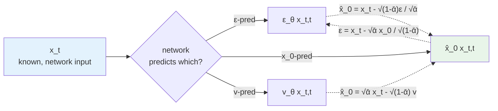
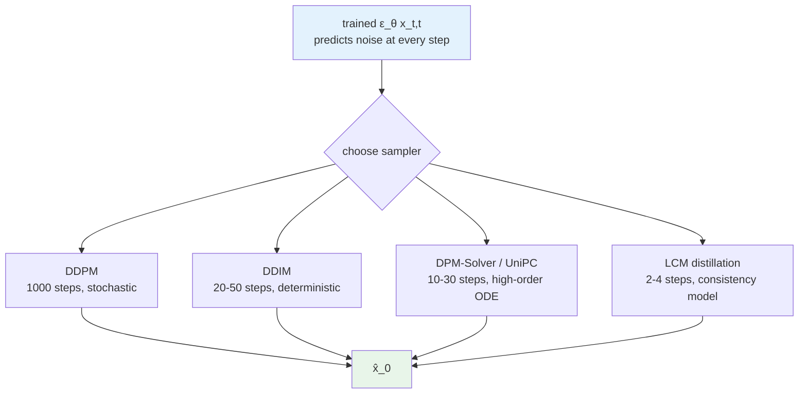
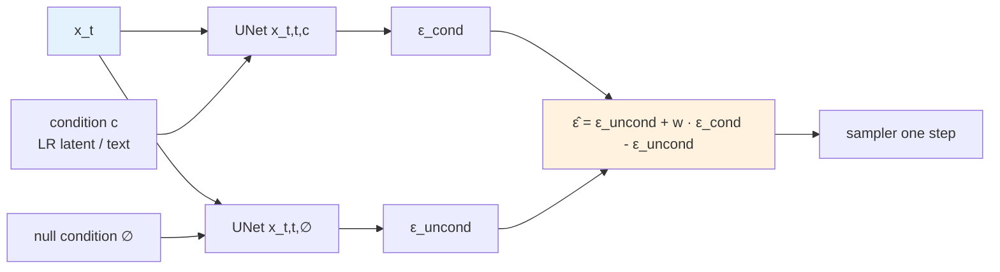

# Chapter 8 · Diffusion Model Basics

> This is the most central paradigm shift in this book.
>
> All of the models in Chapters 6-7 are **discriminative** — given $y$, they output a unique $\hat{x}$.
> The diffusion models from this chapter onward are **generative** — given $y$, they output $p(x | y)$, from which several plausible $\hat{x}$ can be sampled.
>
> This difference becomes a qualitative leap in heavily ill-posed scenarios.

## 8.0 Reading guide

This chapter is the turning point of Part II. Up to here every model has been a discriminative pipeline of "take in one image, output one image", with priors implicitly baked into the weights. Starting from this chapter, the model itself is a full probabilistic generator that can describe "what the natural-image distribution looks like" independently of any specific input condition, and the degraded image $y$ is added as a constraint only during sampling. In other words, the earlier chapters' models learn $f_\theta(y) \approx x$, while the models from this chapter onward learn $p_\theta(x)$ or $p_\theta(x \mid y)$.

So that the equations later don't need to be parsed word by word, the abbreviations that recur in this chapter are listed up front. Those already introduced in Chapter 1 (such as DDPM) are summarized briefly:

- **DDPM** (Denoising Diffusion Probabilistic Model): mentioned in Chapter 1; proposed by Ho et al. 2020, the foundational paradigm of diffusion models, with a fixed forward noising and a learned reverse denoising
- **DDIM** (Denoising Diffusion Implicit Model): a deterministic reverse sampler from Song et al. 2021, which allows skipping steps, compressing 1000 steps to a few dozen
- **DPM-Solver** (Diffusion Probabilistic Model Solver): a family of higher-order numerical solvers from Lu et al. 2022 that accelerates sampling using an ODE viewpoint
- **UniPC** (Unified Predictor-Corrector): a higher-order method that further integrates predictor and corrector
- **LCM** (Latent Consistency Model): based on consistency distillation, compressing multi-step sampling to 2-4 steps
- **SDE / ODE** (Stochastic / Ordinary Differential Equation): the reverse diffusion process can be written equivalently as either an SDE or an ODE, with the former carrying a noise term and the latter being deterministic
- **VLB / ELBO** (Variational Lower Bound / Evidence Lower Bound): the lower bound of the log-likelihood that is optimized when training diffusion models; the DDPM loss is eventually simplified to a weighted MSE form of the ELBO
- **CFG** (Classifier-Free Guidance): randomly drop the condition during training, and at inference linearly extrapolate between conditional and unconditional predictions, controlling how strongly the generation adheres to the condition
- **LDM** (Latent Diffusion Model): Rombach et al. 2022 moved diffusion from pixel space to the VAE latent space; Stable Diffusion is its representative implementation
- **SD / SDXL** (Stable Diffusion / Stable Diffusion XL): two generations of concrete LDM implementations, with UNet parameter counts of about 860M / 2.6B respectively
- **VAE** (Variational Autoencoder): the pre/post-processing network in LDM that converts between pixels and latent space
- **CLIP** (Contrastive Language-Image Pretraining): commonly used as the text / image encoder of diffusion models
- **SDS** (Score Distillation Sampling, introduced by Poole et al. 2022 in DreamFusion): uses a diffusion model as a "score-gradient provider", running gradient descent on external parameters (e.g. a NeRF or another image) along the score direction. In enhancement it occasionally appears as a tool to "score and optimize a specific image with a diffusion model"
- **LoRA** (Low-Rank Adaptation): a fine-tuning technique that decomposes the weight update into two low-rank matrices $W + AB^\top$; standard for diffusion fine-tuning
- **SUPIR / StableSR / DiffBIR**: three diffusion-based real-world SR models that recur at the end of this chapter; their detailed structure is left to Chapter 9

The assumed background is still the one listed in Section 1.0 of Chapter 1: comfortable with tensors and basic loss functions, able to read PyTorch, has heard of diffusion models but has not necessarily trained one. This chapter walks through DDPM's forward / reverse / training objective / samplers / latentization / UNet internals / condition-injection paradigms, all so that Chapter 9's condition control and Chapter 10's task-specific models stand on solid ground.

## 8.1 Why diffusion matters in image enhancement

Recall the perception-distortion trade-off in Section 4.8 of Chapter 4:

> On ill-posed problems, distortion (PSNR) and perception (FID/LPIPS) cannot be optimal at the same time.

Discriminative models have pushed the distortion end to the extreme — HAT reaches 33.4 dB on Set5 4×. But they have a ceiling on the perception end:

- Given a heavily blurred face LR, the "most likely" $\hat{x}$ is the average face (the mean of multiple plausible $x$)
- A discriminative model must output **a single** definite $\hat{x}$, so it outputs the average face
- The average face is **visually blurry** — it is optimal in PSNR but unrealistic perceptually

Diffusion models attack this problem directly:

> I do not output **a single** $\hat{x}$; I learn the entire distribution $p(x | y)$, and then **sample** a concrete $\hat{x}$ from this distribution.

Each sampled $\hat{x}$ is a concrete point in the distribution — a **specific face** rather than an average face, visually realistic but not necessarily pixel-level consistent with the ground truth.

This is why SUPIR is stunning on heavily degraded old photos but is 5+ dB lower in PSNR than HAT — it walks the other end of the perception-distortion curve.

This chapter clarifies how diffusion models work, why they suit enhancement tasks, and how to use them concretely.

## 8.2 Intuition for diffusion models

The core idea of diffusion models can be summarized in one sentence:

> **Learn a denoising process** — start from pure noise, remove noise step by step, and end up with an image.

To make this more intuitive, the forward noising and reverse denoising chains are drawn below. The forward chain is a fixed stochastic process (no learnable parameters; just keeps adding Gaussian noise to the image according to a pre-defined noise schedule), while the reverse chain is what the neural network has to learn.

```mermaid
graph LR
    X0[x_0<br/>clean image] -->|+ε_1| X1[x_1]
    X1 -->|+ε_2| X2[x_2]
    X2 -->|...| XT_1[x_{T-1}]
    XT_1 -->|+ε_T| XT[x_T<br/>≈ pure Gaussian noise]
    XT -. reverse .-> RT_1[x_{T-1}]
    RT_1 -. reverse .-> R2[x_2]
    R2 -. reverse .-> R1[x_1]
    R1 -. reverse .-> R0[x̂_0<br/>sampled image]

    style X0 fill:#e8f5e9
    style XT fill:#ffebee
    style R0 fill:#fff3e0
```

The solid arrows indicate the fixed forward noising process, which adds a small amount of Gaussian noise at every step according to the schedule $\beta_t$; the dashed arrows indicate the reverse denoising process driven by the neural network, which estimates at every step how much noise to remove from the current $x_t$ and returns to $x_{t-1}$. When $T$ is large enough (e.g. 1000), the distribution of $x_T$ is approximately a standard Gaussian with independent components. Walking the entire reverse chain produces a new image $\hat{x}_0$.

The training objective is in fact very simple: **given a noisy image at any time step $x_t$, predict the noise that was added**.

At first glance this objective looks odd: how does predicting noise amount to learning to generate images? The key lies in two points:

1. **A noisy image at any $t$ can be sampled in a single step** — there is no need to repeatedly add noise $T$ times from $x_0$; the forward process has a closed-form formula that lets you jump directly to any $t$, which makes training computationally feasible
2. **Learning to predict the noise = learning the score function of $p(x_0)$** — the score is $\nabla_x \log p(x)$, the gradient field of the distribution; knowing the score at every point is equivalent to knowing the geometric structure of the distribution, so one can sample from noise back to $p(x)$ via Langevin dynamics or the reverse SDE

We will work out the math of these two points below.

## 8.3 The math of the forward process

Define a **noise schedule** $\beta_1, \beta_2, \dots, \beta_T$. The common configuration is $T = 1000$ with $\beta_t$ increasing linearly from $10^{-4}$ to $0.02$; later practice replaces this with a cosine schedule (Nichol & Dhariwal 2021), which decays early-stage signal more gently and gives a measurable quality boost. The linear version is used here to explain the mechanism; cosine is just a different parameter choice within the same framework.

Each step adds noise according to:

$$
q(x_t | x_{t-1}) = \mathcal{N}(x_t; \sqrt{1 - \beta_t} \cdot x_{t-1}, \beta_t \mathbf{I})
$$

Meaning: $x_t$ is $x_{t-1}$ shrunk by a small factor (multiplied by $\sqrt{1-\beta_t}$) plus a small amount of Gaussian noise (variance $\beta_t$). The $\sqrt{1-\beta_t}$ factor is there to keep variance conserved — without shrinking, the second moment of $x_t$ would grow over time, eventually far exceeding the scale of $x_0$; shrinking the signal first and adding equal-variance noise keeps the second moment at $O(1)$, which is numerically more stable.

For shorthand, define $\alpha_t = 1 - \beta_t$, and the cumulative product $\bar{\alpha}_t = \prod_{s=1}^t \alpha_s$. This $\bar{\alpha}_t$ is the core quantity that recurs in every subsequent formula; geometrically it is the "fraction of signal retained" from $x_0$ to $x_t$. When $t$ is close to 0, $\bar{\alpha}_t \approx 1$ (almost no noise added); when $t$ is close to $T$, $\bar{\alpha}_t \approx 0$ (the signal is almost completely drowned out).

**Key property**: chaining $q(x_t \mid x_{t-1})$ inductively shows that the marginal $q(x_t \mid x_0)$ from $x_0$ to any $x_t$ is still Gaussian:

$$
q(x_t | x_0) = \mathcal{N}(x_t; \sqrt{\bar{\alpha}_t} \cdot x_0, (1 - \bar{\alpha}_t) \mathbf{I})
$$

Intuitive derivation: the first step gives $x_1 = \sqrt{\alpha_1} x_0 + \sqrt{1-\alpha_1} \epsilon_1$; the second step gives $x_2 = \sqrt{\alpha_2} x_1 + \sqrt{1-\alpha_2}\epsilon_2 = \sqrt{\alpha_2 \alpha_1} x_0 + (\sqrt{\alpha_2(1-\alpha_1)} \epsilon_1 + \sqrt{1-\alpha_2}\epsilon_2)$. Adding the two independent Gaussians at the end, the new variance is the sum $\alpha_2(1-\alpha_1) + (1-\alpha_2) = 1 - \alpha_2 \alpha_1$. Recurring all the way yields $x_t = \sqrt{\bar{\alpha}_t} x_0 + \sqrt{1-\bar{\alpha}_t} \epsilon$.

This means **given $x_0$, we can sample any $x_t$ in a single step**:

$$
x_t = \sqrt{\bar{\alpha}_t} \cdot x_0 + \sqrt{1 - \bar{\alpha}_t} \cdot \epsilon, \quad \epsilon \sim \mathcal{N}(0, \mathbf{I})
$$

This is what makes training efficient — there is no need to actually add noise 1000 times step by step. In the training loop one just samples a random $t$, constructs $x_t$ and the corresponding $\epsilon$ from the formula above, and uses them for supervision. Without this closed-form path, every training step would have to simulate $t$ noising operations, and the cost of training diffusion models would be completely infeasible.

```python
import torch


class NoiseScheduler:
    """A DDPM-style linear noise schedule."""

    def __init__(self, num_steps: int = 1000,
                 beta_start: float = 1e-4, beta_end: float = 0.02,
                 device: str = 'cuda'):
        self.num_steps = num_steps
        self.betas = torch.linspace(beta_start, beta_end, num_steps, device=device)
        self.alphas = 1.0 - self.betas
        self.alphas_cumprod = torch.cumprod(self.alphas, dim=0)
        # Quantities frequently used during training
        self.sqrt_alphas_cumprod        = torch.sqrt(self.alphas_cumprod)
        self.sqrt_one_minus_alphas_cumprod = torch.sqrt(1.0 - self.alphas_cumprod)

    def add_noise(self, x0: torch.Tensor, t: torch.Tensor,
                  noise: torch.Tensor = None) -> tuple:
        """One-step sampling of x_t.
        x0: (B, C, H, W) clean image
        t:  (B,) integer time step
        noise: optional, randomly sampled if not provided
        Returns: (x_t, noise)
        """
        if noise is None:
            noise = torch.randn_like(x0)
        sqrt_alpha = self.sqrt_alphas_cumprod[t].view(-1, 1, 1, 1)
        sqrt_one_minus = self.sqrt_one_minus_alphas_cumprod[t].view(-1, 1, 1, 1)
        x_t = sqrt_alpha * x0 + sqrt_one_minus * noise
        return x_t, noise
```

### Engineering choice of the noise schedule

The linear schedule $\beta_t \in [10^{-4}, 0.02]$ is the initial choice in the DDPM paper but is not good enough at high resolution. It decays too quickly near $t \to T$, so the early signal is drowned out almost instantly and the model receives little gradient signal in that range. Nichol & Dhariwal 2021 proposed the **cosine schedule**:

$$
\bar{\alpha}_t = \frac{f(t)}{f(0)}, \quad f(t) = \cos\left(\frac{t/T + s}{1 + s} \cdot \frac{\pi}{2}\right)^2
$$

where $s \approx 0.008$ is a small offset to avoid the singularity at $t = 0$. The cosine $\bar{\alpha}_t$ is slow at both ends and fast in the middle, putting more sampling effort into the "middle noise levels", which matches the eye's sensitivity to mid-frequency details. SDXL and Imagen both default to cosine.

Going further, the **SNR-based schedule** defines the schedule directly by signal-to-noise ratio $\text{SNR}(t) = \bar{\alpha}_t / (1 - \bar{\alpha}_t)$, letting $\log \text{SNR}(t)$ decrease linearly in $t$. This is one of the core contributions of EDM (Karras et al. 2022), decoupling "which time step" from "which noise level": the same noise level corresponds to different $t$ under different schedules, but they are completely equivalent in the SNR view. EDM rewrites the entire training / sampling code in the SNR parameterization, and its FID improves by a clear margin over DDPM's original schedule.

Engineering practice:

- Academic DDPM reproduction: linear
- New models: cosine by default
- SOTA generation quality: EDM SNR parameterization
- For enhancement tasks the schedule has relatively small impact; what mainly matters is how the loss is weighted across mid-range $t$

## 8.4 The reverse process: training objective

In theory the reverse process is $p(x_{t-1} | x_t)$, and what is to be learned is this conditional distribution. The full training objective is actually a variational lower bound (VLB / ELBO) of the data log-likelihood $\log p_\theta(x_0)$. Modelling each reverse step as a Gaussian $p_\theta(x_{t-1} \mid x_t) = \mathcal{N}(\mu_\theta(x_t, t), \Sigma_\theta(x_t, t))$ and decomposing $\log p(x_0)$ into a sum of $T$ KL terms — each measuring the distance between the "model reverse Gaussian" and the "true posterior Gaussian $q(x_{t-1} \mid x_t, x_0)$" — yields the long expression that appears in the DDPM paper.

The most valuable engineering contribution of the DDPM paper is the proof that, with appropriate variance choices, this long objective **simplifies** to a unit-weight MSE:

**Train a network $\epsilon_\theta(x_t, t)$ directly to predict the added noise $\epsilon$**.

Training loss:

$$
\mathcal{L}_{\text{simple}} = \mathbb{E}_{t, x_0, \epsilon} \left[ \| \epsilon - \epsilon_\theta(x_t, t) \|^2 \right]
$$

This is the simple loss covered in Section 3.6 of Chapter 3. Although the exact weights of the ELBO are dropped, empirically sample quality is actually better (the higher-$t$ terms get "informally" up-weighted, focusing the model on the harder mid-to-high noise range).

Note that three things are randomly sampled in the training process: every batch picks some $x_0$, every sample independently picks a time step $t \sim \text{Uniform}\{1, \dots, T\}$, and every sample independently picks an $\epsilon$. The Monte Carlo estimate of this triple expectation is the loss.

### Three equivalent prediction targets

The model can predict any one of three quantities, mutually determined by the linear relation $x_t = \sqrt{\bar{\alpha}_t} x_0 + \sqrt{1-\bar{\alpha}_t} \epsilon$. They are **information-equivalent**; the only difference is the shape of the loss surface:

- **$\epsilon$-prediction**: predict the added noise (the DDPM standard). At large $t$ (small $\bar{\alpha}_t$), $x_0$ is almost drowned out by noise, so predicting $\epsilon$ has a relatively better SNR
- **$x_0$-prediction**: predict the original image directly. At small $t$ ($\bar{\alpha}_t$ close to 1), $x_t$ is essentially $x_0$ with a small perturbation, and predicting $x_0$ is equivalent to mild denoising — the loss scale is more stable
- **$v$-prediction** (Salimans & Ho 2022): defining $v_t = \sqrt{\bar{\alpha}_t} \epsilon - \sqrt{1-\bar{\alpha}_t} x_0$, this is equivalent to predicting along a rotated direction in the $(\epsilon, x_0)$ plane. Its benefit is that the loss has a consistent magnitude across all $t$, which is especially useful at high resolution

The conversions between them:

```python
# Given the model output and the current (x_t, t), convert between the three

def eps_to_x0(x_t, eps_pred, alpha_cumprod_t):
    """Recover x_0 from predicted epsilon."""
    sqrt_alpha_t = alpha_cumprod_t.sqrt()
    sqrt_one_minus = (1 - alpha_cumprod_t).sqrt()
    return (x_t - sqrt_one_minus * eps_pred) / sqrt_alpha_t


def v_to_x0(x_t, v_pred, alpha_cumprod_t):
    """Recover x_0 from predicted v."""
    sqrt_alpha_t = alpha_cumprod_t.sqrt()
    sqrt_one_minus = (1 - alpha_cumprod_t).sqrt()
    return sqrt_alpha_t * x_t - sqrt_one_minus * v_pred


def x0_to_eps(x_t, x0_pred, alpha_cumprod_t):
    """Recover epsilon from predicted x_0."""
    sqrt_alpha_t = alpha_cumprod_t.sqrt()
    sqrt_one_minus = (1 - alpha_cumprod_t).sqrt()
    return (x_t - sqrt_alpha_t * x0_pred) / sqrt_one_minus
```

How to choose the prediction target during training:

- **$\epsilon$-pred**: standard for general text-to-image (SD 1.x)
- **$v$-pred**: more stable for high-resolution training (SD 2.x, SDXL refiner)
- **$x_0$-pred**: intuitive for enhancement / restoration tasks, since the quantity of interest is the quality of $x_0$

The relations among the three targets can be drawn as a small diagram for reference:



The three predictions are just different projections of the same affine relation. At training time the choice changes the angle of the loss; at inference time we recover $\hat{x}_0$ with the corresponding formula for use in the next sampling step.

## 8.5 A minimal DDPM training loop

```python
import torch
import torch.nn.functional as F
from torch.optim import AdamW

def train_ddpm(model, train_loader, scheduler, epochs=100,
               lr=1e-4, device='cuda'):
    """A minimal DDPM training loop.
    model: UNet, takes (x_t, t) and outputs predicted noise (B, C, H, W)
    """
    optimizer = AdamW(model.parameters(), lr=lr)
    model.train()

    for epoch in range(epochs):
        for x0 in train_loader:                    # x0: (B, C, H, W)
            x0 = x0.to(device)
            B = x0.shape[0]

            # 1. Sample a random time step
            t = torch.randint(0, scheduler.num_steps, (B,), device=device)

            # 2. One-step sampling of x_t
            x_t, noise = scheduler.add_noise(x0, t)

            # 3. Model predicts the noise
            pred_noise = model(x_t, t)

            # 4. MSE loss
            loss = F.mse_loss(pred_noise, noise)

            # 5. Backpropagate
            optimizer.zero_grad()
            loss.backward()
            torch.nn.utils.clip_grad_norm_(model.parameters(), 1.0)
            optimizer.step()
```

This loop looks overly simple. The fundamental reason it works:

> Learning "predict the added noise from an image with arbitrary noise" = learning an approximation of $\nabla \log p(x)$ (the score function).
>
> Once the score is learned, Langevin dynamics / a reverse SDE can be used to sample from noise to $p(x)$.

## 8.6 Sampling: DDPM, DDIM, DPM-Solver

After training, the UNet has learned "in which direction $x_t$ at any time step should denoise". Sampling organises this one-step denoising capability into a multi-step process from $x_T$ back to $x_0$. Different samplers differ in "how to walk this path in fewer steps". The figure below places DDPM, DDIM, and DPM-Solver on the same reverse chain:



Note that all these samplers share the **same** set of trained weights and **do not require retraining** (LCM is the exception — it needs consistency distillation). In production it is perfectly reasonable to train DDPM once and pick different samplers at inference based on the SLA.

After training, how do we generate an image from noise?

### DDPM sampling

Step by step along the reverse chain:

$$
x_{t-1} = \frac{1}{\sqrt{\alpha_t}} \left( x_t - \frac{\beta_t}{\sqrt{1 - \bar{\alpha}_t}} \epsilon_\theta(x_t, t) \right) + \sigma_t z
$$

where $z \sim \mathcal{N}(0, \mathbf{I})$ is a Gaussian sampled independently at each step, and $\sigma_t$ is the noise variance chosen by DDPM. The form of this formula is derived from the true posterior $q(x_{t-1} \mid x_t, x_0)$, substituting the predicted $\hat{x}_0 = (x_t - \sqrt{1-\bar{\alpha}_t}\epsilon_\theta) / \sqrt{\bar{\alpha}_t}$ for $x_0$. The randomness across the chain comes from this sequence of $z$ — running DDPM twice from the same starting $x_T$ yields two different samples.

**Problem**: it requires 1000 steps, each with a UNet forward pass — **slow**. SD 1.5 takes about 30 ms per forward pass on an A100, so 1000 steps is 30 seconds for a single image. Completely unacceptable in production.

### DDIM sampling

Song et al. 2021 showed that the reverse can be made deterministic:

$$
x_{t-1} = \sqrt{\bar{\alpha}_{t-1}} \cdot \hat{x}_0 + \sqrt{1 - \bar{\alpha}_{t-1}} \cdot \epsilon_\theta(x_t, t)
$$

where $\hat{x}_0$ is the $x_0$ derived from $x_t$ and the predicted noise (using the `eps_to_x0` from the previous section). Note there is no explicit random term $z$ in the formula — the same starting noise under DDIM always gives the same image, which is the meaning of "deterministic". This sampling **can skip steps**: DDIM rewrites "one step from $t$ to $t-1$" as "one step from $t$ to any smaller $t'$", so at inference one can pick 50 time steps (e.g. 20 evenly spaced of 1000) to walk through the entire reverse chain.

DDIM 50 steps ≈ DDPM 1000 steps in quality, **a 20× speedup**. The deterministic nature has another benefit for editing tasks: one can do DDIM inversion, reversing an existing image back to its corresponding latent noise $x_T$, then forward-sampling again with a modified condition.

### The DPM-Solver family

Treat the reverse process as an ODE and use higher-order numerical methods to solve it. Song et al. 2021 showed that the reverse diffusion is strictly equivalent to a probability-flow ODE $dx/dt = f(x, t) - \frac{1}{2} g(t)^2 \nabla_x \log p_t(x)$ where the score is provided by the trained $\epsilon_\theta$. Once it is written as an ODE, decades of numerical-integration techniques become available.

- **DPM-Solver-2** (Lu et al. 2022): second-order Taylor expansion to solve the ODE; ~20 steps reach DDIM 100-step quality
- **DPM-Solver++**: brings the SDE form (with noise term) into the same framework, more stable for conditional generation
- **UniPC** (Unified Predictor-Corrector): further integrates predictor and corrector, also using multi-step residual information; a common default in 2024

```python
# Use the diffusers samplers
from diffusers import DPMSolverMultistepScheduler

scheduler = DPMSolverMultistepScheduler.from_pretrained(
    "stabilityai/stable-diffusion-2-1",
    subfolder="scheduler",
    algorithm_type="dpmsolver++",
    solver_order=2,
)
scheduler.set_timesteps(num_inference_steps=20)
```

Engineering practice (the SOTA configuration in 2026):

- **Academic benchmarks / high-quality inference**: UniPC, 30-50 steps
- **Production deployment**: DPM-Solver++ 2M, 20 steps
- **Extreme speed**: LCM (Latent Consistency Models), distilled, 4 steps

## 8.7 LDM: moving diffusion to latent space

LDM was already introduced from the "representation space" angle in Section 2.4 of Chapter 2. Here we supplement it from the diffusion angle: why moving diffusion to the latent space is the engineering inflection point of this field.

The key observation of LDM (Rombach et al. 2022):

> Pixel-space diffusion wastes a lot of compute on "high-frequency details" — these details can be generated by post-processing through a VAE decoder.
>
> Let the UNet do diffusion only in **latent space**, and leave the high-frequency details to the VAE decoder.

### The specific configuration of Stable Diffusion

| Component | Role | Parameters |
|------|------|--------|
| VAE encoder | RGB → latent (8× downsampling, 4 channels) | ~50M |
| VAE decoder | latent → RGB | ~50M |
| UNet | Latent-space diffusion | ~860M |
| Text encoder (CLIP) | Text → embedding | ~120M |
| Total | | ~1.1B |

The UNet is the bulk; the VAE is relatively small. This is why SD fine-tuning mainly trains the UNet (keeping the VAE fixed).

### Engineering impact of LDM

- **Compute drops to 1/48**: what would have been diffusion on $512 \times 512 \times 3$ now happens on $64 \times 64 \times 4$
- **Large images become tractable**: $1024 \times 1024$ is no longer a memory disaster
- **The VAE is an independent, swappable component**: it can be fine-tuned (e.g. using a better decoder for enhancement scenarios)

## 8.8 The internal structure of the SD UNet

The UNet is the "main network" of a diffusion model. Its structure matters for enhancement tasks — extensions like ControlNet are built on top of this structure. To place "the UNet in a denoising step" in the big picture, here is a data-flow diagram of a single sampling step:

```mermaid
graph LR
    XT[x_t<br/>latent noise<br/>B,4,h,w] --> UNet
    T[time step t] --> TEmb[time embedding<br/>sinusoidal + MLP]
    Cond[condition c<br/>text/image tokens] --> CtxEmb[CLIP encoder]
    TEmb --> UNet
    CtxEmb --> UNet
    UNet[UNet ε_θ<br/>encoder + mid + decoder<br/>cross-attention to c] --> Eps[ε̂ or v̂<br/>B,4,h,w]
    Eps --> Step[sampler one step<br/>DDIM / DPM-Solver]
    XT --> Step
    Step --> XTm1[x_{t-1}<br/>next-step input]

    style XT fill:#e3f2fd
    style UNet fill:#fff3e0
    style XTm1 fill:#e8f5e9
```

Every sampling step repeats this data flow; the only differences are that $t$ decreases and the noise content of $x_t$ shrinks. The condition $c$ (text or image embedding) is the same across all time steps and is consumed repeatedly only in cross-attention.

The overall macro structure of the UNet:

```
Input (B, 4, 64, 64) latent
  ↓ Conv (4 → 320 channels)
  ↓ DownBlock × 4 (encoder)
    each DownBlock:
      ResBlock × 2 + Spatial Transformer × 2 (cross-attention to text)
      Downsample (×2)
  ↓ MidBlock
    ResBlock + Spatial Transformer + ResBlock
  ↓ UpBlock × 4 (decoder, with skip connections)
    each UpBlock:
      ResBlock × 3 + Spatial Transformer × 3
      Upsample (×2)
  ↓ Conv (320 → 4 channels)
Output (B, 4, 64, 64) predicted noise / v
```

### ResBlock: the core compute unit

```python
import torch
import torch.nn as nn

class ResBlock(nn.Module):
    """SD UNet's ResBlock, with time embedding injection."""

    def __init__(self, in_ch: int, out_ch: int, time_emb_dim: int = 1280):
        super().__init__()
        self.norm1 = nn.GroupNorm(32, in_ch)
        self.conv1 = nn.Conv2d(in_ch, out_ch, 3, padding=1)

        self.time_proj = nn.Linear(time_emb_dim, out_ch)

        self.norm2 = nn.GroupNorm(32, out_ch)
        self.conv2 = nn.Conv2d(out_ch, out_ch, 3, padding=1)

        self.skip = nn.Conv2d(in_ch, out_ch, 1) if in_ch != out_ch else nn.Identity()

    def forward(self, x: torch.Tensor, t_emb: torch.Tensor) -> torch.Tensor:
        # x:     (B, C, H, W)
        # t_emb: (B, time_emb_dim)
        h = self.conv1(F.silu(self.norm1(x)))
        # Inject the time embedding (broadcast)
        h = h + self.time_proj(F.silu(t_emb)).view(*t_emb.shape[:1], -1, 1, 1)
        h = self.conv2(F.silu(self.norm2(h)))
        return h + self.skip(x)
```

Time embedding injection is unique to diffusion models — the same network has to handle 1000 different time steps and needs to know which one the current step is.

### Spatial Transformer: the cross-attention entry

```python
class SpatialTransformer(nn.Module):
    """The attention block of SD UNet.
    self-attention + cross-attention to text.
    """

    def __init__(self, dim: int, num_heads: int, context_dim: int = 768):
        super().__init__()
        self.norm = nn.GroupNorm(32, dim)
        self.proj_in = nn.Conv2d(dim, dim, 1)

        # Self-attention
        self.attn1 = MultiheadAttention(dim, num_heads)
        # Cross-attention (text → latent)
        self.attn2 = MultiheadAttention(dim, num_heads, kv_dim=context_dim)
        # FFN
        self.ff = nn.Sequential(
            nn.Linear(dim, dim * 4),
            nn.GELU(),
            nn.Linear(dim * 4, dim),
        )

        self.proj_out = nn.Conv2d(dim, dim, 1)

    def forward(self, x: torch.Tensor, context: torch.Tensor) -> torch.Tensor:
        # x: (B, C, H, W); context: (B, T_text, D_text)
        B, C, H, W = x.shape
        h = self.proj_in(self.norm(x))
        h = h.view(B, C, -1).transpose(1, 2)         # (B, HW, C)

        h = h + self.attn1(h, h, h)
        h = h + self.attn2(h, context, context)      # cross-attention
        h = h + self.ff(h)

        h = h.transpose(1, 2).view(B, C, H, W)
        return x + self.proj_out(h)
```

Cross-attention is the key to text-to-image — text influences the features at every spatial position via cross-attention. This mechanism will be reused for condition injection in enhancement tasks in Chapter 9.

## 8.9 Diffusion usage in enhancement tasks

Text-to-image samples from pure noise + a text condition to an image. **Enhancement tasks** sample from pure noise + a degraded image $y$ as the condition to produce $\hat{x}$. The only change is that the condition $c$ goes from a piece of text to an image (or an image plus a caption); the UNet and the sampler chain remain the same.

A few paradigms for condition injection (the detailed engineering implementations are left to Chapter 9; names are listed here so the reader has the full picture):

### Paradigm 1: concat to the input (the simplest)

```python
# UNet input goes from (B, 4, h, w) to (B, 8, h, w)
# The latter 4 channels are the LR latent
def prepare_input(noisy_latent, lr_latent):
    return torch.cat([noisy_latent, lr_latent], dim=1)
```

Representative: StableSR (2023) uses this simple form.

### Paradigm 2: cross-attention (semantic condition)

Inject some embedding of LR via cross-attention. Representative: DiffBIR uses a CLIP image embedding.

### Paradigm 3: ControlNet (structural condition)

Copy a UNet encoder dedicated to processing the conditional input, and add its output to the corresponding layer of the main UNet. Representative: the ControlNet variant of StableSR, SUPIR.

Chapter 9 will discuss these in detail.

### A common misconception

Many engineers who encounter diffusion-based enhancement for the first time assume that the "injection point" of LR determines the model's ceiling, and spend a lot of time tuning the architecture. Empirically, **what actually determines generation quality is (1) whether the training data reflects real degradation, and (2) how tunable the condition control strength is**. The architecture choice (concat vs ControlNet) shifts which end of the fidelity-creativity curve the model lands on, but as long as the training data is reasonable and the conditioning scale is tunable, several paradigms can all reach production quality. This is why this book places Chapter 5 (data synthesis) before Chapter 9 (condition control) — the data ceiling determines the floor.

## 8.10 Why diffusion can "create something from nothing"

Back to the core question at the start of this chapter: **why can diffusion generate realistic high-frequency details while discriminative methods cannot?**

### 1. Multi-step sampling = repeated random refinement

Discriminative: a single forward pass, output a definite $\hat{x}$.
Diffusion: $T$ forward passes, each one sampled from a random distribution. Each sample is a random choice of "which direction this step should go".

This randomness means the same LR input can produce different $\hat{x}$ — every one of them is plausible.

### 2. Learning the score function

Theoretically, what the diffusion model learns is:

$$
\epsilon_\theta(x_t, t) \approx -\sqrt{1-\bar{\alpha}_t} \cdot \nabla_{x_t} \log p(x_t)
$$

This gradient field tells the model in which direction to move at point $x_t$ to get closer to the natural-image distribution. The score function directly encodes the **geometry of the natural-image manifold**.

### 3. The reverse chain is an SDE solver

It can be rigorously shown that the reverse chain of DDPM is equivalent to solving a stochastic differential equation (SDE):

$$
dx = [f(x, t) - g(t)^2 \nabla_x \log p_t(x)] dt + g(t) dw
$$

where $w$ is a Wiener process (Brownian motion). The stationary distribution of this SDE is the natural-image distribution.

### Putting these three together

A diffusion model is not "approximating the ground truth"; it is "walking T steps along the geometry of the natural-image distribution". Each step is guided by the geometry of the distribution, and each step has a random perturbation that prevents results from repeating.

The final output is a point on the distribution — concrete, plausible, random.

## 8.10b An extended use: SDS (Score Distillation Sampling)

SDS, proposed in DreamFusion (Poole et al. 2022), is a representative example of "using a diffusion model in a different way". Originally diffusion is "reverse-sampling from noise to image"; SDS treats it as a **gradient source**: given any parameterizable target $\theta$ (another image, a NeRF, the texture of a 3D mesh), the diffusion model provides on its rendering $x(\theta)$ the gradient of "in which direction should $\theta$ be updated to look more like a natural image":

$$
\nabla_\theta \mathcal{L}_{\text{SDS}}(\theta) = \mathbb{E}_{t, \epsilon}\left[w(t) (\epsilon_\theta(x_t, t, c) - \epsilon) \cdot \frac{\partial x}{\partial \theta}\right]
$$

where $x_t = \sqrt{\bar{\alpha}_t} x(\theta) + \sqrt{1-\bar{\alpha}_t}\epsilon$. The noise residual $\epsilon_\theta - \epsilon$ predicted by the diffusion model is back-propagated to $\theta$ via the chain rule. This is equivalent to "the diffusion model telling $x(\theta)$ in which direction to change to be closer to the natural-image distribution"; back-propagation moves $\theta$ along the score direction.

In enhancement SDS is occasionally used as:

- A "diffusion-prior polish" on top of an existing discriminative SR output — treat the output $\hat{x}$ as $\theta$, run a few SDS steps to push it closer to the natural-image manifold learned by diffusion
- Per-image optimization on the test image for rare tasks without paired training data (old-painting restoration, few-shot satellite SR), using a general diffusion model + SDS

Empirically SDS used directly on SR is unstable, often producing oversaturated and over-textured results; the community later proposed VSD (Variational Score Distillation), CSD (Classifier Score Distillation), and other improvements. This line is not mainstream in enhancement, but it is worth knowing as an example of "what else a diffusion model can be used for".

## 8.11 Trade-offs: diffusion camp vs discriminative

Putting the previous two chapters of Part II side-by-side with this chapter:

| Aspect | Discriminative (CNN/Transformer) | Diffusion |
|------|------------------------|------|
| Inference speed | **1× (baseline)** | 20-1000× slower |
| PSNR | **High** | 5-10 dB lower |
| LPIPS / FID | Low | **Better** |
| Visual realism | Medium | **High** |
| Handling severe degradation | Outputs "safe blur" | **Recovers details** |
| Diversity | Single output | **Multiple samples** |
| Control | Only by changing the training data | **Can add prompt / control** |
| Memory usage | Low | High (2-4×) |

**Neither one wins overall** — these two model types have respective strengths in different application scenarios:

- **Forensic evidence enhancement**: discriminative (no fabrication allowed)
- **Academic-benchmark PSNR competitions**: discriminative
- **Photo upscaling, old-photo restoration**: diffusion
- **Extremely lightweight on-device deployment**: discriminative
- **Highly creative applications** (artistic style, 4K live-stream creative enhancement): diffusion

## 8.12 Engineering details for training diffusion models

### Min-SNR weighting (mentioned in Section 3.6 of Chapter 3)

```python
def min_snr_weight(t, alphas_cumprod, gamma=5.0):
    """Min-SNR weighting, makes loss magnitudes consistent across time steps."""
    snr = alphas_cumprod[t] / (1 - alphas_cumprod[t])
    return torch.minimum(snr, torch.full_like(snr, gamma)) / snr
```

### EMA (exponential moving average)

The final weights of a diffusion model are usually the EMA, not the raw weights. The EMA decay is commonly 0.9999:

```python
class EMA:
    def __init__(self, model, decay=0.9999):
        self.decay = decay
        self.shadow = {n: p.clone().detach() for n, p in model.named_parameters()}

    def update(self, model):
        for n, p in model.named_parameters():
            self.shadow[n] = self.decay * self.shadow[n] + (1 - self.decay) * p.detach()

    def apply_to(self, model):
        """Copy the EMA weights to model (used for inference)."""
        for n, p in model.named_parameters():
            p.data.copy_(self.shadow[n])
```

### Importance sampling of time steps

Do not sample $t$ uniformly. Some $t$ ranges contribute more to the final quality (typically the middle range $t \in [200, 800]$) and their sampling probability can be increased.

### Classifier-Free Guidance (CFG)

CFG (Classifier-Free Guidance) replaces the "classifier-guided diffusion" family (early ADM used an ImageNet classifier for gradient guidance) with a version that does not depend on an external classifier. Ho & Salimans 2022's core recipe: during training, replace the condition $c$ with a null condition $\emptyset$ with some probability (typically 10%), so the same network learns both conditional and unconditional predictions. At inference, linearly extrapolate the two predictions:

$$
\hat{\epsilon} = \epsilon_\theta(x_t, t, \emptyset) + w \cdot (\epsilon_\theta(x_t, t, c) - \epsilon_\theta(x_t, t, \emptyset))
$$

$w > 1$ pushes the generation closer to the condition, but too large makes the result oversaturated, with overly saturated colours and over-textured surfaces. In enhancement tasks $w$ is typically 1.5-3.0; pure text-to-image uses 5-9.

Inference does one extra UNet forward (the unconditional one) per step, roughly doubling cost. The two-pass CFG can be drawn like this:



```python
def classifier_free_guidance(model, x_t, t, condition, guidance_scale=2.0):
    """CFG inference."""
    # Conditional prediction
    eps_cond = model(x_t, t, condition)
    # Unconditional prediction (with null/empty condition)
    eps_uncond = model(x_t, t, None)
    # Weighted combination
    return eps_uncond + guidance_scale * (eps_cond - eps_uncond)
```

In production the two forwards are batched together — stacked into $(2B, C, H, W)$ and run in one pass, saving one kernel launch. The default implementation in diffusers works this way.

## 8.13 A diffusion training pipeline for an enhancement task

Putting the above concepts together into a training loop for an enhancement task. The recipe below uses **the simplest latent-concat scheme**: upsample LR to HR resolution, run it through the VAE so the resulting `lr_latent` matches `hr_latent` in spatial size, then concat into the UNet input channels. This is closest to the LDSR setup from the LDM paper — enough to understand the minimal skeleton of diffusion-based enhancement training.

Worth being explicit: **SUPIR and StableSR do not work this way**. Both inject the LR signal into the main UNet's skip connections via ControlNet / time-aware feature injection (StableSR uses a time-aware encoder; SUPIR uses ZeroSFT + ControlNet), keeping most of the main UNet weights frozen. Plain input-concat has weaker fidelity and is more sensitive to the LR input distribution; for production diffusion SR, prefer the ControlNet-style routes covered in Chapter 9.

```python
def train_diffusion_enhancement(
    unet, vae, scheduler,
    train_loader,                  # outputs (lr, hr) pairs
    text_encoder=None,             # optional, adds prompt condition
    epochs=50, lr=1e-4,
    device='cuda',
):
    optimizer = AdamW(unet.parameters(), lr=lr)
    ema = EMA(unet)

    # Freeze VAE and text encoder
    vae.eval(); 
    for p in vae.parameters():
        p.requires_grad_(False)

    for epoch in range(epochs):
        for lr_img, hr_img in train_loader:
            lr_img = lr_img.to(device)
            hr_img = hr_img.to(device)

            # 0. Important: upsample LR to the same size as HR so that the latent
            # spaces align. Otherwise vae.encode(lr_img) gives a smaller latent than
            # hr_latent and they cannot be concatenated directly.
            lr_img_upsampled = F.interpolate(lr_img, size=hr_img.shape[-2:],
                                             mode='bicubic', align_corners=False)

            # 1. Encode to latent space (now hr_latent and lr_latent have the same spatial size)
            with torch.no_grad():
                hr_latent = vae.encode(hr_img).latent_dist.sample() * 0.18215
                lr_latent = vae.encode(lr_img_upsampled).latent_dist.mean * 0.18215

            # 2. Add noise to hr_latent
            B = hr_latent.shape[0]
            t = torch.randint(0, scheduler.num_steps, (B,), device=device)
            x_t, noise = scheduler.add_noise(hr_latent, t)

            # 3. UNet input = (x_t || lr_latent), condition = lr_latent (or text)
            unet_input = torch.cat([x_t, lr_latent], dim=1)
            pred_noise = unet(unet_input, t)

            # 4. Weighted MSE loss
            weights = min_snr_weight(t, scheduler.alphas_cumprod)
            loss = (weights.view(-1, 1, 1, 1) * (pred_noise - noise) ** 2).mean()

            # 5. Backpropagate
            optimizer.zero_grad()
            loss.backward()
            torch.nn.utils.clip_grad_norm_(unet.parameters(), 1.0)
            optimizer.step()

            # 6. EMA update
            ema.update(unet)

    # After training, use EMA weights for inference
    ema.apply_to(unet)
    return unet
```

## 8.14 Inference: the full LR-to-HR pipeline

```python
@torch.no_grad()
def diffusion_enhance(unet, vae, scheduler, lr_img,
                       target_size=None,
                       num_inference_steps=20, guidance_scale=2.0):
    """
    Given an LR image, generate an HR estimate.
    target_size: (H, W) HR output size; defaults to 4× LR.
    """
    device = lr_img.device
    if target_size is None:
        target_size = (lr_img.shape[-2] * 4, lr_img.shape[-1] * 4)

    # 1. Important: upsample LR to the target size before passing through the VAE,
    # so that the latent space size equals that of the HR latent.
    lr_upsampled = F.interpolate(lr_img, size=target_size,
                                 mode='bicubic', align_corners=False)
    lr_latent = vae.encode(lr_upsampled).latent_dist.mean * 0.18215

    # 2. Start from pure noise (with the same spatial size as the LR latent)
    x_t = torch.randn_like(lr_latent)

    # 3. Set inference time steps (DPM-Solver / DDIM)
    scheduler.set_timesteps(num_inference_steps)

    # 4. Reverse denoising
    for t in scheduler.timesteps:
        unet_input = torch.cat([x_t, lr_latent], dim=1)
        pred_noise = unet(unet_input, t)
        # CFG (omitted; used in actual production)
        x_t = scheduler.step(pred_noise, t, x_t).prev_sample

    # 5. Decode to pixels
    hr_img = vae.decode(x_t / 0.18215).sample
    return hr_img.clamp(0, 1)
```

Note one key point: **LR must first be upsampled to the target HR size before going through the VAE** — that way the resulting latent has the same size as hr_latent and they can be concatenated directly. If you do `vae.encode(lr_img)` directly, the latent space will be at the LR size (HR/8 is 4× larger than LR/8), and the shapes will not match.

The output resolution is determined by `target_size`, and the image after the VAE decoder is at exactly that size.

## 8.14.1 Training vs inference: a mental model

Putting the training and inference loops side by side reveals an essential difference between diffusion models and the discriminative models of Chapters 6-7:

```mermaid
graph TD
    subgraph Train[Training: single-step supervision]
        T1[sample x_0] --> T2[sample t]
        T2 --> T3[one-step noising → x_t, ε]
        T3 --> T4[UNet x_t,t,c → ε̂]
        T4 --> T5[MSE ε̂, ε]
        T5 --> T6[backprop, update weights]
    end

    subgraph Infer[Inference: multi-step sampling]
        I0[sample x_T ~ N 0,I] --> I1[t = T]
        I1 --> I2[UNet x_t,t,c → ε̂]
        I2 --> I3[sampler one step → x_{t-1}]
        I3 --> I4{t > 1?}
        I4 -->|yes, t = t-1| I2
        I4 -->|no| I5[VAE decode → x̂_0]
    end

    style T5 fill:#e3f2fd
    style I5 fill:#e8f5e9
```

Training is single-step supervision — one forward/backward per batch, almost no different from training a regular CNN. Inference is a $T'$-step loop ($T' \in [4, 50]$ depending on the sampler), and every step requires a UNet forward. This asymmetry causes many problems that only surface at inference: a smooth training-loss curve does not imply good sampling quality; one must run the actual sampler on every checkpoint and evaluate (FID, LPIPS, human ratings). This is an iron rule of diffusion-model engineering.

## 8.15 Summary

1. **Diffusion is the paradigm shift from discriminative to generative** — the output is not a unique $\hat{x}$ but a sample from $p(x|y)$
2. **Forward noising + reverse denoising**: the training objective is to predict the added noise
3. **Any time step can be sampled in one step**: 1000 noisings are not needed; there is a closed-form formula
4. **The three prediction targets are equivalent** ($\epsilon$ / $x_0$ / $v$); which to choose depends on the task
5. **DDPM 1000 steps → DDIM 50 steps → DPM-Solver 20 steps → LCM 4 steps**: the evolution of samplers
6. **LDM is the engineering key**: moving diffusion to the VAE latent space, reducing compute to 1/48
7. **Stable Diffusion = LDM + text condition + large-scale training**
8. **Diffusion usage in enhancement tasks**: inject LR into the UNet as a condition
9. **Diffusion's "creating something from nothing" = learning the score function + multi-step random sampling**
10. **Trade-offs**: diffusion has strong visual realism but lower PSNR, slower speed, and higher memory usage

The next chapter discusses condition injection — there are several paradigms for injecting LR into a diffusion UNet (concat, cross-attention, ControlNet, IP-Adapter), each suited to different scenarios.

---

> Next chapter [Condition control in diffusion](09-control.md) → from concat to ControlNet to IP-Adapter, the real engineering battlefield of diffusion-based enhancement models.
