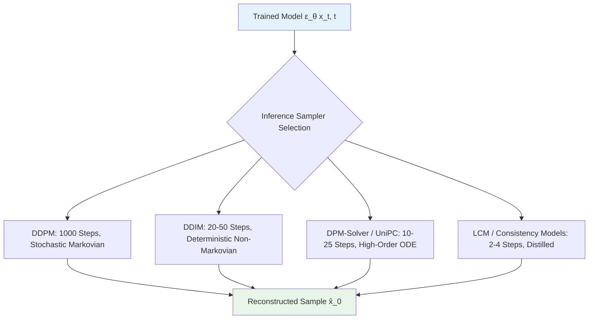
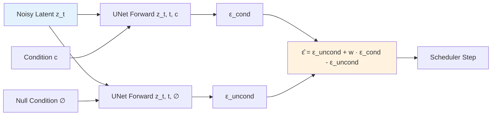

# Chapter 8 · Diffusion Model Foundations

> All architectures examined in Chapters 6 and 7 are **discriminative**: given a degraded input $y$, they output a deterministic estimate $\hat{x} = f_\theta(y)$.
>
> Diffusion models represent a fundamental transition to **generative modeling**: given $y$, they model the posterior distribution $p(x \mid y)$, enabling diverse, highly realistic samples $\hat{x} \sim p(x \mid y)$ to be drawn from the natural image manifold.
>
> In severely ill-posed restoration scenarios, this generative shift overcomes the visual blurriness inherent to deterministic regression.

## 8.0 Reading Notes

This chapter marks the transition in Part II from discriminative regression to probabilistic generative modeling. Rather than learning a direct mapping $f_\theta(y) \approx x$, diffusion frameworks learn the score function of data distribution $p_\theta(x)$ or conditional posterior $p_\theta(x \mid y)$.

Key objectives:

- Understand the mathematical formulation of the forward stochastic differential equation (SDE) and reverse denoising process.
- Analyze the equivalence between noise prediction, score matching, and data reconstruction.
- Compare numerical samplers (DDPM, DDIM, DPM-Solver, UniPC, and consistency distillation).
- Understand Latent Diffusion Models (LDM) and Classifier-Free Guidance (CFG).

**Prerequisites.** Vector calculus, probability theory, Gaussian distributions, and loss formulation fundamentals from Chapter 3.

**Key Terminology Introduced in This Chapter:**

- **DDPM** (Denoising Diffusion Probabilistic Model): The foundational discrete diffusion framework (Ho et al., 2020) using fixed Markovian forward noising and learned reverse transitions.
- **DDIM** (Denoising Diffusion Implicit Model): Non-Markovian deterministic sampling formulation (Song et al., 2021) enabling accelerated step skipping.
- **DPM-Solver / UniPC**: High-order numerical Ordinary Differential Equation (ODE) solvers designed for fast diffusion inference in $10\text{ to }20$ evaluation steps.
- **ELBO** (Evidence Lower Bound): Variational objective maximized during diffusion training, simplified in practice to reweighted Mean Squared Error.
- **Score Function**: The gradient of the log probability density with respect to state, $\nabla_x \log p(x)$.
- **CFG** (Classifier-Free Guidance): Joint training of conditional and unconditional diffusion paths, extrapolating between them at inference to balance fidelity and sample realism.
- **LDM** (Latent Diffusion Model): Formulation executing the diffusion trajectory in a compressed latent space $\mathcal{Z}$ parameterized by a pretrained autoencoder (Rombach et al., 2022).
- **SDS** (Score Distillation Sampling): Utilizing a pretrained diffusion backbone as a differentiable perceptual loss gradient to optimize external parameters.

```mermaid
graph LR
    X0[x_0<br/>Clean Image] -->|+ε_1| X1[x_1]
    X1 -->|+ε_2| X2[x_2]
    X2 -->|...| XT_1[x_{T-1}]
    XT_1 -->|+ε_T| XT[x_T<br/>Standard Gaussian Noise]
    XT -. Reverse .-> RT_1[x_{T-1}]
    RT_1 -. Reverse .-> R2[x_2]
    R2 -. Reverse .-> R1[x_1]
    R1 -. Reverse .-> R0[x̂_0<br/>Generated Sample]

    style X0 fill:#e8f5e9
    style XT fill:#ffebee
    style R0 fill:#fff3e0
```

## 8.1 The Generative Role in Image Enhancement

As established by the perception-distortion trade-off (Section 4.8), minimizing mean squared error on severely degraded inputs forces models to predict the conditional expectation $\mathbb{E}[x \mid y]$: the pixel-wise mean of all plausible ground-truth realizations. For severely degraded imagery, this expectation averages out high-frequency phase information, resulting in unnatural, smooth reconstructions.

Generative diffusion models resolve this limitation by sampling concrete points directly from the high-probability manifold:

$$
\hat{x} \sim p_\theta(x \mid y)
$$

Each generated realization represents a coherent natural image that satisfies the conditioning constraints without collapsing into spatial averages.

## 8.2 Mathematical Formulation of Forward Noising

The forward noising process is a non-learnable Markov chain that incrementally injects Gaussian noise across discrete time steps $t \in \{1, \dots, T\}$ according to a variance schedule $\beta_1, \dots, \beta_T$:

$$
q(x_t \mid x_{t-1}) = \mathcal{N}\left(x_t; \sqrt{1 - \beta_t} \, x_{t-1}, \, \beta_t \mathbf{I}\right)
$$

Defining $\alpha_t = 1 - \beta_t$ and the cumulative product $\bar{\alpha}_t = \prod_{s=1}^t \alpha_s$, repeated application of the Gaussian transition density yields the closed-form marginal distribution:

$$
q(x_t \mid x_0) = \mathcal{N}\left(x_t; \sqrt{\bar{\alpha}_t} \, x_0, \, (1 - \bar{\alpha}_t)\mathbf{I}\right)
$$

Consequently, any noisy state $x_t$ can be sampled in a single step without computing intermediate transitions:

$$
x_t = \sqrt{\bar{\alpha}_t} \, x_0 + \sqrt{1 - \bar{\alpha}_t} \, \epsilon, \quad \epsilon \sim \mathcal{N}(0, \mathbf{I})
$$

```python
import torch

class NoiseScheduler:
    """Standard linear variance scheduler for DDPM pipelines."""

    def __init__(self, num_steps: int = 1000,
                 beta_start: float = 1e-4, beta_end: float = 0.02,
                 device: str = 'cuda'):
        self.num_steps = num_steps
        self.betas = torch.linspace(beta_start, beta_end, num_steps, device=device)
        self.alphas = 1.0 - self.betas
        self.alphas_cumprod = torch.cumprod(self.alphas, dim=0)

        self.sqrt_alphas_cumprod = torch.sqrt(self.alphas_cumprod)
        self.sqrt_one_minus_alphas_cumprod = torch.sqrt(1.0 - self.alphas_cumprod)

    def add_noise(self, x0: torch.Tensor, t: torch.Tensor,
                  noise: torch.Tensor = None) -> tuple:
        """Computes closed-form noisy latent x_t at arbitrary step t."""
        if noise is None:
            noise = torch.randn_like(x0)
        sqrt_alpha = self.sqrt_alphas_cumprod[t].view(-1, 1, 1, 1)
        sqrt_one_minus = self.sqrt_one_minus_alphas_cumprod[t].view(-1, 1, 1, 1)
        x_t = sqrt_alpha * x0 + sqrt_one_minus * noise
        return x_t, noise
```

### Variance Schedules in Practice

- **Linear Schedule**: $\beta_t \in [10^{-4}, 0.02]$ (Standard baseline, Ho et al., 2020).
- **Cosine Schedule**: $\bar{\alpha}_t = \frac{f(t)}{f(0)}, f(t) = \cos\left(\frac{t/T + s}{1 + s} \frac{\pi}{2}\right)^2$ (Nichol & Dhariwal, 2021). Avoids rapid signal degradation near $t \approx T$.
- **Signal-to-Noise Ratio (SNR) Parameterization**: Continuous time scheduling defined via $\text{SNR}(t) = \frac{\bar{\alpha}_t}{1 - \bar{\alpha}_t}$ (Karras et al., EDM, 2022).

## 8.3 Training Objectives and Parameterization

The reverse transition $p_\theta(x_{t-1} \mid x_t)$ is modeled as a Gaussian parameterized by deep neural networks. Optimizing the variational lower bound simplifies to weighted mean squared error:

$$
\mathcal{L}_{\text{simple}}(\theta) = \mathbb{E}_{t, x_0, \epsilon} \left[ \| \epsilon - \epsilon_\theta(x_t, t) \|^2 \right]
$$

### Parameterization Equivalences

The neural network can be trained to predict one of three algebraically coupled targets:

```mermaid
graph LR
    XT[Input State x_t] --> P{Parameterization Target}
    P -->|Noise Prediction| EP[ε_θ x_t, t]
    P -->|Data Reconstruction| X0P[x̂_0 x_t, t]
    P -->|Velocity Formulation| VP[v_θ x_t, t]
    EP -.->|x̂_0 = (x_t - √(1-ᾱ)ε) / √ᾱ| X0P
    VP -.->|x̂_0 = √ᾱ x_t - √(1-ᾱ) v| X0P
    X0P -.->|ε = (x_t - √ᾱ x_0) / √(1-ᾱ)| EP

    style XT fill:#e3f2fd
    style X0P fill:#e8f5e9
```

```python
def eps_to_x0(x_t: torch.Tensor, eps_pred: torch.Tensor, alpha_cumprod_t: torch.Tensor) -> torch.Tensor:
    """Recovers x_0 estimate from predicted noise."""
    sqrt_alpha_t = alpha_cumprod_t.sqrt()
    sqrt_one_minus = (1.0 - alpha_cumprod_t).sqrt()
    return (x_t - sqrt_one_minus * eps_pred) / sqrt_alpha_t


def v_to_x0(x_t: torch.Tensor, v_pred: torch.Tensor, alpha_cumprod_t: torch.Tensor) -> torch.Tensor:
    """Recovers x_0 estimate from velocity parameterization."""
    sqrt_alpha_t = alpha_cumprod_t.sqrt()
    sqrt_one_minus = (1.0 - alpha_cumprod_t).sqrt()
    return sqrt_alpha_t * x_t - sqrt_one_minus * v_pred
```

## 8.4 Reverse Trajectory Samplers



### 1. DDPM Sampling (Stochastic SDE)

$$
x_{t-1} = \frac{1}{\sqrt{\alpha_t}} \left( x_t - \frac{\beta_t}{\sqrt{1 - \bar{\alpha}_t}} \epsilon_\theta(x_t, t) \right) + \sigma_t z, \quad z \sim \mathcal{N}(0, \mathbf{I})
$$

Requires 1000 sequential evaluations, incurring high computational cost for production deployment.

### 2. DDIM Sampling (Deterministic ODE)

Song et al. (2021) generalized forward non-Markovian transitions sharing the identical marginals $q(x_t \mid x_0)$, yielding the deterministic step:

$$
x_{t-1} = \sqrt{\bar{\alpha}_{t-1}} \, \hat{x}_0 + \sqrt{1 - \bar{\alpha}_{t-1}} \, \epsilon_\theta(x_t, t)
$$

Enables non-uniform sub-sequence step skipping (e.g., $50$ evaluation steps), accelerating inference by $20\times$ without retraining.

### 3. High-Order ODE Solvers (DPM-Solver / UniPC)

Formulating reverse diffusion as continuous probability flow Ordinary Differential Equations ($dx/dt = f(x, t) - \frac{1}{2} g(t)^2 \nabla_x \log p_t(x)$) permits the use of adaptive high-order Runge-Kutta and predictor-corrector solvers:

```python
from diffusers import DPMSolverMultistepScheduler

scheduler = DPMSolverMultistepScheduler.from_pretrained(
    "stabilityai/stable-diffusion-2-1",
    subfolder="scheduler",
    algorithm_type="dpmsolver++",
    solver_order=2,
)
scheduler.set_timesteps(num_inference_steps=20)
```

## 8.5 Latent Diffusion Models (LDM)

Pixel-space diffusion processes spend substantial capacity modeling perceptually imperceptible high-frequency residuals. Latent Diffusion Models (Rombach et al., 2022) decouple perceptual compression from semantic generation:

1. **Autoencoding Phase**: A convolutional VAE encodes high-resolution imagery $x \in \mathbb{R}^{3 \times H \times W}$ into a compact latent space $z = \mathcal{E}(x) \in \mathbb{R}^{C \times \frac{H}{f} \times \frac{W}{f}}$ using spatial downsampling factor $f=8$.
2. **Latent Diffusion Phase**: The UNet backbone executes denoising trajectories entirely within $\mathcal{Z}$, reducing spatial compute overhead by a factor of $f^2 = 64$.
3. **Synthesis Phase**: The decoder reconstructs pixel representations $\hat{x} = \mathcal{D}(z)$.

```mermaid
graph LR
    XT[Latent State z_t<br/>Shape: B, 4, H/8, W/8] --> UNet
    T[Time Step t] --> TEmb[Sinusoidal Time Embedding]
    Cond[Condition c<br/>Degraded Latent / Text] --> CtxEmb[Conditioning Encoder]
    TEmb --> UNet
    CtxEmb --> UNet
    UNet[UNet ε_θ Backbone<br/>Cross-Attention / ResBlocks] --> Eps[Predicted Noise ε̂]
    Eps --> Step[Numerical Step Operator]
    XT --> Step
    Step --> XTm1[Next Latent State z_{t-1}]

    style XT fill:#e3f2fd
    style UNet fill:#fff3e0
    style XTm1 fill:#e8f5e9
```

## 8.6 Classifier-Free Guidance (CFG)

To steer reverse generation toward conditioning signals without computing explicit external classifier gradients, Ho & Salimans (2022) proposed Classifier-Free Guidance:

During training, condition $c$ is randomly dropped with probability $p_{\text{uncond}} \approx 0.1$, setting $c = \emptyset$. At inference, predictions are extrapolated along the conditional vector:

$$
\hat{\epsilon}_\theta(x_t, t, c) = \epsilon_\theta(x_t, t, \emptyset) + w \cdot \left( \epsilon_\theta(x_t, t, c) - \epsilon_\theta(x_t, t, \emptyset) \right)
$$

Where guidance scale $w \ge 1.0$ controls the trade-off between conditional fidelity and sample diversity.



```python
def classifier_free_guidance(model: torch.nn.Module, x_t: torch.Tensor,
                             t: torch.Tensor, condition: torch.Tensor,
                             guidance_scale: float = 2.0) -> torch.Tensor:
    """Executes batched Classifier-Free Guidance step."""
    eps_cond = model(x_t, t, condition)
    eps_uncond = model(x_t, t, None)
    return eps_uncond + guidance_scale * (eps_cond - eps_uncond)
```

## 8.7 Score Distillation Sampling (SDS)

Beyond generative sampling, pretrained diffusion models can act as differentiable score priors via Score Distillation Sampling (Poole et al., 2022). Given a differentiable generator or parametric representation $x(\theta)$:

$$
\nabla_\theta \mathcal{L}_{\text{SDS}}(\theta) = \mathbb{E}_{t, \epsilon}\left[ w(t) \left(\epsilon_\phi\left(x_t(\theta); t, c\right) - \epsilon\right) \frac{\partial x(\theta)}{\partial \theta} \right]
$$

This formulation provides a gradient vector directing output $x(\theta)$ toward high-density regions of the learned natural image distribution.

## 8.8 Paradigm Comparison: Discriminative vs. Generative Diffusion

| Operational Attribute | Discriminative (CNN / Restormer) | Generative Diffusion (LDM / SUPIR) |
|-----------------------|----------------------------------|------------------------------------|
| **Inference Latency** | $\mathcal{O}(1)$ Forward Pass ($< 50\text{ ms}$) | $\mathcal{O}(T')$ Iterative Steps ($0.5\text{ to }5\text{ s}$) |
| **Objective Alignment** | Distortion Minimization (Peak PSNR) | Perceptual Likelihood (Low FID/LPIPS) |
| **Severe Degradation Response** | Smooth Average Textures (Safe Blur) | Realistic Synthesized Fine Details |
| **Sample Multimodality** | Deterministic Unique Mapping | Stochastic Diverse Realizations |
| **Hardware Memory Footprint** | Lightweight ($< 2\text{ GB}$) | Substantial GPU VRAM ($> 8\text{ GB}$) |

## 8.9 Complete Latent-Space Diffusion Pipeline

```python
import torch
import torch.nn as nn
import torch.nn.functional as F
from torch.optim import AdamW

def min_snr_weight(t: torch.Tensor, alphas_cumprod: torch.Tensor, gamma: float = 5.0) -> torch.Tensor:
    """Computes clamped Min-SNR loss balancing weights."""
    snr = alphas_cumprod[t] / (1.0 - alphas_cumprod[t])
    return torch.minimum(snr, torch.full_like(snr, gamma)) / snr


class EMA:
    """Exponential Moving Average of model parameters."""
    def __init__(self, model: nn.Module, decay: float = 0.9999):
        self.decay = decay
        self.shadow = {name: param.clone().detach() for name, param in model.named_parameters()}

    def update(self, model: nn.Module):
        for name, param in model.named_parameters():
            self.shadow[name] = self.decay * self.shadow[name] + (1.0 - self.decay) * param.detach()

    def apply_to(self, model: nn.Module):
        for name, param in model.named_parameters():
            param.data.copy_(self.shadow[name])


def train_diffusion_enhancement_step(
    unet: nn.Module,
    vae: nn.Module,
    scheduler: NoiseScheduler,
    lr_img: torch.Tensor,
    hr_img: torch.Tensor,
    optimizer: torch.optim.Optimizer,
    ema: EMA,
    device: str = 'cuda'
) -> float:
    """Executes single training step for latent-concatenated diffusion restoration."""
    unet.train()
    optimizer.zero_grad()

    # 1. Spatially align input crops
    lr_upsampled = F.interpolate(lr_img, size=hr_img.shape[-2:], mode='bicubic', align_corners=False)

    # 2. Encode to latent space with frozen VAE
    with torch.no_grad():
        hr_latent = vae.encode(hr_img).latent_dist.sample() * 0.18215
        lr_latent = vae.encode(lr_upsampled).latent_dist.mean * 0.18215

    # 3. Sample random time steps and inject noise
    B = hr_latent.shape[0]
    t = torch.randint(0, scheduler.num_steps, (B,), device=device)
    x_t, noise = scheduler.add_noise(hr_latent, t)

    # 4. Predict noise with condition concatenation
    unet_input = torch.cat([x_t, lr_latent], dim=1)
    pred_noise = unet(unet_input, t)

    # 5. Weighted Min-SNR loss
    weights = min_snr_weight(t, scheduler.alphas_cumprod)
    loss = (weights.view(-1, 1, 1, 1) * (pred_noise - noise) ** 2).mean()

    loss.backward()
    torch.nn.utils.clip_grad_norm_(unet.parameters(), 1.0)
    optimizer.step()
    ema.update(unet)

    return loss.item()
```

## 8.10 Chapter Summary

1. **The Generative Transition**: Diffusion models shift the restoration paradigm from single-point regression $f_\theta(y)$ to posterior density sampling $p_\theta(x \mid y)$, synthesizing realistic high-frequency detail under severe degradations.
2. **Score-Matching Equivalence**: Minimizing simple noise-prediction mean squared error is mathematically equivalent to estimating the score function $\nabla_x \log p(x)$ of the natural image manifold.
3. **Sampling Trajectory Acceleration**: Advanced numerical formulations (DDIM, DPM-Solver, UniPC) compress reverse sampling from $1000$ steps to $15\text{ to }25$ steps without retraining.
4. **Latent Space Compression**: Executing diffusion trajectories within a pretrained VAE latent space reduces spatial computational complexity by $64\times$.
5. **Conditioning Mechanisms**: Image restoration conditions can be integrated via channel concatenation, cross-attention modulation, or structural adapters like ControlNet.

---

> Next: [Conditional Control in Diffusion Models](09-control.md) details architectural conditioning frameworks including ControlNet, IP-Adapter, and SUPIR.
