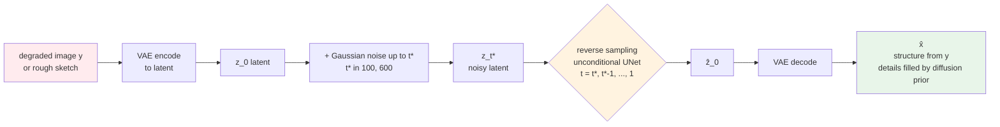
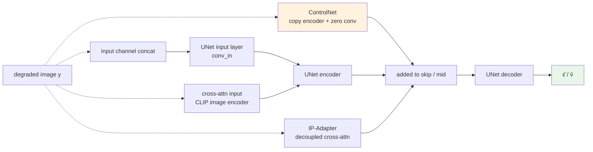

# Chapter 9 · Condition Control in Diffusion

> Chapter 8 covered the basics of diffusion models — given noise, predict the denoising.
>
> But the key in image-enhancement tasks is not denoising capability; it is **how to make a diffusion model obey** — using its generative ability (creating plausible details) while strictly respecting the LR input (not deviating from the original image).
>
> This chapter is the most active engineering battleground of this field over the past three years.

## 9.0 Reading guide

This chapter follows directly from Chapter 8. Chapter 8 settled the "generator" part of diffusion models: given a latent noise $x_T$, UNet + sampler can produce an $\hat{x}_0$ that lies on the natural-image distribution. But this is only "unconditional generation" — the result can be any image. Enhancement tasks need **conditional generation**: given a degraded image $y$, sample from $p(x \mid y)$ an $\hat{x}$ that is content-consistent with $y$ and of higher quality. This chapter discusses how to plug the condition $y$ into the diffusion process, and how different ways of plugging it in trade off fidelity (faithfulness) against creativity (generative freedom).

Before reading this chapter, you are assumed to be familiar with the following from Chapter 8:

- Forward noising and reverse denoising, $\bar{\alpha}_t$, $\epsilon$-prediction
- Samplers such as DDIM / DPM-Solver
- The latent-space structure of LDM, the ResBlock + Spatial Transformer in SD's UNet
- The two-pass forward of CFG at inference

Abbreviations that recur in this chapter:

- **SDEdit** (Stochastic Differential Editing, Meng et al. 2022): add noise to $y$ up to an intermediate time step, then run unconditional reverse diffusion to get a "guided random sample". The cheapest condition scheme, with zero additional training
- **SR3** (Super-Resolution via Repeated Refinement, Saharia et al. 2022): an early representative of using input concat to feed LR into a diffusion UNet
- **StableSR** (Wang et al. 2023): SD-based real-world SR, introducing CFW and a time-aware condition
- **DiffBIR** (Lin et al. 2023): Blind Image Restoration with Diffusion, using CLIP image cross-attention + ControlNet
- **SUPIR** (Yu et al. 2024): SDXL + ControlNet + LLaVA prompt, the 2024 representative for real-world SR
- **ControlNet** (Zhang & Agrawala 2023): copy the UNet encoder + zero conv; the de facto standard for diffusion condition control
- **T2I-Adapter** (Mou et al. 2023): a lighter-weight condition adapter than ControlNet
- **IP-Adapter** (Image Prompt Adapter, Ye et al. 2023): injects an image as a prompt into diffusion via decoupled cross-attention
- **PnP / Plug-and-Play** (Tumanyan et al. 2023): a training-free diffusion control method that does editing via inversion + feature injection
- **null-text inversion** (Mokady et al. 2023): a precision enhancement of DDIM inversion, common in editing tasks
- **CFW** (Controllable Feature Warping): the inference-time tunable fusion proposed by StableSR
- **ZeroSFT** (Zero Spatial Feature Transform): the feature-modulation variant used by SUPIR
- **LoRA** (Low-Rank Adaptation): low-rank fine-tuning, often paired with ControlNet
- **LCM** (Latent Consistency Model): the 4-step distillation method introduced in Chapter 8

This chapter implicitly takes all "diffusion models" to mean SD / SDXL — the LDM line — and does not expand on pixel-space diffusion (the GLIDE family), because production-side work is almost entirely in latent space.

## 9.1 The core problem: fidelity vs creativity

Chapter 8 ended with diffusion's "creating something from nothing" capability — this is its strength as well as its danger.

Upscaling the same elderly LR face image, a diffusion model may:

- **Adhere too strongly to LR**: output exactly the same as LR, blurry as ever (failing to use the generative ability)
- **Adhere too weakly to LR**: fabricate details, the face changes (the generative ability is out of control)
- **Balanced**: respect LR's overall structure, use the generative ability to fill in plausible details

Controlling this balance point is the theme of this chapter.

> The essence of "condition control" in image enhancement:
>
> Make the model **inject** the constraint that "$\hat{x}_0$ should be close to $y$" into the sampling process at every denoising step.

Different injection methods (concat, cross-attention, ControlNet, IP-Adapter) differ greatly in effectiveness. This chapter clarifies them.

## 9.2 Five condition-injection paradigms

Overview:

| Paradigm | Injection point | Representative method | Training cost | Control strength |
|------|---------|---------|---------|---------|
| **Input Concat** | UNet input channels | SR3, StableSR v1 | Low (modify input) | Medium |
| **Cross-Attention** | Internal UNet attention | DiffBIR | Medium (train cross-attn) | Weak (semantic level) |
| **ControlNet** | Sum to UNet middle layers | StableSR v2, SUPIR | High (copy encoder) | Strong |
| **IP-Adapter** | Decoupled cross-attention | Style / identity preservation | Medium | Medium |
| **Tile + ControlNet** | Local condition | Large-image enhancement | (Inference trick) | Strong |

In addition there are two **training-free** approaches that tweak the sampling process without retraining weights:

- **SDEdit**: noise $y$ up to $t^* \ll T$ then run unconditional sampling back to 0, equivalent to "applying a random reshaping under the diffusion prior to $y$"
- **PnP / null-text inversion / classifier guidance**: invert $y$ to its corresponding $x_T$, then inject extra constraints during the reverse process

These training-free methods are occasionally useful in production (especially when there is no data to train a ControlNet). SDEdit is typical and cheap enough to deserve its own data-flow figure, so the reader can build intuition for this "training-free" line:



The key parameter of SDEdit is the intermediate time step $t^*$: a larger $t^*$ adds more noise and gives the model more freedom (the generation may drift further, possibly changing content); a smaller $t^*$ preserves more of the input structure (close to an identity map). These two extremes are exactly the two ends of the fidelity-creativity spectrum discussed in Section 9.3, except that SDEdit slides along it with a single number.

**No paradigm wins overall** — the choice depends on task and budget. The figure below draws the injection points of all five paradigms on the same UNet for comparison:



The injection point differs across paradigms: concat is at the shallowest layer; cross-attention and IP-Adapter are at every attention block; ControlNet is at all encoder skips. Roughly speaking, **the deeper and broader the injection, the stronger the control but the higher the training cost**.

## 9.3 The engineering meaning of fidelity vs creativity

Putting the perception-distortion trade-off (Section 4.8 of Chapter 4) into the diffusion context:

- **High fidelity**: strong pixel-level consistency in the output, high PSNR/SSIM, but stiff visually
- **High creativity**: the model has free rein, visually stunning but possibly fabricated ("hallucinated")

The two extremes correspond to different applications:

- Surveillance video → high fidelity (no fabricating faces)
- Old-photo restoration → medium (preserve structure, generate details)
- Artistic upscaling, 4K live-stream creative enhancement → high creativity (visual impact above all)

All the techniques in this chapter aim to **let users pick a point on this curve** — not only at training time but **also at inference time**.

## 9.4 Paradigm 1: Input Concat

The simplest condition injection: **concatenate** the LR latent into the UNet input channels.

The UNet input goes from $(B, 4, h, w)$ to $(B, 8, h, w)$, where the first 4 channels are the current noisy latent and the latter 4 channels are the LR latent.

```python
def diffusion_step_concat(unet, x_t, lr_latent, t):
    """Input-concat-style condition injection."""
    inp = torch.cat([x_t, lr_latent], dim=1)  # (B, 8, h, w)
    return unet(inp, t)
```

Modify the first conv layer of the UNet to accept 8-channel inputs:

```python
import torch.nn as nn

# Original first layer of UNet
old_conv = unet.conv_in  # in_channels=4

# Replace with an 8-channel input
new_conv = nn.Conv2d(8, old_conv.out_channels, kernel_size=3, padding=1)

# Important: copy only the weights of the first 4 channels; initialize the latter 4 to 0
with torch.no_grad():
    new_conv.weight[:, :4] = old_conv.weight
    new_conv.weight[:, 4:] = 0
    new_conv.bias[:] = old_conv.bias

unet.conv_in = new_conv
```

Initializing the latter 4 channels to 0 makes the UNet behave like the original model in early training — the LR signal gradually takes effect.

### Pros and cons of Input Concat

**Pros**:

- The simplest, only a few lines of code to change
- Training only requires fine-tuning (most UNet weights are kept)
- No extra cost at inference

**Cons**:

- LR information is only injected at the first layer, **deep-layer information gets diluted**
- Hard to tune "control strength"
- Insufficient respect for LR (at high $t$, the UNet is too "free")

**StableSR v1** uses this simple form, with reasonable results but insufficient fidelity, which is why v2 switched to ControlNet.

## 9.5 Paradigm 2: Cross-Attention injection

Inject not at the input layer but at the UNet's internal cross-attention — encode LR into tokens via some image encoder and use them as the KV of cross-attention.

The most common image encoder is CLIP. The pipeline:

```
LR image
  ↓ CLIP image encoder
  ↓ (B, T_img, D)  image tokens (replacing the original SD text tokens)
  ↓ Inject into the cross-attention of every UNet layer
```

```python
import open_clip

class CLIPImageEncoder(nn.Module):
    def __init__(self):
        super().__init__()
        self.clip, _, _ = open_clip.create_model_and_transforms('ViT-L-14')
        self.proj = nn.Linear(self.clip.visual.output_dim, 768)  # align with SD context dim

    def forward(self, lr_img):
        # Take the patch tokens of the second-to-last CLIP layer (rather than the final [CLS])
        feat = self.clip.encode_image(lr_img, return_tokens=True)
        # feat: (B, T, D), typically T=257 for ViT-L/14
        return self.proj(feat)
```

The UNet's cross-attention is unchanged (see Section 8.8 of Chapter 8); only the source of K/V switches from the text encoder to the image encoder.

### Characteristics of cross-attention injection

**Suitable for**:

- LR information is mainly **semantic** (need to preserve "is it a cat or a dog", not pixel-level identity)
- Style transfer-style tasks

**Not suitable for**:

- High-fidelity SR (CLIP embeddings lose pixel-level information)
- Document / small-text enhancement (structural information is insufficient with patch tokens alone)

**DiffBIR** (2023) injects the semantic condition with a CLIP image encoder, paired with a ControlNet that injects the structural condition — combining the two is a representative design in this direction.

## 9.6 Paradigm 3: ControlNet — the protagonist of this chapter

Zhang & Agrawala (2023) proposed ControlNet, the **de facto standard** for diffusion control. Its core design:

> Copy the encoder of the UNet to dedicate to processing the "control signal", and **add** its output to the corresponding layer of the main UNet's skip connections.

The main UNet is left untouched (its pretrained weights preserved); ControlNet is an **add-on**. The advantages of this design:

1. **Preserves pretrained knowledge**: all the abilities of the main UNet (including the semantic understanding of text-to-image) are unchanged
2. **Trainable parameter count is smaller than full fine-tuning**: ControlNet copies the encoder + mid block of the main UNet, so trainable params are about 0.4–0.5× the main UNet (on SD 1.5: ControlNet ≈ 360M vs. main UNet ≈ 860M). But **memory cost is not modest** — the forward pass still runs the full main UNet to produce skip features, and only the ControlNet portion sees gradients in the backward pass. Training an SDXL ControlNet on a single GPU still requires 40GB+; this is not a "LoRA-cheap" setup
3. **Stackable**: multiple ControlNets can act simultaneously (one for LR, one for an edge map, one for a depth map)

### The specific structure of ControlNet

```
                  Main UNet (frozen)
                  
LR ──→ Encoder copy ──→ Mid block copy
        (trainable)       (trainable)
              │              │
              ↓ zero conv    ↓ zero conv
              │              │
              ▼              ▼
       UNet skip 1-12    UNet mid
              │              │
              └──→ Add to the corresponding location of the main UNet
              
Output (B, 4, h, w) noise prediction
```

Re-drawing this ASCII figure as a mermaid data-flow diagram makes it clearer: the main UNet is the frozen SD weights, the trainable copy in the lower-left has gradients only on encoder + mid, and its output goes through a zero conv before being added to the main UNet's skips.

```mermaid
graph LR
    XT[x_t<br/>noisy latent<br/>B,4,h,w] --> MainEnc
    XT --> CnetIn[ControlNet input<br/>x_t || lr_latent<br/>B,8,h,w]
    LR[LR / condition image] --> Pre[cond pre-process<br/>RGB → latent size] --> CnetIn
    T[t, context] --> MainEnc
    T --> CnetEnc

    subgraph Main[Main UNet · frozen · pretrained SD]
        MainEnc[Encoder<br/>multi-layer ResBlock + Spatial Transformer] --> MainMid[Mid Block]
        MainMid --> MainDec[Decoder<br/>upsample + skip concat per layer]
        MainDec --> EpsOut[ε̂ / v̂<br/>B,4,h,w]
    end

    subgraph Cnet[ControlNet · trainable · encoder + mid copy]
        CnetIn --> CnetEnc[Encoder copy<br/>initial weights = main UNet]
        CnetEnc --> CnetMid[Mid block copy]
    end

    CnetEnc -.->|per layer| Z1[Zero Conv × N<br/>initial weights 0]
    CnetMid -.-> Zm[Zero Conv mid]
    Z1 --> SkipAdd[add to corresponding skip of main UNet]
    Zm --> SkipAdd
    SkipAdd --> MainDec

    style Main fill:#e3f2fd
    style Cnet fill:#fff3e0
    style EpsOut fill:#e8f5e9
```

A few details worth re-examining in the figure:

- The main UNet runs its entire forward pass (the path is not drawn dashed but is always taken), so ControlNet's "low training cost" means only that backward gradients flow through the trainable copy; the forward memory still has to hold the main UNet
- The ControlNet input is the concat of $x_t$ and the LR latent (overlapping with the input-concat route in Section 9.4); the difference is that the concat goes through a separate copy of the encoder rather than replacing the first layer of the main UNet
- The zero conv collapses every ControlNet output back to 0, so the main UNet behaviour is unchanged at the start of training; this is the same idea as LoRA initializing its adapters to a zero matrix
- ControlNet's outputs are added to the main UNet's **skip connections** (not replacing them and not via cross-attention), so the main UNet receives "its own skip features + a small condition offset", minimizing damage to pretrained knowledge

### Zero Convolution — the core trick

Before ControlNet's output is added to the main UNet, it goes through a **zero-initialized 1×1 conv** — its initial weights are all 0.

Why does this detail matter?

- Early in training, ControlNet's output multiplied by 0 = 0, **with no effect at all on the main UNet**
- This means in the early training stage the model behaves identically to the original SD (no risk of quality regression)
- ControlNet's weights gradually learn nonzero values, and the control signal grows stronger

```python
class ZeroConv(nn.Module):
    """ControlNet's zero convolution."""

    def __init__(self, in_ch, out_ch):
        super().__init__()
        self.conv = nn.Conv2d(in_ch, out_ch, 1)
        nn.init.zeros_(self.conv.weight)
        nn.init.zeros_(self.conv.bias)

    def forward(self, x):
        return self.conv(x)
```

Mathematically, suppose ControlNet's output is $h_c$ and the feature of the main UNet at some layer is $h_m$. After modification:

$$
h_m' = h_m + Z(h_c)
$$

where $Z$ is the zero conv. Initially $Z(h_c) = 0$ and $h_m' = h_m$ — the model behavior is unchanged. After training learns nonzero weights for $Z$, the control signal starts to take effect.

### A simplified ControlNet implementation

```python
import torch
import torch.nn as nn
import copy


class ControlNetForSR(nn.Module):
    """A simplified SR ControlNet.
    The main UNet is a pretrained SD UNet (frozen).
    ControlNet copies its encoder + mid block, with zero convs added.
    """

    def __init__(self, sd_unet: nn.Module, lr_input_channels: int = 3,
                 latent_channels: int = 4):
        super().__init__()
        # Copy the encoder + mid of the main UNet (shallow-copy structure, deep-copy weights)
        self.input_blocks = copy.deepcopy(sd_unet.input_blocks)
        self.middle_block = copy.deepcopy(sd_unet.middle_block)

        # Important: after copying, the first conv layer must be replaced, because the
        # first layer of SD UNet takes 4 channels, while ControlNet here accepts
        # (x_t || lr_latent) for a total of 8 channels (the official ControlNet uses a
        # separate condition embedding; for simplicity we directly concat to the input).
        old_conv = self._first_conv(self.input_blocks)
        new_conv = nn.Conv2d(
            latent_channels * 2, old_conv.out_channels,
            kernel_size=old_conv.kernel_size, padding=old_conv.padding,
        )
        with torch.no_grad():
            new_conv.weight[:, :latent_channels] = old_conv.weight
            new_conv.weight[:, latent_channels:] = 0      # the extra channels are inactive at init
            new_conv.bias[:] = old_conv.bias
        self._replace_first_conv(self.input_blocks, new_conv)

        # Zero convs at the output of every input_block
        self.zero_convs = nn.ModuleList()
        for block in self.input_blocks:
            ch = self._get_block_out_ch(block)
            self.zero_convs.append(ZeroConv(ch, ch))
        # Zero conv after the mid block as well
        self.zero_conv_mid = ZeroConv(
            self._get_block_out_ch(self.middle_block),
            self._get_block_out_ch(self.middle_block),
        )

        # Pre-processing for LR before feeding into ControlNet (RGB -> latent size)
        self.cond_pre = nn.Sequential(
            nn.Conv2d(lr_input_channels, 16, 3, padding=1, stride=2),
            nn.SiLU(),
            nn.Conv2d(16, 32, 3, padding=1, stride=2),
            nn.SiLU(),
            nn.Conv2d(32, 64, 3, padding=1, stride=2),
            nn.SiLU(),
            nn.Conv2d(64, latent_channels, 3, padding=1),
        )

    @staticmethod
    def _first_conv(input_blocks):
        for m in input_blocks[0].modules():
            if isinstance(m, nn.Conv2d):
                return m
        raise RuntimeError("no conv found in first input block")

    @staticmethod
    def _replace_first_conv(input_blocks, new_conv):
        # Simplified: in real SD UNet the first input_block is usually a separate input conv;
        # this is a search-and-replace illustration. In production, replace precisely
        # according to the specific UNet structure.
        for parent in input_blocks.modules():
            for name, child in list(parent.named_children()):
                if isinstance(child, nn.Conv2d) and child.in_channels in (4, 8):
                    setattr(parent, name, new_conv)
                    return

    def forward(self, x_t, lr_img, t, context):
        """
        x_t: (B, 4, h, w) noisy latent
        lr_img: (B, 3, H, W) LR input (RGB)
        t: (B,) time
        context: (B, T, D) text/image tokens
        """
        # Bring LR down to latent size
        lr_latent = self.cond_pre(lr_img)

        # ControlNet input = noisy latent + LR latent (concat into 8 channels)
        h = torch.cat([x_t, lr_latent], dim=1)

        outs = []
        for block, zero_conv in zip(self.input_blocks, self.zero_convs):
            h = block(h, t, context)
            outs.append(zero_conv(h))

        h = self.middle_block(h, t, context)
        outs.append(self.zero_conv_mid(h))

        # These outs are added to the corresponding skips during the main UNet forward
        return outs

    @staticmethod
    def _get_block_out_ch(block):
        # Simplified; in practice this should be derived from the specific SD UNet structure
        for m in block.modules():
            if isinstance(m, nn.Conv2d):
                return m.out_channels
        return None
```

The forward of the main UNet has to be modified to add ControlNet's output to the corresponding skip:

```python
def forward_with_controlnet(unet, controlnet, x_t, lr_img, t, context):
    """Main UNet forward + ControlNet injection."""
    # 1. ControlNet computes the conditional signal
    control_outs = controlnet(x_t, lr_img, t, context)

    # 2. Main UNet encoder, add control_outs into skips
    skips = []
    h = x_t
    for i, block in enumerate(unet.input_blocks):
        h = block(h, t, context)
        skips.append(h + control_outs[i])           # sum

    # 3. Main UNet mid + control mid
    h = unet.middle_block(h, t, context)
    h = h + control_outs[-1]

    # 4. Main UNet decoder
    for block, skip in zip(unet.output_blocks, reversed(skips)):
        h = block(torch.cat([h, skip], dim=1), t, context)

    return unet.out(h)
```

### Training-data requirements for ControlNet

Pairs (LR, HR) are required (HR is used as the target after noising the latent, and LR is the ControlNet input).

Data scale: the ControlNet paper used hundreds of thousands to millions of images. The ControlNet for enhancement tasks usually generates training data using the synthesis pipeline of Chapter 5.

## 9.6b Paradigm 4: IP-Adapter — a decoupled image prompt

IP-Adapter (Ye et al. 2023) addresses something ControlNet does not do well: **using a reference image as a "style / identity prompt"**, not controlling each pixel's structure but controlling how the generated image as a whole looks like the reference.

In the enhancement context:

- Given LR + a high-resolution photo of the same person (reference), make the generated HR identity-consistent with the reference
- Given LR + a target-lighting sample image, make the HR replicate the sample's tone
- Given LR + a high-resolution patch with the target texture, make the HR learn that texture

The IP-Adapter design can be summarized in one sentence:

> Do not let the image prompt steal the text prompt's cross-attention; **open a separate cross-attention channel for the image prompt**, and add it to the original text cross-attention.

This is "decoupled cross-attention". The original SD UNet's attention is $\text{Attn}(Q, K_t, V_t)$ where $K_t, V_t$ come from the text encoder. IP-Adapter adds a parallel term:

$$
\text{Output} = \text{Attn}(Q, K_t, V_t) + \lambda \cdot \text{Attn}(Q, K_i, V_i)
$$

$K_i, V_i$ come from the image encoder (CLIP image) through a new projection layer. $\lambda$ is the user-tunable "image-prompt strength".

The advantages of this decoupling over "concat image tokens onto text tokens":

1. **Preserves the original text channel's training distribution**: the original cross-attention has only seen text tokens; force-mixing image tokens would shift the distribution. Decoupling keeps the text channel completely unchanged
2. **Image and text strengths can be tuned independently**: the text part is still under CFG control, the image part is controlled by $\lambda$, the two not interfering
3. **Only the new image cross-attention layers need training**, the original UNet is untouched, and new parameters are very few (< 100M)

A skeleton implementation:

```python
class IPAdapterCrossAttn(nn.Module):
    """IP-Adapter: decoupled image cross-attention.
    Parallel to the original text cross-attention; outputs are summed.
    """

    def __init__(self, dim: int, num_heads: int, image_dim: int = 1024):
        super().__init__()
        # Reuse the original cross-attention's Q (from the latent)
        # Add K, V projections for the image branch
        self.to_k_img = nn.Linear(image_dim, dim, bias=False)
        self.to_v_img = nn.Linear(image_dim, dim, bias=False)
        self.num_heads = num_heads
        nn.init.zeros_(self.to_k_img.weight)
        nn.init.zeros_(self.to_v_img.weight)        # zero init -> no effect at start

    def forward(self, q, text_kv, image_tokens, scale: float = 1.0):
        # text_kv goes through the original cross-attention (omitted; built into main UNet)
        text_out = original_cross_attn(q, text_kv)

        # Image branch
        k_img = self.to_k_img(image_tokens)
        v_img = self.to_v_img(image_tokens)
        image_out = scaled_dot_product_attention(q, k_img, v_img, num_heads=self.num_heads)

        return text_out + scale * image_out
```

In enhancement tasks IP-Adapter is often used together with ControlNet: ControlNet handles "structural alignment with LR" while IP-Adapter handles "style / identity alignment with the reference". SUPIR replaces IP-Adapter's image-prompt role with a LLaVA prompt — a different solution.

### Relation to RefSR in Chapter 10

IP-Adapter is engineering-wise extremely close to RefSR in Chapter 10: both are "LR + Ref → HR" multi-input diffusion enhancement. The difference is that RefSR's cross-attention usually does patch-level matching (local textures of Ref → corresponding regions of the main image), while IP-Adapter encodes Ref globally into a token sequence, biasing control toward global style / identity. In production these two ideas often coexist; they are not mutually exclusive.

## 9.7 SUPIR (2024) — the design behind the current SR SOTA

SUPIR stacks several engineering tricks together to reach the 2024 real-world SR SOTA. It is worth looking at its compositional logic in detail.

### Component 1: SDXL as the base

SDXL is a larger version of SD (a 2.6B-parameter UNet), with generative ability an order of magnitude stronger than SD 1.5. SUPIR uses SDXL as the base to guarantee generation quality.

### Component 2: ControlNet to inject LR

Similar to the ControlNet above, LR is injected via ControlNet. But SUPIR uses a variant — **ZeroSFT** (Zero Spatial Feature Transform):

ZeroSFT is a feature modulation — before the ControlNet output is added to the main UNet, a spatially varying affine transformation is applied:

$$
h' = h \odot (1 + \gamma) + \beta
$$

where $\gamma, \beta$ are spatial feature maps predicted from the ControlNet output. This control is more flexible than simple addition.

### Component 3: LLaVA prompt

SUPIR uses LLaVA (a VLM) to automatically generate a text description of the LR, used as the text condition for SDXL. This gives the model a "semantic prior" — knowing whether it is a cat or a dog and being able to generate the corresponding details.

### Component 4: adaptive noise

Instead of starting sampling from pure noise, start from a **noise infused with LR information**:

$$
x_T^{\text{init}} = \sqrt{\bar{\alpha}_T'} \cdot \text{Encode}(y) + \sqrt{1 - \bar{\alpha}_T'} \cdot \epsilon
$$

where $T' < T$. This is equivalent to "skipping the highest time step" and starting from somewhere in the middle. Advantages: fewer inference steps + retain more LR structure.

### Component 5: Restoration-Guided Sampling

After every sampling step, use a restoration loss (e.g. LPIPS to LR-upsampled) to pull $\hat{x}_0$ back toward LR. This is an inference-time trick and does not require retraining.

### Overall effect of SUPIR

- On heavily degraded real old photos, the visual quality far exceeds all discriminative SR
- LPIPS is more than 30% lower than ESRGAN
- But PSNR is 7-8 dB lower than HAT (the perception-distortion trade-off chooses the perception end)
- Slow (30-50-step inference), each 1K image needs 5-10 seconds (A100)

## 9.8 StableSR (2023) — a simplified version

Wang et al.'s StableSR is the predecessor of SUPIR. Its idea is simpler but more friendly for engineering practice.

### Key design: CFW (Controllable Feature Warping)

Lets users adjust "quality vs fidelity" at inference. Specifically: a warping layer is added before decoding the latent to pixels:

$$
\hat{x}_0 = (1 - w) \cdot \text{Decode}(z) + w \cdot \text{Decode}(\text{warp}(z, y))
$$

$w \in [0, 1]$ is a user-tunable parameter:

- $w = 0$: pure generation (high quality but low fidelity)
- $w = 1$: full fidelity (close to LR)
- $w = 0.5$: balanced

This kind of user-tunable design is a plus in production environments — the same model can serve users with different needs.

### Time-aware Condition

StableSR has another detail: the strength of condition injection is related to the time step. Early on (high $t$) the injection is weak (let the model generate freely), and later (low $t$) it is strong (let the model align with LR). This is a precise exploitation of diffusion dynamics.

## 9.9 Tile inference: handling large images

Diffusion models are usually trained on $256 \times 256$ or $512 \times 512$ patches. But real enhancement tasks may have to handle 4K or even 8K images. **Direct full-image inference will blow memory** — and the model has never seen such large sizes during training, so the result may collapse.

Solution: **tile-based inference**.

### Naive tile

Split the large image into blocks, run each independently, and reassemble. The problem: **block boundaries are not continuous**.

### Overlap + blend

Let tiles have an overlapping region (e.g. 50%) and use a gradient mask to blend them:

```python
import torch
import torch.nn.functional as F

def tile_diffusion_inference(
    pipeline, hr_img_tensor, tile_size=512, overlap=128, **pipe_kwargs
):
    """
    Tile-based diffusion inference.
    pipeline: a diffusion pipeline
    hr_img_tensor: input LR image tensor (1, 3, H, W) - already latent-encoded or RGB
    """
    _, _, H, W = hr_img_tensor.shape
    stride = tile_size - overlap

    # Create accumulator and weights
    output = torch.zeros_like(hr_img_tensor)
    weight = torch.zeros_like(hr_img_tensor)

    # Create gradient blend mask (highest weight at center, fading to 0 at edges)
    blend_mask = torch.ones((1, 1, tile_size, tile_size))
    for i in range(overlap):
        v = (i + 1) / (overlap + 1)
        blend_mask[:, :, i, :]  *= v
        blend_mask[:, :, -i-1, :] *= v
        blend_mask[:, :, :, i]  *= v
        blend_mask[:, :, :, -i-1] *= v

    blend_mask = blend_mask.to(hr_img_tensor.device)

    # Sliding-window inference - key: use anchored ranges so that the last tile lands at
    # H-tile_size; otherwise when (H - tile_size) is not an integer multiple of stride,
    # the right/bottom edges will not be covered.
    def anchored_starts(total: int, tile: int, step: int):
        if total <= tile:
            return [0]
        starts = list(range(0, total - tile, step))
        if starts[-1] + tile < total:
            starts.append(total - tile)
        return starts

    for top in anchored_starts(H, tile_size, stride):
        for left in anchored_starts(W, tile_size, stride):
            tile = hr_img_tensor[:, :, top:top+tile_size, left:left+tile_size]
            tile_out = pipeline(tile, **pipe_kwargs)

            output[:, :, top:top+tile_size, left:left+tile_size] += tile_out * blend_mask
            weight[:, :, top:top+tile_size, left:left+tile_size] += blend_mask

    return output / (weight + 1e-8)
```

### Shared Noise

A more advanced trick: all tiles **share the same noise starting point** — generate the full-image noise latent in advance, and each tile uses the noise at the corresponding location during inference. This way the "random direction" is consistent across tiles, and boundaries are more continuous.

This is the idea behind work like Multi-Diffusion / SyncDiffusion.

### ControlNet Tile model

A ControlNet model trained specifically for tile inference — at training time it sees a mix of various tile pairings (small and large sizes mixed together) so the model is more robust to tile boundaries.

Engineering practice: enhancement of 4K+ images **almost always uses tile + blend**; there is no better alternative.

## 9.10 Negative prompts and quality control

In text-to-image, a negative prompt is used to exclude what is not wanted ("blurry, low quality, deformed"). It can also be used in enhancement tasks:

```python
# At inference time
positive_prompt = "high quality, sharp, detailed photograph"
negative_prompt = "blurry, low quality, jpeg artifacts, oversmooth, plastic skin"
```

CFG pushes the generated result **away** from the features described by the negative prompt. Empirical impact:

- Without a negative prompt: ~5% chance of mild artifacts
- With a reasonable negative prompt: artifacts drop to ~1%

Cost: nearly zero (one extra UNet forward at inference).

## 9.11 Tuning inference parameters

Diffusion-based enhancement models have many inference parameters with major impact on the final quality:

| Parameter | Typical range | Effect of increasing it |
|------|---------|-----------|
| `num_inference_steps` | 20 - 50 | Quality up, speed down |
| `guidance_scale` | 1.0 - 3.0 | More "obedient", but may oversaturate |
| `controlnet_conditioning_scale` | 0.5 - 1.5 | Closer to LR, but may blur |
| `start_noise_level` | 0.5 - 1.0 | Smaller values preserve more LR structure |
| `tile_size` | 512, 1024 | Larger tiles are more coherent, but blow memory |
| `tile_overlap` | 64 - 256 | Smoother but slower |

Engineering practice (a starting configuration for enhancement tasks):

```python
{
    'num_inference_steps': 25,
    'guidance_scale': 2.0,
    'controlnet_conditioning_scale': 1.0,
    'start_noise_level': 0.7,
    'tile_size': 1024,
    'tile_overlap': 256,
    'positive_prompt': 'high quality, sharp, detailed',
    'negative_prompt': 'blurry, low quality, oversmooth',
}
```

These parameters are best made user-tunable — different users have different fidelity preferences for the same model.

## 9.12 Training vs inference: key differences

The differences between training and inference for diffusion-based enhancement models are much larger than for CNN/Transformer models.

### At training time

- Input size is fixed (typically $512 \times 512$)
- Single-step backprop (not iterative sampling)
- No sampler is needed; only the noise scheduler adds noise
- No tile is needed (the full image is processed directly)

### At inference time

- Input size is variable (any resolution)
- Multi-step iterative sampling
- Sampler choice (DDIM/DPM-Solver/UniPC)
- Large images must be tiled
- CFG / negative prompt
- ControlNet conditioning scale is tunable

Engineering implication: **the training-time performance of an experiment may not match the inference-time performance in production** — many problems (tile artifacts, CFG instability, accumulated long-sequence sampling errors) only surface at inference. This is a special difficulty of diffusion-based enhancement engineering.

## 9.13 Selection decision table

Recommendations by scenario:

| Scenario | Recommended paradigm | Representative method |
|------|---------|---------|
| Severe degradation, strong generation | SDXL ControlNet + LLaVA prompt | SUPIR |
| Medium degradation, tunable | SD 1.5 ControlNet + CFW | StableSR |
| Semantic preservation priority | CLIP image cross-attn + ControlNet | DiffBIR |
| Content preservation (keep identity) | IP-Adapter + ControlNet | Custom combination |
| Fast inference | LCM distillation + ControlNet | LCM-LoRA + Tile |
| On-device | **Diffusion not recommended** (use CNN) | — |
| 4K+ large images | ControlNet Tile + Multi-Diffusion | Tile workflow |
| Video | Still under research | Chapter 13 |

## 9.14 Summary

1. **Condition control is the engineering core of diffusion-based enhancement** — far more important than the basic diffusion
2. **Five paradigms**: concat, cross-attention, ControlNet, IP-Adapter, Tile + ControlNet
3. **ControlNet is the de facto standard** — copy the encoder + zero conv, preserving the pretrained weights
4. **Zero conv keeps model behavior unchanged in early training** — this is the key to ControlNet's training stability
5. **SUPIR's stack of multiple components**: SDXL + ControlNet + ZeroSFT + LLaVA prompt + adaptive noise
6. **Tile + Blend is the only option for large images**; use shared noise + ControlNet Tile to reduce boundary artifacts
7. **Inference parameters have a major impact on the final result** — guidance_scale, conditioning_scale, num_steps, start_noise all need tuning
8. **The gap between training and inference is large** — many problems only surface at inference and must be tested at production scale

This concludes Part II's four chapters covering CNN → Transformer → diffusion basics → diffusion control. The next chapter is the last in this part — task-specific models, discussing what inductive biases face, document, and medical tasks each rely on.

---

> Next chapter [Task-specific models](10-task-specific.md) → general enhancement vs specialized enhancement: face uses GAN inversion, document uses CRNN guidance, medical uses physical priors.
