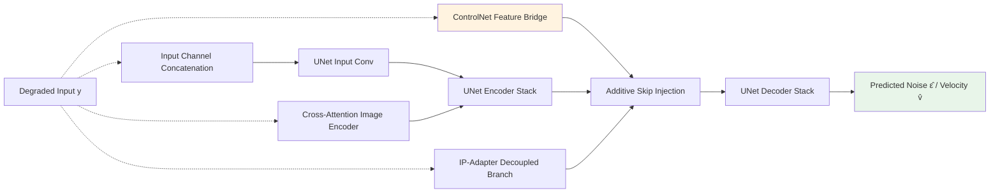
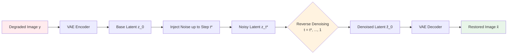

# Chapter 9 · Conditional Control in Diffusion Models

> While Chapter 8 analyzed the mechanics of unconditional and latent diffusion, the core engineering challenge in image restoration is **precise conditional steering**: harnessing generative priors to synthesize high-frequency detail while strictly adhering to low-resolution structural constraints.
>
> Designing conditioning interfaces that navigate the spectrum between faithful reconstruction and generative hallucination represents the primary operational frontier in modern diffusion restoration.

## 9.0 Reading Notes

This chapter examines the architectural mechanisms used to condition latent diffusion models on degraded inputs $y$.

Key objectives:

- Analyze the mathematical and architectural trade-offs across five conditioning paradigms: **Input Concatenation**, **Cross-Attention Conditioning**, **ControlNet**, **IP-Adapter**, and **Tiled Diffusion**.
- Understand the zero-convolution initialization mechanism that prevents degradation of pretrained diffusion priors during fine-tuning.
- Examine production frameworks (SUPIR, StableSR, DiffBIR) and their conditioning strategies.
- Implement tiled overlap blending for high-resolution (4K/8K) latent inference without boundary artifacts.

**Prerequisites.** Forward/reverse diffusion formulations, variance schedules, and the Stable Diffusion UNet architecture from Chapter 8.

**Key Terminology Introduced in This Chapter:**

- **ControlNet**: An architectural adapter (Zhang & Agrawala, 2023) that duplicates the UNet encoder and connects trainable feature paths to the frozen backbone via zero convolutions.
- **Zero Convolution**: A $1 \times 1$ convolutional layer initialized with zero weights and zero biases, ensuring the network output remains strictly identical to the base model at step zero of training.
- **IP-Adapter** (Image Prompt Adapter): A decoupled cross-attention mechanism (Ye et al., 2023) routing visual reference tokens into parallel attention layers without perturbing text conditioning distributions.
- **SDEdit** (Stochastic Differential Editing): A training-free conditioning method (Meng et al., 2022) adding noise to degraded inputs up to intermediate step $t^*$ and executing reverse sampling back to $t=0$.
- **SUPIR**: Scaling-up image restoration framework (Yu et al., 2024) combining SDXL, ControlNet, ZeroSFT feature modulation, and multimodal text prompts.
- **ZeroSFT** (Zero Spatial Feature Transform): A spatial modulation layer predicting affine feature scaling ($\gamma$) and shifting ($\beta$) parameters initialized to zero.
- **Tiled Blending**: An inference-time tiling strategy with overlapping linear ramps that prevents GPU memory exhaustion when restoring large-scale imagery.



## 9.1 The Fidelity-Creativity Frontier

In image restoration, conditional control governs where the model operates along the fidelity-creativity frontier:

1. **Over-Constrained Conditioning**: The model reproduces low-resolution inputs with high pixel fidelity, but suppresses high-frequency detail synthesis, returning blurry outputs.
2. **Under-Constrained Conditioning**: The model synthesizes sharp details, but hallucinates structural anomalies that diverge from original subject identity.
3. **Calibrated Conditioning**: Macro-structural geometry and color balance strictly match the input $y$, while micro-textures (pores, hair strands, fabric weaves) are filled in by the generative prior.



## 9.2 Comparative Taxonomy of Conditioning Paradigms

| Conditioning Paradigm | Injection Interface | Architectural Modification | Training Overhead | Control Fidelity | Primary Use Case |
|-----------------------|---------------------|----------------------------|-------------------|------------------|------------------|
| **Input Concat** | UNet Input Channels | Expanded first conv ($4 \to 8\text{ ch}$) | Low (fine-tune first layer) | Moderate | Baseline restoration |
| **Cross-Attention** | Spatial Transformer Layers | Key/Value projection replacement | Moderate (train cross-attn) | Semantic Only | Style and semantic transfer |
| **ControlNet** | Encoder Skip Connections | Cloned trainable encoder + Zero Convs | High (train cloned branch) | **Strict Structural** | **Production Restoration** |
| **IP-Adapter** | Decoupled Attention Heads | Parallel cross-attention layers | Moderate (train small adapter) | Feature / Identity | Reference-guided enhancement |
| **Tiled ControlNet** | Localized Spatial Windows | Slided inference windows + Blending | Zero (Inference strategy) | **Strict Structural** | **4K/8K Ultra-Resolution** |

## 9.3 Paradigm 1: Input Channel Concatenation

The most direct conditioning strategy concatenates the low-resolution latent $z_{\text{lr}}$ directly to the noisy latent $z_t$ along the channel dimension. The UNet input projection is modified from $4$ to $8$ channels:

```python
import torch
import torch.nn as nn

def adapt_unet_input_channels(unet: nn.Module, additional_channels: int = 4) -> nn.Module:
    """Expands UNet input conv layer to accept concatenated conditioning latents."""
    old_conv = unet.conv_in
    new_in_channels = old_conv.in_channels + additional_channels

    new_conv = nn.Conv2d(
        new_in_channels,
        old_conv.out_channels,
        kernel_size=old_conv.kernel_size,
        padding=old_conv.padding,
        stride=old_conv.stride
    )

    with torch.no_grad():
        # Preserve original weights for noisy latent channels
        new_conv.weight[:, :old_conv.in_channels] = old_conv.weight
        # Initialize conditioning channels to zero to preserve initial behavior
        new_conv.weight[:, old_conv.in_channels:] = 0.0
        new_conv.bias[:] = old_conv.bias

    unet.conv_in = new_conv
    return unet
```

While simple to implement, input concatenation injects conditioning signals exclusively at the network entry point. As activations propagate through deep encoder-decoder stacks, fine structural constraints tend to attenuate.

## 9.4 Paradigm 2: Cross-Attention Conditioning

Cross-attention conditioning encodes the input image through a frozen visual encoder (such as CLIP ViT-L/14) and injects the resulting sequence of tokens into the UNet's spatial transformer layers:

```python
import open_clip

class CLIPImageContextEncoder(nn.Module):
    """Extracts intermediate patch tokens from CLIP for cross-attention conditioning."""
    def __init__(self, context_dim: int = 768):
        super().__init__()
        self.clip, _, _ = open_clip.create_model_and_transforms('ViT-L-14', pretrained='openai')
        self.clip.eval()
        self.proj = nn.Linear(self.clip.visual.output_dim, context_dim)

    def forward(self, x: torch.Tensor) -> torch.Tensor:
        with torch.no_grad():
            # Extract patch embeddings prior to final global pooling
            tokens = self.clip.visual(x)
        return self.proj(tokens)
```

Because CLIP tokens capture high-level semantic abstractions rather than coordinate-precise high-frequency details, cross-attention conditioning is best suited for semantic restoration (DiffBIR) rather than fine geometric alignment.

## 9.5 Paradigm 3: ControlNet and Zero Convolutions

ControlNet (Zhang & Agrawala, 2023) locks the original UNet backbone and instantiates a trainable clone of its encoder and middle blocks. Outputs from the cloned encoder are routed into the frozen decoder's skip connections through **Zero Convolutions**:

```mermaid
graph LR
    XT[Noisy Latent z_t] --> MainEnc
    XT --> CnetIn[Concatenated Input: z_t || z_lr]
    LR[Conditioning Input y] --> Pre[Conditioning Pre-Processor] --> CnetIn
    T[Time Step t] --> MainEnc
    T --> CnetEnc

    subgraph Main[Frozen Base UNet]
        MainEnc[Encoder Blocks] --> MainMid[Mid Block]
        MainMid --> MainDec[Decoder Blocks]
        MainDec --> EpsOut[Predicted Noise ε̂]
    end

    subgraph Cnet[Trainable ControlNet Clone]
        CnetIn --> CnetEnc[Encoder Clone]
        CnetEnc --> CnetMid[Mid Block Clone]
    end

    CnetEnc -.->|Per Block| Z1[Zero Convolutions]
    CnetMid -.-> Zm[Zero Convolution Mid]
    Z1 --> SkipAdd[Additive Skip Injection]
    Zm --> SkipAdd
    SkipAdd --> MainDec

    style Main fill:#e3f2fd
    style Cnet fill:#fff3e0
    style EpsOut fill:#e8f5e9
```

### Mathematical Stability of Zero Convolutions

Let $h_m$ denote the intermediate activation of the frozen UNet at layer $l$, and $h_c$ denote the output of the corresponding ControlNet branch. The modified activation is:

$$
h_m' = h_m + \mathcal{Z}(h_c; \Theta_{\mathcal{Z}})
$$

Where $\mathcal{Z}(\cdot)$ is a $1 \times 1$ convolution whose weight matrix $W$ and bias $b$ are initialized to zero: $\Theta_{\mathcal{Z}} = \{W=0, b=0\}$.

At training initialization:
$$
\mathcal{Z}(h_c; \{0, 0\}) = 0 \implies h_m' = h_m
$$

This ensures that the model begins optimization in a state identical to the pretrained base model, preventing catastrophic forgetting of natural image distributions.

```python
class ZeroConv2d(nn.Module):
    """Zero-initialized 1x1 convolution for structural feature bridging."""
    def __init__(self, in_channels: int, out_channels: int):
        super().__init__()
        self.conv = nn.Conv2d(in_channels, out_channels, 1)
        nn.init.zeros_(self.conv.weight)
        nn.init.zeros_(self.conv.bias)

    def forward(self, x: torch.Tensor) -> torch.Tensor:
        return self.conv(x)
```

## 9.6 Paradigm 4: IP-Adapter (Decoupled Cross-Attention)

IP-Adapter (Ye et al., 2023) introduces parallel cross-attention projection layers dedicated exclusively to image reference tokens, preventing visual embeddings from distorting text conditioning pathways:

$$
\text{Attention}(Q, K, V) = \text{Softmax}\left(\frac{Q K_{\text{text}}^T}{\sqrt{d}}\right)V_{\text{text}} + \lambda \cdot \text{Softmax}\left(\frac{Q K_{\text{image}}^T}{\sqrt{d}}\right)V_{\text{image}}
$$

Where $\lambda \in [0, 1.5]$ is a runtime scaling coefficient governing reference guidance strength.

```python
class DecoupledCrossAttention(nn.Module):
    """Parallel decoupled cross-attention for reference-guided feature injection."""
    def __init__(self, query_dim: int, context_dim: int = 1024, heads: int = 8):
        super().__init__()
        self.heads = heads
        self.scale = (query_dim // heads) ** -0.5

        # Separate Key/Value projections for visual reference tokens
        self.to_k_img = nn.Linear(context_dim, query_dim, bias=False)
        self.to_v_img = nn.Linear(context_dim, query_dim, bias=False)

        # Zero initialization guarantees baseline pass-through at init
        nn.init.zeros_(self.to_k_img.weight)
        nn.init.zeros_(self.to_v_img.weight)

    def forward(self, query: torch.Tensor, image_tokens: torch.Tensor,
                scale: float = 1.0) -> torch.Tensor:
        B, N, C = query.shape
        k = self.to_k_img(image_tokens).view(B, -1, self.heads, C // self.heads).transpose(1, 2)
        v = self.to_v_img(image_tokens).view(B, -1, self.heads, C // self.heads).transpose(1, 2)
        q = query.view(B, -1, self.heads, C // self.heads).transpose(1, 2)

        attn = (q @ k.transpose(-2, -1)) * self.scale
        attn = attn.softmax(dim=-1)
        out = (attn @ v).transpose(1, 2).reshape(B, N, C)
        return scale * out
```

## 9.7 Advanced Frameworks: SUPIR and StableSR

### SUPIR (Scaling-Up Image Restoration)

SUPIR (Yu et al., 2024) combines several generative restoration components:

1. **SDXL Foundation**: Employs a 2.6B-parameter latent diffusion backbone to provide strong generative prior capacity.
2. **ZeroSFT (Zero Spatial Feature Transform)**: Modulates UNet features with affine scaling and shifting:
   $$
   h' = h \odot (1 + \gamma) + \beta
   $$
   where $\gamma$ and $\beta$ are spatial parameter maps predicted from ControlNet features.
3. **Multimodal VLM Guidance**: Integrates dense scene descriptions generated by a Vision-Language Model (LLaVA) as descriptive prompt conditioning.
4. **Adaptive Noise Initialization**: Initiates reverse trajectories from an intermediate step $t^* < T$, preserving low-frequency structural layout while avoiding early unconstrained drift.

### StableSR

StableSR (Wang et al., 2023) introduced **Controllable Feature Warping (CFW)** to allow runtime trade-offs between restoration fidelity and generative quality:

$$
\hat{x} = (1 - w) \cdot \mathcal{D}(z_{\text{denoised}}) + w \cdot \mathcal{D}\left(\text{warp}(z_{\text{denoised}}, y)\right)
$$

Where $w \in [0, 1]$ allows users to continuously interpolate between pure generative detail ($w=0$) and conservative fidelity ($w=1$).

## 9.8 Tiled Latent Diffusion for High-Resolution Processing

Executing latent diffusion directly on $4\text{K}$ or $8\text{K}$ imagery exceeds GPU memory limits and operates outside the spatial distribution seen during training. Tiled diffusion partitions the latent grid into overlapping windows, denoises each tile independently, and recombines the results using smooth linear weighting masks:

```python
import torch
import torch.nn.functional as F

def tiled_diffusion_inference(
    denoise_fn,
    noisy_latent: torch.Tensor,
    condition_latent: torch.Tensor,
    t: torch.Tensor,
    tile_size: int = 64,
    overlap: int = 16
) -> torch.Tensor:
    """Executes single denoising step across overlapping spatial latent tiles."""
    B, C, H, W = noisy_latent.shape
    stride = tile_size - overlap

    output = torch.zeros_like(noisy_latent)
    weight_map = torch.zeros((1, 1, H, W), device=noisy_latent.device)

    # Construct 2D linear blending ramp
    ramp_h = torch.ones((tile_size, tile_size), device=noisy_latent.device)
    for i in range(overlap):
        factor = (i + 1) / (overlap + 1)
        ramp_h[i, :] *= factor
        ramp_h[-i-1, :] *= factor
        ramp_h[:, i] *= factor
        ramp_h[:, -i-1] *= factor
    blend_mask = ramp_h.view(1, 1, tile_size, tile_size)

    def get_anchors(total: int, tile: int, step: int):
        if total <= tile:
            return [0]
        starts = list(range(0, total - tile, step))
        if starts[-1] + tile < total:
            starts.append(total - tile)
        return starts

    for top in get_anchors(H, tile_size, stride):
        for left in get_anchors(W, tile_size, stride):
            tile_noisy = noisy_latent[:, :, top:top+tile_size, left:left+tile_size]
            tile_cond = condition_latent[:, :, top:top+tile_size, left:left+tile_size]

            # Execute model forward pass on tile
            tile_pred = denoise_fn(tile_noisy, tile_cond, t)

            output[:, :, top:top+tile_size, left:left+tile_size] += tile_pred * blend_mask
            weight_map[:, :, top:top+tile_size, left:left+tile_size] += blend_mask

    return output / (weight_map + 1e-8)
```

## 9.9 Practical Hyperparameter Tuning

| Hyperparameter | Recommended Range | Operational Trade-Off |
|----------------|-------------------|-----------------------|
| `num_inference_steps` | $20\text{ to }35$ (DPM-Solver++) | Higher values yield cleaner detail; sub-linear gains beyond 35 steps. |
| `guidance_scale` ($w_{\text{cfg}}$) | $1.5\text{ to }3.0$ | Balances conditional adherence against over-saturation and contrast artifacts. |
| `controlnet_conditioning_scale` | $0.8\text{ to }1.2$ | Higher values enforce strict structural fidelity; lower values allow creative inpainting. |
| `start_noise_level` ($t^* / T$) | $0.6\text{ to }0.85$ | Skipping highest noise steps preserves global input structure and cuts runtime. |
| `tile_overlap` | $16\text{ to }32$ (Latent px) | Eliminates visible seam transitions across tiled spatial patches. |

## 9.10 Chapter Summary

1. **The Core Conditioning Challenge**: Generative restoration relies on conditioning adapters to balance realistic feature synthesis with structural adherence to the input.
2. **Zero Convolutions**: Initializing adapter connections with zero weights and biases preserves pretrained diffusion priors throughout early training.
3. **ControlNet as the Primary Architecture**: Cloning the UNet encoder and injecting multi-scale features directly into decoder skip connections remains the standard mechanism for structural control.
4. **Decoupled Cross-Attention (IP-Adapter)**: Separating reference image cross-attention from text pathways prevents cross-modal interference.
5. **High-Resolution Tiling**: Tiled latent diffusion combined with linear overlap blending enables multi-megapixel restoration without boundary artifacts or GPU memory exhaustion.

---

> Next: [Task-Specific Restoration Models](10-task-specific.md) examines domain-specific inductive biases across face restoration, document enhancement, and medical imaging.
