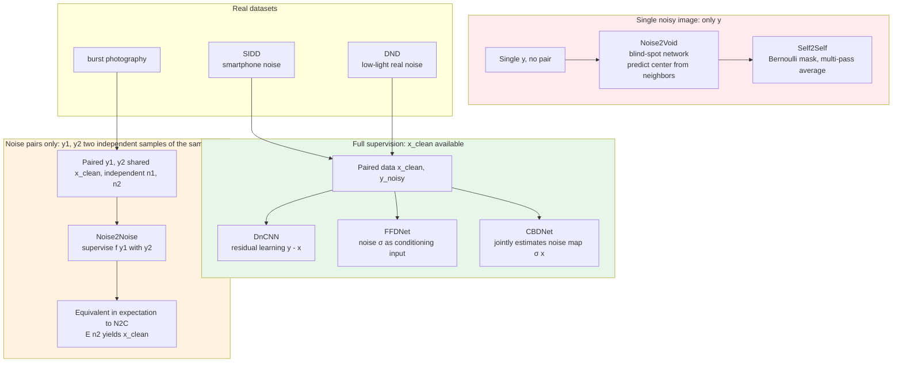

# Chapter 10 · Task-Specific Models

> General-purpose enhancement models (Real-ESRGAN, SUPIR) handle most scenarios. But there are several types of tasks where **general-purpose models do not work well** and a task-specific model is required.
>
> This chapter discusses what inductive biases face, document, and medical imaging each need, and how the corresponding models are designed.

## 10.0 Reading guide

Up to Chapter 9 the perspective of this book has consistently been "a class of general-purpose models that does its best on any natural image". From this chapter onward the perspective is reversed: **first acknowledge that a general-purpose model will inevitably fail on certain data distributions**, then discuss how to design models specifically for those distributions. The "prior" that kept recurring in the previous nine chapters is now refined further. It is no longer "the general prior of natural images" but "the prior of faces", "the prior of text", "the physical prior of medical imaging", "the physical meaning of multispectral channels", and so on. Each comes with its own set of engineering conventions, loss designs, and data organization.

Before reading this chapter we assume you are already familiar with:

- The degradation model and the blind / non-blind distinction in Chapter 1
- The perceptual loss, adversarial loss, and identity-preservation loss in Chapter 3
- The CNN / Transformer enhancement backbones in Chapters 6-7
- The diffusion fundamentals and ControlNet control ideas in Chapters 8-9

Abbreviations that will recur in this chapter:

- **GAN inversion** (Generative Adversarial Network Inversion): map a real image to a latent vector in a GAN's latent space so the GAN can "re-paint" it
- **StyleGAN** (Style-based GAN, the family of style-modulated high-quality generators since 2019): the most commonly used pretrained generative prior for faces
- **W / W+ space**: StyleGAN maps latent noise $z$ to an intermediate vector $w$; the $w$ injected at each layer can be tuned independently (together they form the W+ space), and enhancement methods typically perform inversion in W+
- **PULSE** (Photo Upsampling via Latent Space Exploration, CVPR 2020): an early representative of formulating super-resolution as latent-space search in StyleGAN
- **GFPGAN** (Generative Facial Prior GAN, Wang et al. 2021): uses a frozen StyleGAN2 generator as the prior plus an encoder + CS-SFT modulation
- **GPEN** (GAN Prior Embedded Network, Yang et al. 2021): embeds StyleGAN directly into a U-Net decoder; a contemporary alternative line to GFPGAN
- **CodeFormer** (Zhou et al. 2022): uses a discrete codebook learned by VQ-VAE as the face prior, with a Transformer predicting code sequences
- **VQ-VAE** (Vector-Quantized Variational Autoencoder): an autoencoder that discretizes the continuous latent into a finite codebook
- **RestoreFormer / RestoreFormer++** (Wang et al. 2022/2023): connect cross-attention directly to the codebook, dropping CodeFormer's multi-step prediction
- **ArcFace / FaceNet**: face-recognition networks that output identity embeddings, often used for identity-preservation losses
- **DnCNN** (Denoising CNN, Zhang et al. 2017): the seminal denoising deep-learning work, residual learning + Gaussian noise
- **N2N / Noise2Noise** (Lehtinen et al. 2018): use two independently sampled noisy images to supervise each other, with no clean image needed
- **N2V / Noise2Void** (Krull et al. 2019): drops the requirement of noise pairs as well, using a blind-spot network for self-supervised training on a single noisy image
- **FFDNet** (Fast and Flexible Denoising Network, Zhang et al. 2018): a tunable denoising network that takes the noise level as a conditioning input
- **CBDNet / VDN / NoiseFlow**: representative methods for modeling and denoising real-world noise
- **OCR** (Optical Character Recognition): the task of converting text images into character strings
- **CRNN** (Convolutional Recurrent Neural Network): an early mainstream OCR architecture, later iterated by SVTR, PARSeq, and others
- **PSF** (Point Spread Function): the imaging system's response to an ideal point source; determines the physical resolution upper bound in microscopy/astronomy
- **k-space**: the Fourier-domain representation of MRI data; scanning is actually sampling in k-space
- **Radon transform**: the mathematical transform corresponding to the CT projection geometry
- **HSI-SR** (Hyperspectral Image Super-Resolution): SR models specialized for multi-channel spectral images
- **NDVI** (Normalized Difference Vegetation Index): a typical band-ratio index in remote sensing
- **RefSR / RefIR** (Reference-based Super-Resolution / Image Restoration): models that take an additional high-quality reference image as input on top of LR
- **MASA-SR / C2-Matching / DATSR**: representative methods for RefSR

This chapter is organized **by task**, not by method. The same method (e.g. a discrete codebook, an unrolled network, cross-attention) will appear under different tasks. Please read it from the viewpoint of "picking tools for a task" rather than "finding tasks for a tool".

## 10.1 Why we need task-specific models

General-purpose SR performs well on natural images, but breaks down in the following scenarios:

- **Faces**: faces restored by general-purpose models often **change appearance** — eyes are the wrong size, the nose shape is altered, skin tone drifts
- **Text / documents**: a general-purpose model restores "日" as "目" — the structure is wrong by one stroke
- **Medical imaging**: a general-purpose model adds nonexistent "lesions" to X-ray/MRI — potentially an accident-grade error
- **Satellite remote sensing**: a general-purpose model treats multispectral channels as RGB, getting the spectral information completely wrong
- **Scientific microscopy**: a general-purpose model does not understand the physical imaging process and reconstructs non-physical structures

The common reason for general-purpose failure: **the prior they have learned is "the general distribution of natural images", not "the special distribution of this class of images"**.

In more technical terms: the general prior has thin probability density on any one of these classes. Real-ESRGAN's training set DF2K / OST contains only a small slice of faces, almost no text, and medical imaging and satellite imagery are completely out-of-distribution. When the input falls into these sub-distributions, the model can only "hard-guess" using the closest natural-image prior, producing the familiar failure modes: smoothing out faces, blurring characters, adding texture to X-rays, treating multispectral channels as RGB color.

The core of task specialization = injecting knowledge of this special distribution into the model:

- Face: identity preservation + facial geometric constraints + the face distribution learned by StyleGAN / VQ-codebook
- Document: character-level correctness + line/curve structure + supervision from OCR networks
- Medical: physical imaging model (Radon / k-space / scattering) + no "creating" allowed + hard data-consistency constraints
- Remote sensing: multi-channel spectral physics + large-scale ground feature structure + physical band-ratio constraints
- Microscopy: imaging theory (PSF, diffraction) + physical reconstruction + Poisson-noise-dominated fluorescence

This chapter is organized by task, with focus on **face** (the most mature, with the richest engineering practice), and an overview of the others. The complete relationship of the task-prior-loss-evaluation quadruple can be drawn as the following diagram:

```mermaid
graph TD
    Task[Task domain] --> Face[Face]
    Task --> Doc[Document/Text]
    Task --> Med[Medical imaging]
    Task --> Rs[Remote sensing/Multispectral]
    Task --> Micro[Microscopy]
    Face --> FPrior[StyleGAN W+<br/>VQ codebook]
    Face --> FLoss[L1 + perceptual + ArcFace id<br/>+ component GAN]
    Face --> FEval[Identity cos sim + subjective]
    Doc --> DPrior[Discrete character prior<br/>OCR networks]
    Doc --> DLoss[L1 + OCR-guided weighted]
    Doc --> DEval[OCR accuracy]
    Med --> MPrior[Unrolled + physical operator A]
    Med --> MLoss[Hard data consistency<br/>+ learned denoising]
    Med --> MEval[Radiologist blind review + lesion detection rate]
    Rs --> RPrior[Multi-channel architecture<br/>band physics]
    Rs --> RLoss[L1 + NDVI consistency]
    Rs --> REval[Downstream-task accuracy]
    Micro --> MicPrior[PSF + diffraction limit]
    Micro --> MicLoss[Poisson likelihood + physical reconstruction]
    Micro --> MicEval[Resolution gain + physical plausibility]

    style Task fill:#e3f2fd
    style Face fill:#fff3e0
```



The viewpoint of the book undergoes a subtle shift here: the first nine chapters asked "how should the model architecture / loss / sampler be put together"; this chapter asks "first state clearly the inductive bias of the task, then pick the architecture". The order matters. An architecture-first approach often leads engineers to swap backbones repeatedly for a new task, when in fact the quality ceiling is set by "we have not injected the right prior".

## 10.2 Face enhancement: the sub-field with the strongest priors and most models

Face enhancement is the **most deeply researched** sub-field of image enhancement, for three reasons:

1. **Abundant data**: FFHQ (70K), CelebA-HQ (30K), VFHQ are all high-quality large-scale datasets
2. **High application value**: old-photo restoration, video conferencing enhancement, video-call beautification — a huge market
3. **Low cost of failure (and high)**: low cost: getting it slightly wrong does not matter for entertainment apps; high cost: identity must not change (a small error means it is a different person)

There are three main types of inductive bias in face enhancement:

### Bias 1: faces have strong priors (learned by StyleGAN)

StyleGAN (2019) and StyleGAN2/3 have already learned the "distribution of faces" very well. Any high-quality face can be **inverted** (GAN inversion) into a W vector in StyleGAN's latent space.

GAN inversion can be understood as "given a fixed generator $G$, find a latent $w$ such that $G(w)$ is as close as possible to the target image $x$". Formally:

$$
w^* = \arg\min_w \| G(w) - x \|_{\text{perceptual}}^2 + \lambda \cdot \mathcal{R}(w)
$$

where $\mathcal{R}(w)$ is a latent-space regularizer that encourages $w$ to lie within the distribution of "natural $w$" (e.g. near StyleGAN's mean W vector). In the enhancement setting, the only difference is replacing the target $x$ with an approximation to the degraded image $y$ under some metric — for example, upsampling $y$ to HR size first and then computing perceptual loss — so the recovered $w^*$ "produces a high-resolution face that is consistent with $y$ at low frequencies".

Key insight:

> The face latent space is low-dimensional (the dimension of StyleGAN's W+ depends on the generation resolution: StyleGAN2 for 1024px FFHQ is 18×512 = 9216 dims; 512px is 14×512).
> A high-quality face = a point in this low-dimensional space.
>
> Enhancement = infer the most plausible W vector from the LR, then decode it back to HR with StyleGAN.

This is the core idea of models like **PULSE / GFPGAN / GPEN**. The difference between them is only in "how to infer $w$ from the LR": PULSE runs an iterative search at inference time (slow, no training needed), GFPGAN trains an encoder + modulation layers to produce it in a single forward pass (fast, needs training), and GPEN embeds StyleGAN into a U-Net decoder (more tightly coupled). All three are fundamentally searching for a point in the StyleGAN latent space.

### Bias 2: identity must be preserved

Face recognition models (ArcFace, FaceNet) have already learned "what determines a face's identity". The enhancement model must **leave the embedding seen by ArcFace unchanged**.

This is the identity preservation loss covered in Section 3.8 of Chapter 3:

```python
class IdentityLoss(nn.Module):
    """ArcFace identity preservation loss."""
    def __init__(self, arcface_path: str):
        super().__init__()
        self.arcface = load_arcface(arcface_path).eval()
        for p in self.arcface.parameters():
            p.requires_grad_(False)

    def forward(self, pred: torch.Tensor, target: torch.Tensor):
        # Inputs are aligned faces in the range [-1, 1], typically 112x112
        emb_pred   = self.arcface(pred)
        emb_target = self.arcface(target)
        return 1.0 - F.cosine_similarity(emb_pred, emb_target).mean()
```

### Bias 3: alignment matters

Faces have a standard geometric structure — eyes are horizontal, nose in the middle, mouth below. **Aligned faces** (face alignment) let the model achieve the same effect with a simpler network, because the model does not need to learn "where the facial features might be".

Engineering practice: face enhancement models almost always use a face detector + landmark detector to align the face into a fixed crop (typically 512×512), then paste it back into the original image after enhancement.

## 10.3 GFPGAN: StyleGAN prior + general backbone

Wang et al.'s GFPGAN (Generative Facial Prior GAN) of 2021 is a classic representative of face enhancement.

### Core architecture

```
LR Face (degraded)
  ↓ Encoder (similar to ESRGAN backbone)
  ↓ Extract multi-scale features F_1, F_2, ..., F_n
  ↓
  ↓ Modulate the StyleGAN2 generator in some way
  ↓
StyleGAN2 Generator (frozen, FFHQ pretrained)
  ↓
HR Face
```

Key points:

- **The StyleGAN2 generator is frozen and not trained** — it has already learned the face distribution
- **Training trains the encoder + some modulation layers** — they map LR information into the StyleGAN latent space and intermediate features

### CS-SFT (Channel-Split Spatial Feature Transform)

GFPGAN injects LR features at every layer of the StyleGAN generator, but not by direct concat — it uses an SFT (spatial feature transform):

$$
F' = F \odot (1 + \gamma) + \beta
$$

where $\gamma, \beta$ are spatial features predicted from the LR feature $F_{\text{LR}}$. This modulation lets LR information finely affect each spatial location without disrupting the StyleGAN's overall generation capability.

The "CS" (Channel-Split) of CS-SFT: splitting the StyleGAN feature in half along the channel dimension, modulating one half with SFT (accepting LR information) and keeping the other half as the original StyleGAN output (preserving the generative prior). This balances fidelity and quality.

### GFPGAN training loss

The classic combination:

$$
\mathcal{L} = \lambda_1 \mathcal{L}_1 + \lambda_2 \mathcal{L}_{\text{percep}} + \lambda_3 \mathcal{L}_{\text{adv}} + \lambda_4 \mathcal{L}_{\text{id}} + \lambda_5 \mathcal{L}_{\text{component}}
$$

where $\mathcal{L}_{\text{component}}$ is a "facial component local GAN loss" — separate discriminators are trained on eyes, nose, and mouth, forcing each local region to be realistic.

### GFPGAN performance and limitations

Effect: stunning on heavily degraded old photos, far surpassing general-purpose SR.

Limitations:

- **Depends on face alignment**: cannot be used unaligned
- **Depends on the FFHQ distribution**: quality drops on faces uncommon in FFHQ (e.g. elderly people, children, certain ethnicities)
- **Only handles faces**: must be paired with a general-purpose SR for the background

The engineering combination: **general-purpose SR (Real-ESRGAN) for background + GFPGAN for faces**. This was the standard pipeline for most old-photo restoration tools from 2022 to 2024.

## 10.4 CodeFormer: the advantage of discrete codebooks

Zhou et al.'s CodeFormer of 2022 takes a different approach — instead of relying on StyleGAN, it uses a **discrete codebook learned by VQ-VAE**.

### Core idea

Discretize the "local features" of a face into several codes in a codebook (e.g. 1024 codes). A high-quality face = some combination of these codes.

VQ-VAE training proceeds in two stages. In stage one, an autoencoder is trained on a high-quality face dataset (typically FFHQ) with a "quantization" step in the middle: the continuous feature map $\hat{z} \in \mathbb{R}^{h \times w \times d}$ output by the encoder is replaced with the closest discrete vector in the codebook $\{e_k\}_{k=1}^K$, then fed to the decoder to reconstruct the image. After training, each vector in the codebook corresponds to "some local patch pattern of faces". In stage two, the codebook and decoder are frozen, and a Transformer is trained to predict the **correct code-index sequence** from the LR-encoded token sequence. The full pipeline:

```mermaid
graph LR
    LR[LR face<br/>B,3,512,512] --> Enc[Encoder<br/>stacked conv downsampling]
    Enc --> Feat[Continuous features<br/>B,h,w,d]
    Feat --> Quant[Nearest-neighbor quantization<br/>Q z = arg min_k ||z - e_k||]
    Quant --> Idx[Discrete index sequence<br/>B, h*w integers]
    CB[VQ Codebook<br/>K=1024 vectors e_k<br/>learned on FFHQ]
    CB -.->|lookup| Quant
    Idx --> TX[Transformer<br/>correction prediction<br/>code-level]
    TX --> Idx2[Corrected indices]
    Idx2 --> Lookup[codebook lookup]
    CB -.->|lookup| Lookup
    Lookup --> Feat2[Corrected features]
    Feat2 --> Dec[Decoder<br/>symmetric upsampling]
    Dec --> HR[HR face<br/>B,3,512,512]
    Feat -. fidelity bypass w .-> Fuse[Weighted fusion]
    Feat2 -. quality main 1-w .-> Fuse
    Fuse --> Dec

    style LR fill:#ffebee
    style CB fill:#fff3e0
    style HR fill:#e8f5e9
```

The "fidelity bypass" in the diagram corresponds to CodeFormer's inference-time $w$ parameter: a larger $w$ leans toward the original encoder features (preserving LR pixel detail), and a smaller $w$ leans toward the Transformer-corrected codebook features (higher quality but more likely to change appearance).

Why is discretization useful?

- **Discretization = a strong prior**: the model can only generate features that have appeared in the codebook, so it does not fabricate meaningless local content. This is the essential advantage of a discrete structure over a continuous W+: any point $w$ in W+ produces some output, whereas only 1024 combinations are legal in the codebook
- **Transformers are naturally suited for predicting discrete sequences**: it is the same paradigm as next-token prediction in LLMs, and many mature sequence-modeling techniques apply directly
- **The "control strength" is tunable**: CodeFormer provides $w \in [0, 1]$ that lets users tune between "strictly respecting LR" and "fully exploiting the prior"

### Fidelity tuning of CodeFormer

An engineering highlight of CodeFormer is the `fidelity_weight` parameter. At inference:

```python
def codeformer_inference(model, lr_face, fidelity_weight=0.5):
    """
    fidelity_weight ∈ [0, 1]:
      0 -> fully use the codebook prior (high quality but may change appearance)
      1 -> strictly use LR information (low quality but faithful)
    """
    return model(lr_face, w=fidelity_weight)
```

Common engineering choices:

- Old-photo restoration (looking good is enough): $w = 0.3$
- Video-call beautification (must not change appearance): $w = 0.7$
- Legal evidence (absolute fidelity): do not use CodeFormer; use a discriminative model

### CodeFormer vs GFPGAN

| Dimension | GFPGAN | CodeFormer |
|------|--------|-----------|
| Source of prior | StyleGAN2 (continuous) | VQ codebook (discrete) |
| Inference speed | Fast | Slow (multi-step transformer) |
| Fidelity tunable | No (fixed) | Yes, tunable $w$ |
| For extreme degradation | Easily "changes face" | Discretization restricts changes |
| Engineering friendliness | Medium | **High** |

Since 2024 CodeFormer has become the more mainstream choice for face restoration, with engineering flexibility being the key reason.

## 10.5 RestoreFormer / RestoreFormer++

Wang et al.'s RestoreFormer (2022) directly connects LR features and the codebook with **cross-attention**, removing CodeFormer's multi-step prediction and being much faster.

RestoreFormer++ further optimizes it; it offers the best speed/quality balance for face restoration in 2023.

Code skeleton:

```python
class RestoreFormerBlock(nn.Module):
    """A simplified RestoreFormer block."""

    def __init__(self, dim: int, codebook_size: int, num_heads: int):
        super().__init__()
        self.codebook = nn.Embedding(codebook_size, dim)
        self.attn = nn.MultiheadAttention(dim, num_heads, batch_first=True)
        self.norm = nn.LayerNorm(dim)

    def forward(self, lr_features: torch.Tensor) -> torch.Tensor:
        """
        lr_features: (B, N, D) - feature sequence encoded from LR
        cross-attn to the entire codebook
        """
        codes = self.codebook.weight.unsqueeze(0).expand(
            lr_features.shape[0], -1, -1
        )  # (B, K, D)

        out, _ = self.attn(query=lr_features, key=codes, value=codes)
        return self.norm(out + lr_features)
```

## 10.6 A complete old-photo restoration pipeline

Combining the above face techniques to form a production-grade pipeline:

```python
def restore_old_photo(image_path: str, fidelity: float = 0.5):
    """Complete old-photo restoration pipeline."""

    img = load_image(image_path)

    # 1. General-purpose enhancement (background)
    bg_enhanced = real_esrgan.enhance(img, scale=4)

    # 2. Detect + align faces
    faces, landmarks = face_detector.detect(img)

    enhanced_faces = []
    for face_crop in extract_aligned_faces(img, landmarks):
        # 3. Face-specific restoration
        enhanced = codeformer.enhance(face_crop, fidelity_weight=fidelity)
        enhanced_faces.append(enhanced)

    # 4. Paste enhanced faces back into the background
    final = paste_faces_back(bg_enhanced, enhanced_faces, landmarks)

    return final
```

This is the simplified logic of commercial products like Topaz Photo AI, Tencent ARC, and Adobe.

## 10.7 Document and text enhancement

Document enhancement (preprocessing before OCR) has completely different inductive biases.

### The peculiarities of text

- **Discrete structure**: each character is from a finite set (around 5000 Chinese characters + Western characters)
- **Shapes are bilevel**: black strokes + white background
- **Topology preservation is the core**: restoring "日" as "目" is a structural error (an extra stroke), not a detail error

### Failure of general-purpose SR

What general-purpose SR has learned is "the statistical prior of natural images" — smoothness, texture, natural color. These are completely wrong for text:

- General-purpose SR **blurs strokes** → text becomes illegible
- General-purpose SR tries to add "natural texture" → fog appears at character edges
- General-purpose SR does not know stroke structure → errors of one extra/missing stroke

### Solution 1: DocSR / Text-SR

SR models trained specifically with text data. Key points:

- **Training data**: synthetic text images (with known characters) + real scanned-document pairs
- **Loss weighting**: increase the L1 weight in text regions to emphasize pixel-level correctness
- **Failure-mode-targeted training**: deliberately add "degradations that make text wrong" (strong JPEG, low resolution) in the synthetic data

### Solution 2: OCR guidance

Use an OCR model as an additional loss:

```python
class OCRGuidedLoss(nn.Module):
    """OCR-guided loss.
    The output goes through OCR, and locations with character recognition errors get
    increased pixel-loss weight.
    """
    def __init__(self, ocr_model):
        super().__init__()
        self.ocr = ocr_model.eval()

    def forward(self, pred, target):
        # Standard pixel loss
        pixel_loss = F.l1_loss(pred, target, reduction='none')

        # OCR results on pred
        with torch.no_grad():
            chars_pred   = self.ocr(pred)
            chars_target = self.ocr(target)

        # Add 5× weight at locations where the characters mismatch
        char_mask = (chars_pred != chars_target).float()
        char_mask = expand_to_pixel_mask(char_mask)  # (B, 1, H, W)
        weighted = pixel_loss * (1 + 5 * char_mask)

        return weighted.mean()
```

### Solution 3: Bilevel enhancement

Documents are mostly bilevel (black text on white background). One can learn a two-step pipeline of **binarize first, then SR**:

```
LR document
  ↓ Binarization (Otsu / U-Net)
  ↓ Bilevel SR (a specifically trained SR)
  ↓ Post-processing (anti-aliasing)
HR document
```

Engineering practice: commercial document enhancement products (ABBYY, Adobe Scan) use the above pipeline. In the open-source world, the DocSR family and the doc enhance of PaddleOCR follow similar lines.

## 10.7b Denoising: supervision granularity determines the method

Denoising was set up from the perspective of "the physical noise model" in Section 1.8 of Chapter 1; here we revisit it from the perspective of task specialization. Like SR and deblurring, it falls under the general framework $y = D(x) + n$, but it has a unique engineering problem: **a clean real image $x$ is essentially unobtainable**. SR can use HR images as ground truth, deblurring can use sharp images as ground truth, but the ground truth for denoising is "a noise-free image", which does not physically exist (every captured image has noise) and can only be approximated by long-exposure multi-frame averaging, low-ISO pairing, or synthesizing noise on top of clean data.

The level of supervision available directly determines what kind of model you can use. The diagram below classifies the denoising landscape by "what supervision is seen during training":



The three tiers relax constraints in sequence:

- **DnCNN (Zhang et al. 2017)** assumes a clean $x$ and trains $f_\theta(y) \approx y - x$ (residual learning instead of predicting $\hat{x}$ directly, because $y - x$ is close to zero-mean noise and easier to optimize). The loss is MSE. This route is nearly optimal on synthetic Gaussian noise, but performs poorly on real smartphone noise because the noise distribution seen at training is too narrow
- **FFDNet (Zhang et al. 2018)** adds one tweak to DnCNN: the noise level $\sigma$ is fed in as an extra noise-level-map channel. A single model handles noise levels $\sigma \in [0, 75]$, and at inference the user provides a $\sigma$ to dial in the strength. This is a textbook example of exposing "non-blind" information ($\sigma$ known) explicitly to the model
- **Noise2Noise (Lehtinen et al. 2018)** makes a counter-intuitive observation: if $y_2$ is used as the supervision for $y_1$ (two noisy images of the same scene independently sampled), minimizing $\mathbb{E}[\|f(y_1) - y_2\|^2]$ still has the optimal solution $\mathbb{E}[y \mid x_{\text{clean}}] = x_{\text{clean}}$. The reason is that $y_2 = x_{\text{clean}} + n_2$ with zero-mean $n_2$, and the optimal predictor under squared loss is the conditional mean. This means **no clean image is required** to train a denoiser
- **Noise2Void (Krull et al. 2019)** drops the dependence on pairs as well. It trains a "blind-spot network": when predicting the center pixel, the input has the center pixel masked out, and only neighboring pixels are used. If the noise is spatially independent, the best prediction for the center pixel is some interpolation from neighbors, whose expectation equals $x_{\text{clean}}$. The loss is MSE computed at the masked positions. This enables self-supervised training on a single noisy image
- **CBDNet (Guo et al. 2019)**, **VDN (Yue et al. 2019)** and similar lines fall under the real-noise modeling school: jointly learn a noise-estimation subnetwork and a denoising subnetwork so the model adapts to the local $\sigma$ per pixel

Engineering conclusions:

- **With real paired data like SIDD / DND** → use DnCNN / FFDNet / CBDNet directly
- **With burst captures only** → Noise2Noise
- **With a single noisy image (old photo)** → Noise2Void / Self2Self
- **Extreme low light (night sky, microscopy)** → must model Poisson noise; pure Gaussian MSE training will not work

A minimal DnCNN-style code skeleton:

```python
class DnCNN(nn.Module):
    """DnCNN: residual learning + 17 conv layers.
    Input: noisy image y
    Output: predicted noise ε̂; obtain denoised result via x̂ = y - ε̂
    """

    def __init__(self, in_ch: int = 3, depth: int = 17, width: int = 64):
        super().__init__()
        layers = [nn.Conv2d(in_ch, width, 3, padding=1), nn.ReLU(inplace=True)]
        for _ in range(depth - 2):
            layers += [
                nn.Conv2d(width, width, 3, padding=1, bias=False),
                nn.BatchNorm2d(width),
                nn.ReLU(inplace=True),
            ]
        layers += [nn.Conv2d(width, in_ch, 3, padding=1)]
        self.body = nn.Sequential(*layers)

    def forward(self, y: torch.Tensor) -> torch.Tensor:
        noise = self.body(y)
        return y - noise        # residual: y - ε̂ = x̂
```

```python
def train_n2n(model, paired_loader, optim, epochs):
    """Noise2Noise training: no clean image needed.
    paired_loader yields (y1, y2) — two independent noisy samples of the same scene.
    """
    for _ in range(epochs):
        for y1, y2 in paired_loader:
            pred = model(y1)
            loss = F.mse_loss(pred, y2)     # key: the supervision is another noisy image
            optim.zero_grad()
            loss.backward()
            optim.step()
```

This supervision hierarchy unpacks another dimension of task specialization: not every task can obtain ground truth, and how to train a useful model under scarce supervision is the central issue of the denoising school. Similar problems exist in other tasks (face, document, medical), but denoising is the sub-field where this question has been studied most deeply and systematically.

## 10.8 Medical image enhancement

Medical imaging (X-ray, CT, MRI, ultrasound) has the strictest constraints.

### Core constraint: **no unconstrained "fabrication"**

In medical diagnosis, "adding a nonexistent lesion" is an accident. Therefore:

- **Unconstrained generative restoration is not allowed** — pure GAN/diffusion priors will fabricate
- **Generative models can be used as a prior**, but **must be paired with strict data-consistency constraints** (at every step the estimate is forced to align with the actual measurement in the observed physical space) — the academic literature contains many works (e.g. score-based MRI reconstruction, diffusion + data consistency) of this kind
- **Discriminative models also need care** — even those trained with L1 may "smooth out" lesions
- **Physical constraints are required**: the imaging physics (the Radon transform of CT, k-space sampling of MRI) must be modeled

### Form of the physical constraint

Medical enhancement is usually a precise model of the inverse problem:

$$
y = A x + n
$$

where $A$ is a **known physical operator** (not a synthetic degradation):

- CT: Radon transform (projection to the sinogram domain)
- MRI: FFT + an undersampling mask
- Ultrasound: scattering + attenuation model

**Unrolled networks** can be used — unrolling traditional iterative algorithms (such as ADMM, conjugate gradient) into a neural network, where each step contains both a data-consistency term (forcing $\hat{x}$ to be consistent with $y$) and a learned prior term.

### A simplified unrolled network structure

```python
class UnrolledMRIRecon(nn.Module):
    """A simplified MRI reconstruction unrolled network.
    Each step: data-consistency projection + learned denoising.
    """

    def __init__(self, num_iter: int = 5):
        super().__init__()
        self.num_iter = num_iter
        self.denoisers = nn.ModuleList([UNet(in_ch=2, out_ch=2) for _ in range(num_iter)])

    def forward(self, y: torch.Tensor, mask: torch.Tensor) -> torch.Tensor:
        """
        y: (B, 2, H, W) under-sampled k-space (real, imag)
        mask: (B, 1, H, W) sampling mask (1=sampled)
        """
        # Initialize: zero-filled IFFT
        x = ifft2c(y * mask)

        for denoiser in self.denoisers:
            # 1. Denoise step (learned)
            x = denoiser(x)

            # 2. Data consistency step (hard constraint)
            x_kspace = fft2c(x)
            x_kspace = mask * y + (1 - mask) * x_kspace
            x = ifft2c(x_kspace)

        return x
```

The data-consistency step (`mask * y + (1 - mask) * x_kspace`) is the key — the model can only act freely at **un-sampled** k-space positions, while the sampled positions must strictly use the actual measurements. This guarantees from the engineering side that "observed signals are not fabricated".

### Engineering practice

- Do not directly transplant a general-purpose SR model into medical
- When a physical model is available, prefer unrolled networks
- A radiologist must participate in evaluation (cannot rely only on PSNR/SSIM)
- Failure-mode analysis matters more than average metrics

Medical AI is a separate large field; this book only touches on it. Going deeper requires consulting professional medical-imaging-processing textbooks.

## 10.9 Satellite remote sensing and multispectral

Satellite imagery has several special points:

- **Multispectral**: in addition to RGB, there are NIR, SWIR, thermal infrared and other channels (4-13 channels are common)
- **Large scale**: a single image can be more than 10000×10000 pixels
- **Physical meaning**: each pixel value has concrete physical meaning (reflectance, temperature) and cannot be changed arbitrarily
- **The application is analysis (not visual appeal)**: vegetation indices, water-body extraction, land-cover classification — these tasks demand high precision in pixel values

Failures of general-purpose SR in these scenarios:

- Treats multispectral as RGB → spectral information is wholly wrong
- "Beautifies" the output → physical meaning is altered
- Cannot handle large-scale images → must tile, but general-purpose models have boundary issues when tiled

Task-specific directions:

- **HSI-SR** (hyperspectral image super-resolution) specialized models
- **Physics-constrained losses**: ensure that certain band ratios (such as the NDVI vegetation index) remain unchanged
- **Tile + overlap blending** (Section 9.9 of Chapter 9)

## 10.10 Microscopy super-resolution

Microscopy imaging has a complete physical theory:

- **PSF (Point Spread Function)** determines the resolution upper bound
- **The diffraction limit** is a physical constraint
- **Fluorescence microscopy** has a unique noise model (photon noise dominated)

Mainstream methods:

- **Physical modeling + learned priors**: knowing the PSF, use a learned denoiser as post-processing
- **STORM/PALM-style algorithms + neural network acceleration**: super-resolution microscopy
- **Cycle GAN-style**: transfer from one type of microscopy image to another (without paired data)

General-purpose SR models do not apply at all — they have no notion of the diffraction limit.

## 10.11 Reference-based enhancement

Every task specialization so far has assumed **single-image input** (single-image / blind) — given only LR, lean on priors to fill in HR information. There is another paradigm widely used in industry but barely covered in Chinese-language academic material: **reference-based** (Ref-based) enhancement, abbreviated **RefSR / RefIR**.

### The paradigm

Input is LR plus one or more **reference images** ($\text{Ref}$):

$$
\hat{x} = f(y, \text{Ref})
$$

The reference is not the HR ground truth (that would be paired training); it's a **content-related but not identical** high-quality image:

- An HR shot of the same scene at a different time
- An HR shot of the same object from a different angle
- A clear photo of the same person from the user's gallery
- Another camera's HR frame from the same instant on a multi-camera phone

The model's job becomes: **find LR-corresponding patches in Ref and transfer Ref's textures**.

### Representative methods

- **MASA-SR** (CVPR 2021): cross-attention for patch matching between LR and Ref, robust to misalignment
- **C2-Matching** (CVPR 2021): split matching into coarse alignment + fine correspondence learning
- **DATSR** (ECCV 2022): deformable attention to handle geometric warps between Ref and LR
- **AccelIR / RefSR-Lite**: distilled mobile versions

The core module in all of them is **cross-attention between LR features and Ref features** — same family as the low-level-vision attention covered in Chapter 7, except Q comes from LR and K/V from Ref.

### Key engineering issues

Reference-based **does not mean "use Ref to supervise training"** — Ref must also be passed in **at inference time**. This causes a chain of engineering problems:

1. **Geometric alignment of Ref**: Ref and LR may differ in viewpoint, scale, lighting. The model must be robust to misalignment — the central research focus of MASA / DATSR.
2. **Fallback when Ref is missing**: what if the user provides no Ref? You need a single-image fallback (typical trick: during training, randomly use the LR's own upsampled version as a fake Ref).
3. **Ref selection**: which Ref to pick when multiple candidates exist? A common heuristic is top-k by CLIP image-embedding similarity.
4. **Ref-bias risk**: if the Ref is wrong (e.g., same name, different person), the model migrates the wrong textures — **and it crashes uglier than no-Ref at all**.

### Industrial scenarios

RefSR's actual product position is far more important than its paper presence suggests:

**Multi-camera phones**:

- Main + telephoto exposed simultaneously: the tele frame is high-res but narrow FOV; the main is wide FOV but lower-res in the center → use tele as Ref for the main's center region
- Main + macro: macro is high-res, can serve as a local-detail Ref for main
- iPhone Pro / Pixel Pro / Huawei / Xiaomi flagships' "telephoto enhancement" routes are all this pattern

**Smart photo libraries**:

- A user took 100 photos of the same person; some sharp, some blurry
- When restoring the blurry ones, **use the sharp ones of the same face as Ref**
- Google Photos / Tencent Albums' "person restoration" feature is built on this
- Note: this complements blind face restoration (CodeFormer) — CodeFormer uses a generic face prior; RefSR uses a prior **of this person**

**Burst photography**:

- 8 frames in rapid burst, each with different motion blur and noise
- Pick the sharpest few as Ref, align, fuse into the main frame
- Google HDR+ and Apple Deep Fusion are industrial implementations of this line (they don't call it RefSR, but the essence is identical)

**Inter-frame guidance for video**:

- When SR-ing a long video, **enhance keyframes (I-frames)** with a heavy model and **enhance P/B frames via RefSR** (with the keyframe as Ref)
- Inference cost goes from "heavy model per frame" to "heavy model per GOP + N RefSR runs"
- This pattern is useful in 4K live streaming / video conferencing enhancement

### Relationship to the blind paradigm

RefSR is not a third option beyond blind / non-blind — it's **multi-input blind**: $D$ is still unknown, but extra information (Ref) helps the model "guess" $x$. The extra signal is engineering gold:

| Paradigm | Inputs | Difficulty | Quality ceiling |
|----------|--------|------------|-----------------|
| Non-blind single-image | $y, D$ | Low | High (if $D$ is accurate) |
| Blind single-image | $y$ | High | Medium (depends on prior) |
| **Blind multi-image (RefSR)** | $y, \text{Ref}$ | Medium | **Higher** (Ref provides real textures) |

This is why phone manufacturers treat RefSR as a flagship feature — at the same compute budget, **the information from a Ref beats any single-image prior**.

### Should you use RefSR?

Engineering decisions:

- **If you can get a Ref, use it** — quality ceiling is clearly higher than single-image
- **Ref must be geometrically pre-aligned** (optical flow / SIFT / let cross-attention learn it)
- **Must have a single-image fallback** — never hard-depend on Ref
- **Detect Ref bias** — if CLIP similarity is too low, ignore the Ref and fall back to single-image

Academic benchmarks make RefSR look only marginally better than single-image (CUFED5 / WR-SR have weak Ref signals by construction), but **on real multi-camera phone scenarios the gap reaches 1–2 dB** — which is why industry has invested in this line for years.

### Papers and code

- MASA-SR: [github.com/dvlab-research/MASA-SR](https://github.com/dvlab-research/MASA-SR)
- C2-Matching: [github.com/yumingj/C2-Matching](https://github.com/yumingj/C2-Matching)
- DATSR: [github.com/caojiezhang/DATSR](https://github.com/caojiezhang/DATSR)

## 10.12 Task specialization in video enhancement (preview)

Video enhancement also has task-specific needs, which Chapters 13-14 will expand on:

- **Video conferencing face enhancement**: keep the speaker's face clear at low bandwidth
- **Live-stream video enhancement**: real-time (< 30ms/frame) + preserve brand color tone
- **Surveillance video enhancement**: identity preservation + no fabrication allowed (similar to forensic evidence)
- **Old-movie restoration**: film scratch removal + frame-rate up-conversion (with RIFE) + color restoration

These tasks each have their own inductive biases and constraints.

## 10.13 A methodology for designing task-specific models

If you want to design a task-specific model for a new task, follow this process:

### Step 1: identify the inductive bias of the task

Ask several questions:

- What **structural constraints** does this class of images have? (face: facial-feature positions; text: discrete strokes; medical: physical imaging)
- Which information **must absolutely not change**? (face: identity; text: characters; medical: lesions)
- Which information can be "created"? (face: high-frequency details such as wrinkle texture; text: cannot be created)

### Step 2: design prior injection

Encode the identified bias into the model:

- Discrete structure (text, CodeFormer) → codebook
- Strong semantic prior (face) → pretrained generator (StyleGAN)
- Physical process (medical) → unrolled network
- Multispectral physics → multi-channel architecture + spectral loss

### Step 3: design task-specific losses

The general-purpose enhancement losses (L1 + perceptual + adv) are not enough; add:

- **Identity preservation** (face)
- **OCR consistency** (text)
- **Data consistency** (medical)
- **Spectral consistency** (remote sensing)

### Step 4: design task-specific evaluation

General-purpose metrics (PSNR/LPIPS) may not reflect task quality:

- Face: identity similarity + subjective evaluation
- Text: OCR accuracy
- Medical: blind evaluation by radiologists + lesion-detection rate
- Remote sensing: downstream task accuracy (classification, segmentation)

### Step 5: failure-mode-targeted testing

General-purpose enhancement failure cases (covered in detail in Chapter 17) + task-specific failures:

- Face: extreme angles, occlusion, sunglasses, masks
- Text: handwriting, stamps, low contrast
- Medical: rare lesions, artifacts, motion blur

## 10.14 Summary

1. **General-purpose models will inevitably fail in certain domains** — face, text, medical, remote sensing, microscopy each have different inductive biases
2. **Face enhancement** is the most mature sub-field: StyleGAN prior + identity preservation + alignment
3. **GFPGAN** uses StyleGAN2 generator + CS-SFT modulation — a 2021 classic
4. **CodeFormer** uses a VQ codebook + Transformer — engineering-flexible with tunable fidelity
5. **Document enhancement** requires an OCR-guided loss + character-level correctness
6. **Medical enhancement** must use physical constraints + unrolled networks; **generative models cannot be used unconstrained**
7. **Remote sensing** requires multispectral physics + large-scale tiling
8. **Microscopy** must model the PSF + diffraction limit
9. **Design methodology**: identify bias → inject prior → specialized loss → specialized evaluation → failure-mode testing
10. **Task specialization is the enhancement direction with the largest marginal benefit** — general-purpose models can only reach 80 points, while specialized models can reach 99 points in their dedicated scenarios

This concludes all five chapters of Part II. Part III moves to the engineering details of training and evaluation — the previous chapters discussed "what to use", and the next two chapters discuss "how to train stably and how to evaluate accurately".

---

> Next chapter [Training stability](11-training.md) → engineering experience on GAN collapse, diffusion scheduling, and mixed loss weights.
