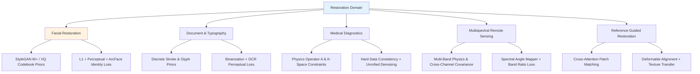
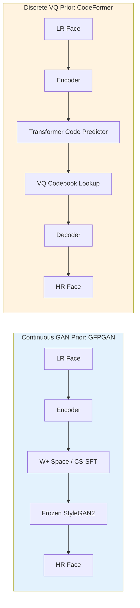
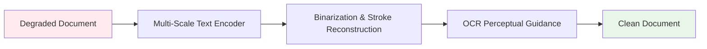
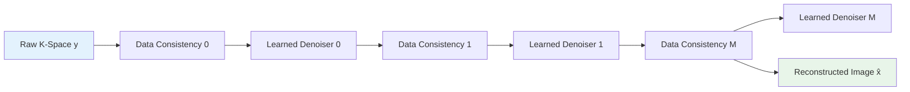
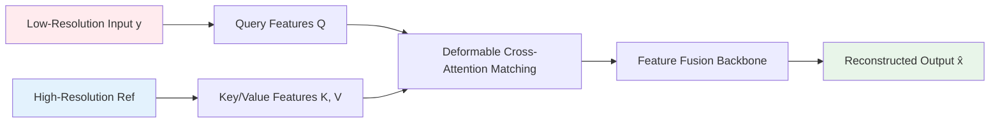
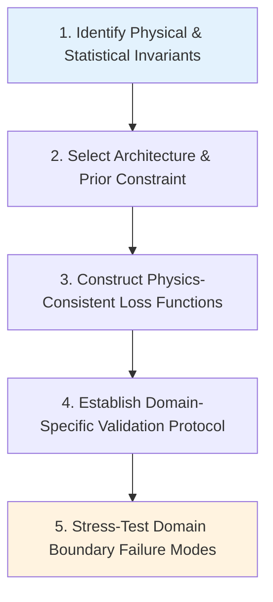

# Chapter 10 · Task-Specific Restoration Models

> General-purpose restoration backbones (such as Real-ESRGAN and SUPIR) excel across broad natural image distributions. However, specialized imaging domains exhibit distinct statistical properties and physical constraints where generic priors fail.
>
> This chapter examines the domain-specific inductive biases required for facial restoration, document binarization, clinical medical imaging, remote sensing, and reference-based super-resolution.

## 10.0 Reading Notes

While Chapters 6 through 9 treated restoration as learning a universal natural-image prior, this chapter shifts focus to domain-specialized constraints: facial geometry, discrete typography, physical tomography operators, and hyperspectral physics.

Key objectives:

- Understand facial prior paradigms: continuous latent inversion (StyleGAN / GFPGAN) versus discrete codebook quantization (CodeFormer / RestoreFormer).
- Analyze document and text restoration using OCR-guided perceptual losses and topological constraints.
- Implement physics-based inverse problem unrolling for medical imaging (MRI / CT) with hard data-consistency projections.
- Contrast single-image blind restoration with reference-guided super-resolution (RefSR) across multi-camera capture pipelines.

**Prerequisites.** Loss formulations from Chapter 3, CNN/Transformer backbones from Chapters 6-7, and conditioning frameworks from Chapter 9.

**Key Terminology Introduced in This Chapter:**

- **GAN Inversion**: The process of mapping an input image into the latent space ($\mathcal{W}$ or $\mathcal{W}^+$) of a pretrained generative adversarial network.
- **GFPGAN** (Generative Facial Prior GAN): Facial restoration framework (Wang et al., 2021) utilizing a frozen StyleGAN2 backbone modulated by Channel-Split Spatial Feature Transform (CS-SFT) layers.
- **CodeFormer**: Discrete facial prior framework (Zhou et al., 2022) formulating restoration as codebook sequence lookup over learned VQ-VAE representations.
- **Unrolled Network**: Neural architecture constructed by unrolling iterative optimization algorithms (e.g., ADMM or Primal-Dual) into alternating steps of learned denoising and physical data consistency.
- **Data-Consistency Projection**: An operator enforcing strict numerical alignment between the reconstructed image and acquired physical measurements (such as k-space trajectories or Radon sinograms).
- **RefSR** (Reference-based Super-Resolution): Restoration paradigm leveraging high-resolution reference imagery of the subject or scene to guide patch-level texture synthesis.



## 10.1 Domain Failure Modes of General-Purpose Models

General-purpose models trained on natural image datasets (e.g., DF2K, ImageNet) exhibit severe failure modes when applied to specialized domains:

- **Facial Degradation**: Generic models alter structural identity, shifting eye geometry, distorting facial symmetry, and smoothing out distinctive features.
- **Document Text**: Generic smooth regression merges discrete character strokes, corrupting typography (e.g., transmuting characters or missing strokes).
- **Medical Imaging**: Generative hallucination risks fabricating non-existent lesions or erasing micro-calcifications, compromising diagnostic validity.
- **Multispectral Remote Sensing**: Treating hyperspectral bands as standard RGB channels corrupts radiometric calibration and physical reflectance signatures.

Domain-specific restoration addresses these failure modes by encoding explicit structural, statistical, or physical priors into the architecture and loss objectives.

## 10.2 Facial Restoration Architectures

Facial imagery occupies a highly structured, low-dimensional manifold. Modern facial restoration frameworks exploit this property through two primary mechanisms: continuous GAN inversion and discrete codebook lookup.



### 1. Continuous GAN Inversion: GFPGAN

GFPGAN (Wang et al., 2021) leverages a pretrained, frozen StyleGAN2 generator as an implicit dictionary of facial textures. Spatial features extracted from degraded inputs modulate intermediate generator layers via Channel-Split Spatial Feature Transform (CS-SFT):

$$
F' = F \odot (1 + \gamma) + \beta
$$

Where modulation parameters $\gamma$ and $\beta$ are computed from degraded input features, while half the channels remain unaltered to preserve natural generative priors.

### 2. Discrete Codebook Priors: CodeFormer

CodeFormer (Zhou et al., 2022) replaces continuous latent spaces with a discrete VQ-VAE codebook $\mathcal{C} = \{e_k\}_{k=1}^K$. By restricting representation space to a finite set of learned code vectors, the model prevents out-of-distribution hallucinations under severe degradations:

```python
import torch
import torch.nn as nn
import torch.nn.functional as F

class DiscreteCodebookPrior(nn.Module):
    """Discrete vector quantization lookup for facial feature restoration."""
    def __init__(self, codebook_size: int = 1024, embedding_dim: int = 256):
        super().__init__()
        self.embedding = nn.Embedding(codebook_size, embedding_dim)
        self.embedding.weight.data.uniform_(-1.0 / codebook_size, 1.0 / codebook_size)

    def forward(self, continuous_latents: torch.Tensor) -> tuple:
        # continuous_latents: (B, C, H, W)
        B, C, H, W = continuous_latents.shape
        flat_latents = continuous_latents.permute(0, 2, 3, 1).contiguous().view(-1, C)

        # Compute Euclidean distance to codebook vectors
        distances = (
            torch.sum(flat_latents**2, dim=1, keepdim=True)
            + torch.sum(self.embedding.weight**2, dim=1)
            - 2 * torch.matmul(flat_latents, self.embedding.weight.t())
        )

        encoding_indices = torch.argmin(distances, dim=1).unsqueeze(1)
        quantized = self.embedding(encoding_indices.squeeze(1)).view(B, H, W, C).permute(0, 3, 1, 2)

        # Straight-Through Estimator (STE)
        quantized = continuous_latents + (quantized - continuous_latents).detach()
        return quantized, encoding_indices
```

CodeFormer introduces an adjustable fidelity parameter $w \in [0, 1]$ allowing runtime balancing between pristine codebook synthesis ($w=0$) and strict input adherence ($w=1$).

## 10.3 Identity-Preserving Facial Optimization

Facial enhancement objectives require specialized identity-preservation constraints based on deep facial recognition embeddings:

$$
\mathcal{L}_{\text{id}}(x, \hat{x}) = 1 - \frac{\phi_{\text{ArcFace}}(\hat{x}) \cdot \phi_{\text{ArcFace}}(x)}{\|\phi_{\text{ArcFace}}(\hat{x})\|_2 \|\phi_{\text{ArcFace}}(x)\|_2}
$$

```python
class ArcFaceIdentityLoss(nn.Module):
    """Computes cosine identity similarity loss via frozen ArcFace backbone."""
    def __init__(self, backbone: nn.Module):
        super().__init__()
        self.backbone = backbone.eval()
        for param in self.backbone.parameters():
            param.requires_grad = False

    def forward(self, pred_face: torch.Tensor, target_face: torch.Tensor) -> torch.Tensor:
        # Assumes inputs cropped and aligned to 112x112, normalized to [-1, 1]
        emb_pred = F.normalize(self.backbone(pred_face), p=2, dim=1)
        emb_target = F.normalize(self.backbone(target_face), p=2, dim=1)
        return (1.0 - torch.sum(emb_pred * emb_target, dim=1)).mean()
```

## 10.4 Document and Text Restoration

Document restoration emphasizes discrete stroke topology and character legibility rather than smooth natural textures.



### OCR-Guided Supervision

To prevent character confusion (such as converting '8' to 'B' or 'O' to '0'), document restoration networks incorporate OCR classification loss gradients into pixel training objectives:

```python
class OCRPerceptualLoss(nn.Module):
    """Enforces typographic accuracy using frozen OCR recognition networks."""
    def __init__(self, ocr_backbone: nn.Module):
        super().__init__()
        self.ocr = ocr_backbone.eval()
        for param in self.ocr.parameters():
            param.requires_grad = False

    def forward(self, pred_text_img: torch.Tensor, target_text_img: torch.Tensor) -> torch.Tensor:
        # Extract intermediate recognition features
        feat_pred = self.ocr.extract_features(pred_text_img)
        feat_target = self.ocr.extract_features(target_text_img)
        return F.l1_loss(feat_pred, feat_target)
```

## 10.5 Medical Image Reconstruction and Physics Unrolling

Medical imaging tasks (such as Accelerated MRI and Low-Dose CT) operate on well-defined physical acquisition models $y = \mathcal{A}(x) + \epsilon$, where operator $\mathcal{A}$ represents a known linear transform (Fourier undersampling or Radon projection).

### Unrolled Physics Networks

Rather than applying black-box regression, unrolled architectures map iterative optimization steps (such as ADMM or Proximal Gradient Descent) into neural layers, enforcing hard data consistency:



```python
class UnrolledMRIReconstruction(nn.Module):
    """Unrolled physics-informed MRI reconstruction with hard k-space projections."""
    def __init__(self, num_cascades: int = 6):
        super().__init__()
        self.cascades = nn.ModuleList([
            nn.Sequential(
                nn.Conv2d(2, 64, 3, padding=1),
                nn.ReLU(inplace=True),
                nn.Conv2d(64, 64, 3, padding=1),
                nn.ReLU(inplace=True),
                nn.Conv2d(64, 2, 3, padding=1)
            ) for _ in range(num_cascades)
        ])

    def forward(self, kspace_measured: torch.Tensor, mask: torch.Tensor) -> torch.Tensor:
        # kspace_measured: (B, 2, H, W), mask: (B, 1, H, W)
        x = torch.fft.ifft2(torch.complex(kspace_measured[:, 0], kspace_measured[:, 1]), dim=(-2, -1))
        x = torch.stack([x.real, x.imag], dim=1)

        for denoiser in self.cascades:
            # 1. Learned image-space regularization
            x_denoised = x + denoiser(x)

            # 2. Hard physical data consistency in Fourier domain
            k_pred = torch.fft.fft2(torch.complex(x_denoised[:, 0], x_denoised[:, 1]), dim=(-2, -1))
            k_pred = torch.stack([k_pred.real, k_pred.imag], dim=1)

            # Enforce exact measured values on acquired k-space lines
            k_corrected = mask * kspace_measured + (1.0 - mask) * k_pred

            x_complex = torch.fft.ifft2(torch.complex(k_corrected[:, 0], k_corrected[:, 1]), dim=(-2, -1))
            x = torch.stack([x_complex.real, x_complex.imag], dim=1)

        return torch.sqrt(x[:, 0]**2 + x[:, 1]**2)
```

## 10.6 Reference-Based Super-Resolution (RefSR)

In multi-camera systems (such as smartphone wide/telephoto configurations), an auxiliary high-resolution reference image ($\text{Ref}$) can be captured simultaneously to guide texture synthesis.



### Deformable Reference Matching

Because reference frames exhibit parallax, scale differences, and viewpoint offsets, modern RefSR models (such as MASA-SR and DATSR) employ deformable cross-attention to match non-rigid feature correspondences:

```python
class CrossScaleReferenceAttention(nn.Module):
    """Deformable cross-attention module matching reference textures to degraded inputs."""
    def __init__(self, channels: int = 64, num_heads: int = 4):
        super().__init__()
        self.num_heads = num_heads
        self.scale = (channels // num_heads) ** -0.5
        self.q_proj = nn.Conv2d(channels, channels, 1)
        self.k_proj = nn.Conv2d(channels, channels, 1)
        self.v_proj = nn.Conv2d(channels, channels, 1)
        self.out_proj = nn.Conv2d(channels, channels, 1)

    def forward(self, lr_feat: torch.Tensor, ref_feat: torch.Tensor) -> torch.Tensor:
        B, C, H, W = lr_feat.shape
        _, _, Hr, Wr = ref_feat.shape

        q = self.q_proj(lr_feat).view(B, self.num_heads, C // self.num_heads, H * W).permute(0, 1, 3, 2)
        k = self.k_proj(ref_feat).view(B, self.num_heads, C // self.num_heads, Hr * Wr)
        v = self.v_proj(ref_feat).view(B, self.num_heads, C // self.num_heads, Hr * Wr).permute(0, 1, 3, 2)

        # Correlation matching across spatial dimensions
        attn = torch.matmul(q, k) * self.scale
        attn = F.softmax(attn, dim=-1)

        transferred = torch.matmul(attn, v).permute(0, 1, 3, 2).contiguous().view(B, C, H, W)
        return self.out_proj(transferred) + lr_feat
```

## 10.7 Methodology for Developing Domain-Specific Models

When engineering restoration systems for specialized domains, apply the following systematic workflow:



1. **Identify Domain Invariants**: Determine non-negotiable structural constraints (facial landmarks, discrete character vocabularies, radiometric indices, or optical transfer functions).
2. **Select Prior Representation**: Encode constraints via continuous latent inversion (StyleGAN), discrete quantization (CodeFormer), or unrolled operators.
3. **Construct Specialized Losses**: Pair reconstruction objectives with identity cos-similarity, OCR recognition gradients, or k-space data consistency.
4. **Establish Domain Metrics**: Evaluate models using task-specific benchmarks (ArcFace identity similarity, Character Error Rate, Radiologist blinded scoring) rather than relying solely on PSNR.
5. **Stress-Test Edge Cases**: Evaluate robustness against severe domain perturbations (extreme head poses, heavily warped typography, rare clinical pathologies).

## 10.8 Chapter Summary

1. **The Necessity of Specialization**: Generic natural-image priors underperform in specialized domains, causing identity shifts in faces, stroke corruption in text, and non-physical hallucinations in medical scans.
2. **Continuous vs. Discrete Facial Priors**: While StyleGAN continuous inversion provides smooth photorealism, discrete VQ codebooks (CodeFormer) deliver superior robustness under extreme degradation.
3. **Typography and Topological Consistency**: Document restoration relies on OCR-guided perceptual objectives and discrete binarization to preserve character topology.
4. **Physical Inversion in Medical Diagnostics**: Clinical imaging mandates physics-informed unrolled networks with hard data-consistency projections to eliminate hallucination risks.
5. **Reference-Guided Super-Resolution**: Multi-camera mobile pipelines exploit high-resolution reference frames via deformable cross-attention, outperforming single-image blind baselines.

---

> Next: [Training Stability and Optimization Strategies](11-training.md) explores techniques for stabilizing multi-loss optimization, adversarial GAN convergence, and diffusion training schedules.
