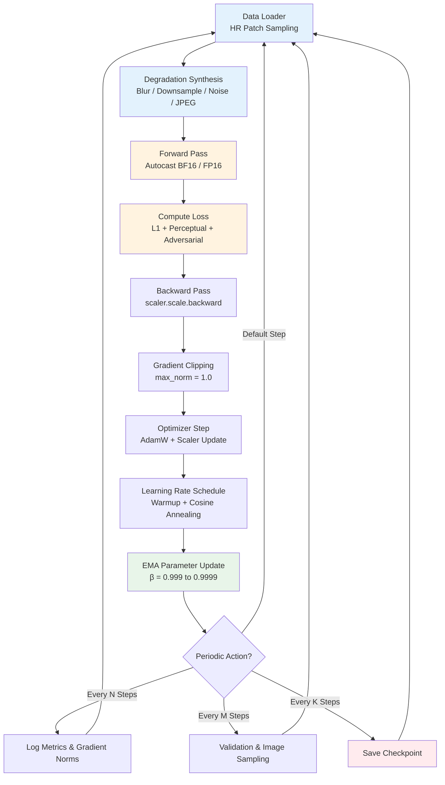
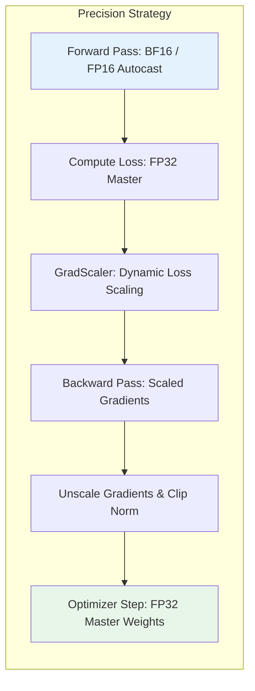
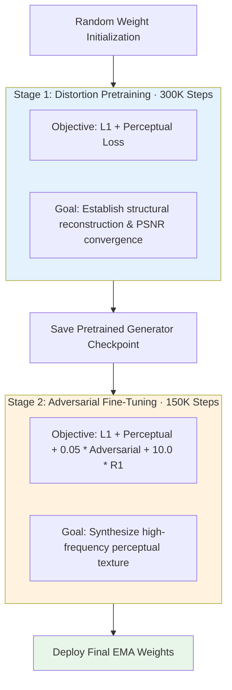

# Chapter 11 · Training Stability and Optimization Protocols

> While preceding chapters established loss landscapes, metrics, data synthesis pipelines, and model backbones, synthesizing these components into a robust training workflow presents substantial optimization challenges.
>
> Low-level vision training is inherently susceptible to instability: multi-loss gradient conflicts, adversarial GAN equilibrium failures, and diffusion scheduling sensitivities can degrade multi-day training runs into divergence or mode collapse.
>
> This chapter formalizes standard optimization protocols to ensure stable, reproducible training across deep restoration architectures.

## 11.0 Reading Notes

Restoration optimization diverges sharply from classification and language modeling: objectives are non-convex multi-term mixtures (L1, perceptual, adversarial, and frequency losses), inputs and outputs maintain spatial coordinate correspondence, and data synthesis pipelines introduce stochastic GPU overheads.

Key objectives:

- Master the training anatomy: linear warmup, cosine learning rate schedules, gradient clipping, and Exponential Moving Averages (EMA).
- Understand numerical precision trade-offs (FP16 vs. BF16 Automatic Mixed Precision) and memory scaling strategies (Gradient Accumulation, FSDP).
- Diagnose and stabilize adversarial GAN training using Two Time-Scale Update Rules (TTUR), Spectral Normalization, and $R_1$ gradient regularization.
- Execute two-stage optimization curricula (distortion pretraining followed by adversarial fine-tuning).
- Implement multi-loss balancing (GradNorm and phased loss weighting schedules).

**Prerequisites.** Loss function formulations from Chapter 3, degradation synthesis mechanics from Chapter 5, and CNN/Transformer/Diffusion architectures from Chapters 6-9.

**Key Terminology Introduced in This Chapter:**

- **AMP** (Automatic Mixed Precision): Training execution running forward and backward passes in reduced precision (FP16/BF16) while accumulating master weights in FP32.
- **EMA** (Exponential Moving Average): Continuous temporal smoothing of model parameters $\theta_{\text{EMA}} = \beta \theta_{\text{EMA}} + (1-\beta) \theta$, filtering out optimization oscillations.
- **GradAccum** (Gradient Accumulation): Iterative batch accumulation over $N$ micro-steps prior to calling the optimizer step, expanding effective batch size under memory constraints.
- **TTUR** (Two Time-Scale Update Rule): Decoupled optimization scheduling assigning distinct learning rates to the discriminator ($\eta_D$) and generator ($\eta_G$).
- **$R_1$ Regularization**: Zero-centered gradient penalty constraining the discriminator's gradient norm on real data distributions.
- **FSDP** (Fully Sharded Data Parallel): Zero-redundancy distributed data parallelism sharding parameters, gradients, and optimizer states across multiple GPU ranks.



## 11.1 The Fragility of Low-Level Vision Optimization

Unlike single-criterion cross-entropy classification, image enhancement optimization involves distinct failure vectors:

1. **Multi-Objective Gradient Interference**: Concurrently optimizing spatial fidelity ($\mathcal{L}_1$), perceptual features ($\mathcal{L}_{\text{VGG}}$), and adversarial realism ($\mathcal{L}_{\text{adv}}$) creates competing gradient vectors. Uncalibrated weights cause one term to dominate, either collapsing high-frequency synthesis or inducing severe structural distortion.
2. **Adversarial Non-Convergence**: GAN training represents a continuous minimax game $\min_G \max_D V(D, G)$. If discriminator capacity or learning rate outpaces the generator, vanishing gradients cause mode collapse or output degeneration.
3. **Diffusion Sampling Trajectory Drift**: Errors in time-step noise prediction compound across multi-step reverse sampling. Without exponential parameter averaging (EMA) and Min-SNR loss reweighting, diffusion training exhibits severe perceptual variance across checkpoints.

## 11.2 Optimization Configuration and Hyperparameter Baselines

### Optimizer Selection: AdamW Baseline

AdamW with decoupled weight decay is the standard baseline across low-level vision. Setting $\beta_2 = 0.99$ (rather than the default $0.999$) shortens the second-moment estimation window, allowing optimizer updates to adapt quickly to non-stationary multi-loss gradients:

```python
import torch
from torch.optim import AdamW

def build_restoration_optimizer(model: torch.nn.Module, lr: float = 2e-4) -> AdamW:
    """Builds calibrated AdamW optimizer for low-level vision architectures."""
    return AdamW(
        model.parameters(),
        lr=lr,
        betas=(0.9, 0.99),       # Responsive second-moment tracking
        weight_decay=1e-2,
        eps=1e-8
    )
```

### Empirical Learning Rate Reference Table

| Architectural Family | Base Learning Rate ($\eta$) | Schedule Type | Warmup Iterations | Recommended Batch Size |
|----------------------|-----------------------------|---------------|-------------------|------------------------|
| **CNN (EDSR / NAFNet)** | $2 \times 10^{-4}$ | Cosine Decay | $1{,}000$ Steps | $32\text{ to }64$ Patches |
| **Transformer (Restormer / HAT)** | $2 \times 10^{-4}$ | Cosine Annealing | $5{,}000$ Steps | $32\text{ to }64$ Patches |
| **Adversarial (Generator $G$)** | $1 \times 10^{-4}$ | Multi-Step / Cosine | None (Pretrained $G$) | $16\text{ to }32$ Patches |
| **Adversarial (Discriminator $D$)** | $4 \times 10^{-4}$ (TTUR) | Multi-Step / Cosine | None | $16\text{ to }32$ Patches |
| **Latent Diffusion (From Scratch)** | $1 \times 10^{-4}$ | Cosine Decay | $10{,}000$ Steps | $64\text{ to }256$ Latents |
| **ControlNet / Adapter Fine-Tuning** | $1 \times 10^{-5}$ to $5 \times 10^{-6}$ | Constant / Warmup | $1{,}000$ Steps | $16\text{ to }64$ Latents |

## 11.3 Learning Rate Scheduling and Warmup Protocols

Linear warmup prevents early optimization divergence in deep Transformer and diffusion backbones where random initialization produces large, erratic gradient norms:

```python
import torch.optim.lr_scheduler as sched

def build_cosine_warmup_scheduler(
    optimizer: torch.optim.Optimizer,
    warmup_steps: int,
    total_steps: int,
    min_lr_ratio: float = 0.01
) -> sched.SequentialLR:
    """Constructs linear warmup followed by cosine decay."""
    warmup = sched.LinearLR(optimizer, start_factor=1e-3, end_factor=1.0, total_iters=warmup_steps)
    cosine = sched.CosineAnnealingLR(
        optimizer,
        T_max=total_steps - warmup_steps,
        eta_min=optimizer.param_groups[0]['lr'] * min_lr_ratio
    )
    return sched.SequentialLR(optimizer, schedulers=[warmup, cosine], milestones=[warmup_steps])
```

## 11.4 Patch Sampling Dynamics and Spatial Receptive Fields

Low-level vision models are trained on cropped spatial patches rather than full-resolution frames to manage memory overhead, increase mini-batch diversity, and standardize batch shapes.

### Receptive Field Coupling

The training patch dimension $S_{\text{patch}}$ must comfortably exceed the network's effective receptive field $R_{\text{eff}}$:

$$
S_{\text{patch}} \ge 1.5 \cdot R_{\text{eff}}
$$

If $S_{\text{patch}} < R_{\text{eff}}$, boundary zero-padding artifacts dominate the spatial activations, preventing the network from learning long-range deconvolution or context aggregation.

```python
def extract_random_paired_patches(
    lr_img: torch.Tensor,
    hr_img: torch.Tensor,
    patch_size_hr: int = 256,
    scale: int = 4
) -> tuple:
    """Crops spatially aligned patch pairs from arbitrary resolution inputs."""
    patch_size_lr = patch_size_hr // scale
    _, _, H_lr, W_lr = lr_img.shape

    top_lr = torch.randint(0, H_lr - patch_size_lr + 1, (1,)).item()
    left_lr = torch.randint(0, W_lr - patch_size_lr + 1, (1,)).item()

    top_hr = top_lr * scale
    left_hr = left_lr * scale

    lr_patch = lr_img[:, :, top_lr:top_lr + patch_size_lr, left_lr:left_lr + patch_size_lr]
    hr_patch = hr_img[:, :, top_hr:top_hr + patch_size_hr, left_hr:left_hr + patch_size_hr]

    return lr_patch, hr_patch
```

## 11.5 Exponential Moving Average (EMA)

Parameter averaging acts as an online low-pass temporal filter over optimization trajectories:

$$
\theta_{\text{EMA}}^{(t)} = \beta \cdot \theta_{\text{EMA}}^{(t-1)} + (1 - \beta) \cdot \theta^{(t)}
$$

Where the effective averaging window corresponds to approximately $\frac{1}{1 - \beta}$ training steps. In diffusion models and adversarial fine-tuning, evaluating on EMA weights consistently lowers FID and eliminates high-frequency texture jitter:

```python
class ExponentialMovingAverage:
    """Maintains shadow parameters updated via exponential moving average."""
    def __init__(self, model: torch.nn.Module, decay: float = 0.9999):
        self.decay = decay
        self.shadow = {name: p.clone().detach() for name, p in model.named_parameters() if p.requires_grad}

    @torch.no_grad()
    def update(self, model: torch.nn.Module):
        for name, param in model.named_parameters():
            if param.requires_grad:
                self.shadow[name].mul_(self.decay).add_(param.detach(), alpha=1.0 - self.decay)

    def apply_shadow(self, model: torch.nn.Module):
        """Copies EMA shadow parameters into model for evaluation."""
        for name, param in model.named_parameters():
            if param.requires_grad:
                param.data.copy_(self.shadow[name])
```

## 11.6 Numerical Precision: FP16 vs. BF16 Automatic Mixed Precision



- **Bfloat16 (BF16)**: Features an 8-bit dynamic exponent matching FP32, eliminating underflow/overflow risks during multi-loss summation. **Recommended default for NVIDIA Ampere (A100), Hopper (H100), and Ada Lovelace architectures.**
- **Float16 (FP16)**: Limited 5-bit dynamic range requires dynamic gradient scaling (`torch.cuda.amp.GradScaler`) to prevent gradient underflow during adversarial and perceptual backpropagation.

## 11.7 Adversarial GAN Stabilization Protocols

Adversarial restoration models frequently experience discriminator domination, mode collapse, or gradient explosion. Modern stabilization relies on three complementary techniques:

### 1. Two Time-Scale Update Rule (TTUR)

Setting $\eta_D \approx 4 \cdot \eta_G$ ensures the discriminator tracks optimal decision boundaries without forcing the generator into unstable high-magnitude updates.

### 2. Spectral Normalization

Constraining the Lipschitz constant of discriminator convolutional layers ($\|D\|_{\text{Lip}} \le 1$) prevents gradient explosion along decision boundaries:

```python
from torch.nn.utils import spectral_norm

def build_lipschitz_discriminator(in_channels: int = 3) -> torch.nn.Module:
    """Constructs PatchGAN discriminator with Spectral Normalization."""
    return torch.nn.Sequential(
        spectral_norm(torch.nn.Conv2d(in_channels, 64, 4, stride=2, padding=1)),
        torch.nn.LeakyReLU(0.2, inplace=True),
        spectral_norm(torch.nn.Conv2d(64, 128, 4, stride=2, padding=1)),
        torch.nn.LeakyReLU(0.2, inplace=True),
        spectral_norm(torch.nn.Conv2d(128, 256, 4, stride=2, padding=1)),
        torch.nn.LeakyReLU(0.2, inplace=True),
        spectral_norm(torch.nn.Conv2d(256, 1, 4, stride=1, padding=1))
    )
```

### 3. $R_1$ Gradient Regularization

Penalizing the gradient norm of the discriminator on ground-truth samples stabilizes game dynamics around the true data manifold:

$$
\mathcal{L}_{R_1}(D) = \frac{\gamma}{2} \mathbb{E}_{x \sim p_{\text{data}}} \left[ \|\nabla_x D(x)\|_2^2 \right]
$$

```python
def compute_r1_gradient_penalty(d_real: torch.Tensor, real_images: torch.Tensor) -> torch.Tensor:
    """Computes zero-centered R1 gradient penalty on ground-truth images."""
    grad_real = torch.autograd.grad(
        outputs=d_real.sum(),
        inputs=real_images,
        create_graph=True,
        retain_graph=True,
        only_inputs=True
    )[0]
    return 0.5 * grad_real.flatten(1).pow(2).sum(dim=1).mean()
```

## 11.8 Two-Stage Optimization Curriculum

Restoration models should not be trained with adversarial losses from random initialization. Standard engineering best practice follows a two-stage curriculum:



1. **Stage 1 (Distortion Pretraining)**: Train generator $G$ using exclusively pixel and perceptual objectives ($\mathcal{L}_1 + \lambda_{\text{percep}} \mathcal{L}_{\text{percep}}$) until PSNR converges. This ensures the model masters structural inversion.
2. **Stage 2 (Adversarial Fine-Tuning)**: Lower the generator learning rate by $50\%$, initialize the discriminator, and introduce adversarial loss with conservative weighting ($\lambda_{\text{adv}} \in [0.01, 0.05]$) alongside $R_1$ regularization ($\gamma = 10.0$).

## 11.9 Systematic Failure Diagnosis Matrix

| Observed Symptom | Primary Root Cause | Diagnostic Verification | Remediation Protocol |
|------------------|--------------------|-------------------------|----------------------|
| **Loss becomes NaN / Inf** | Gradient explosion or FP16 underflow | Inspect `grad_norm` logs; verify dataset for corrupted inputs | Switch to BF16; clamp gradients (`max_norm=1.0`); reduce base learning rate |
| **Loss Plateau (Zero Descent)** | Sub-optimal learning rate or normalization mismatch | Train on a single 8-image batch to verify capacity | Confirm input scaling ($[0, 1]$ vs. $[-1, 1]$); adjust warmup schedule |
| **Validation Drift (Train Drops, Val Stalls)** | Overfitting to synthetic degradation distribution | Evaluate across out-of-distribution real test crops | Expand degradation parameter ranges (Chapter 5); apply random horizontal flips |
| **Discriminator Loss Collapses to Zero** | Discriminator overpowering generator ($D \gg G$) | Plot $D_{\text{loss}}$ and $G_{\text{loss}}$ trajectories | Apply TTUR ($\eta_D / \eta_G = 4$); introduce Spectral Normalization; increase $R_1$ weight $\gamma$ |
| **Severe High-Frequency Checkerboard Noise** | Deconvolution stride overlap or adversarial instability | Inspect intermediate sub-pixel convolution activations | Replace Transposed Conv with PixelShuffle + ICNR initialization; lower $\lambda_{\text{adv}}$ |

## 11.10 Complete Production Training Step

```python
import torch
import torch.nn.functional as F

def execute_restoration_training_step(
    generator: torch.nn.Module,
    discriminator: torch.nn.Module,
    vgg_perceptual: torch.nn.Module,
    optimizer_g: torch.optim.Optimizer,
    optimizer_d: torch.optim.Optimizer,
    ema: ExponentialMovingAverage,
    lr_patches: torch.Tensor,
    hr_patches: torch.Tensor,
    r1_gamma: float = 10.0,
    adv_weight: float = 0.05
) -> dict:
    """Executes single stable training iteration for Stage-2 adversarial restoration."""
    hr_patches.requires_grad_(True)

    # -------------------------------------------------------------
    # 1. Update Discriminator D
    # -------------------------------------------------------------
    optimizer_d.zero_grad()
    with torch.cuda.amp.autocast(dtype=torch.bfloat16):
        with torch.no_grad():
            fake_hr = generator(lr_patches)
        d_real = discriminator(hr_patches)
        d_fake = discriminator(fake_hr.detach())

        # Relativistic Average GAN Loss (RaGAN)
        loss_d_real = F.binary_cross_entropy_with_logits(d_real - d_fake.mean(), torch.ones_like(d_real))
        loss_d_fake = F.binary_cross_entropy_with_logits(d_fake - d_real.mean(), torch.zeros_like(d_fake))
        loss_d_main = 0.5 * (loss_d_real + loss_d_fake)

    # Compute R1 gradient penalty in full precision
    r1_loss = compute_r1_gradient_penalty(d_real, hr_patches)
    loss_d_total = loss_d_main + (r1_gamma * 0.5) * r1_loss

    loss_d_total.backward()
    torch.nn.utils.clip_grad_norm_(discriminator.parameters(), max_norm=1.0)
    optimizer_d.step()

    # -------------------------------------------------------------
    # 2. Update Generator G
    # -------------------------------------------------------------
    optimizer_g.zero_grad()
    hr_patches.requires_grad_(False)

    with torch.cuda.amp.autocast(dtype=torch.bfloat16):
        fake_hr = generator(lr_patches)
        d_real = discriminator(hr_patches)
        d_fake = discriminator(fake_hr)

        l1_loss = F.l1_loss(fake_hr, hr_patches)
        percep_loss = vgg_perceptual(fake_hr, hr_patches)
        adv_g_loss = F.binary_cross_entropy_with_logits(d_fake - d_real.mean(), torch.ones_like(d_fake))

        loss_g_total = l1_loss + 1.0 * percep_loss + adv_weight * adv_g_loss

    loss_g_total.backward()
    torch.nn.utils.clip_grad_norm_(generator.parameters(), max_norm=1.0)
    optimizer_g.step()

    # 3. Update EMA shadow parameters
    ema.update(generator)

    return {
        'loss_g': loss_g_total.item(),
        'loss_d': loss_d_total.item(),
        'l1': l1_loss.item(),
        'percep': percep_loss.item(),
        'adv': adv_g_loss.item()
    }
```

## 11.11 Chapter Summary

1. **Optimization Architecture**: Modern restoration relies on AdamW with responsive tracking ($\beta_2 = 0.99$), linear warmup curricula, and gradient norm clipping.
2. **Exponential Parameter Smoothing**: EMA shadow parameter maintenance ($\beta \ge 0.9999$) is essential for stabilizing diffusion and GAN evaluation trajectories.
3. **Adversarial Equilibrium Triad**: Stabilizing GAN restoration requires combining Two Time-Scale Update Rules (TTUR), Spectral Normalization, and $R_1$ zero-centered gradient regularization.
4. **Two-Stage Curricula**: Pretraining generators on distortion objectives before introducing adversarial supervision prevents early structural divergence.
5. **Precision Standards**: BF16 Automatic Mixed Precision provides optimal numerical stability across multi-loss restoration pipelines on modern hardware.

---

> Next: [Evaluation Methodology and Benchmarking](12-evaluation.md) examines quantitative assessment protocols, subjective testing standards (2AFC / MOS), and statistical significance analysis.
