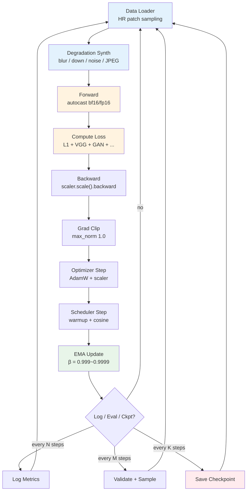
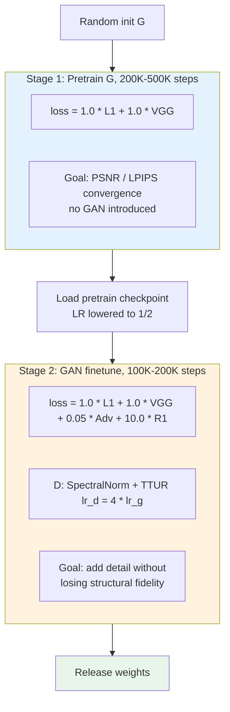
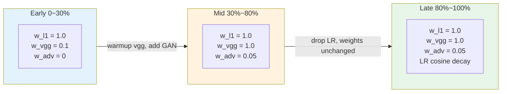

# Chapter 11 · Training Stability

> The first 10 chapters covered "which model, which loss, which data."
>
> This chapter is about "putting them together to train, and how to train stably."
>
> Training enhancement models is more fragile than training classifiers or language models: multi-loss conflicts, GAN dynamics, diffusion schedules — any one of them can leave you with three days of training and a collapsed model.

## 11.0 Reading guide

This chapter sits in the engineering position downstream of all previous chapters. Chapters 1-2 gave the problem definition, Chapter 3 the losses, Chapter 4 the metrics, Chapter 5 the data, and Chapters 6-10 the models and architectural choices. Stitching them into a training script that runs is not hard — what is hard is **getting it to run for days or weeks without collapsing**, and finishing with a model that is genuinely better than the last version. This chapter answers the "engineering-actually-runs" question.

We assume the reader can write a routine PyTorch training loop (forward / backward / optimizer step / dataloader) but **does not necessarily have specialized experience with low-level vision training**. Low-level vision training differs significantly from classification or language model training in four respects, each of which is unpacked in later sections:

- Input and output are paired in size: you train an image-to-image mapping, not image-to-scalar
- The loss function is almost never single; it is a weighted sum of 3-5 terms, and imbalanced weights cause the model to optimize only one of them
- When GAN or diffusion scheduling is involved, the training dynamics are an adversarial game or a long-horizon timestep sampling, an order of magnitude harder than optimizing a single objective
- The data pipeline usually performs degradation synthesis on the GPU (see Chapter 5), and a sampling bug can make the model "appear to learn" while actually learning the synthesis bug

**Abbreviations introduced here.** For convenience in later sections, the abbreviations used in this chapter are listed up front:

- **AMP** (Automatic Mixed Precision): a training paradigm that runs forward and backward in FP16/BF16 while keeping the weights and gradient accumulation in FP32
- **EMA** (Exponential Moving Average): maintain a running average of the weights alongside the training weights, and use the EMA weights at inference time
- **GradAccum** (Gradient Accumulation): accumulate gradients across several mini-batches before taking one optimizer step, equivalent to enlarging the batch size
- **TTUR** (Two Time-scale Update Rule): in GAN training, assign different learning rates to the discriminator and the generator
- **R1**: a GAN regularizer that penalizes the L2 norm of the discriminator's gradient on real samples
- **FSDP** (Fully Sharded Data Parallel): a distributed training paradigm that shards model parameters, gradients, and optimizer states across ranks
- **BPTT** (Backpropagation Through Time): training method for recurrent structures, which unrolls the full sequence before backpropagating
- **OOM** (Out Of Memory): the GPU runs out of memory and crashes
- **PSNR / LPIPS / FID**: defined in Chapter 4, used directly here

After reading this chapter you should be able to answer: given a new low-level vision architecture, roughly how do I assemble the training loop; when a symptom appears mid-training, where do I start investigating; what are the standard tricks when a GAN refuses to train; should I use different hyperparameters for training a diffusion model from scratch vs finetuning; do I really need to enable EMA and AMP.

## 11.1 Why training stability is a big deal

Training a language model usually has a single cross-entropy loss, and the training dynamics are relatively simple: with the right model scale, data volume, and learning rate, the loss decreases stably. Enhancement models in low-level vision are entirely different:

- **Multi-loss mixtures**: L1 + VGG + GAN + task-specific losses are optimized jointly; an imbalance in any one weight tilts the model toward one specific notion of "good" — the result is either high PSNR but visually blurry, or visually sharp but PSNR collapsing
- **GAN training**: the discriminator D and the generator G are in a dynamic game; if either side becomes too strong, training collapses. This is the same mechanism as GAN collapse in image generation, with the only difference being that G here is conditioned on input
- **Diffusion training**: timestep sampling strategy, loss weighting (e.g. Min-SNR), and EMA are all required; missing any one of them costs several FID points
- **Complex data pipeline**: degradation synthesis (Chapter 5) is usually done on the GPU and contains a dozen-plus random parameters; any misspecified distribution does not immediately manifest as a crash but as "the model performs poorly on real images" — by the time you notice, you have already trained for days

This chapter consolidates the engineering pitfalls into an actionable checklist. The way to read it is not cover-to-cover but as a reference: when assembling training, lay the skeleton from 11.2; when tuning hyperparameters, consult 11.3-11.8; when symptoms appear, consult the diagnosis table in 11.15.

## 11.2 Training anatomy: basic components

The training loop of an enhancement model contains:

```python
# Abstract skeleton
optimizer = build_optimizer(model)
scheduler = build_scheduler(optimizer)
scaler = torch.cuda.amp.GradScaler()                # AMP
ema = EMA(model, decay=0.999)                       # exponential moving average

for step, batch in enumerate(train_loader):
    # 1. Warmup
    if step < warmup_steps:
        adjust_lr_for_warmup(optimizer, step, warmup_steps)

    # 2. Forward (with AMP)
    with torch.cuda.amp.autocast():
        loss = compute_loss(model, batch)

    # 3. Backward
    scaler.scale(loss).backward()

    # 4. Gradient clipping
    scaler.unscale_(optimizer)
    torch.nn.utils.clip_grad_norm_(model.parameters(), max_norm=1.0)

    # 5. Optimizer step
    scaler.step(optimizer)
    scaler.update()
    optimizer.zero_grad()

    # 6. Learning rate schedule
    scheduler.step()

    # 7. EMA update
    ema.update(model)

    # 8. Monitoring
    if step % log_interval == 0:
        log_metrics(...)
    if step % eval_interval == 0:
        evaluate(...)
    if step % save_interval == 0:
        save_checkpoint(...)
```

Drawing these eight steps as a data-flow diagram makes the dependencies between components clearer. The figure below is also the "big picture" each subsequent section drills into — each section is just the detail decisions of one of these steps:



Two engineering details recur often when reading this figure. First, **degradation synthesis (B) on the GPU vs in the dataloader (A) on the CPU is a deliberate engineering trade-off**. CPU synthesis is simple and parallelizes across worker processes, but PCIe bandwidth easily becomes the bottleneck. GPU synthesis saves transfer and lets the degradation function be differentiable, but consumes model training compute and requires careful memory planning. Real-ESRGAN's official implementation chose GPU synthesis. Second, **the EMA update (I) must come after the optimizer step**, and the EMA weights do not participate in the training gradient — they are only read during validation and when saving checkpoints.

Each item is unpacked below.

## 11.3 Optimizer choice

| Optimizer | When to use |
|-------|------|
| **Adam** | Classic choice, stable |
| **AdamW** | Adds decoupled weight decay, **default recommendation** |
| **Lion** | New optimizer from 2023, saves memory (only needs momentum), close to AdamW |
| **Adafactor** | Saves memory on large models (no second moment) |
| **SGD + momentum** | Not recommended for enhancement (slow convergence, sensitive hyperparameters) |

**Starting configuration** (general for enhancement tasks):

```python
optimizer = torch.optim.AdamW(
    model.parameters(),
    lr=2e-4,                      # SR/denoising empirical value
    betas=(0.9, 0.99),            # 0.99 instead of 0.999, more stable
    weight_decay=0.01,
    eps=1e-8,
)
```

Learning rate empirics:

- **CNN (EDSR/NAFNet)**: $2 \times 10^{-4}$
- **Transformer (SwinIR/Restormer)**: $2 \times 10^{-4}$, warmup mandatory
- **GAN finetune**: $10^{-4}$ for G, $10^{-4} \times 4 = 4 \times 10^{-4}$ for D (TTUR, see Section 11.10)
- **Diffusion from scratch**: $10^{-4}$
- **Diffusion finetune**: $10^{-5}$ to $5 \times 10^{-6}$
- **ControlNet training**: $10^{-5}$

These numbers are not pulled out of the air. They are "consensus values" converged on by many SOTA papers and open-source codebases. The implicit assumption is batch size between 16-32, training steps between 200K-1M, AdamW + cosine. When you change batch size or schedule, you need to adjust per the scaling rules in Section 11.5.

The choice of `betas=(0.9, 0.99)` deserves a comment. The default $\beta_2 = 0.999$ in vanilla Adam gives the second-moment estimator a very long window, which suits single-peak objectives (like classification) but is too long for low-level vision: the loss landscape is rugged (the GAN and perceptual terms act together), and a long window makes Adam's step updates lag behind the true gradient, showing up as inexplicable small spikes in late training. Lowering $\beta_2$ to $0.99$ lets the second moment respond faster, and this is the empirical practice in the field.

## 11.4 Learning rate schedule

### Linear Warmup

In the early phase, LR ramps linearly from 0 to the target value. **Mandatory** for Transformer and diffusion training—without it the first few steps may diverge directly.

```python
def linear_warmup(step: int, warmup_steps: int, target_lr: float) -> float:
    if step >= warmup_steps:
        return target_lr
    return target_lr * (step + 1) / warmup_steps
```

Empirical values for warmup_steps:

- **1-5%** of total training steps
- Large models (diffusion): 5000-10000 steps
- Small models (CNN SR): 500-1000 steps

### Cosine Decay

After warmup, use cosine to bring LR down to the final value (typically 1-10% of the LR):

$$
\eta_t = \eta_{\min} + \frac{1}{2} (\eta_{\max} - \eta_{\min}) \left( 1 + \cos\left( \frac{t}{T} \pi \right) \right)
$$

```python
import torch.optim.lr_scheduler as sched

# Warmup + cosine
scheduler = sched.SequentialLR(
    optimizer,
    schedulers=[
        sched.LinearLR(optimizer, start_factor=0.001, end_factor=1.0,
                       total_iters=warmup_steps),
        sched.CosineAnnealingLR(optimizer, T_max=total_steps - warmup_steps,
                                eta_min=target_lr * 0.01),
    ],
    milestones=[warmup_steps],
)
```

### Multi-step decay (used by classic SR)

ESRGAN/Real-ESRGAN use stepwise decay:

```python
scheduler = sched.MultiStepLR(
    optimizer,
    milestones=[200_000, 400_000, 600_000, 800_000],   # train for 1M steps
    gamma=0.5,                                          # LR×0.5 each time
)
```

### Cosine Restart

In the late phase, periodically "restart" LR to a high value to escape local optima:

```python
scheduler = sched.CosineAnnealingWarmRestarts(
    optimizer, T_0=100_000, T_mult=1, eta_min=1e-6
)
```

Engineering experience: cosine restart is especially recommended for diffusion training—it keeps gaining points over long training runs.

## 11.5 Batch Size and Patch Size

A peculiarity of low-level vision training: **almost never train on whole images**, use patches (image crops). This section unpacks the engineering concepts around patch training.

### Basic flow of patch sampling

- Pick a random position in the original HR (high-resolution) image and crop a fixed-size patch (typically $256 \times 256$ or $128 \times 128$)
- Run the degradation synthesis pipeline from Chapter 5 to turn this HR patch into a corresponding LR patch
- Stack several such patches into a batch and feed them to the model

In code this looks roughly like:

```python
class PatchSampler:
    def __init__(self, hr_size: int = 256, scale: int = 4):
        self.hr_size = hr_size
        self.lr_size = hr_size // scale

    def __call__(self, hr_image: torch.Tensor) -> tuple[torch.Tensor, torch.Tensor]:
        H, W = hr_image.shape[-2:]
        # random top-left corner
        top  = random.randint(0, H - self.hr_size)
        left = random.randint(0, W - self.hr_size)
        hr_patch = hr_image[..., top:top+self.hr_size, left:left+self.hr_size]
        # degradation synthesis is invoked here
        lr_patch = self.degrade(hr_patch)
        return lr_patch, hr_patch
```

### Why not train directly on whole images

The main reasons are memory and efficiency:

- **Memory**: a single $2048 \times 2048$ three-channel FP32 image is 50MB; multiplied by batch and intermediate activations, a single card cannot hold it
- **Data augmentation**: cropping itself is implicit data augmentation; each epoch "sees" different parts of the image
- **Training efficiency**: for the same GPU time, patch training sees more scene diversity
- **Uniform sizes within a batch**: original images vary in size, and patching makes the batch dimension stackable

### Coupling of patch size with receptive field

Patch size is not "bigger is better"; it has a **natural coupling with the model's receptive field**. If the model's effective receptive field is $R \times R$, the patch size should be at least $\geq R$, otherwise the model has insufficient information near the patch boundaries and the training cannot pick up gradients there. A common rule of thumb is the following table:

| Task | Recommended HR patch size | Reason |
|------|-----------------|------|
| 4× SR | 256 | LR=64, enough compute |
| 8× SR | 384 | LR=48, more spatial context needed |
| Denoising | 128-192 | Local texture is enough |
| Deblurring | 256-384 | Large blur kernels need large patches |
| Diffusion | 512 | Matches pretrained Stable Diffusion |

The receptive-field requirement is most intuitive for deblurring: if the blur kernel has radius 30 pixels, the patch must be at least 60+ pixels wide to contain both "ends" of the kernel, otherwise the model learns an incomplete deconvolution. For windowed-attention models like SwinIR, the window size (e.g. 8) also lower-bounds the effective patch size.

### Effective batch size and gradient accumulation

The "effective batch size" in practice is a product of several quantities:

```
effective_batch_size = num_patches_per_image × image_batch × gradient_accumulation × num_gpus
```

Among these, **GradAccum** (Gradient Accumulation) is a time-for-memory trick: run forward / backward $N$ times in a row without immediately taking an optimizer step, accumulate the gradients, and call step + zero_grad on the $N$-th iteration. The effect is equivalent to scaling the batch size by $N$, while the peak memory only slightly exceeds a single step.

```python
accum_steps = 4   # effective batch enlarged 4×

for step, batch in enumerate(loader):
    with torch.cuda.amp.autocast():
        loss = compute_loss(model, batch) / accum_steps   # key: divide loss by accum

    scaler.scale(loss).backward()

    if (step + 1) % accum_steps == 0:
        scaler.unscale_(optimizer)
        torch.nn.utils.clip_grad_norm_(model.parameters(), 1.0)
        scaler.step(optimizer)
        scaler.update()
        optimizer.zero_grad()
```

Two things to note: the loss must be divided by `accum_steps`, otherwise it is equivalent to scaling LR by $N$; gradient clipping must be done after the last backward and before the optimizer step, because only then is the accumulated gradient complete.

Common configurations:

- Single A100, CNN SR: 8 images × 1 patch × 1 = 8
- 4× A100, diffusion: 16 images × 1 patch × 2 GradAccum × 4 GPU = 128

### LR scaling for large batches

Rule of thumb: batch size × 2, LR × √2 (square-root rule); or the linear rule: batch × 2, LR × 2. Low-level vision is sensitive to LR, so it is recommended to **measure** rather than blindly scale: train a baseline configuration for 5K steps, look at the slope of the PSNR curve, then decide whether to scale up LR per the formula.

## 11.6 Gradient Clipping

The standard equipment against gradient explosions.

```python
torch.nn.utils.clip_grad_norm_(
    model.parameters(),
    max_norm=1.0,    # empirical value for enhancement
)
```

Empirical values for `max_norm`:

- CNN: 1.0 - 5.0
- Transformer: 1.0
- GAN: 0.5 (more aggressive)
- Diffusion: 1.0

## 11.7 EMA: required for diffusion and high-quality GAN

**EMA** (Exponential Moving Average) maintains an exponential moving average of the model weights. Intuitively: the training weights are pushed in one direction at every step and the direction is jittery; the EMA weights are a low-pass-filtered version of these jittery weights, more stable, and often "closer" to the true center of the optimum.

Mathematically:

$$
\theta_{\text{EMA}}^{(t)} = \beta \cdot \theta_{\text{EMA}}^{(t-1)} + (1-\beta) \cdot \theta^{(t)}
$$

```python
class EMA:
    def __init__(self, model, decay=0.999):
        self.decay = decay
        self.shadow = {n: p.clone().detach() for n, p in model.named_parameters()}

    @torch.no_grad()
    def update(self, model):
        for n, p in model.named_parameters():
            if p.requires_grad:
                self.shadow[n].mul_(self.decay).add_(p.detach(), alpha=1 - self.decay)

    def apply_to(self, model):
        for n, p in model.named_parameters():
            p.data.copy_(self.shadow[n])

    def state_dict(self):
        return {'decay': self.decay, 'shadow': self.shadow}

    def load_state_dict(self, state):
        self.decay = state['decay']
        self.shadow = state['shadow']
```

Empirical values for EMA decay:

- CNN SR: 0.999 (not mandatory, but PSNR gains 0.05-0.1 dB)
- GAN: 0.999 (inference output is steadier with EMA)
- Diffusion: **0.9999** or **0.99995** (mandatory, paper standard)

EMA is especially important in diffusion training. The FID (Fréchet Inception Distance, a generation-quality measure using statistics of Inception features) of pure training weights is usually a few points worse than that of EMA weights. Intuitively: each step of diffusion training is a gradient update on noise prediction at some random timestep, and the direction is extremely jittery; EMA smooths these directions, producing a weight that is "centrist" across all timesteps.

The magnitude of decay can be estimated this way: the "effective memory length" of EMA weights is roughly $1 / (1 - \beta)$ steps. $\beta = 0.999$ corresponds to about 1000 steps, $\beta = 0.9999$ to about 10000 steps. This explains why diffusion uses 0.9999 or even 0.99995: diffusion training usually requires hundreds of thousands to millions of steps, and an effective memory of several thousand steps is needed to filter out the early transient phase.

Engineering details:

- EMA weights should be saved separately and must not overwrite the training weights (when training crashes mid-way, you resume from the training weights, not from EMA)
- Should BatchNorm's running_mean / running_var also be EMA'd? Strictly yes, but many implementations ignore this in practice; for a strict implementation see `ModelEmaV2` in the `timm` library
- At evaluation, switch to EMA weights, then switch back to training weights for the next training step

## 11.8 Mixed Precision (AMP)

**AMP** (Automatic Mixed Precision) puts the forward and backward passes in low precision (FP16 or BF16) to save memory and accelerate compute, while keeping weight storage and gradient accumulation in FP32 for numerical stability. It saves roughly 40-50% memory and yields 1.5-2× throughput on NVIDIA GPUs after Volta.

```python
scaler = torch.cuda.amp.GradScaler()

for batch in loader:
    optimizer.zero_grad()

    with torch.cuda.amp.autocast(dtype=torch.bfloat16):  # or torch.float16
        loss = compute_loss(model, batch)

    scaler.scale(loss).backward()
    scaler.unscale_(optimizer)
    torch.nn.utils.clip_grad_norm_(model.parameters(), 1.0)
    scaler.step(optimizer)
    scaler.update()
```

### FP16 vs BF16

| Dimension | FP16 | BF16 |
|------|------|------|
| Numerical range | Small (overflows easily) | Large (close to FP32) |
| Precision | High | Low |
| Hardware | V100, A100, H100 | A100, H100 |
| Recommendation | Old hardware | **Default for A100 and later** |

In low-level vision BF16 is almost always the better choice — numerically stable, and no GradScaler needed. In principle BF16 shares the same exponent bit-width (8 bits) as FP32, so it does not overflow on accumulation or division the way FP16 does; the cost is that the mantissa has only 7 bits, so the last few decimal places are less precise than FP16. For low-level vision, loss values often span several orders of magnitude (the GAN term and the pixel term together), and FP16's frequent overflow is more damaging than BF16's reduced fractional precision.

### Which layers cannot use low precision

- **VAE encoder/decoder**: in diffusion, VAE is usually FP32 or FP16, not BF16 (insufficient numerical precision)
- **softmax**: in Transformers, softmax is more stable in FP32; diffusers/transformers handle this automatically
- **Loss computation**: can be FP32

## 11.9 GAN training collapse: diagnosis and treatment

GAN training is the most collapse-prone part of low-level vision. Common symptoms:

### Symptom 1: mode collapse

All output images are similar (regardless of the input LR). Diagnosis:

- Check the diversity of G's output (use a fixed set of LR and look at outputs)
- Look at D loss: if D loss is extremely low (< 0.01), D is too strong and G can't learn

### Symptom 2: D too strong

```
D_loss → 0
G_loss not decreasing / oscillating
```

Treatment:

- Lower D's learning rate (keep G unchanged)
- Add spectral normalization to D
- Add R1 regularization
- Reduce D training frequency (train D every 2 steps)

### Symptom 3: D too weak

```
D_loss → 1 / not converging
G_loss also not converging
```

Treatment:

- Raise D's learning rate
- Increase D capacity (deeper/wider)
- Reduce G capacity

### Symptom 4: training divergence

```
loss suddenly becomes NaN
```

Treatment:

- Check whether gradient norm is exploding (log it out)
- Add gradient clipping
- Lower LR
- Check whether data has inf/NaN

## 11.10 GAN stabilization techniques

### Spectral Normalization

Controls D's Lipschitz constant so that D cannot become arbitrarily steep.

```python
from torch.nn.utils import spectral_norm

class StableDiscriminator(nn.Module):
    def __init__(self, in_ch=3):
        super().__init__()
        self.layers = nn.Sequential(
            spectral_norm(nn.Conv2d(in_ch, 64, 4, stride=2, padding=1)),
            nn.LeakyReLU(0.2, inplace=True),
            spectral_norm(nn.Conv2d(64, 128, 4, stride=2, padding=1)),
            nn.LeakyReLU(0.2, inplace=True),
            # ...
            spectral_norm(nn.Conv2d(512, 1, 4, stride=1, padding=1)),
        )
```

Engineering experience: **almost all modern GANs use SpectralNorm**, and adding it makes things much more stable.

### R1 Regularization

Penalize D's gradient on real samples:

$$
\mathcal{L}_{R_1} = \frac{\gamma}{2} \mathbb{E}_{x \sim p_{\text{data}}} \left[ ||\nabla_x D(x)||^2 \right]
$$

```python
def r1_penalty(d_real: torch.Tensor, real_imgs: torch.Tensor) -> torch.Tensor:
    grad = torch.autograd.grad(
        outputs=d_real.sum(),
        inputs=real_imgs,
        create_graph=True,
        only_inputs=True,
    )[0]
    return grad.flatten(1).pow(2).sum(1).mean() * 0.5
```

Add it to D loss:

```python
d_loss = d_loss_main + 10.0 * r1_penalty(d_real, real_imgs)
```

R1 keeps D from being too steep around the real data, mitigating the D-too-strong problem.

### TTUR: a race between two learning rates

**TTUR** (Two Time-scale Update Rule) was proposed by Heusel et al. in 2017. Intuition: GAN training is a dynamic game between G and D, and in theory D must remain "close to the optimal discriminator" at every step to provide G with meaningful gradient direction; but if D is trained too fast it locks G too early. TTUR gives D a larger learning rate so that within each step D advances a little more, effectively "D follows G on a fast time-scale, G optimizes on a slow time-scale".

D uses a larger learning rate than G (typically 4×):

```python
opt_g = AdamW(g.parameters(), lr=1e-4)
opt_d = AdamW(d.parameters(), lr=4e-4)   # 4× lr
```

This rule paired with SpectralNorm + R1 forms the "three-piece set" of modern GAN training; using all three together generally avoids the common collapse modes.

## 11.11 Two-stage training (strongly recommended)

Experience with low-level vision GAN training: **always train G alone to convergence first, then add the GAN loss**.

### Stage 1: Pretrain G

```python
# Only pixel loss + perceptual loss, no GAN
loss = l1_loss + 1.0 * vgg_loss
# Train until PSNR converges
```

Typically requires 200K-500K steps.

### Stage 2: GAN finetune

```python
# Add GAN loss with a small weight (0.005 - 0.1)
g_loss = l1_loss + 1.0 * vgg_loss + 0.05 * adv_loss
# Lower learning rate to 1/2 of pretrain
```

Typically 100K-200K steps.

### Why two stages

Issues with direct joint training (all-in-one):

- The GAN loss has large, noisy gradients early on, which destroy pixel consistency
- The model has not yet learned basic restoration ability; forcing it to "generate details" with GAN produces garbage
- Loss weighting is hard to tune properly

ESRGAN, Real-ESRGAN, BSRGAN, etc. all use a two-stage strategy. **This is the de facto standard**, do not try to innovate by skipping a stage.

Drawing the loss-weight schedule over time across the full GAN training, the idea of loss balancing becomes clearer:



Several engineering lessons are worth memorizing from this diagram. **First train G with a large pixel-term weight to bring it "close to" GT**, then let the GAN term push it a little toward filling in detail. If the adv weight is set to 1.0 from the start, G is dragged by D to imitate "looks like a real image" high-frequency texture before it has learned basic restoration, producing an output that is very sharp but completely mismatched with GT. **The ratio of R1 coefficient 10.0 to adv coefficient 0.05** is the empirical value from Karras et al. in StyleGAN2; low-level vision adopts it directly.

## 11.12 Specifics of diffusion training

### Timestep sampling

Uniform sampling is the baseline, but some $t$ ranges contribute more:

```python
def importance_sampling_t(B, num_steps=1000):
    """Non-uniform timestep sampling, biased toward the middle region."""
    # Empirical: t ∈ [200, 800] contributes the most to final quality
    weights = torch.ones(num_steps)
    weights[:200]  *= 0.5
    weights[800:]  *= 0.5
    weights = weights / weights.sum()
    return torch.multinomial(weights, B, replacement=True)
```

### Min-SNR weighting (review of Chapter 3, Section 3.6)

```python
def min_snr_weight(t, alphas_cumprod, gamma=5.0):
    """Min-SNR weighting, standard in SDXL."""
    snr = alphas_cumprod[t] / (1 - alphas_cumprod[t])
    return torch.minimum(snr, torch.full_like(snr, gamma)) / snr
```

Add it to loss:

```python
loss = (min_snr_weight(t, alphas_cumprod).view(-1, 1, 1, 1) *
        (pred_noise - true_noise) ** 2).mean()
```

### v-prediction vs eps-prediction

Discussed in Chapter 3, Section 3.6. Engineering practice:

- **New training**: v-prediction is more stable
- **Finetuning from SD 1.5**: keep the original eps-prediction
- **Based on SD 2.x / SDXL refiner**: v-prediction

### Multi-GPU large models (FSDP)

The SDXL UNet has 2.6B parameters and won't fit on a single card. Use FSDP (Fully Sharded Data Parallel):

```python
from torch.distributed.fsdp import FullyShardedDataParallel as FSDP
from torch.distributed.fsdp.wrap import transformer_auto_wrap_policy

model = FSDP(
    unet,
    auto_wrap_policy=partial(
        transformer_auto_wrap_policy,
        transformer_layer_cls={UNetBlock},
    ),
    mixed_precision=MixedPrecision(
        param_dtype=torch.bfloat16,
        reduce_dtype=torch.bfloat16,
        buffer_dtype=torch.bfloat16,
    ),
)
```

## 11.13 Engineering experience for mixed loss weights

### Starting recipe (don't tune from zero)

Refer to the decision table in Chapter 3, Section 3.10, and **directly copy the weights of a mature model**:

```python
# Real-ESRGAN-style SR
loss = l1 + 1.0 * vgg + 0.1 * adv

# Restormer-style denoising
loss = charb + 0.05 * fft + 0.001 * tv

# SUPIR-style diffusion
loss = simple_loss + 0.1 * latent_lpips + 0.01 * clip
```

### Heuristic tuning method

If the initial weights perform poorly, tune in this order:

1. **First check whether the main loss (pixel or diffusion simple loss) is descending normally**
2. If not, raise the main loss weight to 1 and cut all auxiliary loss weights to 1/10
3. Once the main loss converges, **incrementally** raise the auxiliary loss weights and observe
4. Never change two weights at the same time

### GradNorm (adaptive weights)

A more advanced method: use GradNorm to automatically balance multi-task gradients:

```python
def gradnorm_step(losses: dict, weights: dict, alpha=0.12):
    """Simplified GradNorm: bring each task's normalized gradient close to the average."""
    grads = {}
    for name, loss in losses.items():
        grads[name] = torch.autograd.grad(
            loss * weights[name], 
            shared_params(),                # parameters of the shared layers
            retain_graph=True,
        )[0].norm()

    avg_grad = sum(grads.values()) / len(grads)

    # Slowly adjust weights so each grad is close to avg
    for name in weights:
        ratio = (grads[name] / avg_grad) ** alpha
        weights[name] = weights[name] / ratio  # tasks with large grads get smaller weights
```

Engineering practice: GradNorm is useful in some scenarios (multiple very different auxiliary losses), but **it is not the default choice**. Use empirical weights first, and try GradNorm if results are not good enough.

## 11.14 Training monitoring: what to watch

Log every step:

```python
# Log every 50 steps
log_dict = {
    # Loss terms
    'loss/total': loss.item(),
    'loss/l1':    l1_loss.item(),
    'loss/vgg':   vgg_loss.item(),
    'loss/adv':   adv_loss.item(),

    # Gradient health
    'grad/total_norm': grad_norm.item(),

    # Learning rate
    'lr/g': optimizer_g.param_groups[0]['lr'],
    'lr/d': optimizer_d.param_groups[0]['lr'],
}
```

Every N epochs, compute metrics and visual comparisons on the validation set:

```python
# Validation
metrics = run_validation(model_ema, val_loader)
log_dict.update({
    'val/psnr':  metrics['psnr'],
    'val/lpips': metrics['lpips'],
    'val/dists': metrics['dists'],
})

# Visual comparison (fixed set of LR, observe model evolution)
sample_outputs = generate_samples(model_ema, fixed_lr_batch)
log_image_grid(sample_outputs, step=step)
```

### Curves you must watch

1. **Total loss descent trend**: steady descent is healthy
2. **Relative magnitudes of loss terms**: one term dominating the others is unhealthy
3. **PSNR on val**: is it still rising
4. **LPIPS on val**: perceptual quality
5. **In GAN training**: D and G loss should oscillate rather than be monotonic
6. **Gradient norm**: is it exploding (sudden spike)

### Visual comparison matters more than metrics

Some problems are only revealed by looking:

- Color drift (metrics all normal)
- Local artifacts (average metrics normal)
- Detail distortion (PSNR rising while LPIPS instead increases)

**Every N steps, run a fixed set of LR, save the comparison images to wandb/tensorboard**—it's far more intuitive than reading numbers.

## 11.15 Common collapse scenarios and diagnosis

| Symptom | Possible cause | Check |
|------|---------|------|
| Loss = NaN | Gradient explosion / FP16 overflow | Check grad_norm, switch to BF16 |
| Loss not decreasing | LR too large/small, data bug | First overfit a single batch and see if it converges |
| Val not decreasing while train decreases | Overfitting | Add dropout / shrink model / add data |
| Val neither decreasing nor increasing | Data distribution too narrow | Increase degradation diversity |
| Output all black/white | Wrong data normalization ([-1,1] vs [0,1]) | Check dataloader output |
| Sudden collapse after some epoch | LR schedule misconfigured | Check whether the lr curve is reasonable |
| GAN D loss = 0 | D too strong | Add SpectralNorm + R1 |
| GAN outputs garbage | G not pretrained | Pretrain G first |
| 1 epoch extremely slow | Data loading bottleneck | Increase num_workers, use LMDB |

## 11.15.5 Loss balancing schedule

Chapter 3 discussed the origin and meaning of several losses in detail; this section is about how to coordinate their weights along the time dimension during training. A common anti-pattern is using the same set of weights for the entire training run, but different phases call for different needs from each loss:

- Early training: the model is still learning "the output's color and size should match" — the pixel-term weight should be large, perceptual term small
- Mid training: basic structure is stable, perceptual and GAN terms can be raised to fill texture beyond structure
- Late training: switch to EMA weights for evaluation, keep loss weights steady so the model fine-tunes

Drawing this schedule:



Implementation has two styles. The simple style is step-segmented:

```python
def get_loss_weights(step: int, total: int) -> dict:
    if step < total * 0.3:
        return {'l1': 1.0, 'vgg': 0.1, 'adv': 0.0}
    if step < total * 0.8:
        return {'l1': 1.0, 'vgg': 1.0, 'adv': 0.05}
    return {'l1': 1.0, 'vgg': 1.0, 'adv': 0.05}
```

The more elaborate style linearly interpolates between segments to avoid a "step" in the loss curve when weights change abruptly. Two-stage GAN training (Section 11.11) is an extreme form of this idea: set the adv weight to 0 until convergence, then switch to 0.05.

## 11.16 Checkpoint and recovery

### What to save

```python
def save_checkpoint(path, step, model, optimizer, scheduler, ema, scaler):
    torch.save({
        'step': step,
        'model':     model.state_dict(),
        'optimizer': optimizer.state_dict(),
        'scheduler': scheduler.state_dict(),
        'ema':       ema.state_dict(),
        'scaler':    scaler.state_dict(),
    }, path)


def load_checkpoint(path, model, optimizer, scheduler, ema, scaler):
    ckpt = torch.load(path, map_location='cpu')
    model.load_state_dict(ckpt['model'])
    optimizer.load_state_dict(ckpt['optimizer'])
    scheduler.load_state_dict(ckpt['scheduler'])
    ema.load_state_dict(ckpt['ema'])
    scaler.load_state_dict(ckpt['scaler'])
    return ckpt['step']
```

### Frequency

- **Small models**: every 5K-10K steps
- **Large models (diffusion)**: every 1K-2K steps
- **Keep a few**: latest 3 + one with best PSNR/LPIPS

### Auto resume

When the training script starts, detect the most recent checkpoint and auto-resume:

```python
def auto_resume(ckpt_dir, model, optimizer, scheduler, ema, scaler):
    ckpts = sorted(glob(f'{ckpt_dir}/step_*.pt'))
    if ckpts:
        latest = ckpts[-1]
        print(f'Resuming from {latest}')
        return load_checkpoint(latest, model, optimizer, scheduler, ema, scaler)
    return 0
```

This is essential for long training runs (days or weeks)—you will always run into machine restarts, CUDA OOM, network interruption, power failure.

## 11.17 Engineering experience: start from a baseline that runs

### Don't train a brand-new model from scratch

Empirical order:

1. **Find an open-source model + public weights**, confirm it runs and you can do inference on your machine
2. **Pretrain on a small dataset (100 images)**, confirm the training loop is fine
3. **Overfit a single batch**: shrink training data to 8 images, run 1000 steps, see if you can hit PSNR > 50 (basically perfect fit)
4. Cannot overfit → there's a bug in the training loop or model
5. Can overfit → switch to the full dataset

### Change one thing at a time

Scientific method:

- **Have a clear baseline**: know the metrics and visual results of the baseline
- **Change a single variable** (one loss weight, one learning rate, one data augmentation)
- **Run long enough** to confirm the effect
- **Record**: each experiment as its own wandb run, linked to the commit ID

The cost of not doing this: you change 5 things and don't know which helped, which hurt.

### Start small, then go big

- First prove the idea on $128 \times 128$ patches
- Then move up to $256 \times 256$
- Only then run full training

## 11.17.5 Reading an end-to-end training log

Stringing all the above concepts together, here is what a typical SR + GAN training log should look like:

```
[Stage 1: Pretrain G]
step 1000   | l1 0.0421 | vgg 0.7823 | psnr 24.31 | lr 2.0e-4 | grad 2.31
step 10000  | l1 0.0287 | vgg 0.6102 | psnr 27.84 | lr 2.0e-4 | grad 1.84
step 50000  | l1 0.0203 | vgg 0.4891 | psnr 29.12 | lr 1.8e-4 | grad 1.42
step 200000 | l1 0.0156 | vgg 0.3941 | psnr 30.08 | lr 1.2e-4 | grad 1.08
[switch to Stage 2: GAN finetune, lr_g=1e-4, lr_d=4e-4]
step 200100 | l1 0.0158 | vgg 0.3935 | adv 0.6932 | d 1.3867 | grad_g 1.21 | grad_d 0.89
step 210000 | l1 0.0162 | vgg 0.3811 | adv 0.5421 | d 1.0982 | grad_g 1.35 | grad_d 1.12
step 250000 | l1 0.0171 | vgg 0.3654 | adv 0.4823 | d 0.9712 | grad_g 1.41 | grad_d 1.08
step 300000 | l1 0.0179 | vgg 0.3589 | adv 0.4521 | d 0.9234 | grad_g 1.38 | grad_d 1.05
```

Healthy signs:

- Both l1 and vgg decrease monotonically in Stage 1, with PSNR rising monotonically
- After switching to Stage 2, l1 rises slightly (around 10%) but vgg continues to drop, meaning the model has shifted from "pixel-close" to "feature-close"
- The adv loss oscillates between 0.4-0.7 rather than monotonically dropping to 0; the d loss stays near ln(2) ≈ 0.69 without drifting to an extreme — G and D are in dynamic balance
- Gradient norm stays < 2 with no spikes

Unhealthy signs:

- d loss suddenly drops below 0.05 and does not recover — D has "crushed" G (Symptom 2, lower lr_d or add R1)
- adv loss suddenly jumps above 5 or becomes NaN — G's outputs have been pushed into an abnormal region by D; restart
- l1 rises by more than 50% in Stage 2 — adv weight is too large; lower 0.05 to 0.01

## 11.18 Summary

1. **Optimizer**: AdamW + cosine schedule + warmup (mandatory)
2. **EMA**: mandatory for diffusion and high-quality GAN, decay 0.9999+
3. **AMP**: BF16 is better than FP16 (A100+)
4. **GAN training relies on SpectralNorm + R1 + TTUR**, and **must be two-stage** (pretrain G → GAN finetune)
5. **Diffusion training relies on Min-SNR weighting + timestep importance sampling + EMA**
6. **For mixed losses, start from empirical weights**, tune them one at a time, never change multiple at once
7. **Training monitoring**: loss curves + validation metrics + visual comparison, all three are necessary
8. **Save checkpoints frequently + auto-resume**, the survival skill of long training runs
9. **Start from a baseline** + **overfit verification** + **change one thing at a time**, the three most distilled engineering lessons

That completes the training chapter of Part III. The next chapter discusses evaluation methodology—we already covered the limitations of objective metrics in Chapter 4; Chapter 12 focuses on **how to do subjective evaluation** and **how to do A/B testing in production**.

---

> Next chapter [Evaluation Methodology](12-evaluation.md) → MOS, 2AFC, statistical significance: the methodology of "running experiments" in image enhancement.
