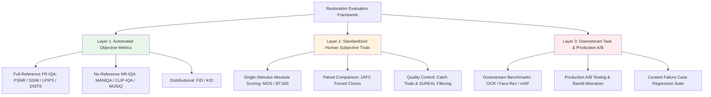
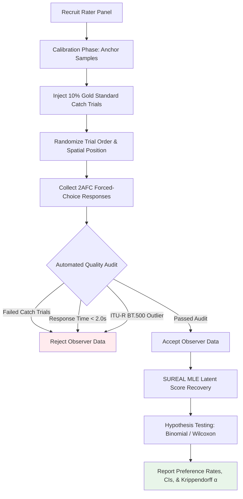
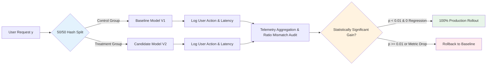

# Chapter 12 · Evaluation Methodology and Benchmarking

> While Chapter 4 dissected the mathematical properties and blind spots of objective metrics (PSNR, LPIPS, FID), this chapter examines experimental design: structuring human subjective trials, computing statistical significance, and running production A/B tests.
>
> In image restoration engineering, empirical validation is only as reliable as the evaluation methodology behind it.

## 12.0 Reading Notes

This chapter formalizes the verification protocols required to establish statistically sound conclusions in low-level vision.

Key objectives:

- Master the three-tier evaluation hierarchy: Automated Objective Metrics, Standardized Subjective Human Studies, and Downstream Task Verification.
- Understand Two-Alternative Forced Choice (2AFC) protocols, Mean Opinion Score (MOS) standardization, and the ITU-R BT.500 laboratory testing standard.
- Implement inter-rater reliability testing (Krippendorff's $\alpha$, Intraclass Correlation Coefficient ICC, and Cohen's $\kappa$) and outlier rejection via SUREAL.
- Apply parametric and non-parametric hypothesis testing (paired $t$-tests, Wilcoxon signed-rank tests, binomial tests with Bonferroni corrections).
- Build production A/B testing pipelines and failure-mode regression test suites.

**Prerequisites.** Image quality assessment fundamentals from Chapter 4 and basic statistical hypothesis testing.

**Key Terminology Introduced in This Chapter:**

- **MOS** (Mean Opinion Score): Subjective rating average collected on a 5-point Likert scale.
- **2AFC** (Two-Alternative Forced Choice): Psychophysical comparative protocol where raters make a binary choice between two paired candidate images.
- **ITU-R BT.500**: International telecommunication standard specifying physical viewing conditions, display calibration, and rating procedures for visual media.
- **Krippendorff's $\alpha$**: Statistical coefficient measuring inter-rater agreement across arbitrary numbers of observers and data types.
- **ICC** (Intraclass Correlation Coefficient): Metric evaluating scoring consistency across multiple raters on continuous evaluation scales.
- **SUREAL** (Subjective Recovery Algorithm with Latent Variables): Maximum likelihood estimation framework (Netflix) that decouples observer bias and inconsistency from true image quality scores.



## 12.1 The Three-Tier Evaluation Hierarchy

Comprehensive model evaluation requires concurrent verification across three distinct operational layers:

```
Layer 1: Automated Objective Metrics
  PSNR, SSIM, LPIPS, DISTS, FID, MANIQA
  Characteristics: High throughput, deterministic, zero marginal cost.
  Limitation: Moderate correlation with human visual preference under severe generative hallucinations.

Layer 2: Standardized Subjective Human Trials
  MOS, 2AFC, ITU-R BT.500 protocols
  Characteristics: Direct reflection of human psychophysical perception.
  Limitation: Labor-intensive, susceptible to rater noise and demographic bias.

Layer 3: Downstream Task Benchmarking & Production A/B Testing
  Downstream accuracy (OCR CER, ArcFace verification, detection mAP) and live user behavior (like rates, retention)
  Characteristics: Direct measurement of practical operational utility.
  Limitation: Requires production infrastructure or task-specific validation sets.
```

## 12.2 Psychophysical Protocols: MOS vs. 2AFC



### 1. Mean Opinion Score (MOS)

Observers view single images in isolation and assign an absolute scalar rating:
- $1$: Bad (severe degradation, non-functional)
- $2$: Poor (substantial visible artifacts)
- $3$: Fair (acceptable quality, noticeable softening)
- $4$: Good (high fidelity, minor imperceptible flaws)
- $5$: Excellent (pristine detail, indistinguishable from high-resolution ground truth)

To eliminate individual observer rating biases, raw scores $s_{ij}$ (rater $i$ on image $j$) are normalized via $Z$-score transformation:

$$
z_{ij} = \frac{s_{ij} - \mu_i}{\sigma_i + \epsilon}
$$

### 2. Two-Alternative Forced Choice (2AFC)

In comparative model evaluation, 2AFC protocols yield significantly higher signal-to-noise ratios than single-stimulus MOS. Observers are presented with two candidate outputs $(A, B)$ alongside the conditioning input (or reference ground truth) and forced to select the superior reconstruction.

```python
import numpy as np
from collections import defaultdict

def calculate_preference_win_rates(votes: list) -> dict:
    """Computes pairwise win rates and preference percentages from 2AFC trial logs.

    votes: list of tuples (model_a, model_b, selected_winner)
    """
    records = defaultdict(lambda: {'wins_a': 0, 'wins_b': 0, 'ties': 0, 'total': 0})

    for model_a, model_b, winner in votes:
        pair_key = tuple(sorted([model_a, model_b]))
        records[pair_key]['total'] += 1

        if winner == 'tie':
            records[pair_key]['ties'] += 1
        elif winner == pair_key[0]:
            records[pair_key]['wins_a'] += 1
        else:
            records[pair_key]['wins_b'] += 1

    results = {}
    for pair, stats in records.items():
        total = stats['total']
        results[pair] = {
            'win_rate_a': stats['wins_a'] / total,
            'win_rate_b': stats['wins_b'] / total,
            'tie_rate': stats['ties'] / total,
            'sample_size': total
        }
    return results
```

## 12.3 Statistical Power and Sample Size Estimation

To reliably detect a true preference margin $\Delta p = |p_1 - p_2|$ in 2AFC testing with significance level $\alpha = 0.05$ and statistical power $1 - \beta = 0.80$, the required sample size of independent evaluations is governed by:

$$
N = \left( \frac{z_{1-\alpha/2} + z_{1-\beta}}{\Delta p} \right)^2 \cdot \left( p_1(1-p_1) + p_2(1-p_2) \right)
$$

For detecting a $5\%$ preference difference ($p_1 = 0.55, p_2 = 0.50$):

$$
N \approx \left( \frac{1.96 + 0.84}{0.05} \right)^2 \cdot (0.55 \cdot 0.45 + 0.50 \cdot 0.50) \approx 1{,}550 \text{ pairwise trials}
$$

| Detectable Performance Delta ($\Delta p$) | Minimum Required Evaluations ($N$) | Recommended Operational Context |
|-------------------------------------------|------------------------------------|---------------------------------|
| $\Delta p = 0.15$ (Coarse Screening) | $\sim 180$ Pairs | Architecture prototype validation |
| $\Delta p = 0.05$ (Standard Benchmark) | $\sim 1{,}550$ Pairs | Academic peer review submissions |
| $\Delta p = 0.02$ (Subtle Fine-Tuning) | $\sim 9{,}600$ Pairs | Commercial A/B model deployment |

## 12.4 Inter-Rater Reliability and Observer Quality Auditing

Subjective experimental datasets must be validated for inter-observer consistency prior to drawing conclusions.

### 1. Krippendorff's $\alpha$

Krippendorff's $\alpha$ generalizes across arbitrary numbers of observers, missing ratings, and measurement scales:

$$
\alpha = 1 - \frac{D_o}{D_e}
$$

Where $D_o$ is observed disagreement and $D_e$ is expected chance disagreement.

```python
import krippendorff
import numpy as np

def compute_inter_rater_reliability(rating_matrix: np.ndarray) -> float:
    """Calculates Krippendorff's alpha for subjective rating matrices.

    rating_matrix: shape (num_raters, num_images), missing values encoded as np.nan
    """
    return krippendorff.alpha(reliability_data=rating_matrix, level_of_measurement='ordinal')
```

- $\alpha \ge 0.80$: High consensus, standard for published benchmarks.
- $0.67 \le \alpha < 0.80$: Moderate consensus, acceptable for preliminary exploratory studies.
- $\alpha < 0.67$: Low consensus, indicating ambiguous task definitions or noisy rater cohorts.

### 2. Maximum Likelihood Score Recovery: SUREAL

Rather than computing unweighted sample means, the SUREAL framework (Netflix) models observer ratings as a joint likelihood problem:

$$
s_{ij} = q_j + b_i + v_i \cdot \epsilon_{ij}, \quad \epsilon_{ij} \sim \mathcal{N}(0, 1)
$$

Where $q_j$ represents true underlying image quality, $b_i$ represents observer bias, and $v_i$ reflects observer scoring inconsistency. Observers with abnormally high variance $v_i$ are automatically downweighted during score aggregation.

## 12.5 Statistical Significance Testing

### Continuous Metric Evaluation (LPIPS / DISTS / PSNR)

Because perceptual loss metrics across matched test sets exhibit spatial autocorrelation and non-normal distributions, use the non-parametric Wilcoxon Signed-Rank Test for paired samples:

```python
from scipy.stats import wilcoxon, ttest_rel

def evaluate_paired_metric_significance(scores_model_a: list, scores_model_b: list) -> tuple:
    """Computes paired t-test and non-parametric Wilcoxon signed-rank test."""
    t_stat, p_param = ttest_rel(scores_model_a, scores_model_b)
    w_stat, p_nonparam = wilcoxon(scores_model_a, scores_model_b)
    return {'p_parametric': p_param, 'p_nonparametric': p_nonparam}
```

### Multiple Comparison Corrections

When simultaneously evaluating $M$ competing model pairs, apply Bonferroni correction to prevent Type I false positive inflation:

$$
\alpha_{\text{adjusted}} = \frac{\alpha_{\text{base}}}{M}, \quad \text{where } M = \binom{K}{2} \text{ for } K \text{ models}
$$

## 12.6 Downstream Task Benchmarking

Evaluating restoration outputs through downstream automated vision models provides an objective, application-grounded metric of practical performance:

```python
def benchmark_downstream_ocr_gain(
    restoration_fn,
    ocr_engine,
    degraded_test_loader
) -> dict:
    """Quantifies Character Error Rate (CER) reduction from image restoration."""
    cer_unprocessed = []
    cer_restored = []

    for lr_imgs, ground_truth_texts in degraded_test_loader:
        # Evaluate baseline degraded input
        texts_raw = ocr_engine.recognize_batch(lr_imgs)
        # Evaluate restored output
        restored_imgs = restoration_fn(lr_imgs)
        texts_restored = ocr_engine.recognize_batch(restored_imgs)

        for raw_pred, clean_pred, target in zip(texts_raw, texts_restored, ground_truth_texts):
            cer_unprocessed.append(compute_character_error_rate(raw_pred, target))
            cer_restored.append(compute_character_error_rate(clean_pred, target))

    return {
        'mean_cer_raw': np.mean(cer_unprocessed),
        'mean_cer_restored': np.mean(cer_restored),
        'relative_cer_reduction': (np.mean(cer_unprocessed) - np.mean(cer_restored)) / np.mean(cer_unprocessed)
    }
```

## 12.7 Production A/B Testing Protocols

Deploying restoration models in production environments requires controlled online experimentation:



### Production Telemetry Indicators

- **Active User Engagement**: Download rates, direct share rates, zoom-in interaction duration.
- **Negative Feedback Signals**: Reprocess / retry rates, manual filter cancellation, in-app defect reports.
- **Systems Performance**: $P_{95}$ / $P_{99}$ inference latency, peak GPU VRAM allocation, client memory pressure.

## 12.8 Maintaining Curated Failure Case Suites

To prevent silent performance regressions during model iteration, engineering teams should maintain a persistent, version-controlled **Failure Case Regression Suite**:

1. **Extreme Lighting**: High-ISO sensor shot noise, severe underexposure, mixed non-uniform illumination.
2. **Pathological Blur**: Complex non-linear motion trajectories, defocus coupled with camera shake.
3. **Small-Scale Semantics**: Micro-typography (< 12px font), distant crowd faces (< 24px bounding boxes).
4. **Out-of-Distribution Imagery**: Synthetic illustrations, line art, anime, graphical UI screenshots.

Each prospective model release must execute evaluation over this curated suite, verifying that average benchmark improvements do not introduce severe local visual regressions.

## 12.9 Chapter Summary

1. **The Three-Tier Verification Protocol**: Sound model evaluation combines automated objective metrics, standardized subjective human trials, and downstream task benchmarks.
2. **2AFC Superiority**: Two-Alternative Forced Choice protocols eliminate subjective scale calibration noise, providing superior statistical power over isolated Mean Opinion Scores.
3. **Reliability and Outlier Auditing**: Measuring inter-rater consensus via Krippendorff's $\alpha$ and applying SUREAL maximum likelihood scoring rejects anomalous raters.
4. **Hypothesis Testing Rigor**: Claims of algorithmic superiority require non-parametric significance testing (Wilcoxon, Binomial) alongside Bonferroni multiple-comparison adjustments.
5. **Continuous Regression Testing**: Maintaining dedicated failure-case test banks prevents production deployment regressions obscured by global benchmark averages.

---

> Next: [Video Restoration Fundamentals and Temporal Dynamics](13-video-basics.md) transitions from static image processing to video sequences, analyzing temporal coherence, optical flow alignment, and inter-frame propagation.
