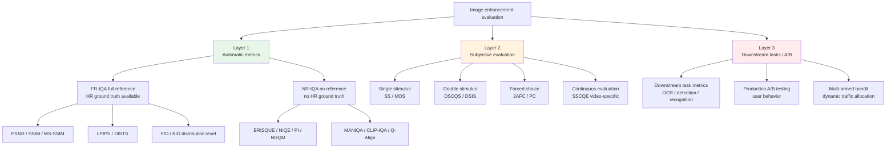
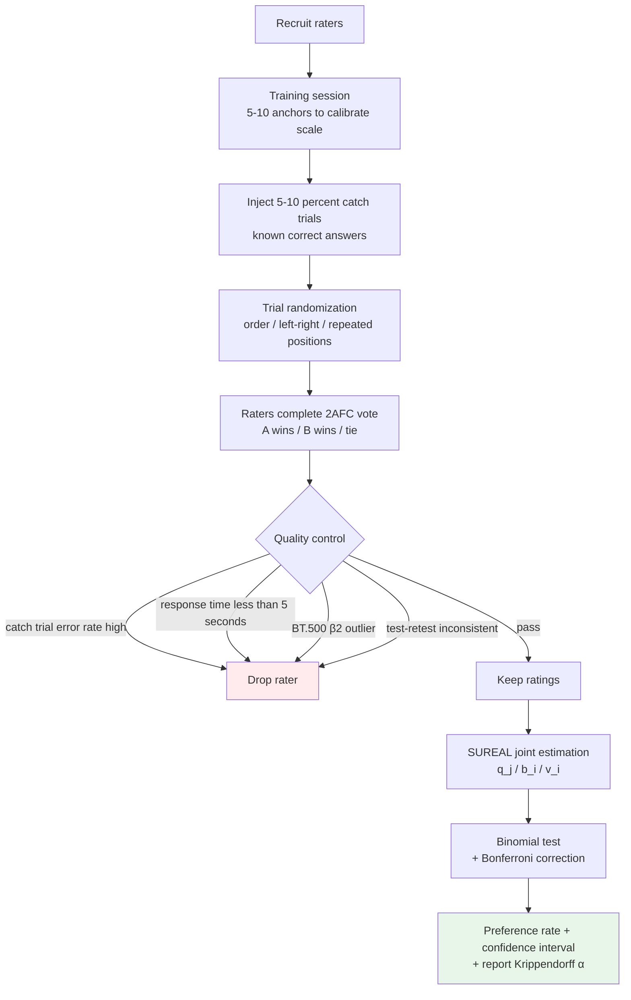

# Chapter 12 · Evaluation Methodology

> Chapter 4 discussed **the metrics themselves**: where PSNR/LPIPS/FID each deceive you.
>
> This chapter discusses **how to run an evaluation**: how to design a subjective evaluation, how to compute statistical significance, how to do A/B testing in production.
>
> In image enhancement, "running an experiment" itself has a methodology, and most papers do not get this step right.

## 12.0 Reading guide

Chapter 4 pulled each metric apart to discuss its individual biases; this chapter goes one level up: **given a set of metrics, how to organize them into trustworthy experimental conclusions**. The boundary can be drawn this way: Chapter 4 answers "what does PSNR = 32 dB mean", and this chapter answers "is PSNR 32 vs 31 actually better" and "is this gap perceivable by real users".

This chapter assumes the reader has run simple comparison experiments (run two models, compute a PSNR, draw a table) but **has not necessarily designed a user study or live A/B test**. We unpack the three layers of evaluation, several subjective protocols, rater quality control, statistical significance testing, and production A/B testing.

**Abbreviations introduced here.** The abbreviations used in this chapter are listed up front:

- **IQA** (Image Quality Assessment): defined in Chapter 1, used directly here
- **MOS** (Mean Opinion Score): the average of raters' image-quality scores on a 1-5 Likert scale
- **DMOS** (Differential MOS): a relative MOS measured against a reference image; equals the reference score minus the test score, in units of "quality loss"
- **2AFC** (Two-Alternative Forced Choice): a comparison protocol where the rater must pick between A and B
- **BT.500**: ITU-R's standard for subjective video and image evaluation, the de facto standard in this field
- **NR-IQA / FR-IQA** (No-Reference / Full-Reference IQA): defined in Chapter 1; NR-IQA is the workhorse for real-world scenarios in this chapter
- **BRISQUE** (Blind/Referenceless Image Spatial Quality Evaluator): a classic NR-IQA metric based on natural-scene statistics
- **NIQE** (Natural Image Quality Evaluator): another NR-IQA metric based on natural-scene statistics
- **PI** (Perceptual Index): a composite NR metric defined by the PIRM 2018 competition, equal to (10 - NRQM + NIQE) / 2
- **NRQM** (No-Reference Quality Metric): an SR-specific NR metric proposed by Ma et al. 2017
- **MANIQA / CLIP-IQA / Q-Align**: modern NR-IQA metrics defined in Chapter 1
- **ICC** (Intraclass Correlation Coefficient): a measure of inter-rater agreement
- **AMT** (Amazon Mechanical Turk): the classic crowdsourcing platform
- **IRB** (Institutional Review Board): the institutional ethics review board for human-subject research in academia
- **SUREAL** (Subjective REcovery Algorithm with Latent classes): Netflix's MOS estimation method
- **PVD** (Preferred Viewing Distance): the recommended viewing distance specified in BT.500

After reading this chapter you should be able to answer: given a new model, how do I design a set of experiments that runs fast, runs accurately, and stands up to scrutiny in paper / product review; when a user says "I can't see a difference", how do I rebut or concede using data; when a live A/B test shows no difference after two weeks, is the model bad or is the sample too small.

## 12.1 The three layers of evaluation

Any serious enhancement evaluation should cover three layers:

```
Layer 1: Automatic metrics
  PSNR / SSIM / LPIPS / DISTS / FID / NIQE
  Pros: fast, reproducible, cheap
  Cons: limited correlation with human eye (covered in Chapter 4)

Layer 2: Subjective human evaluation
  MOS / 2AFC / preference test
  Pros: reflects real visual experience
  Cons: slow, expensive, noisy

Layer 3: Real-world downstream tasks
  A/B test / user behavior / downstream recognition accuracy
  Pros: directly reflects value
  Cons: requires deployment, limited data
```

**The three layers must validate each other**: an automatic-metric improvement that does not show up in subjective evaluation or downstream tasks is suspect.

Drawing the three layers and their concrete methods as a taxonomy makes it easier to look up later — each subsequent section is essentially filling in a subtree of the following diagram:



This chapter focuses on Layer 2 and Layer 3; the details of Layer 1 are already covered in Chapter 4.

## 12.2 MOS: single-image scoring

MOS (Mean Opinion Score) is the most classic form of subjective evaluation.

### Procedure

1. Show the rater an image (the enhancement model's output)
2. The rater scores on a 5-level Likert scale:

```
1 - Bad (severe artifacts/blur)
2 - Poor (clear problems)
3 - Fair (usable but not good)
4 - Good (high quality)
5 - Excellent (flawless)
```

3. Multiple raters score the same image independently; take the average

### Pros

- **Simple**: raters need no professional training
- **Scalable**: scoring an image takes seconds, can cover many samples
- **Task-agnostic**: can compare models across tasks

### Cons

- **Inconsistent scales**: rater A's 4 ≠ rater B's 4 (A is strict, B is lenient)
- **No reference comparison**: looking at an isolated image, the rater may not know "is this a 4 or a 5"
- **High data noise**: standard deviation is often ±0.5 points

### Tricks for raising MOS SNR

1. **At least 5-10 raters per image**, take the average to reduce per-rater bias
2. **Calibration samples**: place a few images of known quality up front (HR ground truth gets 5, severe blur gets 1) so the rater calibrates their own scale
3. **Z-score normalization**: subtract each rater's own mean and divide by their own std before merging

```python
import numpy as np

def normalize_mos_scores(scores: dict) -> dict:
    """
    scores: {rater_id: {image_id: score}}
    returns: {image_id: normalized average}
    """
    # Z-score each rater's scores
    normalized = {}
    for rater, ratings in scores.items():
        s = np.array(list(ratings.values()))
        mean, std = s.mean(), s.std() + 1e-8
        normalized[rater] = {img: (sc - mean) / std for img, sc in ratings.items()}

    # Average across raters
    image_scores = {}
    for rater_dict in normalized.values():
        for img, sc in rater_dict.items():
            image_scores.setdefault(img, []).append(sc)
    return {img: np.mean(scs) for img, scs in image_scores.items()}
```

### MOS is recommended for

- Overall quality evaluation
- Quality distribution across multiple samples of a single model
- Cross-task comparison (**not recommended**—different tasks have different baselines)

## 12.3 2AFC: forced choice

2AFC (Two-Alternative Forced Choice) makes raters **directly compare** two candidates.

### Procedure

```
Show the reference image (HR ground truth)
Show candidate A (output of model 1)
Show candidate B (output of model 2)
Rater chooses: A is closer / B is closer / cannot tell
```

### Pros

- **Forced comparison**: humans are far more sensitive to "A vs B" than to "absolute scores"
- **Less data noise**: no need to calibrate scales
- **Simple statistics**: directly compute preference rate (A's win rate)

### Cons

- **Only pairwise**: 5 models means $\binom{5}{2} = 10$ pairs, each pair with multiple images
- **No absolute score**: you know A is better than B but not by how much
- **Order bias**: raters may prefer the option on the left (must randomize)

### Practical recommendation: **more reliable than MOS**

The vast majority of serious paper/product comparisons use 2AFC rather than MOS - unless you are only evaluating the overall quality of one single model.

Drawing a complete paired-comparison (PC) experiment from recruitment to conclusion, the flowchart covers every quality-control point in Sections 12.4 - 12.7:



This diagram is referenced throughout later sections - 12.5 on recruitment and quality control corresponds to the left half, 12.6 on agreement metrics and BT.500 outlier detection corresponds to the middle, 12.7 on SUREAL to the lower right, and 12.11 on statistical testing to the final step.

```python
def compute_preference_rate(votes: list) -> dict:
    """
    votes: list of (model_a, model_b, winner)
    returns: {(a, b): a_win_rate}
    """
    from collections import defaultdict
    counts = defaultdict(lambda: {'a_wins': 0, 'b_wins': 0, 'tie': 0, 'total': 0})

    for a, b, winner in votes:
        key = tuple(sorted([a, b]))   # normalize direction
        counts[key]['total'] += 1
        if winner == 'tie':
            counts[key]['tie'] += 1
        elif winner == key[0]:
            counts[key]['a_wins'] += 1
        else:
            counts[key]['b_wins'] += 1

    return {k: v['a_wins'] / v['total'] for k, v in counts.items()}
```

## 12.4 Sample size for subjective evaluation

How many images and how many raters are needed to reach a reliable conclusion?

### Sample size calculation (power analysis)

To detect a 5% preference-rate difference (e.g. A win rate 50% vs 55%) requires:

$$
n = \left( \frac{z_{1-\alpha/2} + z_{1-\beta}}{p_1 - p_2} \right)^2 \cdot \left( p_1(1-p_1) + p_2(1-p_2) \right)
$$

Plugging in $\alpha = 0.05$ (significance level), $\beta = 0.2$ (power 0.8), $p_1 = 0.55, p_2 = 0.5$:

$$
n \approx 1500 \text{ pairs}
$$

In other words, **to reliably distinguish two close models, each pair needs about 1500 2AFC votes**.

Common compromises in practice:

- **Coarse screening** (gap 10%+): 100-300 pairs
- **Normal comparison** (gap 3-5%): 500-1000 pairs
- **Subtle differences** (gap 1-2%): 3000+ pairs (very expensive)

### Number of raters

How many distinct raters per image pair? Empirical:

- **Academic papers**: 5-10 distinct raters per pair
- **Product A/B**: 100+ independent users

## 12.5 Sources of raters

### Amazon Mechanical Turk (AMT)

The most classic crowdsourcing platform. Pros: many people, cheap ($0.01-0.05/task); cons: variable quality.

### Prolific

A more modern alternative. Quality is higher than AMT, price slightly higher ($0.10-0.20/task).

### Self-built platform

Deploy a rating system internally and have employees / recruited volunteers rate. Quality is controllable but sample size is limited.

### Professional evaluation agencies

Specialized video/image evaluation companies (such as Telecom ParisTech IPI lab). Highest quality, highest price (thousands of dollars per batch).

### Rater quality control

Required no matter the platform:

1. **Catch trial**: include 5-10% "obvious-answer" samples (HR vs an extremely poor output); raters must pick correctly
2. **Test-retest**: rate the same sample twice; remove raters with low consistency
3. **Time check**: remove raters who score too quickly (< 5 sec/image)
4. **Multiple raters per item**: a single rater cannot determine ground truth

## 12.6 Inter-rater reliability

Sample size, catch trials — all done. One independent question remains: **do raters actually agree with one another?** If five raters score the same image anywhere from 1 to 5, no amount of averaging makes that result trustworthy — either the image is at a genuine quality boundary (legitimate disagreement) or rater quality is the problem (noisy scoring).

In practice you must compute an agreement statistic as a precondition to trusting the user study at all.

### Cohen's κ (two raters, categorical)

Simplest case: two raters classify items into categories (e.g., "A wins / B wins / tie"). $\kappa$ measures their agreement above chance:

$$
\kappa = \frac{p_o - p_e}{1 - p_e}
$$

$p_o$ is the observed agreement rate, $p_e$ the expected chance agreement. $\kappa = 1$ is perfect, $0$ is chance, $< 0$ is inverse.

Empirical thresholds (Landis & Koch):

- $\kappa < 0.4$: poor
- $0.4–0.6$: moderate
- $0.6–0.8$: good
- $> 0.8$: very good

```python
from sklearn.metrics import cohen_kappa_score
kappa = cohen_kappa_score(rater1_labels, rater2_labels)
```

### Krippendorff's α (multiple raters, multiple data types)

More general: supports any number of raters, missing values, and ordinal / interval / ratio data. **Use ordinal α for MOS, nominal α for 2AFC**.

Empirical thresholds (Krippendorff's own, stricter than κ):

- $\alpha > 0.8$: high agreement, publishable
- $0.67–0.8$: acceptable for preliminary conclusions
- $< 0.67$: data is unreliable, conclusions don't hold

```python
import krippendorff
import numpy as np

# Rows = raters, columns = items, NaN = rater didn't score that item
ratings = np.array([
    [4, 3, 5, np.nan, 2],
    [4, 4, 5, 3, np.nan],
    [3, 3, 4, 3, 2],
])
alpha = krippendorff.alpha(reliability_data=ratings, level_of_measurement='ordinal')
```

Practical experience: image-enhancement MOS data typically lands at α between 0.5 and 0.75 — **most public IQA datasets do not reach 0.8**. This means:

- Don't chase α > 0.8 — there is legitimate perceptual disagreement in this domain
- But α < 0.5 should raise alarms: either the task is poorly defined or rater quality is poor

### ICC (Intraclass Correlation)

When MOS is continuous / ordinal, papers often prefer ICC over Krippendorff α. ICC(2,k) is the most commonly reported variant:

```python
import pingouin as pg

# df has three columns: rater, item, score (long format)
icc = pg.intraclass_corr(data=df, targets='item', raters='rater',
                          ratings='score', nan_policy='omit')
print(icc[icc['Type'] == 'ICC2k'])
```

ICC > 0.75 is considered good, > 0.9 excellent (Koo & Li, 2016).

### Outlier rater detection: BT.500-14 Annex V

ITU-R BT.500-14 (the de-facto standard for video / image subjective assessment) gives a **β2 outlier detection** procedure in Annex V — raters whose scores have kurtosis far from normal are flagged:

```
For each rater i:
1. Take their z-scored ratings across all images
2. Compute β2 (kurtosis estimate) for that distribution
3. If |β2| > 2, mark as suspicious
4. Then check their deviation from the group mean: if > ±2σ on more than 5% of items, drop them
```

ITU's filtering procedure is more systematic than simply "drop people who failed catch trials" and **should be used for serious paper / product evaluations**.

Engineering: see [Netflix's SUREAL library](https://github.com/Netflix/sureal), `bt500.py` for an implementation.

## 12.7 SUREAL: modern MOS estimation

The naive "take the mean across raters per image" assumes all raters are equally trustworthy. Netflix proposed **SUREAL** (Subjective REcovery Algorithm with Latent classes) in 2018, modeling MOS as:

$$
s_{ij} = q_j + b_i + v_i \cdot \epsilon_{ij}
$$

- $s_{ij}$: rater $i$'s score on image $j$
- $q_j$: true quality of image $j$ (the thing to estimate)
- $b_i$: rater $i$'s bias ("strict" or "lenient")
- $v_i$: rater $i$'s inconsistency (high $v$ = noisy)

EM iteration jointly estimates $(q, b, v)$ and **simultaneously identifies unreliable raters** (high $v_i$).

### Difference from z-score normalization

- **z-score**: each rater normalized independently, assumes each sees a similar distribution
- **SUREAL**: joint estimation, identifies outlier raters in small samples

In practice: **SUREAL significantly outperforms z-score when each rater scores < 30 images**. Production scenarios (each rater scores only a few dozen items) should use SUREAL.

```python
# Netflix's official implementation
# pip install sureal
from sureal.dataset_reader import RawDatasetReader
from sureal.subjective_model import MosModel, MaximumLikelihoodEstimationModel

# MLE model = SUREAL
model = MaximumLikelihoodEstimationModel(dataset_reader)
result = model.run_modeling()
print(result['quality_scores'])     # Estimated true quality per image
print(result['observer_bias'])      # Bias per rater
print(result['observer_inconsistency'])  # v per rater
```

Citing SUREAL instead of raw mean / z-score in user-study sections has become standard in video quality literature post-2020.

## 12.8 ITU-R BT.500: the bible of subjective video / image evaluation

For serious subjective evaluation, **ITU-R BT.500-14** (latest 2023 revision) is unavoidable. It defines:

### Evaluation methods

- **DSCQS** (Double-Stimulus Continuous Quality Scale): reference + test shown together
- **DSIS** (Double-Stimulus Impairment Scale): focus on impairment severity
- **SS** (Single Stimulus): single-stimulus, similar to MOS
- **SSCQE** (Single Stimulus Continuous Quality Evaluation): for video, raters score continuously
- **PC** (Pair Comparison): = 2AFC

### Physical environment standards

- **Viewing distance**: 3–4× screen height (PVD: preferred viewing distance)
- **Ambient light**: < 20 lux (avoid reflection interference)
- **Display calibration**: D65 white point, 100–200 cd/m² luminance, contrast per BT.1886 EOTF
- **Background**: neutral gray (15% reflectance)

Academic papers must report these parameters. AMT / Prolific and other remote crowdsourcing platforms **cannot meet these requirements** — which is why serious papers run both lab and crowdsourcing rounds, calibrating the latter against the former.

### Anchors and training

- A **training session** is required before the experiment (5–10 anchor images covering worst to best) so raters calibrate their scale
- Training data **does not count toward formal scores**

### Trial randomization

- Image presentation order is independently randomized per rater
- Left/right order in pair comparisons is randomized
- Repeated catch-trial images are scattered across positions

The methods in 12.2–12.5 are a simplified form of the BT.500 framework — sufficient for product iteration. **For academic publication, report parameters per BT.500.**

## 12.9 IRB / informed consent / ethics

User studies involve human subjects. **Both academic publication and corporate GDPR compliance require ethics review**, but this is typically glossed over in image-enhancement papers — yet the risk is real.

### Academic: IRB approval

Since 2024, NeurIPS / CVPR / ICCV submission templates require an ethics statement covering:

- Subject recruitment source, sample size, compensation
- Whether the study went through institutional IRB / Ethics Committee
- Data retention period and deletion policy
- Additional protections for NSFW / violent content / images of real people

Cross-border collaborations: EU subjects are protected under GDPR; **US IRB approval does not automatically cover them**.

### Industry: consumer data

When deploying user-study platforms inside companies:

- If employee-rated images are real user data → run PII review
- Rating-platform log retention: ≤ 30 days post task completion (unless required for compliance)
- Informed consent: explicitly disclose task nature, payment, sensitive content, right of withdrawal

### Crowdsourcing-platform ethics traps

- AMT pay-rate problem: since 2023, multiple academic IRBs require pay rates ≥ minimum wage in the rater's jurisdiction. $0.01/task + 20s/task = $1.80/hour, which **fails most IRB review boards**.
- Prolific defaults to $8/hour (UK minimum), saving IRB headaches.
- Task disclosure: prominently disclose NSFW or real-person content **upfront** so raters can opt in.

Engineering bottom line: budget ≥ $8/hour and obtain institutional IRB approval — the compliance floor since 2024.

## 12.10 Cross-cultural and demographic bias

The last commonly underestimated source of variance: **raters are not homogeneous**.

- **Aesthetic differences**: East Asian raters tend to rate "over-sharpened + high contrast" as "good quality"; Western raters lean toward "natural + low artifacts" — same image's MOS can differ by 0.5
- **Document / text content**: rater's native language affects judgment of text SR
- **Devices**: phone-screen raters and desktop raters perceive the same image differently
- **Professional vs lay**: photographers / designers are more sensitive to color tone, regular users to structure

Engineering practice:

- **Record demographic features**: region, age bracket, device — for post-hoc segmentation analysis
- **Match the target market**: Asian-market product → Asian panel; cross-region products → at least 2–3 region samples
- **Disclose in reporting**: paper user-study sections should give a demographic overview

Papers that omit this dimension face challenges to generalizability — a common reviewer complaint in IQA since 2024.

## 12.11 Statistical significance

Before claiming "model A is better than B" you must run a significance test.

### Paired t-test (continuous metrics)

If you compare LPIPS of two models on the same set of test images:

```python
from scipy import stats

lpips_a = [...]   # LPIPS of model A on N test images
lpips_b = [...]   # model B
t_stat, p_value = stats.ttest_rel(lpips_a, lpips_b)
print(f"t = {t_stat:.3f}, p = {p_value:.4f}")
```

Only `p < 0.05` allows you to claim statistical significance.

### Wilcoxon Signed-Rank Test (non-parametric)

LPIPS/PSNR don't necessarily follow a normal distribution; Wilcoxon is more robust:

```python
from scipy.stats import wilcoxon
stat, p = wilcoxon(lpips_a, lpips_b)
```

### Binomial Test (2AFC)

Significance for 2AFC preference rate:

```python
from scipy.stats import binomtest

# Model A won 540 out of 1000 pairs
result = binomtest(540, 1000, p=0.5, alternative='two-sided')
print(f"A win rate 54%, p = {result.pvalue:.4f}")
```

### Multiple comparison correction

If you are comparing 5 models (10 pairs), p-values must be Bonferroni-corrected: $\alpha_{\text{corrected}} = 0.05 / 10 = 0.005$.

## 12.12 Correlation between automatic metrics and MOS

Correlation between different metrics and human perception (statistics from multiple IQA benchmarks):

| Metric | Spearman correlation with MOS |
|------|----------------------|
| PSNR | 0.40 - 0.55 |
| SSIM | 0.50 - 0.65 |
| MS-SSIM | 0.55 - 0.70 |
| **LPIPS** | **0.70 - 0.80** |
| **DISTS** | **0.72 - 0.82** |
| **MANIQA** (NR) | **0.75 - 0.85** |
| FID (distribution-level) | 0.40 - 0.60 |

This tells us:

- **PSNR alone is unreliable** (correlation only 0.4-0.55)
- **LPIPS/DISTS are the strongest full-reference metrics** (0.7+)
- **The SOTA NR metric (MANIQA) is already close to LPIPS**—when there's no ground truth in real-world settings, MANIQA is a decent proxy

Engineering practice:

- During training, watch PSNR + LPIPS
- For papers/reports, beyond PSNR + LPIPS also do subjective evaluation
- For production deployment, watch MANIQA + user behavior

## 12.13 Real-world: downstream task evaluation

The most convincing evaluation: **does the enhanced image make a downstream task perform better?**

Examples:

### Enhancement + OCR

```python
# Test set: 1000 low-quality document images
# Ground truth: known text content

original_ocr_acc  = test_ocr(low_quality_images)         # OCR accuracy on raw images: 65%
enhanced_ocr_acc  = test_ocr(model_output(low_quality))  # after enhancement: 88%

# This is what "real contribution of the enhancement model to the OCR task" means
```

### Enhancement + face recognition

```python
# Test set: 1000 pairs of (low-quality image, high-quality reference)
# Ground truth: same person or not

original_recognition = face_recognize(low_quality_images, gallery)  # accuracy: 70%
enhanced_recognition = face_recognize(model_output(...), gallery)   # accuracy: 85%
```

### Enhancement + object detection

```python
# Test set: 1000 low-quality surveillance images, with object annotations
mAP_original = detection_eval(low_quality_images, annotations)  # 0.45
mAP_enhanced = detection_eval(model_output(...), annotations)   # 0.62
```

Pros of downstream task evaluation:

- **Directly reflects value**—what customers/users actually care about
- **No need for human rating**—reuse off-the-shelf downstream models
- **Objective and reproducible**—accuracy/mAP are absolute numbers

Applicable scenarios:

- Document enhancement → OCR
- Face enhancement → recognition / verification
- Surveillance enhancement → detection / person re-identification
- Satellite enhancement → land cover classification / change detection

Inapplicable scenarios:

- Art restoration (no "task")
- Beauty filters (user-preference driven)

## 12.14 A/B testing in production

Deploy the new model to a fraction of users, compare against the old model, observe user-behavior changes.

### A/B design

```
50% of users → old model (control)
50% of users → new model (treatment)
```

Monitored metrics:

- **Direct quality metrics** (active user feedback): like rate, report rate, reprocess rate
- **Behavior metrics**: processing duration, repeat-use rate, subscription conversion rate
- **Exit metrics**: bounce rate, uninstall rate

```python
# Simplified A/B report
def compute_ab_metrics(control_users, treatment_users):
    return {
        'reprocess_rate':  metric_reprocess(treatment) - metric_reprocess(control),
        'subscribe_rate':  metric_subscribe(treatment) - metric_subscribe(control),
        'rating_avg':      rating_avg(treatment) - rating_avg(control),
        'p_value':         ab_significance_test(control, treatment),
    }
```

### Multi-Armed Bandit

A more advanced deployment style: have traffic allocation itself adjust dynamically based on results. Models that perform better automatically receive more traffic.

Engineering implementation: use mature frameworks such as Vowpal Wabbit, Adobe Sensei.

### Engineering caveats for A/B

1. **Long enough duration**: run for at least 7-14 days to avoid single-day fluctuations
2. **Avoid Selection Bias**: assign users randomly, do not let users self-select
3. **Sample Ratio Mismatch**: monitor whether the split is actually 50/50 (infrastructure bugs are common)
4. **Multiple testing**: simultaneously testing several variants requires Bonferroni correction
5. **Segmented analysis**: different devices/regions/user segments may react differently

## 12.15 Failure case bank

A model with good average metrics may completely break in **specific scenarios**. **Specifically maintain a failure case bank**—collect known broken inputs and run every new model against this set.

### How to collect

- From user reports (production)
- Actively constructed (boundary scenarios)
- Failure cases in papers
- Complaints on Twitter/Reddit

Typical failure categories (general for image enhancement):

- Extreme low light
- Extreme high-ISO noise
- Severe motion blur
- Extremely small details (small text, distant faces)
- Multi-face scenes
- Rare objects (animals other than cats and dogs)
- Special viewpoints (fisheye, wide-angle)
- Partial occlusion
- All kinds of stylized imagery (anime, oil painting, pixel art)

### Metrics for the failure case bank

Beyond the average, also look at:

- **Failure rate**: how many images in this set are visually broken?
- **New failure modes**: did it introduce problems that didn't exist before?

Engineering practice: every new model version must be run on the failure bank, results archived. **Long-term maintenance** of this set is far more important than benchmark grinding.

## 12.16 Benchmark design

Chapter 4, Section 4.9 covered the bias of academic benchmarks. Here we discuss how to design **your own** benchmark.

### What the test set should include

At least four sources:

1. **Academic benchmarks** (DIV2K val, Set5/14, etc.): for comparison with published methods
2. **Real degradation data** (RealSR, DRealSR): to test the real distribution
3. **Domain-specific test set** (your business data): to test actual results
4. **Failure case bank**: to test robustness

### Diversity audit

Tag every image in the test set (scene, content, degradation level) to ensure distribution coverage:

| Scene | Share |
|------|------|
| Indoor | 25% |
| Outdoor daylight | 30% |
| Outdoor night | 15% |
| Documents/screenshots | 10% |
| People (including faces) | 15% |
| Other | 5% |

If a category is < 1% in share, failures in that category will not appear in the average metrics.

### The benchmark cannot be optimized

The most important discipline: **your final benchmark must not be used for hyperparameter tuning**.

- Train on the train set
- Tune hyperparameters on the val set
- Final evaluation on the test set

If you tweaked hyperparameters in order to grind the test set, the test set is already contaminated. This is the basic principle that machine learning repeatedly violates.

Engineering practice: **keep one "sealed" test set** to be run only once before final release.

## 12.17 Eval pipeline engineering

In real engineering, eval should be automated.

```python
import json
from pathlib import Path

class EvalPipeline:
    def __init__(self, model, datasets: dict, metrics: dict):
        """
        datasets: {name: dataloader}
        metrics: {name: callable(pred, target) -> float}
        """
        self.model = model
        self.datasets = datasets
        self.metrics = metrics

    @torch.no_grad()
    def run(self, output_dir: Path) -> dict:
        results = {}
        for ds_name, loader in self.datasets.items():
            ds_results = {m: [] for m in self.metrics}
            for batch in loader:
                lr, hr = batch['lr'], batch['hr']
                pred = self.model(lr.cuda())
                for m_name, m_fn in self.metrics.items():
                    score = m_fn(pred, hr.cuda())
                    ds_results[m_name].extend(score.cpu().tolist())
            results[ds_name] = {
                m: {
                    'mean':  np.mean(scores),
                    'std':   np.std(scores),
                    'count': len(scores),
                }
                for m, scores in ds_results.items()
            }

        # Save results
        output_dir.mkdir(parents=True, exist_ok=True)
        with open(output_dir / 'results.json', 'w') as f:
            json.dump(results, f, indent=2)
        return results
```

Engineering essentials:

- **Reproducible**: fixed random seed, version number, commit ID
- **Persistent**: every eval result is written to disk, kept long-term
- **Comparable**: able to diff eval results across commits
- **Visualized**: automatically generate comparison images and tables

## 12.18 Standards for paper experimental reporting

When writing a paper / technical report, the eval section should include:

1. **Datasets**: list each, including version numbers
2. **Metrics**: PSNR + SSIM + LPIPS + DISTS + at least one NR metric
3. **Comparison methods**: include 5+ public SOTA + a simple baseline
4. **Multiple runs**: run each setup at least 3 times, report mean ± std
5. **Failure cases**: required, otherwise reviewers will request them
6. **Subjective evaluation** (if it is a perception-end method)
7. **Downstream tasks** (if the method targets helping downstream tasks)
8. **Ablation studies**: ablate each design decision

Many papers skip 4, 5, 6, and the result is reviewer skepticism or failed reproductions.

## 12.19 Common evaluation antipatterns

A few to avoid in engineering:

### Antipattern 1: only showing cherry-picked images

"Look how well this old photo is restored!"—what about the failure cases you didn't show?

### Antipattern 2: comparing against outdated methods

Only comparing to ESRGAN (2018), not to SwinIR/HAT/SUPIR.

### Antipattern 3: only reporting PSNR

"Our PSNR is 0.3 dB higher than theirs"—high PSNR does not imply good visual quality.

### Antipattern 4: training data contains the test set

Inadvertently including images similar to the test set in training.

### Antipattern 5: "by feel" hyperparameter selection

Each eval is different, with no traceability to why this number was chosen.

## 12.20 Summary

1. **Three layers of evaluation**: automatic metrics + subjective evaluation + downstream tasks, validating each other
2. **MOS is simple but noisy**, 2AFC's forced comparison has higher SNR, **prefer 2AFC**
3. **Sample size requires power analysis**: 1000+ pairs is the lower bound for a serious experiment
4. **Rater quality control**: catch trial, test-retest, time check
5. **Inter-rater reliability**: Krippendorff α / ICC are the precondition for trusting a user study; BT.500-14 Annex V β2 outlier detection drops anomalous raters
6. **Estimate MOS via SUREAL** (Netflix's MLE method) instead of raw mean / z-score — significantly more stable for small samples
7. **For serious subjective evaluation, follow ITU-R BT.500-14**: DSIS/DSCQS/PC, viewing distance, ambient light, display calibration, anchor training — all parameters reported per standard
8. **IRB / informed consent is the compliance floor**: NeurIPS/CVPR have required ethics statements since 2024; crowdsourcing pay rate ≥ $8/h
9. **Cross-cultural and demographic bias is a real variance source**: report rater demographics; match the target market
10. **Statistical significance**: t-test/Wilcoxon for continuous metrics, binomial test for 2AFC, Bonferroni for multiple comparisons
11. **Correlation between automatic metrics and MOS**: LPIPS/DISTS/MANIQA ~0.75, PSNR only 0.4-0.55
12. **Downstream task evaluation is the most convincing**: OCR accuracy, face recognition rate, detection mAP
13. **A/B testing is the de facto standard in production**: monitor user behavior metrics
14. **Failure case bank**: maintained long-term, more important than average metrics
15. **Benchmarks must not be used for hyperparameter tuning**: keep a sealed test set

That completes Part III's training and evaluation chapters. Part IV moves into video—video is not just "images plus time"; temporal consistency is an independent problem.

---

> Next chapter [Video is Not Just Images Plus Time](13-video-basics.md) → temporal consistency, optical flow, the specifics of video degradation.
