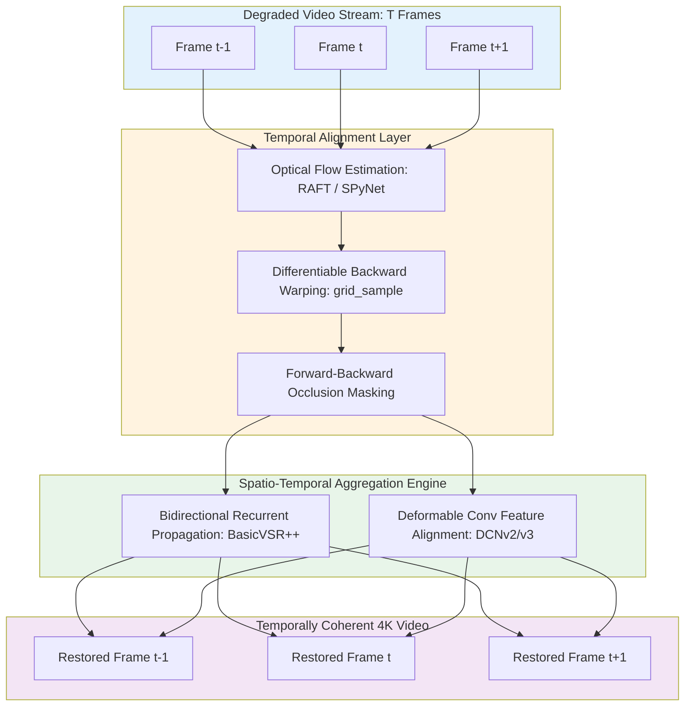
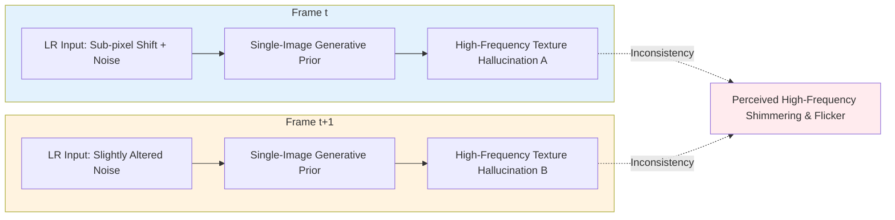
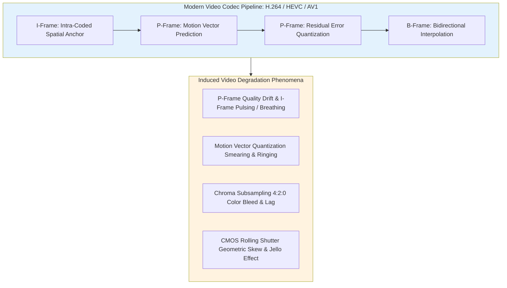
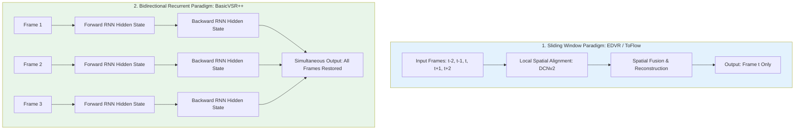

# Chapter 13 · Video Restoration Fundamentals and Temporal Dynamics

> Naively executing frame-by-frame 2D image restoration on video sequences represents a fundamental architectural error.
>
> While isolated frames may exhibit high perceptual sharpness, sequence playback frequently suffers from severe temporal instability: high-frequency texture flickering, boundary shimmering, and geometric jitter.
>
> Video restoration requires optimizing spatial fidelity concurrently with temporal coherence.

## 13.0 Reading Notes

This chapter transitions from static 2D image degradation models to spatio-temporal video processing.

Key objectives:

- Understand the mechanisms of temporal inconsistency (per-frame generative stochasticity and high-frequency aliasing).
- Formulate the physical foundations of temporal coherence: optical flow fields and the Brightness Constancy Constraint.
- Implement differentiable backward warping (`F.grid_sample`) and forward-backward occlusion masking.
- Distinguish video-specific degradation sources: inter-frame compression artifacts (GOP structure, motion-vector quantization), non-rigid motion blur, and CMOS rolling shutter distortion.
- Compare sliding-window versus recurrent propagation architectures (unidirectional vs. bidirectional feature alignment).
- Master spatio-temporal quality metrics: Warping Error (WE), temporal LPIPS (tLP), and temporal Optical Flow consistency (tOF).

**Prerequisites.** Single-image degradation pipelines from Chapter 5 and deep CNN/Transformer backbones from Chapters 6-7.

**Key Terminology Introduced in This Chapter:**

- **VSR** (Video Super-Resolution): Spatio-temporal upsampling reconstructing high-resolution frames from degraded, low-resolution video sequences.
- **VFI** (Video Frame Interpolation): Temporal synthesis generating intermediate frames between successive observed timestamps ($t \to t+0.5 \to t+1$).
- **Temporal Consistency (TC)**: Invariant constraint requiring that frame-to-frame variations correspond strictly to physical scene dynamics rather than stochastic model synthesis.
- **Brightness Constancy**: Fundamental physical assumption stating that the radiometric intensity of a moving scene point remains invariant across short temporal intervals.
- **Occlusion Mask ($M^{\text{occ}}$)**: Binary or continuous confidence field identifying spatial coordinates where correspondence tracking fails due to disocclusion or non-rigid deformation.
- **DCN** (Deformable Convolutional Network): Learnable convolution operator predicting dynamic spatial sampling offsets, enabling implicit multi-frame alignment.



## 13.1 The Failure Mode of Frame-by-Frame Processing

When applying a state-of-the-art single-image super-resolution model (e.g., Real-ESRGAN, HAT, or SUPIR) independently to each frame of a video clip, visual quality exhibits a sharp divergence:

1. **Static Frame Analysis**: Each isolated frame exhibits remarkable sharpness, crisp structural boundaries, and plausible synthesized high-frequency texture (MOS increases from 2.5 to 4.2).
2. **Sequential Video Playback**: Real-time playback reveals severe temporal artifacts: flat surfaces exhibit high-frequency "boiling" or shimmering noise, fine textural patterns rapidly mutate across frames, and structural boundaries jitter uncontrollably. Subjective quality collapses back below 2.0.

### Root Cause Analysis

Generative restoration models perform non-injective ill-posed mapping: multiple plausible high-resolution patches correspond to the same low-resolution input. Sensor noise, compression quantization, and sub-pixel camera motion introduce slight intensity variations between consecutive frames. The generative network resolves these minor input differences into completely distinct high-frequency hallucinations, breaking temporal coherence:



## 13.2 Mathematical Formulation of Temporal Consistency

Let $V = \{I_1, I_2, \dots, I_T\} \in \mathbb{R}^{T \times C \times H \times W}$ denote a sequence of video frames. Let $F_{t \to t+1} \in \mathbb{R}^{2 \times H \times W}$ represent the dense forward optical flow vector field mapping pixel coordinates $\mathbf{x} = (x, y)$ in frame $t$ to their corresponding locations in frame $t+1$:

$$
\mathbf{x}' = \mathbf{x} + F_{t \to t+1}(\mathbf{x}) = (x + u, y + v)
$$

### The Brightness Constancy Assumption

Assuming Lambertian surface reflectance and short exposure intervals, the radiometric intensity of a physical scene point remains constant across motion:

$$
I_t(\mathbf{x}) \approx I_{t+1}\left(\mathbf{x} + F_{t \to t+1}(\mathbf{x})\right) = \mathcal{W}\left(I_{t+1}, F_{t \to t+1}\right)(\mathbf{x})
$$

Where $\mathcal{W}(\cdot, \cdot)$ denotes the spatial backward warping operator.

### Differentiable Backward Warping Implementation

In deep neural networks, backward warping is implemented via sub-pixel bilinear sampling:

```python
import torch
import torch.nn.functional as F

def backward_warp(image: torch.Tensor, flow: torch.Tensor) -> torch.Tensor:
    """Warps an image tensor using optical flow via bilinear sampling.

    Args:
        image: Source image tensor of shape (B, C, H, W).
        flow: Optical flow field of shape (B, 2, H, W), where flow[:, 0] is dx and flow[:, 1] is dy.
    Returns:
        Warped image tensor of shape (B, C, H, W).
    """
    B, _, H, W = image.shape

    # Generate normalized coordinate grid in range [-1, 1]
    grid_y, grid_x = torch.meshgrid(
        torch.arange(H, device=image.device, dtype=torch.float32),
        torch.arange(W, device=image.device, dtype=torch.float32),
        indexing='ij'
    )
    grid = torch.stack((grid_x, grid_y), dim=0).unsqueeze(0).repeat(B, 1, 1, 1)  # (B, 2, H, W)

    # Displace sampling grid by optical flow vectors
    sampling_grid = grid + flow

    # Normalize coordinates to [-1, 1] for F.grid_sample
    norm_grid_x = 2.0 * sampling_grid[:, 0, :, :] / max(W - 1, 1) - 1.0
    norm_grid_y = 2.0 * sampling_grid[:, 1, :, :] / max(H - 1, 1) - 1.0
    norm_grid = torch.stack((norm_grid_x, norm_grid_y), dim=-1)  # (B, H, W, 2)

    return F.grid_sample(image, norm_grid, mode='bilinear', padding_mode='border', align_corners=True)
```

## 13.3 Occlusion Reasoning and Forward-Backward Validation

The brightness constancy assumption fails systematically in regions undergoing spatial occlusion (objects moving behind foreground surfaces) or exiting the camera field of view. Enforcing temporal consistency across occluded pixels corrupts optimization gradients.

### Forward-Backward Consistency Verification

Validating the consistency of bidirectional optical flow vectors isolates genuine correspondence from occlusion boundaries:

$$
M_t^{\text{occ}}(\mathbf{x}) = \mathbb{I}\left( \left\| F_{t \to t+1}(\mathbf{x}) + \mathcal{W}\left(F_{t+1 \to t}, F_{t \to t+1}\right)(\mathbf{x}) \right\|_2^2 < \alpha_1 \left( \|F_{t \to t+1}(\mathbf{x})\|_2^2 + \|\mathcal{W}(F_{t+1 \to t}, F_{t \to t+1})(\mathbf{x})\|_2^2 \right) + \alpha_2 \right)
$$

Where standard tolerance parameters are set to $\alpha_1 = 0.01$ and $\alpha_2 = 0.5 \text{ pixels}$.

```python
def compute_forward_backward_occlusion_mask(
    flow_fwd: torch.Tensor,
    flow_bwd: torch.Tensor,
    alpha1: float = 0.01,
    alpha2: float = 0.5
) -> torch.Tensor:
    """Computes binary validity occlusion mask via forward-backward flow consistency check."""
    warped_bwd = backward_warp(flow_bwd, flow_fwd)
    flow_diff = flow_fwd + warped_bwd

    sq_diff = torch.sum(flow_diff ** 2, dim=1, keepdim=True)
    sq_fwd = torch.sum(flow_fwd ** 2, dim=1, keepdim=True)
    sq_bwd = torch.sum(warped_bwd ** 2, dim=1, keepdim=True)

    threshold = alpha1 * (sq_fwd + sq_bwd) + alpha2
    valid_mask = (sq_diff < threshold).float()
    return valid_mask
```

## 13.4 Temporal Consistency Loss Formulations

To regularize training without penalizing genuine physical motion, the temporal consistency loss evaluates the photometric warping residual masked by flow validity:

$$
\mathcal{L}_{\text{temporal}} = \frac{1}{T-1} \sum_{t=1}^{T-1} \frac{\sum_{\mathbf{x}} M_t^{\text{occ}}(\mathbf{x}) \cdot \rho\left( \hat{I}_t(\mathbf{x}) - \mathcal{W}\left(\hat{I}_{t+1}, F_{t \to t+1}\right)(\mathbf{x}) \right)}{\sum_{\mathbf{x}} M_t^{\text{occ}}(\mathbf{x}) + \epsilon}
$$

Where $\rho(z) = \sqrt{z^2 + \epsilon^2}$ represents the robust Charbonnier penalty function, and $\hat{I}$ denotes network restoration output.

```python
def calculate_masked_temporal_loss(
    restored_seq: torch.Tensor,
    flows_fwd: torch.Tensor,
    occlusion_masks: torch.Tensor
) -> torch.Tensor:
    """Calculates robust Charbonnier temporal consistency loss over a video sequence.

    Args:
        restored_seq: Shape (B, T, C, H, W)
        flows_fwd: Forward flows between frame t and t+1, shape (B, T-1, 2, H, W)
        occlusion_masks: Valid correspondence masks, shape (B, T-1, 1, H, W)
    """
    B, T, C, H, W = restored_seq.shape
    total_loss = 0.0

    for t in range(T - 1):
        frame_t = restored_seq[:, t]
        frame_next = restored_seq[:, t + 1]
        flow = flows_fwd[:, t]
        mask = occlusion_masks[:, t]

        warped_next = backward_warp(frame_next, flow)
        charbonnier_res = torch.sqrt((frame_t - warped_next) ** 2 + 1e-6)

        masked_res = mask * charbonnier_res
        frame_loss = masked_res.sum() / (mask.sum() * C + 1e-4)
        total_loss += frame_loss

    return total_loss / (T - 1)
```

## 13.5 Video Degradation Physics

Video signals introduce complex spatio-temporal degradations absent in static image photography:



1. **GOP-Induced Quality Breathing**: Codecs allocate high bitrate budgets to periodic intra-coded I-frames while heavily compressing predicted P/B frames. This generates a low-frequency visual "breathing" artifact where sharpness pulses once per second.
2. **Motion Vector Quantization Artifacts**: Block-matching motion compensation fails under non-rigid deformation (liquid surfaces, fire, cloth dynamics), generating rectangular blocking boundaries along moving contours.
3. **Rolling Shutter Distortion**: Sequential line-by-line CMOS sensor readout during rapid camera pans causes non-uniform affine skew and high-frequency "jello" oscillation.

## 13.6 Temporal Aggregation Paradigms

Deep video restoration models utilize multi-frame information through two primary architectural paradigms:



### 1. Sliding Window Architecture

The model ingests a fixed temporal window of $2K+1$ frames (typically $5$ to $7$) to reconstruct exclusively the center frame $I_t$.
- **Advantages**: Straightforward mini-batch training; zero inter-frame dependency during distributed inference.
- **Disadvantages**: Compute redundancy (intermediate frame features are recomputed $2K+1$ times across overlapping windows); inability to propagate long-range information beyond the temporal kernel radius.

### 2. Bidirectional Recurrent Architecture

The network maintains persistent forward and backward latent hidden states $h_t^f, h_t^b$, propagating features across the entire video sequence.
- **Advantages**: Near-infinite receptive field along the temporal dimension; linear compute complexity $\mathcal{O}(T)$; optimal parameter efficiency.
- **Disadvantages**: Requires Backpropagation Through Time (BPTT) during training; non-streaming execution (requires caching future frames for backward propagation).

## 13.7 Video Quality Assessment Metrics

Standard image metrics (PSNR, SSIM, LPIPS) cannot quantify temporal stability. Video restoration evaluation requires specialized spatio-temporal metrics:

| Metric | Formulation | Target Evaluation Domain |
|--------|-------------|--------------------------|
| **Warping Error (WE)** | $\|\hat{I}_t - \mathcal{W}(\hat{I}_{t+1}, F_{t \to t+1})\|_1$ | Quantifies low-level photometric frame-to-frame stability along motion paths. |
| **Temporal LPIPS (tLP)** | $\text{LPIPS}(\hat{I}_t, \mathcal{W}(\hat{I}_{t+1}, F_{t \to t+1}))$ | Measures perceptual feature-space consistency across successive motion-aligned frames. |
| **Temporal Flow Consistency (tOF)** | $\|F_{\text{out}} - F_{\text{in}}\|_2$ | Validates that restored outputs preserve the original geometric motion vector field without introducing synthetic jitter. |
| **FVD (Fréchet Video Distance)** | $\text{Tr}(\Sigma_r + \Sigma_g - 2(\Sigma_r \Sigma_g)^{1/2}) + \|\mu_r - \mu_g\|_2^2$ (I3D Features) | Distributional metric assessing spatio-temporal video realism across full sequences. |

```python
def compute_temporal_lpips_metric(
    video_tensor: torch.Tensor,
    optical_flows: torch.Tensor,
    lpips_evaluator: torch.nn.Module
) -> float:
    """Computes motion-compensated temporal LPIPS across a sequence.

    Args:
        video_tensor: (T, C, H, W) in range [-1, 1]
        optical_flows: (T-1, 2, H, W)
    """
    T = video_tensor.shape[0]
    scores = []

    with torch.no_grad():
        for t in range(T - 1):
            frame_curr = video_tensor[t:t + 1]
            frame_next = video_tensor[t + 1:t + 2]
            flow = optical_flows[t:t + 1]

            warped_next = backward_warp(frame_next, flow)
            dist = lpips_evaluator(frame_curr, warped_next).item()
            scores.append(dist)

    return float(torch.tensor(scores).mean())
```

## 13.8 Chapter Summary

1. **Temporal Independence vs. Coherence**: Frame-by-frame 2D restoration induces severe high-frequency texture flickering due to generative stochasticity under sub-pixel input shifts.
2. **Motion-Compensated Alignment**: Optical flow fields paired with differentiable backward warping (`F.grid_sample`) provide the mathematical foundation for inter-frame correspondence tracking.
3. **Occlusion-Aware Optimization**: Forward-backward flow consistency checking isolates invalid correspondence regions, preventing loss corruption at occlusion boundaries.
4. **Video Codec Degradations**: Video restoration pipelines must explicitly account for non-rigid motion blur, GOP breathing oscillations, and chroma subsampling lag.
5. **Architectural Trade-Offs**: Bidirectional recurrent networks (BasicVSR++) outperform sliding-window baselines in temporal receptive field and compute efficiency.
6. **Multi-Dimensional Benchmarking**: Validating video enhancement requires pairing spatial distortion metrics with temporal warping error (WE) and temporal LPIPS (tLP).

---

> Next: [SOTA Video Restoration Architectures](14-video-models.md) examines concrete neural implementations: BasicVSR++, RIFE video frame interpolation, and ProPainter spatio-temporal inpainting.
