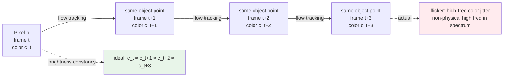

# Chapter 13 · Video is Not Just Images Plus Time

> "Run an image enhancement model on each frame and you have video enhancement."
>
> This is a very common beginner mistake.
>
> Video enhancement has the independent problem of temporal consistency - making each frame "good" individually does not guarantee the strung-together result is watchable.

## 13.0 Reading guide

The first twelve chapters essentially covered the world of "a single image": how to model degradation, how to build representations, how to train, how to evaluate. Starting with this chapter we enter Part IV, whose subject is **video**. The most misleading thing about video relative to images is that in terms of data shape it really is just "an image plus a time axis," so a natural-sounding idea is "run the image model on every frame." The main work of this chapter and Chapter 14 is to falsify that idea and then systematize the answer to "why it doesn't work" into engineerable countermeasures.

This chapter assumes the reader has internalized: the degradation and loss foundations of Chapters 1-3, the image-side model architectures of Chapters 6-10, and the evaluation methodology of Chapter 12. It does not assume the reader has previously worked with video codecs, optical flow estimation, or temporal modeling - every concept that comes up is given a full name and a one-line definition on first appearance.

After reading you should be able to answer: why running an image model on each frame flickers; how temporal consistency goes from a concept to a loss function; which artifacts video compression adds on top of JPEG that need special handling; what makes the common video enhancement tasks (VSR, VFI, denoising, deblurring) individually hard; how to choose between the sliding-window and recurrent paradigms; what extra metrics you should look at when evaluating video quality.

**Notational conventions.** The book-wide tensor notation continues to apply, plus a few video-specific symbols:

- $V$: a video clip, shape written $(T, C, H, W)$, with $T$ being the number of frames
- $I_t$: the image at frame $t$, shape $(C, H, W)$
- $F_{t \to t+1}$: the optical flow field from frame $t$ to frame $t+1$, shape $(2, H, W)$, with the two channels being horizontal and vertical displacement
- $\mathcal{W}(I, F)$: the result of warping (motion-compensating) image $I$ with flow $F$
- $M_t^{\text{occ}}$: the occlusion mask at frame $t$, with 1 meaning the pixel is trustworthy and 0 meaning it is occluded or the flow there is unreliable

**Abbreviations on first appearance.** The abbreviations used in the video chapters are listed here once; in the body of the text we use them without re-expanding:

- **VSR** (Video Super-Resolution): the task of taking low-resolution video to high resolution
- **VFI** (Video Frame Interpolation): synthesizing intermediate frames between two given frames, taking low-frame-rate video to high frame rate
- **TC** (Temporal Consistency): adjacent frames should differ only in ways that reflect real scene changes; the model itself must not introduce jitter or flicker
- **Brightness Constancy**: the assumption that the same point on the same object keeps essentially the same color between adjacent frames - the basis of almost all optical-flow methods
- **I-Frame / P-Frame / B-Frame**: the three frame types in video coding. I-frames (Intra) are independently coded, like a single JPEG image; P-frames (Predicted) are predicted from earlier I/P frames; B-frames (Bi-directional) reference I/P frames in both directions
- **GOP** (Group of Pictures): in video coding, a group of frames anchored on an I-frame (typically 30 frames per group), the basic unit of rate control and random access
- **TAA** (Temporal Anti-Aliasing): the technique used in games and real-time rendering of accumulating historical frames to suppress aliasing and noise - the rendering-side incarnation of "leverage adjacent-frame information"
- **TXAA**: NVIDIA's improvement over TAA, combining MSAA with temporal accumulation
- **DLSS** (Deep Learning Super Sampling): NVIDIA's technique of using a neural network on top of low-resolution game rendering plus historical frames to upsample to a high resolution
- **FSR** (FidelityFX Super Resolution): AMD's counterpart; 1.x uses classical algorithms, 2.x adds temporal accumulation, 3.x adds frame generation
- **DCN** (Deformable Convolution Network): a convolution whose kernel sampling positions are learned by the network, often used as implicit temporal alignment
- **BPTT** (Backpropagation Through Time): the standard training method for recurrent networks - unroll along the time dimension and backpropagate through the unrolled graph
- **NVDEC / NVENC**: the hardware video decoder / encoder units on NVIDIA GPUs
- **PTS** (Presentation Timestamp): the playback timestamp attached to each frame when decoding video

The math in this chapter goes no further than undergraduate vector calculus. The video-coding knowledge goes only as far as is needed to explain artifact phenomena - we do not get into the engineering details of entropy coding or motion estimation, which is its own field with its own books.

## 13.1 An intuitive failure case

Let us pin the problem down with a concrete scenario first.

Take a 720P phone-recorded low-quality clip and run Real-ESRGAN (from Chapters 6-7) on each frame independently at 4× to upscale to 4K. This is the most naive "run image model per frame" approach. Two views give sharply different verdicts:

- **Pulled out as single frames**: every frame is dramatically clearer than the original, with sharp edges and rich detail. Subjective MOS can rise from 2.5 to 4.0.
- **Played back as continuous video**: edges **flicker**, textures **shimmer**, details **ghost**. Subjective MOS drops back to 2.0 or lower.

A few characteristic symptoms can be listed:

- A completely static object (say, a picture frame on a wall) has slightly different texture details in each frame; played in sequence, it looks like it is "breathing"
- The eye tracks a uniformly moving object (say, a person walking across the frame) and the object's surface is "boiling," as if reflecting off water
- Flat regions (sky, walls, table tops) develop a flickering high-frequency texture, like the snow on old TVs
- Text edges have sub-pixel jitter between frames, which looks like "trembling" when played

Why does this happen? Take the cause apart:

> Real-ESRGAN is a **generative** model - it "generates" details on every image rather than "recovering" them (this distinction was stressed in Chapter 1).
> The inputs of the same object in two adjacent frames differ only slightly (from sensor noise, JPEG quantization, motion), but the generated details can be completely different.
> Visually: **temporal inconsistency** = flickering, boiling, jitter.

This is not a bug in Real-ESRGAN; it is **a phenomenon that all models without explicit temporal constraints exhibit on video**. Substituting SwinIR, HAT, or even the very recent SUPIR gives the same outcome. In fact, the stronger the generative capacity and the sharper the details, the worse the temporal inconsistency tends to be - this is a trade-off that recurs throughout the field.

To restate this conceptually: per-frame PSNR / LPIPS are **time-independent** metrics, so even perfect scores cannot guarantee that the sequence is stable along the time dimension. Video is fundamentally not just "more images" but **a new coordinate axis**, and this axis has its own loss, its own degradation, and its own evaluation metrics.

## 13.2 Temporal consistency is an independent problem

Let us restate the goal of video enhancement clearly so the rest of the discussion does not drift. Any video enhancement system must satisfy at least two goals simultaneously:

- **Spatial quality**: each frame is sharp enough, detail-rich enough, with few enough artifacts. This is a direct extension of the goal of image enhancement, and everything from Chapters 1-12 still applies.
- **Temporal consistency**: changes between adjacent frames reflect only real scene changes (an object really is moving, the camera really is moving, the lighting really is changing) and do not introduce "noise that the model invented."

These two goals **partially conflict** in engineering:

- More detail generation by the model → details on the same object may differ between frames → flicker
- More temporal stability → the model tends to output "safe blur," details get wiped out → PSNR up, LPIPS down, but subjective quality bad

The engineering difficulty of video enhancement is precisely **optimizing both goals at once**. Looking at the research trajectory, the past decade roughly went through three phases: phase one (around 2015) cared only about spatial quality and ignored temporal issues; phase two (2017-2020) explicitly brought optical flow and warping into networks and started addressing temporal issues systematically; phase three (2021 onward) turned to recurrent networks and cross-frame attention, encoding temporal information implicitly into the feature-propagation paths. Chapter 14 follows this trajectory through concrete models.

A blunt rule of thumb worth recording in advance: **if a video model beats an image model by 2 dB on single-frame PSNR but has no temporal loss and no multi-frame input, the comparison is unfair - it has not solved the video problem, it is just solving a better image problem.**

## 13.3 The physical basis of temporal consistency: optical flow

To turn "temporally consistent" from intuition into mathematics, we first need a tool that can describe "what corresponds to what between two frames." That tool is **optical flow**.

What does "temporally consistent" mean? The mathematical version: between two adjacent frames, the colors of corresponding pixels should be (essentially) unchanged. "Corresponding pixels" are defined by optical flow: the screen-space motion vector field of a point on an object's surface.

Notationally we write

$$
F_{t \to t+1}(x, y) = (u, v)
$$

meaning: the pixel at coordinate $(x, y)$ in frame $t$ has moved to $(x + u, y + v)$ in frame $t+1$. $u$ is the horizontal displacement, $v$ the vertical displacement, with units of pixels, possibly sub-pixel fractions. The whole flow field is $(H \times W)$ such 2D vectors.

On top of that, the minimal mathematical expression of temporal consistency is the **brightness constancy assumption**:

$$
I_{t+1}(x + u, y + v) \approx I_t(x, y)
$$

Intermediate step: Taylor-expand $I_{t+1}$ around $(x + u, y + v)$,

$$
I_{t+1}(x + u, y + v) \approx I_{t+1}(x, y) + \frac{\partial I_{t+1}}{\partial x} u + \frac{\partial I_{t+1}}{\partial y} v
$$

substitute the assumption and let $I_{t+1}(x, y) - I_t(x, y) = \partial I / \partial t$, and you obtain the classical optical-flow equation

$$
I_x u + I_y v + I_t = 0
$$

This is one equation per pixel with two unknowns ($u, v$), an underdetermined system. That is why "estimating optical flow" is itself ill-posed and requires extra constraints (local smoothness, sparsity assumptions, neural-network priors) to solve.

Drawing a single pixel's trajectory over time makes the intuition clearer. Suppose a red pixel moves along a diagonal at constant velocity through the video. Ideally its color is the same red in every frame; if the enhancement model substitutes a slightly different red in each frame, the time series of colors is a jittery curve, and the spectrum shows a high-frequency component that does not belong to the physical world - this is what flicker looks like in the frequency domain.



Conceptually this diagram answers what "temporally consistent" means: walking along a flow trajectory, pixel color should be a low-frequency curve over time; any high-frequency component is flicker.

If the enhancement model obeys brightness constancy, the output video is temporally consistent; if not, it flickers. Every loss function, alignment operation, and evaluation metric in the rest of this chapter is designed around this one inequality.

### Optical flow engineering

Optical flow estimation is its own subfield of computer vision, with more than three decades of history. Here we just list the methods currently in the engineering mainstream and the trade-offs between them.

Mainstream optical flow estimation methods:

- **Classical algorithms**: Lucas-Kanade (solving the flow equation on local patches), Farneback (polynomial expansion), TV-L1 (variational method, provided by OpenCV). Advantages: no training, runs on CPU. Disadvantages: handles large displacements and occlusion poorly.
- **Early deep learning**: FlowNet (2015) first learned flow end-to-end → FlowNet 2.0 (2017, stacked refinement) → PWC-Net (2018, pyramid + warping + cost volume). Accuracy improved markedly with each architecture iteration.
- **Current mainstream: RAFT** (Recurrent All-Pairs Field Transforms, 2020). RAFT builds a 4D cost volume from the similarity of all pixel pairs and uses a GRU to iteratively refine the flow over this volume in multiple steps. It is currently the most-used open-source flow network.
- **Subsequent refinements**: GMA (Global Motion Aggregation, 2021, adds cross-pixel aggregation), SEA-RAFT (Sparse and Efficient RAFT, 2024, speeds up inference by several times).

In the PyTorch ecosystem, RAFT has been incorporated into torchvision's official model zoo, so pretrained weights can be used directly:

```python
# Estimate optical flow with RAFT (recommended: torchvision's pretrained version)
from torchvision.models.optical_flow import raft_large, Raft_Large_Weights

weights = Raft_Large_Weights.C_T_SKHT_V2
preprocess = weights.transforms()
model = raft_large(weights=weights, progress=False).eval().cuda()


def estimate_flow(frame_a: torch.Tensor, frame_b: torch.Tensor) -> torch.Tensor:
    """
    frame_a, frame_b: (B, 3, H, W) RGB in [0, 1]
    returns: (B, 2, H, W) flow from a to b (u, v)

    Notes:
    - RAFT requires H and W to be divisible by 8; otherwise pad to a multiple of 8 then crop back
    - preprocess does the normalization, do not normalize twice
    - inference VRAM grows linearly with H*W, 4K on a single card can OOM, must tile
    """
    a, b = preprocess(frame_a, frame_b)
    with torch.no_grad():
        flow_list = model(a, b)
    return flow_list[-1]   # final iteration result
```

A few principles for picking an optical-flow method in production:

1. **Offline training stage**: use a high-accuracy but slow method like RAFT; flow quality directly determines whether the temporal-consistency loss does anything useful
2. **Online inference stage**: use lighter methods (PWC-Net, SEA-RAFT, or skip explicit flow and rely on DCN-style implicit alignment); latency matters
3. **Extremely low latency (mobile, real-time communications)**: drop explicit flow altogether and use 3D convolution or temporal attention for implicit alignment
4. **Occlusion handling**: any method needs a forward-backward consistency check (Section 13.5); one-directional flow cannot be trusted on its own

### Warping: transforming images with optical flow

Once flow is estimated, the most common next step is warping: given $F_{t \to t+1}$, warp frame $t+1$ into the viewpoint of frame $t$ so that the "same object" in the two frames lines up on the same pixel coordinates.

Mathematically, warping is just inverse sampling:

$$
\hat{I}_t(x, y) = I_{t+1}\big(x + u(x, y),\ y + v(x, y)\big)
$$

In PyTorch this is one line with `F.grid_sample`:

```python
import torch
import torch.nn.functional as F

def warp_with_flow(image: torch.Tensor, flow: torch.Tensor) -> torch.Tensor:
    """
    Use optical flow to warp image to the target position.
    image: (B, C, H, W)
    flow: (B, 2, H, W), unit is pixel displacement
    returns: warped image
    """
    B, _, H, W = image.shape
    # Create standard grid
    yy, xx = torch.meshgrid(
        torch.arange(H, device=image.device),
        torch.arange(W, device=image.device),
        indexing='ij',
    )
    grid = torch.stack([xx, yy], dim=0).float()  # (2, H, W)

    # Add flow
    grid = grid.unsqueeze(0) + flow              # (B, 2, H, W)

    # Normalize to [-1, 1] (required by grid_sample)
    grid_x = 2.0 * grid[:, 0] / (W - 1) - 1.0
    grid_y = 2.0 * grid[:, 1] / (H - 1) - 1.0
    grid_norm = torch.stack([grid_x, grid_y], dim=-1)  # (B, H, W, 2)

    return F.grid_sample(image, grid_norm, mode='bilinear',
                         padding_mode='border', align_corners=True)
```

A few pitfalls in the implementation:

- **Gradient flow**: `grid_sample` is differentiable with respect to `image`, but by default not with respect to `grid` (i.e. the flow). If you want to backpropagate flow gradients through warping (training the flow network end-to-end), you need to set `align_corners` and the right normalization, and confirm that your PyTorch version supports double-sided gradients.
- **padding_mode**: the default `zeros` makes out-of-bound positions black, which the loss then counts as "totally different." For video tasks `border` (edge replication) or `reflection` is the usual choice.
- **bilinear vs bicubic**: `grid_sample` defaults to bilinear, fast but soft; bicubic is sharper but doubles the VRAM.
- **Cumulative error from repeated warping**: every warp incurs sub-pixel interpolation loss; repeatedly warping a clip (e.g. forward then backward in a bidirectional recurrent setup) makes details progressively softer. This is why models like BasicVSR use feature-level warping rather than pixel-level warping.

Warping is the basic operation reused throughout video enhancement - to align adjacent frames, perform temporal aggregation, compute temporal consistency losses, and produce initial predictions for frame interpolation. Every section that follows uses it repeatedly.

## 13.4 Temporal consistency loss

Writing brightness constancy as a differentiable loss and adding it to the training objective is the most direct way to "retrofit" temporal constraints onto an image model.

```python
def temporal_consistency_loss(
    model_outputs: list,    # [out_t, out_t+1, ...]  enhanced frames
    flows: list,            # [flow_t→t+1, ...]
) -> torch.Tensor:
    """
    Use optical flow to verify: enhanced outputs of adjacent frames should
    satisfy brightness constancy.
    """
    loss = 0.0
    for t in range(len(model_outputs) - 1):
        out_t   = model_outputs[t]
        out_t_1 = model_outputs[t + 1]
        flow    = flows[t]

        # Warp out_{t+1} back to time t
        warped = warp_with_flow(out_t_1, flow)

        # Compute occlusion mask (positions where flow is unreliable)
        occlusion_mask = compute_occlusion_mask(flow)

        # Compute L1 at non-occluded positions
        loss = loss + (occlusion_mask * (out_t - warped).abs()).mean()

    return loss / max(1, len(model_outputs) - 1)
```

Add it to the total training loss:

$$
\mathcal{L} = \mathcal{L}_{\text{spatial}} + \lambda \mathcal{L}_{\text{temporal}}
$$

Empirical $\lambda$ is 0.1-0.5. Too small and it does nothing; too large and the model would "rather stay blurry than move."

The loss looks simple, but a few engineering details determine whether it actually works:

1. **Flow must be estimated from ground-truth input frames**, not from model output frames. Reason: model output details are generated and temporally inconsistent, so estimating flow from them would feed noise back into the constraint, which is backwards. Flow should be a "geometric ground truth."
2. **Feature-level consistency is more stable than pixel-level consistency.** Warping plus L1 on intermediate feature maps avoids pushing the model toward "safe blur" more effectively than doing it directly in RGB. See BasicVSR++'s feature-propagation design in Chapter 14.
3. **Multi-scale temporal loss**: applying the TC loss at several resolution levels makes the model maintain both large-range alignment and local detail stability.
4. **Gradient clipping**: at pixels where flow error is large, the loss gradient can blow up. Wrapping $(out_t - warped)$ in a Huber loss or clipping above a threshold is more stable than a plain L1.

## 13.5 Occlusion: where optical flow is unreliable

The brightness constancy assumption has two clearly failing regimes that must be explicitly masked out, or the temporal consistency loss becomes "forcing the model to align at the wrong places."

- **Occlusion**: an object is hidden by something in front and does not exist in frame $t+1$; the reverse is disocclusion, where regions are hidden in frame $t$ and revealed in frame $t+1$. The "correspondence" at these positions is mathematically undefined.
- **Motion blur + large displacement**: the flow estimate itself is wrong. RAFT, even under fast motion or heavy occlusion, can output "plausible-looking" flow whose actual positions are wrong.

The temporal consistency loss must **mask these positions out**. There are three common approaches to estimating an occlusion mask.

### Forward-backward consistency

If forward flow $F_{t \to t+1}$ and backward flow $F_{t+1 \to t}$, after warping, can "return to themselves," the pixel is trustworthy; otherwise it is either occluded or the flow is wrong.

Mathematically: in the ideal case $F_{t \to t+1}(x, y) + F_{t+1 \to t}(x + u, y + v) = 0$. That is, warping the backward flow to the viewpoint of frame $t$ and adding it to the forward flow should give zero.

```python
def forward_backward_check(flow_fwd: torch.Tensor,
                           flow_bwd: torch.Tensor,
                           threshold: float = 1.0) -> torch.Tensor:
    """
    Returns (B, 1, H, W) mask, 1 means the pixel is trustworthy.
    """
    # warp flow_bwd to the viewpoint of frame t
    warped_bwd = warp_with_flow(flow_bwd, flow_fwd)
    # Expectation: flow_fwd + warped_bwd ≈ 0
    diff = (flow_fwd + warped_bwd).norm(dim=1, keepdim=True)
    return (diff < threshold).float()
```

Threshold choice depends on the scene: 1 pixel is the default, scenes with large motion can loosen to 2-3 pixels.

### Warping residual

Another approach is to look directly at the color residual after warping:

$$
M^{\text{occ}}_t = \mathbb{1}\big[\|I_t - \mathcal{W}(I_{t+1}, F_{t \to t+1})\|_1 < \tau\big]
$$

Positions with a large color residual are declared occluded. This method works for static scenes but misjudges dynamic lighting (changes in illumination over time).

### Explicit occlusion-prediction network

A more modern approach is to train a network that directly predicts an occlusion mask, with the two frames plus the flow as input. MaskFlowNet is the representative work. Pros: accurate. Cons: requires a dedicated training pipeline.

In practice the first two methods used together are enough; occlusion-prediction networks show up mainly in dedicated video restoration / frame interpolation work.

## 13.6 Specifics of video degradation

Video is not just "many images"; its degradation model has video-specific content. Lifting the image degradation chain from Chapters 1 and 5 wholesale into video is not enough - video compression, motion blur, and rolling shutter are degradation sources that simply do not exist on the image side.

### Video compression artifacts

The basic idea of video codecs like H.264 / H.265 / AV1: every several dozen frames, an I-frame anchors a "full-image baseline"; P/B frames between them only encode "the changes" through motion compensation plus residual coding, saving large amounts of bitrate. The artifacts this design produces are far more complex than JPEG's.

Main artifact types:

- **Smearing from motion-estimation errors**: the encoder guesses the wrong direction of motion, leaving "ghost" trails along object edges after decoding. Worst in fast-motion scenes or on thin objects.
- **Periodic quality oscillation tied to keyframes (I-frames)**: I-frames get relatively generous bitrate and are coded independently with high quality; subsequent P/B frames degrade until the next I-frame resets things. During playback you can see roughly once-per-second "quality breathing."
- **GOP boundary effects**: at the boundary of a GOP (Group of Pictures, image group) the encoder resets the reference frame and the accumulated error is zeroed out, which can present as a frame suddenly going clear and slowly degrading again in a cycle.
- **Bitrate spikes**: rate control is a budgeting game - when a high-dynamic scene (explosion, transition, fast camera sweep) shows up, the encoder lacks enough bitrate to describe every detail and the picture collapses.
- **Chroma residue**: as with JPEG, the chroma channels are subsampled even more aggressively; color blocks and green/purple fringes show up as "chroma lag" in video.

If a video enhancement model is to "invert" these artifacts, the degradation-synthesis stage ideally reproduces them. Chapter 14 covers how BasicVSR++ / RealBasicVSR and similar models add H.264 encode-decode to their data synthesis via ffmpeg.

### Motion blur (motion-related)

Blur from camera shake or fast object motion. Unlike defocus blur in images, motion blur in video has two special properties:

1. **The direction follows the motion direction**: the blur kernel is approximately a line segment whose direction is determined by the displacement of the object (or camera) over the exposure time. Different objects in the same frame can have differently oriented blur.
2. **It is temporally causal**: the blur in frame $t$ is the result of light accumulation over the interval $[t - \Delta, t]$. In theory, knowing the sharp version of several consecutive frames lets you "reconstruct" the blur kernel.

The key insight in video deblurring: **use adjacent frames to provide a "sharp reference."** If a region of frame $t$ is blurred but the same region in frame $t+1$ happens to be sharp (the instant motion stops, or when the motion direction changes and simplifies the kernel), it can be borrowed. This is the basic operating principle of video deblurring networks like EDVR and CDVD-TSP.

### Rolling shutter

The vast majority of phone and drone CMOS sensors read out row by row (or block by block): starting at the top of the image, a new row is read every few dozen microseconds, and the whole image takes 10-30 milliseconds. If objects or the camera move during this window, geometric distortion results:

- Static objects keep their shape
- Horizontally moving objects appear "skewed" (the jello effect)
- Rotating objects show a "spiral twist"
- Vertical straight lines bend during fast horizontal camera sweeps

This is a degradation specific to phone video; professional global-shutter cameras (CCD or CMOS global shutter) and old film / celluloid do not have it.

De-rolling algorithms exist (RSCD and others) but typically need IMU data or multi-frame flow estimation of the scan offset. In general video enhancement it is usually not handled directly - it is treated as "small-amplitude geometric noise" and smoothed out by other temporal constraints.

### Video-specific synthesis pipeline

The image degradation pipeline from Chapter 5 needs to be extended for video. The most important difference: **degradation parameters within one clip must be correlated**, rather than independently sampled per frame.

```python
class VideoDegradation:
    """Video degradation synthesis pipeline."""

    def __init__(self, image_degrader_cls):
        # image_degrader_cls should accept explicit degradation parameters (blur_kernel, noise_sigma, ...)
        # so we can share one set of parameters across a clip rather than resampling per frame
        self.image_degrader_cls = image_degrader_cls

    def __call__(self, hr_video: torch.Tensor) -> torch.Tensor:
        """
        hr_video: (T, 3, H, W) high-quality video frames
        returns: lr_video (T, 3, H/4, W/4) degraded
        """
        T = hr_video.shape[0]

        # 1. Key: a clip shares one set of degradation parameters
        # blur kernel, noise sigma, JPEG quality stay fixed for a clip; otherwise the model
        # will learn the incorrect distribution where "every frame is degraded differently",
        # which introduces temporal inconsistency
        clip_params = self._sample_clip_params()
        image_degrader = self.image_degrader_cls(**clip_params)

        lr_video = torch.stack([
            image_degrader(hr_video[t:t+1])
            for t in range(T)
        ], dim=0).squeeze(1)

        # 2. Video-specific degradations (whole clip together)
        lr_video = self._add_motion_blur(lr_video)
        lr_video = self._video_compression(lr_video)
        lr_video = self._frame_drop_jitter(lr_video)  # occasionally drop / repeat frames

        return lr_video

    def _sample_clip_params(self):
        """Sample one set of degradation parameters, shared by the entire clip."""
        return {
            'blur_sigma': random.uniform(0.5, 3.0),
            'noise_sigma': random.uniform(0.005, 0.05),
            'jpeg_quality': random.randint(40, 95),
        }

    def _video_compression(self, video):
        """Simulate H.264/H.265 compression.
        In practice, encode/decode via ffmpeg, called engineering-wise via torchvision.io
        or external invocation.
        """
        # Simplified: omitted
        return video

    def _add_motion_blur(self, video):
        """Add motion-direction-related motion blur per frame."""
        # Simplified: omitted
        return video

    def _frame_drop_jitter(self, video):
        """Simulate frame drop / duplicate jitter."""
        return video
```

Engineering challenges of video degradation synthesis:

1. **Large data volumes**: 30 frames per second, a multi-minute video equals thousands of images. Training samples are usually truncated to 7-15 frame clips, but I/O is still a bottleneck.
2. **Temporally consistent degradation**: certain degradation parameters within a clip must be fixed, to avoid the model learning the wrong "different degradation every frame" distribution. But making them completely static is not realistic either - in real video ISO, white balance, and focus genuinely drift slowly, so a more refined scheme is to have parameters do a smooth random walk over time rather than staying frozen.
3. **Differentiable ffmpeg**: ideally a differentiable H.264 encoder so compression artifacts can backpropagate gradients, but there is no perfect solution. Work like RealBasicVSR compromises with "non-differentiable ffmpeg + detached gradients."

## 13.7 The main video enhancement tasks

| Task | Input | Output | Main challenge |
|------|------|------|---------|
| **Video SR (VSR)** | Low-resolution video | High-resolution video | Temporal consistency + leveraging multi-frame information |
| **Video denoising** | Noisy video | Clean video | Leverage "clean copies" from adjacent frames |
| **Video deblurring** | Blurred video | Sharp video | Blur kernel varies in space and time |
| **Frame interpolation (VFI)** | Low frame-rate video | High frame-rate video | Intermediate frames don't exist and must be generated |
| **Video stabilization** | Shaky video | Stabilized video | Distinguish camera shake from real motion |
| **Video colorization** | Black-and-white video | Colored video | Color temporal consistency |
| **Video inpainting** | Scratched / missing-content video | Clean video | Use prior/next frames to fill |

A brief expansion of the core difficulty for each:

- **VSR** is both the most classic video enhancement task and the easiest to compare against image-side SR. The difficulty is not that each frame is too low-resolution, but how to aggregate the sub-pixel information across adjacent frames - this is where video has an advantage over images (multiple frames contain complementary sub-pixel information) and where, done badly, you degrade to "image SR + flicker." Chapter 14's main thread is VSR.
- **Video denoising** versus image denoising: adjacent frames contain "multiple independent samples of the same scene," so in the ideal case averaging $N$ frames reduces noise variance by a factor of $N$. VBM4D, FastDVDnet, and EMVD all build on this principle. The difficulty is motion - averaging works wonders on static regions but blurs moving ones.
- **Video deblurring** is typically framed as "find the sharpest frame within a time window and propagate it via alignment." EDVR, CDVD-TSP, and Restormer-video are representative.
- **VFI (frame interpolation)** is fundamentally different from the above: the output frame's ground truth does not exist in the input. The model has to "generate" the intermediate frame. SuperSloMo, RIFE, and FILM are representative; Chapter 14 develops RIFE.
- **Video stabilization** is a geometric problem, not a pixel problem. It estimates each frame's global motion (a homography or similar transform), smooths the trajectory, and then warps frames back to a stabilized camera viewpoint. Google Pixel's Fused Video Stabilization is an industrial benchmark.
- **Video colorization** hinges on color temporal consistency - the same object cannot be red at second 1 and blue at second 3. The usual approach is reference-based colorization (a few keyframes are colorized by hand and propagated to the whole video).
- **Video inpainting** includes scratch removal, gap filling, watermark removal, and subtitle removal. FuseFormer and ProPainter are SOTA. The difficulty is "seeing through" occluded / missing regions to fill from earlier and later frames.

## 13.8 Two paradigms of video enhancement

Categorizing by "how multi-frame information is used" gives two classes, the most basic taxonomy of video-enhancement network architectures.

### Sliding window

Each call processes $N$ frames (typically $N = 5$ or $7$) and outputs the enhancement of the middle frame:

```
Window 1: [F_1, F_2, F_3, F_4, F_5] → F_3'
Window 2: [F_2, F_3, F_4, F_5, F_6] → F_4'
Window 3: [F_3, F_4, F_5, F_6, F_7] → F_5'
...
```

Representatives: EDVR, ToFlow.

Pros:

- **Training is simple**: each window is an independent sample, an ordinary DataLoader is enough
- **Inference can be parallel**: each window is processed independently, high GPU utilization
- **Clear boundaries**: every frame's "context window" is fixed, easy to debug

Cons:

- **Limited temporal window**: dependencies past the window size cannot be seen (a 5-frame window cannot use information from 10 frames earlier)
- **Tedious boundary handling**: windows at the start and end of the video are missing frames; symmetric mirror padding is common but introduces artifacts
- **Repeated computation**: adjacent windows overlap heavily, and features get recomputed many times

### Recurrent

Each frame's processing leverages the hidden state of the previous frame:

```
F_1 → F_1' + h_1
F_2, h_1 → F_2' + h_2
F_3, h_2 → F_3' + h_3
...
```

Representatives: BasicVSR, BasicVSR++, IconVSR.

Pros:

- **Long-range temporal information available**: in theory the hidden state can carry arbitrarily long-distance dependencies
- **Inference memory is fixed**: only the current hidden state is kept; unlike sliding windows there is no need to hold the whole window in VRAM
- **Naturally supports streaming input**: applicable to livestream / real-time enhancement scenarios

Cons:

- **Training is complex**: BPTT (Backpropagation Through Time) requires unrolling many frames; VRAM grows linearly with the unroll length
- **Inference must be serial**: each frame depends on the previous frame's hidden state, no parallelism across frames
- **Hidden-state forgetting**: in long videos, early information is overwritten; specialized memory mechanisms are needed

### Hybrid: Bidirectional Recurrent

BasicVSR introduced **bidirectional** recurrence:

```
Forward:  F_1 → F_2 → F_3 → ...    produces h^f_t
Backward: ... → F_3 → F_2 → F_1    produces h^b_t
Merge:    F_t' = G(F_t, h^f_t, h^b_t)
```

This lets each frame leverage past and future information, and is the de facto standard for VSR. The cost is losing the ability to do streaming inference - the whole clip must be read before anything can be emitted.

Chapter 14 will lay out the bidirectional feature propagation of BasicVSR / BasicVSR++ in detail, including second-order grid propagation, which extends the architecture by connecting all frames pairwise into a graph.

## 13.9 Temporal alignment: making multi-frame information actually usable

When aggregating multi-frame information, you must first **align** - warp the other frames to the viewpoint of the current frame. Otherwise simply concatenating multi-frame features only lets the model "see different objects at the same pixel position," which actively disrupts judgment.

Alignment methods can be roughly grouped into three categories based on whether they use optical flow explicitly.

### Explicit alignment (using optical flow)

```python
def explicit_align(frames: torch.Tensor, ref_idx: int = None) -> torch.Tensor:
    """
    Warp all frames to the viewpoint of the center frame.
    frames: (B, T, C, H, W)
    """
    if ref_idx is None:
        ref_idx = frames.shape[1] // 2

    ref = frames[:, ref_idx]
    aligned = []
    for t in range(frames.shape[1]):
        if t == ref_idx:
            aligned.append(ref)
            continue
        flow = estimate_flow(ref, frames[:, t])
        aligned.append(warp_with_flow(frames[:, t], flow))
    return torch.stack(aligned, dim=1)
```

Pros: clear physical meaning, interpretable, easy to debug.
Cons: depends on optical flow accuracy; flow errors cascade into alignment and aggregation, dragging down the whole network.

### Implicit alignment (deformable convolution)

EDVR and similar models use **DCN (Deformable Convolution Network)** to learn alignment:

- No explicit optical flow estimation
- The convolution kernel's sampling positions are learned (each spatial position predicts a set of offsets that "warps" the fixed kernel grid to suitable positions)
- The network handles "where to look" automatically

Pros: can handle cases where optical flow is hard to estimate (semi-transparent, complex occlusion, blurred regions).
Cons: complex CUDA implementation, training instability (DCN offsets tend to blow up early in training), hard to interpret. The EDVR paper goes to substantial effort explaining how to stabilize DCN.

### Attention alignment

A more modern approach: aggregate across frames with self-attention:

- Each pixel attends to all pixels in adjacent frames (or a window-constrained subset)
- The network automatically learns the correspondence
- No explicit optical flow is needed, and no DCN-style offset prediction either

Representatives: VRT (Video Restoration Transformer), RVRT (Recurrent Video Restoration Transformer). Heavy compute but strong results; the mainstream direction in VSR after 2022.

Which alignment method to choose in engineering depends on the scenario:

- **Academic benchmarks (REDS, Vimeo-90K)**: attention alignment gets the best numbers and is the default for current SOTA
- **Production deployment / real-time settings**: DCN or explicit flow are cheaper; attention's $O(N^2)$ complexity is simply infeasible at 4K
- **Minimal streaming settings**: pure conv + hidden-state propagation, no explicit alignment, letting the recurrent structure learn alignment implicitly

## 13.10 Evaluation of video enhancement

Video evaluation extends the metrics in Chapter 4 and Chapter 12 with:

### Temporal metrics

Video-specific temporal-quality metrics:

- **tOF (temporal Optical Flow consistency)**: estimate the optical flow of the input video and of the output video, then compare them. The physical intuition is "the output should move the way the input moves."
- **tLP (temporal LPIPS)**: LPIPS distance between adjacent frames (after optical-flow alignment). Smaller means more consistent.
- **WE (Warping Error)**: warp the output's frame $t+1$ back to frame $t$'s viewpoint with ground-truth flow and compute L1 against frame $t$. Similar to tLP but using pixel error rather than perceptual distance.
- **Flickering Index**: quantifies in the frequency domain the energy of "non-physical high frequencies" in the per-pixel color time series. Closer to the intuition of "flicker," but rarely used in engineering practice.

```python
def temporal_lpips_warped(frames: torch.Tensor, flows: list,
                          lpips_fn) -> float:
    """
    frames: (T, C, H, W) — enhanced video frames
    flows: length T-1, each is (1, 2, H, W) forward flow t -> t+1
    returns: average LPIPS between adjacent frames (after motion compensation).
    Smaller is more consistent.

    Important: do NOT directly compute LPIPS(frame[t], frame[t+1]); that would
    count real motion as "temporal inconsistency". You must align first by warping
    with optical flow.
    """
    losses = []
    for t in range(frames.shape[0] - 1):
        warped = warp_with_flow(frames[t+1:t+2], flows[t])
        losses.append(lpips_fn(frames[t:t+1], warped).item())
    return sum(losses) / len(losses)
```

### Video-specific subjective evaluation

You cannot just look at single frames - you must watch playback. Procedure:

1. Play a complete video clip (5-10 seconds) for the rater
2. Rate using MOS or 2AFC
3. Loop the playback multiple times (so the rater can pick up on detail-level flicker)

Subjective evaluation is **even more important for video than for images** - flickering is something the eye sees but per-frame metrics miss. The user-study design principles from Chapter 12 all still apply for video, except that each trial takes longer and the unit cost is higher.

### Evaluation duration

Sample sizes for video evaluation are larger. Reasons:

- Flicker / artifacts are intermittent; a few seconds of video can happen not to trigger them
- Different scenes vary greatly (static vs. high-motion, indoor vs. outdoor)
- Raters need a few seconds of viewing before forming a judgment

Empirical: video subjective evaluation uses 5-10 second clips, at least 50-100 clips per model. Translated to rater hours, a serious video user study costs 5-10× more than an image one.

## 13.11 Relation to temporal accumulation techniques

There are a few neighboring directions outside video enhancement that overlap heavily in solving "leverage historical frames" problems but have different goals. We point them out briefly so the reader does not conflate them.

- **TAA / TXAA** (temporal anti-aliasing in game rendering): every frame rendered by a game has aliasing and noise; TAA warps the previous frame into the current viewpoint and computes a weighted average, averaging aliasing out over time. This is essentially "non-neural video denoising + anti-aliasing"; the ghosting / clamp / disocclusion problems it has to solve are exactly the ones from video enhancement.
- **DLSS / FSR / XeSS**: in games, take low-resolution rendering + historical frames + motion vectors (the game engine can hand them over directly) and upsample to high resolution through a neural network. This amounts to "VSR with exact optical flow" - in games, geometric motion can be produced directly by the engine, so flow estimation is unnecessary and the quality ceiling is much higher than general-purpose VSR.
- **VSR**: the main thread of this chapter and Chapter 14. Optical flow has to be estimated, motion vectors have no ground truth, so the problem is strictly harder than DLSS.

The engineering trade-off is clear: if you can get precise motion information from the scene source (games, synthetic video), take it, and your model can be lighter; if you cannot (phone recordings, internet video), you must estimate flow yourself, and your model has to be heavier.

## 13.12 Differences between video enhancement and video generation

To avoid confusion, **video generation** (Sora, Kling, Veo) and **video enhancement** are different directions:

| Dimension | Video enhancement | Video generation |
|------|---------|---------|
| Input | Existing low-quality video | Text prompt (no video input) |
| Goal | Improve quality, preserve content | Create a new video |
| Temporal constraint | Strictly follows the original timing | Free generation |
| Evaluation | Compare against GT | Subjective rating / FVD |
| Current SOTA | BasicVSR++, Topaz Video AI | Sora, Kling, Veo3 |

This book covers only the former. Two directions are worth flagging:

- **Video generative models as priors**: using the latent space of a large video diffusion model as a prior for video enhancement (analogous to using image diffusion priors for super-resolution in Chapter 8) is an active direction starting in 2024; Upscale-A-Video is representative.
- **Risks of generative video enhancement going off the rails**: as on the image side with SUPIR, the more generative a video enhancement model is, the more easily it "invents" details that were not in the original; under heavier motion it can even change the shape of objects. In forensic / medical / surveillance settings this is a deal-breaker.

## 13.13 Engineering challenges of video enhancement

Beyond the algorithm, video enhancement has several engineering-specific difficulties. This section is relatively practical, summarizing the pitfalls that come up repeatedly in real deployments.

### Data storage and loading

- Video is orders of magnitude larger than images (each clip on the order of GB)
- Random clip sampling at training time (clip sampling): typically pick a random start point in one video and take 7-15 frames
- Decoding H.264 / H.265 is a CPU bottleneck; on single-card training the dataloader frequently becomes the bottleneck of the whole system
- NVDEC hardware decoding is recommended: NVIDIA GPUs have built-in video decoder units that are more than 10× faster than CPU decoding

```python
# Use torchvision.io for hardware decoding (PyTorch 2.0+)
import torchvision

reader = torchvision.io.VideoReader("video.mp4", "video", num_threads=4)
for frame in reader:
    pts = frame['pts']
    img = frame['data']
    # process...
```

Common engineering optimization moves: pre-decode the training video into compressed numpy files, or use a GPU-accelerated dataloader library like NVIDIA DALI.

### Memory management at inference

5 frames of 4K video = 5 × 4 × 3840 × 2160 × 4 bytes ≈ 400 MB (FP32). Model activations are tens of GB. **Must use patches + tiles + streaming processing**:

- Spatial tiling: split each frame into 512×512 patches and process independently, then stitch back. Overlap is required to avoid boundary artifacts.
- Temporal tiling: split long video into 30-60 frame chunks and process independently. Chunk boundaries need a few overlapping frames to avoid breaking the recurrent network's hidden state.
- FP16 / BF16 inference: halves VRAM, with virtually no loss on mainstream GPUs.

### Real-time enhancement

Video conferencing, livestreaming, and camera preview require < 33 ms per frame (30 FPS) or even < 16 ms (60 FPS). In this scenario:

- Cannot use diffusion models (a single step is several hundred ms)
- Cannot use heavy attention networks
- Must be CNN + on-device acceleration (CoreML, NCNN, TensorRT)
- May need to trade quality for speed

Chapter 15 will discuss on-device / real-time deployment in detail.

## 13.14 A useful diagnostic flow

A last practical tool: when you have a video enhancement system that performs poorly, how do you localize the problem?

1. **Pull single frames and look at PSNR / LPIPS**: if even the single-frame metrics are bad, the problem is in spatial quality - go back and look at the image-side model.
2. **Look at the temporal metrics (tOF / tLP)**: if single frames are good but temporal metrics are bad, the model has not learned the temporal constraints. Add a TC loss or switch to a model with temporal structure.
3. **Look at the optical flow itself**: visualize the flow used during training; if it is a mess, the temporal constraint is useless. Switch to a stronger flow model or train a task-specific flow network.
4. **Look at the occlusion mask**: if the mask frequently misclassifies (treating motion as occlusion), the TC loss does not constrain where it should, and the model still flickers.
5. **Look at the synthesis pipeline**: if the training degradation pipeline has no video compression and the model breaks on real compressed video, go back and add ffmpeg.
6. **Look at clip length**: if training clips are too short (< 5 frames), the model has no chance to learn long-range temporal dependencies; extend to 15+ frames and re-evaluate.

This diagnostic flow comes up repeatedly when training concrete models in Chapter 14.

## 13.15 Summary

1. **Video enhancement is not image enhancement × N** - temporal consistency is an independent goal
2. **Flickering comes from temporal inconsistency** - good frames do not imply good video
3. **Optical flow is the foundation of temporal processing** - RAFT is the current standard
4. **Warping + brightness constancy** define "temporally consistent"
5. **Occlusion masks are mandatory** - the loss should not be computed where flow is unreliable
6. **Video degradation is more complex**: H.264 / H.265 compression, motion blur, rolling shutter, I/P/B-frame periodic quality
7. **Sliding window vs Recurrent**: two paradigms with different trade-offs
8. **Bidirectional Recurrent (BasicVSR)** is the de facto standard for VSR
9. **Alignment methods**: explicit optical flow, deformable convolution, cross-frame attention
10. **Video evaluation must include temporal metrics** (tOF / tLPIPS) + **subjective playback**
11. **Engineering challenges**: data storage, decoding bottlenecks, memory management, real-time constraints
12. **Diagnostic flow**: layer-by-layer localization from single-frame metrics to flow to clip length

In the next chapter we look at concrete video enhancement models: BasicVSR++, RIFE frame interpolation, video inpainting - grounding the concepts of this chapter into concrete networks.

---

> Next chapter [VSR / Frame Interpolation / Video Inpainting](14-video-models.md) → BasicVSR++, RIFE, FILM, and video stabilization.
