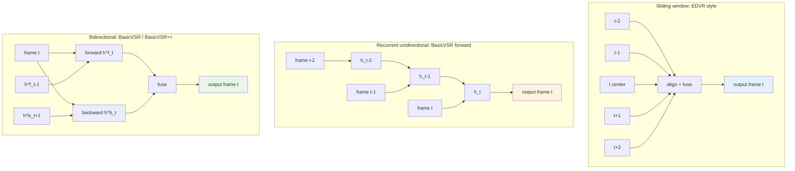
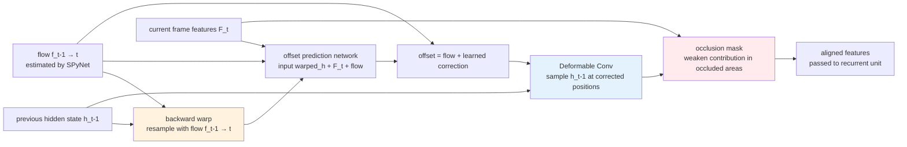
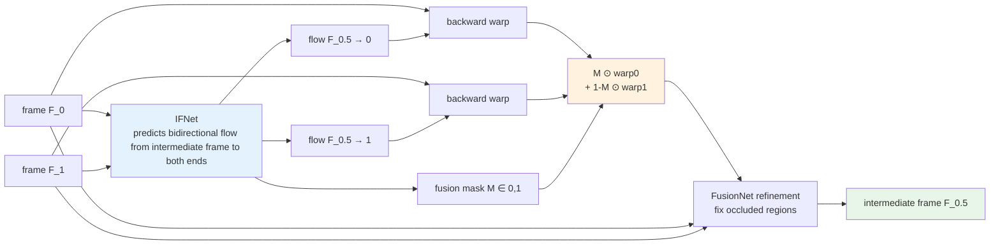

# Chapter 14 · VSR / Frame Interpolation / Video Inpainting

> Chapter 13 established the fundamental concepts of video enhancement: temporal consistency, optical flow, alignment.
>
> This chapter looks at concrete models: BasicVSR++, RVRT, RIFE/FILM, video stabilization.
>
> These models ground the concepts of Chapter 13, each with different engineering trade-offs.

## 14.0 Scope and prerequisites

From a model-design perspective, video enhancement has one fundamental constraint beyond images: **the time dimension**. Not only must the same object be sharp in adjacent frames, it must "line up" with itself at the pixel level, or the result visually flickers, jitters, and texture-pops. Chapter 13 already discussed how this temporal consistency is defined, why optical flow and alignment are necessary, and why bidirectional propagation is more stable than unidirectional. This chapter assumes these basics are in mind and focuses on **how concrete models turn those concepts into trainable, deployable networks**.

After reading you should be able to answer the following questions:

- In video super-resolution (VSR), what are the trade-offs among sliding-window, recurrent, and bidirectional structures?
- What failure modes are BasicVSR++'s "second-order propagation" and "flow-guided deformable alignment" specifically solving?
- After VRT / RVRT brought Transformers into VSR, what did they buy versus BasicVSR++, and what did they pay?
- Why does video frame interpolation (VFI) not directly reuse general optical-flow models, but instead train a dedicated IFNet that estimates "intermediate frame to both endpoints"?
- Why does video deblurring enjoy the structural advantage of "sharp copies in adjacent frames"?
- Why is old-film restoration, a craft-heavy task, handled by a multi-step pipeline rather than a single model?

Reading note: most code fragments in this chapter are skeletons (stubs) that cannot be trained directly; the goal is to spell out the architecture's key data flows. Full implementations can be found in mmagic (formerly mmediting, OpenMMLab's low-level vision toolbox) and the official repos of each project.

**Abbreviations on first appearance.** As in Chapter 1, the first time each abbreviation appears we give a full name in parentheses and a one-line definition:

- **VSR** (Video Super-Resolution): taking low-resolution video to high resolution while meeting both spatial sharpness and temporal consistency
- **VFI** (Video Frame Interpolation): synthesizing intermediate frames between two given frames, taking low-frame-rate video to high frame rate
- **EDVR** (Enhanced Deformable Video Restoration, 2019): the first sliding-window VSR using deformable conv for alignment; the NTIRE 2019 challenge winner at CVPR Workshops
- **TDAN** (Temporally Deformable Alignment Network): early VSR using deformable conv as an "implicit optical flow" for alignment
- **BasicVSR** (2021): the first VSR baseline to make bidirectional recurrence + explicit optical flow alignment a SOTA combination
- **IconVSR**: the "info-fused" variant from the same BasicVSR paper, which extracts multi-frame information into keyframes for subsequent propagation
- **BasicVSR++** (2022): BasicVSR's upgrade, adding second-order propagation and flow-guided deformable alignment
- **VRT** (Video Restoration Transformer, 2022): brings window Transformers into VSR, with attention along the time axis
- **RVRT** (Recurrent Video Restoration Transformer, 2023): the recurrent version of VRT, replacing part of the long-range attention with recurrence to control compute
- **DCN** (Deformable Convolutional Network): a convolution where every kernel sampling position carries a learnable offset, letting the conv "aim at" irregular positions
- **RIFE** (Real-time Intermediate Flow Estimation, 2022): a VFI method that directly estimates "intermediate frame to both endpoints" flow
- **IFNet** (Intermediate Flow Network): the sub-network in RIFE dedicated to predicting intermediate-frame flow
- **FILM** (Frame Interpolation for Large Motion, Google 2022): a VFI method built on multi-scale recursive flow estimation, strong on large displacement
- **AMT** (All-pairs Multi-field Transforms, 2023): adds attention on top of RIFE; more robust to occlusion
- **MIMO-UNet** (Multi-Input Multi-Output UNet): a video deblurring architecture that processes independently at different resolutions and then fuses
- **ProPainter** (ICCV 2023): current SOTA video inpainting method; inpaints flow first, then frames
- **E2FGVI** (End-to-end Flow-Guided Video Inpainting, CVPR 2022): end-to-end flow-guided video inpainting
- **GOP** (Group of Pictures): in video coding, a group of frames starting from one I-frame and forming an independent decoding unit
- **REDS** (Realistic and Dynamic Scenes): the standard VSR dataset from NTIRE 2019, 270 training + 30 test clips
- **VMAF** (Video Multi-Method Assessment Fusion): the video-quality metric Netflix released in 2016, fusing several sub-metrics, trained on real human ratings
- **FVD** (Fréchet Video Distance): a distribution-distance metric that extends FID to video, commonly used for generative video
- **tOF / tLPIPS**: temporal versions of optical-flow consistency / LPIPS consistency, measuring alignment and perceptual difference between adjacent frames
- **NAFNet** (Nonlinear Activation Free Network, 2022): a minimal low-level vision network that replaces nonlinearity with gating multiplications
- **GoPro**: the de facto video-deblurring dataset; uses a 240 fps high-speed camera to average multiple frames into a synthesized "blurred frame" with the original frame as ground truth

More abbreviations are introduced inline as they appear.

## 14.1 Structure of this chapter

The four sub-tasks below are independent in video enhancement but mutually depend on one another in practice. VSR and deblurring both focus on "each frame being sharper," frame interpolation focuses on "more frames," video inpainting focuses on "content completion," and stabilization focuses on "geometric stability between frames." A real video enhancement pipeline typically chains several of them together in some order.

```
14.2-14.5  Video super-resolution (VSR): BasicVSR → BasicVSR++ → RVRT
14.6       Frame interpolation (VFI): RIFE, FILM, AMT
14.7       Video deblurring
14.8       Video inpainting
14.9       Video stabilization
14.10-14.11 Engineering combinations and evaluation
```

Each task gets one representative model plus a few engineering points. This chapter does not aim to cover every method - only the main threads that are still being used in production environments in 2024-2026.

## 14.2 The evolution of video super-resolution (VSR)

The VSR evolution path is similar to image SR but two years later:

```
2017  VESPCN     - first end-to-end VSR
2018  TDAN       - implicit alignment (DCN)
2019  EDVR       - sliding window + DCN alignment
2020  RBPN       - recurrent + multi-frame compensation
2021  BasicVSR   - bidirectional recurrent + explicit optical flow alignment
2022  BasicVSR++ - second-order propagation + flow-guided DCN
2022  VRT        - temporal Transformer
2023  RVRT       - efficient recurrent Transformer
```

**BasicVSR++** is the de facto standard for 2022-2024 - simple, strong, fast. Detailed below.

### Three VSR architectures compared

Compressing the timeline above into structure, you can see that VSR models mainly choose among three "temporal aggregation modes," each corresponding to a particular engineering trade-off:

- **Sliding window** (EDVR-style): to output one frame, independently take N frames around it (typical N = 5 or 7), align them to the center frame, and fuse. **Pros**: simple structure, direct training, naturally supports random access. **Costs**: no explicit feature reuse between adjacent output frames, so long-range temporal information has to be stacked by enlarging the window.
- **Recurrent** (the forward direction of BasicVSR): maintain a hidden state $h_t$ that updates along the time direction; each frame computes a new $h_t$ from $h_{t-1}$ and the current frame's features. **Pros**: long-range information is packed into the hidden state, VRAM-friendly, compute-efficient. **Costs**: a unidirectional RNN cannot see future frames, with a ceiling on detail recovery when motion is in the reverse direction.
- **Bidirectional** (BasicVSR / BasicVSR++): run two RNNs in parallel, forward and backward, and at each time step fuse the two hidden states. **Pros**: any frame has access to both past and future information; best long-range temporal consistency. **Costs**: must have the whole clip (or a sufficiently long buffer) to run; real-time settings are limited.

The diagram below shows all three modes in one place, noting carefully the direction of arrows and where aggregation happens:



Selection rules in engineering:

1. **Offline video files** with sensitivity to a quality ceiling (restoration, editing, transcoding enhancement) → bidirectional.
2. **Real-time streams** (livestreaming, video conferencing, AR pass-through): must be causal recurrent (only history allowed); bidirectional is not available.
3. **Image sequences with weak scene continuity** (e.g. batch-enhancement of slides): sliding window is more robust than RNN, because the hidden state gets polluted at scene cuts.

These three modes are not mutually exclusive: BasicVSR++'s overall structure is essentially "bidirectional + second-order propagation + DCN-corrected flow," while the later RVRT mixes "recurrence + cross-frame attention." Architectural differences mainly determine **VRAM footprint, latency, future-frame dependency, and cross-scene robustness**.

## 14.3 BasicVSR++ in detail

Chan et al. proposed BasicVSR++ in 2022, a representative of the bidirectional recurrent architecture from Chapter 13, Section 13.8. Its design choices remain the first-pick baseline for most 2024-2026 VSR products (offline video transcoding enhancement, long-video post-processing), because the structure is simple, training is stable, and inference VRAM is predictable.

### Overall structure

```
                    Feature extraction
LR frames ─────────────→ feature maps F_t
                              │
                              ↓
        ┌─────────────────────┴─────────────────────┐
        │                                            │
        ▼ Forward propagation                        ▼ Backward propagation
        h^f_1 ─→ h^f_2 ─→ ... ─→ h^f_T              h^b_T ─→ h^b_{T-1} ─→ ... ─→ h^b_1
        Each step aligns the previous hidden state with optical flow
        │                                            │
        └─────────────────────┬─────────────────────┘
                              ↓
                      Aggregation (concat + conv)
                              │
                              ↓
                      Upsample (PixelShuffle)
                              │
                              ↓
                      HR frames
```

### Key innovation 1: second-order propagation

A plain bidirectional RNN uses only the previous step at each step:

$$
h_t = G(F_t, h_{t-1})
$$

BasicVSR++ uses **second-order**:

$$
h_t = G(F_t, h_{t-1}, h_{t-2})
$$

Why does this help?

- First-order: $h_{t-1}$ is warped from $h_{t-2}$, which was warped from earlier ones; optical flow errors accumulate along the way
- Second-order: directly access $h_{t-2}$, bypassing the accumulated error of $h_{t-1}$
- **Corrects local errors of the optical flow**

### Key innovation 2: Flow-Guided Deformable Alignment

Combines optical flow with deformable convolution. Before reading the code, let us spell out the data flow. "Flow-guided" means **first warp the previous hidden state into the current frame's viewpoint using optical flow**, then let the DCN refine the warped features locally; the DCN offsets are not learned from zero but are a small correction on top of the flow.

The diagram below traces the chain of "warp + occlusion mask + DCN refinement":



The occlusion mask is usually learned implicitly as an extra DCN channel, or computed directly from the forward-backward consistency error of the flow (large error → treat as occlusion, downweighting the warped features).

Why "flow + DCN" is more robust than flow alone:

- Use optical flow to give the deformable convolution an **initial sampling position**, effectively injecting physical meaning into the DCN
- Let the DCN learn **a correction to the flow**; when the flow is one or two pixels off, the DCN can still pull it back
- In fast-motion / partial-occlusion settings, pure flow warping produces obvious ghosting; DCN's multi-point sampling mitigates this

```python
class FlowGuidedDCN(nn.Module):
    """Flow-guided deformable alignment (BasicVSR++)."""

    def __init__(self, channels: int, num_groups: int = 8):
        super().__init__()
        # Predict the DCN offset correction (relative to optical flow)
        self.offset_conv = nn.Conv2d(
            channels * 2 + 2,         # h_prev + features + flow
            num_groups * 2 * 9,        # 9 sampling points × 2 dims × num_groups
            3, padding=1,
        )
        # The actual deformable conv (using torchvision's DeformConv2d here)
        from torchvision.ops import DeformConv2d
        self.dcn = DeformConv2d(channels, channels, 3, padding=1, groups=num_groups)

    def forward(self, h_prev, features_t, flow):
        """
        h_prev: previous hidden state (B, C, H, W)
        features_t: current frame features (B, C, H, W)
        flow: optical flow (B, 2, H, W)
        """
        # 1. Use flow to first warp h_prev to the current viewpoint
        warped_h = warp_with_flow(h_prev, flow)

        # 2. Network predicts DCN offset (correction)
        x = torch.cat([warped_h, features_t, flow], dim=1)
        offsets = self.offset_conv(x)
        # offsets shape: (B, num_groups * 2 * 9, H, W)

        # 3. Add the optical flow as the offset baseline (important!)
        # Make the DCN start from the flow's position; what it learns is the correction
        offsets = offsets + flow.repeat(1, offsets.shape[1] // 2, 1, 1)

        # 4. DCN samples at the corrected positions
        return self.dcn(h_prev, offsets)
```

Advantages of the flow + DCN combination: optical flow provides physical meaning, DCN provides local correction capability, **more stable than pure flow on fast-moving / partial-occlusion scenes**. Put this mechanism inside the second-order propagation and the effects compound: second-order reduces accumulated flow error, flow-guided DCN reduces single-step flow error, and the temporal consistency over a clip improves substantially.

### Training BasicVSR++

- **Datasets**: REDS (240 video clips) + Vimeo-90K + self-synthesized degraded pairs
- **Degradation**: MM-CelebA-style video degradation + REDS-standard motion blur and compression
- **Loss**: primarily Charbonnier reconstruction loss (on every output frame). Temporal consistency emerges naturally from **the architectural inductive bias of bidirectional propagation + flow-guided alignment**, rather than from an explicit temporal loss term
- **Training duration**: 1.6M steps on 8× A100, about 10 days

### Performance

On REDS4 4× VSR, PSNR is ~32.4 dB, clearly higher than EDVR (31.1) and BasicVSR (31.4). At the same time it **stays real-time**, about 30 ms per frame on an A100.

## 14.4 Training data for VSR

Data requirements for VSR are higher than for image SR:

| Dataset | Number of videos | Resolution | Use |
|-------|-------|-------|------|
| **REDS** | 270 (train) + 30 (test) | 720P | General VSR standard |
| **Vimeo-90K** | 64,612 7-frame clips | 448×256 | Frame interpolation + VSR |
| **Vid4** | 4 clips | 720P | Test |
| **UDM10** | 10 clips | 1080P | Test |
| **YouHQ40** | 40 4K clips | 4K | Real high-quality |

### Video degradation synthesis

```python
def synthesize_video_pair(hr_video):
    """Synthesize an LR training pair from an HR video."""
    
    # 1. Temporally consistent degradation (same parameters across the clip)
    blur_kernel = sample_blur_kernel()        # fixed for one clip
    noise_sigma = sample_noise_sigma()        # fixed for one clip
    
    lr_frames = []
    for hr_frame in hr_video:
        x = apply_blur(hr_frame, blur_kernel)
        x = downsample(x, scale=4)
        x = add_noise(x, noise_sigma)
        lr_frames.append(x)
    
    lr_video = torch.stack(lr_frames)
    
    # 2. Video-specific degradation (whole clip together)
    lr_video = h264_compression(lr_video, bitrate=random.uniform(500, 5000))
    
    return lr_video
```

Note: **degradation parameters are fixed for one clip**. This is where it differs from images: if each frame uses different degradation parameters, the model learns a "different degradation every frame" distribution, and at inference time it actually amplifies the tiny inter-frame degradation differences into temporal flicker.

## 14.5 VRT and RVRT: Video Restoration Transformer

Liang et al. proposed VRT in 2022 and improved it to RVRT in 2023. This line brings Transformers into VSR; the corresponding idea is "drop the serial dependency of the RNN's hidden state and let all frames see each other through attention." Its prominence comes from two facts: it beats BasicVSR++ on SOTA benchmarks by about 0.5 dB; its implementation complexity and VRAM pressure are also notably higher.

### Core idea

Drop the recurrent RNN and **directly use self-attention to aggregate across frames**:

```
F_1, F_2, F_3, F_4, F_5
   │   │   │   │   │
   └───┴───┼───┴───┘
           ▼
    Cross-frame attention
           │
           ▼
       Aggregated features
```

### Compute

Naive multi-frame attention has complexity that explodes - attention over 5 frames of $H \times W$ is $(5HW)^2$, 25× more than a single-frame $(HW)^2$. VRT's engineering work splits attention along two axes:

1. **Window spatial attention**: first run self-attention within local windows of each frame (continuing the Swin 7×7 or 8×8 windows), reducing spatial complexity from $(HW)^2$ to $HW \cdot w^2$ where $w$ is the window edge.
2. **Temporal-axis attention**: treat the T tokens at the same spatial position as a sequence and attend over them; length drops from $T \cdot HW$ to $T$.

RVRT, building on VRT, adds another layer of "recurrence": chunk the whole clip into segments, use VRT-style attention within each segment, and use a recurrent connection between segments to pass hidden state, further compressing compute. The design is effectively a compromise between "fully recurrent (BasicVSR++)" and "fully attention (VRT)."

### VRT vs BasicVSR++

| Dimension | BasicVSR++ | VRT/RVRT |
|------|-----------|---------|
| Performance | Strong | **Stronger** (PSNR +0.5 dB) |
| Speed | Fast | Slow (2-3×) |
| Memory | Medium | **Large** (attention) |
| Real-time | Possible | Difficult |
| Implementation complexity | Simple | Complex |

Engineering practice in 2026:

- Offline high-quality enhancement: RVRT or VRT
- Real-time / near real-time: BasicVSR++
- On-device: BasicVSR or lighter

## 14.6 Frame interpolation (VFI)

Frame interpolation is another video task: taking a low frame-rate video to a high frame rate (24 fps → 60 fps, 60 fps → 240 fps).

### Task definition

Given two adjacent frames $F_t$ and $F_{t+1}$, generate the intermediate frame $F_{t+0.5}$.

Note the two different contexts of "intermediate frame":

- **At inference**: there is no intermediate frame in the user's video, this is the difficulty of the task
- **At training**: the standard practice is to take three consecutive frames from a high-FPS video (e.g. 240 fps GoPro), use the first and third as input and the second as ground truth supervision, so **at training time, ground truth exists**

### RIFE (2022)

Huang et al.'s RIFE (Real-time Intermediate Flow Estimation) is the current de facto standard for frame interpolation. Core innovations:

- Does not explicitly estimate forward/backward optical flow; **directly estimates the optical flow from the intermediate frame to both ends**
- A single IFNet outputs both $F_{0.5 \to 0}$ and $F_{0.5 \to 1}$
- Use these two flows to warp $F_0$ and $F_1$ respectively, fuse to obtain $F_{0.5}$

Why not directly reuse a general flow model like RAFT or FlowNet? The answer is that what VFI really needs is "intermediate frame to both endpoints" flow ($F_{0.5 \to 0}$ and $F_{0.5 \to 1}$), whereas a general flow model gives you "frame-to-next-frame" ($F_{0 \to 1}$). Inverting the former from the latter requires a back-projection, and that step introduces large amounts of occlusion, holes, and sub-pixel error. RIFE's approach is to **train a network that directly outputs $F_{0.5 \to \{0, 1\}}$**, skipping the back-projection.

The diagram below traces RIFE's bidirectional flow estimation + weighted fusion data flow:



In this diagram the mask is a byproduct of IFNet; its physical meaning is "should this pixel in the intermediate frame come more from F_0 or from F_1?" In disocclusion regions (newly appearing objects) and occlusion boundaries, the mask leans toward one end; in regions visible from both sides, the mask is close to 0.5. FusionNet is a refinement network dedicated to filling holes where "both ends are occluded so warping fails."

```python
class RIFEStub(nn.Module):
    """Simplified RIFE skeleton."""

    def __init__(self):
        super().__init__()
        self.ifnet = IFNet()        # outputs flow from intermediate frame to both ends
        self.fusion_net = FusionNet()  # fuses warp results

    def forward(self, f0: torch.Tensor, f1: torch.Tensor) -> torch.Tensor:
        """
        f0, f1: two adjacent frames (B, 3, H, W)
        returns: intermediate frame f_0.5
        """
        # 1. Estimate flow from intermediate frame to both ends
        flow_to_0, flow_to_1, mask = self.ifnet(f0, f1)

        # 2. Warp the two end frames with the flows
        warped_0 = warp_with_flow(f0, flow_to_0)
        warped_1 = warp_with_flow(f1, flow_to_1)

        # 3. Mask-weighted fusion
        f_mid = mask * warped_0 + (1 - mask) * warped_1

        # 4. (Optional) final refinement with a refine network
        f_mid = self.fusion_net(f_mid, f0, f1)
        return f_mid
```

### Advantages of RIFE

- **Fast**: the original RIFE runs at 30 FPS on 1080P
- **Simple**: a single network end-to-end
- **Extensible**: recursive calls give $4\times$, $8\times$ frame-rate boosts

### FILM (Google, 2022)

Reda et al.'s FILM uses a different idea: multi-scale optical flow estimation + progressive synthesis:

- Does not depend on single-step optical flow estimation
- Recursively refines at multiple resolutions
- **More robust to large displacement** (severe-motion scenes)

In practice:

- **Slow motion** (ordinary video): RIFE and FILM are close
- **Fast motion** (sports, dance): FILM beats RIFE

### AMT (2023)

A more recent SOTA: builds on RIFE by adding attention modules; especially strong on **occlusion scenes**.

### Failure modes of frame interpolation

- **Large displacement**: object motion exceeds receptive field, ghosting in the interpolated result
- **New objects appearing** (disocclusion): the adjacent frames have no information about this object, cannot interpolate
- **Semi-transparent objects**: the optical flow assumption fails (glass, smoke)
- **Repetitive textures**: optical flow easily matches the wrong location (fences)

## 14.7 Video deblurring

The difference between video deblurring and image deblurring: **adjacent frames provide a sharp reference**. This is the most structural advantage that video tasks have over image tasks, and every video deblurring model essentially exploits it.

### Key observation

Blur in video is often **intermittent**: one frame is blurred (instant of motion), the next is sharp (motion stopped). Exploiting this property substantially improves deblurring quality. Two typical situations:

- Motion blur from long exposure happens only in the few frames where an object moves fast; the next frame, once the object slows or stops, is sharp
- Handheld camera shake is high-frequency, the blur kernel direction changes every frame, and the sharp regions of adjacent frames tend to lie in different places

The direct engineering implication: video deblurring cannot do per-frame deconvolution like image deblurring; it must do inter-frame alignment and "borrow" sharp pixels from adjacent frames. That brings us back to the optical-flow / DCN alignment toolkit of Chapter 13.

### EDVR

EDVR is not only the de facto classic for VSR but also a representative for video deblurring:

- Sliding window (5 or 7 frames)
- DCN alignment
- Spatio-temporal attention fusion

### MIMO-UNet (multi-input multi-output)

Independently process at different resolutions and then fuse, covering blur at multiple scales.

### Data: GoPro dataset

The standard benchmark for video deblurring: shoot with a high-speed camera (240 fps), average several adjacent frames to obtain a "blurred frame," with the original frame as ground truth.

## 14.8 Video inpainting / restoration

Video restoration includes two categories:

- **Video inpainting**: complete occluded or removed regions
- **Old film restoration**: remove scratches, flicker, missing frames

### Video Inpainting

Given a video and a mask (per-frame annotations of regions to fill), output the inpainted video.

Representative methods: **E2FGVI** (End-to-end Flow-Guided Video Inpainting, CVPR 2022), **ProPainter** (ICCV 2023)

Core idea:

1. Use optical flow to find the "corresponding pixels" of the mask region in other frames
2. Aggregate that information into the current frame
3. Use a transformer to fuse spatio-temporally

ProPainter's key improvement: a recurrent flow completion module that **first inpaints the optical flow** (the flow within the mask region is also missing, because there are no original pixels there from which to estimate flow), then uses the inpainted flow to guide frame inpainting. This step is critical: without inpainted flow, long-range temporal alignment is simply impossible, and when removing a person or object from an entire clip you get the failure mode where "the inpainted filler drifts across frames."

### Old film restoration

Old film degradation has several special modes:

- **Scratches**: lines at random positions
- **Flicker**: whole-frame brightness/contrast jitter
- **Missing frames**: some frames are entirely missing
- **Color decay**: cyan/red shift

Engineering pipeline:

```
Step 1: Scratch removal (use the corresponding positions in adjacent frames)
Step 2: Flicker stabilization (correct inter-frame brightness)
Step 3: Missing frame inpainting (RIFE-class interpolation)
Step 4: Color recovery (Lab space statistical correction + learned color recovery)
Step 5: Enhancement (VSR + frame interpolation to 60 fps)
```

Representative projects:

- **DeepRemaster** (Iizuka & Simo-Serra 2019): old-film colorization + restoration
- **Bringing Old Films Back to Life** (Wan et al. 2022): full film restoration pipeline

## 14.9 Video stabilization

Shake comes from camera motion (handheld phones, action cameras). **Distinguishing it from real motion** is the difficulty.

### Classical methods

1. Use optical flow / feature point tracking to estimate the camera's global motion
2. Smooth this global motion trajectory
3. Use the smoothed trajectory to inverse-warp every frame

```
Original: camera shake + real scene motion
     ↓
Trajectory estimation + smoothing
     ↓
Re-warp: smoothed camera + real scene motion
```

### Modern methods

- **Stabnet** (learned stabilization)
- **Built into Google's Pixel Camera** (each phone vendor has its own scheme)
- Some phones use IMU data as an auxiliary signal (gyroscope is more accurate than image-based optical flow)

### The crop problem

Stabilization inevitably **crops the edges**: after warping the camera, the edges of the frame leave blank space. A typical trade-off:

- Strong stabilization: more cropping (smaller field of view)
- Weak stabilization: less cropping (field of view preserved)

## 14.10 Engineering combinations of video enhancement

Real products are usually not a single model but a pipeline:

### Example: phone video post-processing (vlog enhancement)

```
Original 1080P 30fps video
  ↓ Stabilization (StabNet)
  ↓ Denoising (BasicVSR family)
  ↓ Frame interpolation (RIFE) → 60 fps
  ↓ Super-resolution (BasicVSR++) → 4K
  ↓ Color correction (LUT-based)
4K 60 fps enhanced video
```

Each step may use a different model; the whole thing runs at about 5-10× real time on a GPU (5-10 seconds = 1 second of video).

### Example: livestream video enhancement

Strict real-time requirement (< 33ms/frame):

```
Original 720P 30fps live stream
  ↓ Lightweight denoising (small NAFNet, < 5ms)
  ↓ On-device super-resolution (distilled ESRGAN-Lite, < 20ms) → 1080P
  ↓ Color LUT (< 1ms)
1080P 30fps enhanced stream
```

Cannot use diffusion, cannot use heavy transformers, cannot use sliding windows (too slow); only ultra-lightweight CNNs.

### Example: old film restoration (offline)

Real-time is not required; quality first:

```
Original 480P 24fps black-and-white old film
  ↓ Scratch removal (DeepRemaster)
  ↓ Flicker stabilization
  ↓ Colorization (DeepRemaster + manual adjustment)
  ↓ Restoration (Bringing Old Films Back to Life)
  ↓ Frame interpolation (RIFE) → 48 fps
  ↓ Super-resolution (Real-ESRGAN per-frame + temporal-consistency post-processing)
2K 48fps colorized restored version
```

## 14.11 Evaluating video enhancement models

Reviewing Chapter 13, Section 13.10, with a few concrete metrics added:

| Metric | Type | Tool |
|------|------|------|
| PSNR / SSIM | Single-frame | Standard |
| LPIPS | Single-frame perceptual | Standard |
| **tOF** | Temporal optical-flow consistency | Self-implemented |
| **tLPIPS** | Temporal perceptual consistency | Self-implemented |
| **VMAF** | Video quality assessment | Open-sourced by Netflix |
| **FVD** (Fréchet Video Distance) | Distribution distance | For generative video |

### VMAF

Netflix's video quality metric introduced in 2016, fusing several sub-metrics (VIF, ADM, motion score), with training data from real human ratings. **The standard for video quality in production**.

```python
# Invoke VMAF (with ffmpeg)
import subprocess

def compute_vmaf(reference_video, distorted_video):
    """Compute the VMAF score with ffmpeg + libvmaf."""
    cmd = [
        'ffmpeg', '-i', distorted_video, '-i', reference_video,
        '-lavfi', 'libvmaf=log_path=vmaf.json:log_fmt=json',
        '-f', 'null', '-'
    ]
    subprocess.run(cmd)
    # Parse vmaf.json
    import json
    with open('vmaf.json') as f:
        result = json.load(f)
    return result['pooled_metrics']['vmaf']['mean']
```

## 14.12 Summary

1. **VSR evolution**: sliding window (EDVR) → bidirectional Recurrent (BasicVSR++) → Transformer (RVRT)
2. **BasicVSR++ is the de facto standard in 2024**: bidirectional recurrent + second-order propagation + flow-guided DCN
3. **VSR has high data requirements**: degradation parameters are fixed for one clip during synthesis to avoid introducing inconsistency
4. **The three giants of frame interpolation (VFI)**: RIFE (fast), FILM (strong on large displacement), AMT (strong on occlusion)
5. **Video deblurring** exploits sharp copies in adjacent frames, an advantage image deblurring does not have
6. **Video restoration**: old films are the classic scenario; engineering is a multi-step pipeline rather than a single model
7. **Video stabilization** hinges on distinguishing camera shake from real motion
8. **The production pipeline is a combination**: not a single model, but a chain of stabilization + denoising + interpolation + SR
9. **Real-time enhancement is strictly constrained**: < 33ms/frame allows only lightweight CNNs
10. **VMAF is the de facto standard for production video quality assessment**

This completes Part IV's two video chapters. Part V moves into engineering deployment—the previous parts covered models themselves, this part covers how to push models into production (quantization, TensorRT, CoreML, mobile, tile).

---

> Next chapter [Inference Optimization](15-inference.md) → quantization, TensorRT, CoreML, torch.compile, dynamic resolution, tile inference.
