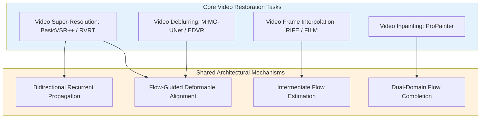
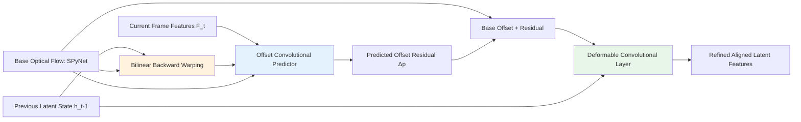
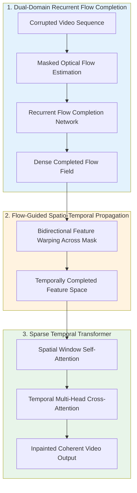

# Chapter 14 · SOTA Video Restoration Architectures

> While Chapter 13 established temporal consistency constraints, optical flow mechanics, and occlusion modeling, this chapter examines production neural architectures.
>
> We analyze state-of-the-art implementations across four core video restoration domains: Video Super-Resolution (BasicVSR++, RVRT), Video Frame Interpolation (RIFE, FILM), Spatio-Temporal Inpainting (ProPainter), and Old Film Restoration pipelines.

## 14.0 Reading Notes

This chapter formalizes the architectural designs enabling multi-frame feature propagation and high-throughput video inference.

Key objectives:

- Master the structural mechanics of Video Super-Resolution: sliding-window paradigms (EDVR) versus bidirectional recurrent propagation (BasicVSR++).
- Understand Second-Order Grid Propagation and Flow-Guided Deformable Alignment (DCNv2/v3).
- Analyze Spatio-Temporal Video Restoration Transformers (VRT and RVRT).
- Formulate Video Frame Interpolation (VFI) using Intermediate Flow Networks (IFNet in RIFE) and multi-scale recursive warping (FILM).
- Build end-to-end video inpainting architectures using recurrent flow completion (ProPainter).
- Master production pipeline orchestration: combining stabilization, denoising, interpolation, and super-resolution under real-time compute budgets.

**Prerequisites.** Temporal consistency fundamentals, backward warping, and occlusion validation from Chapter 13.

**Key Terminology Introduced in This Chapter:**

- **BasicVSR++**: Industry-standard bidirectional recurrent VSR framework utilizing second-order grid propagation and flow-guided deformable alignment.
- **RVRT** (Recurrent Video Restoration Transformer): Hybrid architecture combining intra-clip self-attention with inter-clip recurrent latent propagation.
- **RIFE** (Real-Time Intermediate Flow Estimation): Direct intermediate flow estimation network predicting $F_{0.5 \to 0}$ and $F_{0.5 \to 1}$ without backward flow inversion.
- **FILM** (Frame Interpolation for Large Motion): Multi-scale recursive feature warping network robust to large non-rigid object displacements.
- **ProPainter**: Spatio-temporal video inpainting model integrating dual-domain recurrent flow completion with sparse temporal Transformer attention.
- **VMAF** (Video Multi-Method Assessment Fusion): Industry standard perceptual video metric developed by Netflix, predicting human visual quality.



## 14.1 Architectural Paradigms in Video Super-Resolution

```mermaid
graph TD
    subgraph Mode1[1. Sliding Window: EDVR]
        M1In[Frames t-2 to t+2] --> M1Align[Pyramid Deformable Alignment: PCD]
        M1Align --> M1Fuse[Temporal-Spatial Attention: TSA]
        M1Fuse --> M1Out[Restored Frame t]
    end

    subgraph Mode2[2. Unidirectional Recurrent: RLSP]
        M2In1[Frame t-1] --> M2H1[Hidden State h_t-1]
        M2H1 --> M2H2[Hidden State h_t]
        M2In2[Frame t] --> M2H2
        M2H2 --> M2Out[Restored Frame t]
    end

    subgraph Mode3[3. Bidirectional Second-Order: BasicVSR++]
        M3In[Sequence Frames 1 to T] --> M3Fwd[Forward Second-Order Propagation]
        M3In --> M3Bwd[Backward Second-Order Propagation]
        M3Fwd & M3Bwd --> M3Merge[Flow-Guided DCN Feature Fusion]
        M3Merge --> M3Out[Simultaneous Restored Sequence 1 to T]
    end

    style Mode1 fill:#e3f2fd
    style Mode2 fill:#fff3e0
    style Mode3 fill:#e8f5e9
```



| Paradigm | Memory Complexity | Receptive Field | Latency Profile | Best Operational Context |
|----------|-------------------|-----------------|-----------------|--------------------------|
| **Sliding Window (EDVR)** | $\mathcal{O}(K \cdot H W)$ | Fixed ($2K+1$ frames) | Parallel mini-batch execution | Shot-boundary insensitive batch processing |
| **Unidirectional RNN** | $\mathcal{O}(H W)$ | Causal past only | Low latency streaming | Real-time live communications (< 33ms) |
| **Bidirectional RNN (BasicVSR++)** | $\mathcal{O}(T \cdot H W)$ | Sequence-wide (infinite) | Clip-buffered batch execution | High-fidelity offline video transcoding |
| **Recurrent Transformer (RVRT)** | $\mathcal{O}(T \cdot H W + W_{\text{attn}})$ | Sequence-wide + global attention | High compute overhead | Academic benchmarks & offline cinema mastering |

## 14.2 BasicVSR++ Deep Dive

Chan et al. introduced **BasicVSR++** (CVPR 2022), refining recurrent VSR through two architectural innovations:

### 1. Second-Order Grid Propagation

Standard first-order recurrent networks update hidden states using exclusively adjacent steps:

$$
h_t = \mathcal{R}\left(F_t, \mathcal{W}(h_{t-1}, f_{t-1 \to t})\right)
$$

Under complex motion, optical flow estimation errors compound exponentially across long temporal sequences. Second-order propagation directly conditions $h_t$ on both $t-1$ and $t-2$:

$$
h_t = \mathcal{R}\left(F_t, \mathcal{A}(h_{t-1}, f_{t-1 \to t}), \mathcal{A}(h_{t-2}, f_{t-2 \to t})\right)
$$

Where $\mathcal{A}(\cdot, \cdot)$ represents the flow-guided alignment operator. Accessing $h_{t-2}$ provides a direct residual bypass around local alignment failures.

### 2. Flow-Guided Deformable Alignment

Instead of relying purely on bilinear backward warping (which introduces sub-pixel softening) or unconstrained deformable convolution (which exhibits optimization divergence), BasicVSR++ conditions DCN sampling offsets on base optical flow fields:



```python
import torch
import torch.nn as nn
from torchvision.ops import DeformConv2d

class FlowGuidedDeformableAlignment(nn.Module):
    """Flow-Guided Deformable Alignment Module from BasicVSR++."""
    def __init__(self, channels: int = 64, num_groups: int = 8):
        super().__init__()
        self.num_groups = num_groups
        # Predicts spatial offset residuals (2 * 9 sampling points per group) and modulation masks (9 per group)
        self.offset_mask_conv = nn.Conv2d(
            in_channels=channels * 2 + 2,
            out_channels=num_groups * 3 * 9,
            kernel_size=3,
            padding=1
        )
        self.dcn = DeformConv2d(
            in_channels=channels,
            out_channels=channels,
            kernel_size=3,
            padding=1,
            groups=num_groups
        )

    def forward(
        self,
        h_prev: torch.Tensor,
        feat_curr: torch.Tensor,
        flow: torch.Tensor,
        warped_h_prev: torch.Tensor
    ) -> torch.Tensor:
        """Executes flow-guided deformable alignment.

        Args:
            h_prev: Previous latent feature map (B, C, H, W).
            feat_curr: Current frame feature map (B, C, H, W).
            flow: Base optical flow field (B, 2, H, W).
            warped_h_prev: Pre-warped previous latent feature map (B, C, H, W).
        """
        # Concatenate features and base flow field
        concat_input = torch.cat([feat_curr, warped_h_prev, flow], dim=1)
        out = self.offset_mask_conv(concat_input)

        # Split output into offset residuals and modulation masks
        offsets = out[:, :self.num_groups * 2 * 9, :, :]
        masks = torch.sigmoid(out[:, self.num_groups * 2 * 9:, :, :])

        # Inject base optical flow into learned sampling offsets
        flow_expanded = flow.repeat(1, self.num_groups * 9, 1, 1)
        total_offsets = offsets + flow_expanded

        # Execute modulated deformable convolution
        return self.dcn(h_prev, total_offsets, masks)
```

## 14.3 Video Frame Interpolation: RIFE and FILM

Video Frame Interpolation (VFI) synthesizes intermediate frames between consecutive observed frames ($I_0, I_1 \to I_{0.5}$).

### 1. Direct Intermediate Flow Estimation: RIFE

Traditional VFI pipelines estimate forward flow $F_{0 \to 1}$, compute its inverse via spatial splatting (generating holes and boundary artifacts), and warp frames forward. RIFE (Huang et al., ECCV 2022) introduces **IFNet**, directly predicting intermediate-to-endpoint flows ($F_{0.5 \to 0}$ and $F_{0.5 \to 1}$) without flow inversion:

```mermaid
graph TD
    In0[Frame I_0] & In1[Frame I_1] --> IFNet[Coarse-to-Fine IFNet Predictor]
    IFNet --> Flow0[Intermediate Flow F_0.5 -> 0]
    IFNet --> Flow1[Intermediate Flow F_0.5 -> 1]
    IFNet --> Mask[Spatial Blending Mask M]

    In0 & Flow0 --> Warp0[Backward Warping: W_0]
    In1 & Flow1 --> Warp1[Backward Warping: W_1]

    Warp0 & Warp1 & Mask --> Blend[Blended Approximation: M * W_0 + (1-M) * W_1]
    Blend & In0 & In1 --> Refine[Context Refinement Network]
    Refine --> Output[Synthesized Intermediate Frame I_0.5]

    style IFNet fill:#e3f2fd
    style Blend fill:#fff3e0
    style Output fill:#e8f5e9
```

```python
class IntermediateFlowInterpolator(nn.Module):
    """Production skeleton for RIFE-style direct intermediate frame interpolation."""
    def __init__(self, ifnet_backbone: nn.Module, context_refiner: nn.Module):
        super().__init__()
        self.ifnet = ifnet_backbone
        self.refiner = context_refiner

    def forward(self, frame_0: torch.Tensor, frame_1: torch.Tensor) -> torch.Tensor:
        # Step 1: Predict direct intermediate optical flows and blending mask
        flow_to_0, flow_to_1, mask = self.ifnet(frame_0, frame_1)

        # Step 2: Backward warp endpoint frames to intermediate timestamp
        warped_0 = backward_warp(frame_0, flow_to_0)
        warped_1 = backward_warp(frame_1, flow_to_1)

        # Step 3: Compute soft-blended intermediate representation
        coarse_mid = mask * warped_0 + (1.0 - mask) * warped_1

        # Step 4: Refine occlusion boundaries and high-frequency textures
        refined_mid = self.refiner(coarse_mid, frame_0, frame_1, flow_to_0, flow_to_1)
        return refined_mid
```

### 2. Large Motion Robustness: FILM

Google's FILM (Frame Interpolation for Large Motion, ECCV 2022) addresses large non-rigid displacements (sports action, fast camera pans) using a multi-scale Feature Extractor and Scale-Agnostic Bi-directional Flow Predictor, achieving superior boundary stability over RIFE when motions exceed $64\text{ pixels}$.

## 14.4 Spatio-Temporal Video Inpainting: ProPainter

Video inpainting completes missing or corrupted spatio-temporal regions (removing dynamic objects, watermarks, scratches) across a sequence:

$$
\hat{V} = \mathcal{G}(V \odot (1 - M), M)
$$

Where $M \in \{0, 1\}^{T \times 1 \times H \times W}$ is the binary mask defining occlusion regions.



ProPainter (ICCV 2023) addresses the long-range temporal drift problem by first completing the optical flow field within corrupted regions using a bidirectional recurrent flow network, and then propagating valid image features along completed trajectories before executing masked Transformer self-attention.

## 14.5 Multi-Stage Production Video Pipeline

Production video processing engines combine specialized restoration modules into orchestrated sequential pipelines:


### Real-Time vs. Offline Pipeline Profiles

1. **Broadcast / Real-Time Livestreaming Profile (< 33ms per frame)**:
   - Architecture: Causal unidirectional RNN with lightweight NAFNet blocks.
   - Alignment: Learned implicit DCNv3 (omitting explicit RAFT optical flow).
   - Precision: TensorRT FP16 / INT8 quantization.
2. **Cinema Mastering / Archival Restoration Profile (Offline)**:
   - Architecture: Bidirectional Second-Order BasicVSR++ or RVRT.
   - Alignment: RAFT-Large optical flow paired with Flow-Guided DCN.
   - Super-Resolution: Multi-stage GAN fine-tuning ($R_1$ regularization + temporal LPIPS loss).

## 14.6 Video Quality Benchmarking: VMAF Integration

In production video engineering, Video Multi-Method Assessment Fusion (VMAF, Netflix) provides the standard perceptual benchmark, combining Visual Information Fidelity (VIF), Detail Loss Metric (DLM), and temporal motion analysis:

```python
import subprocess
import json

def evaluate_video_vmaf(
    reference_video_path: str,
    distorted_video_path: str,
    output_log_path: str = "vmaf_report.json"
) -> float:
    """Executes libvmaf evaluation via FFmpeg subprocess."""
    command = [
        "ffmpeg",
        "-i", distorted_video_path,
        "-i", reference_video_path,
        "-filter_complex", f"libvmaf=log_path={output_log_path}:log_fmt=json:n_threads=8",
        "-f", "null", "-"
    ]
    subprocess.run(command, check=True, stdout=subprocess.DEVNULL, stderr=subprocess.DEVNULL)

    with open(output_log_path, "r") as f:
        data = json.load(f)

    return float(data["pooled_metrics"]["vmaf"]["mean"])
```

## 14.7 Chapter Summary

1. **VSR Architectural Hierarchy**: Bidirectional recurrent networks (BasicVSR++) balance high-fidelity long-range temporal propagation with predictable inference memory.
2. **Second-Order Flow-Guided DCN**: Combining second-order temporal connections with flow-guided deformable alignment stabilizes feature propagation across large non-rigid motions.
3. **Direct Intermediate Flow Estimation**: RIFE's IFNet eliminates flow inversion artifacts by directly estimating flows from intermediate coordinates to endpoints ($F_{0.5 \to 0}, F_{0.5 \to 1}$).
4. **Dual-Domain Flow Inpainting**: SOTA video inpainting (ProPainter) requires completing corrupted optical flow fields prior to executing feature-space propagation.
5. **System Pipeline Orchestration**: Real-world video restoration systems chain stabilization, denoising, interpolation, and VSR while balancing strict frame-time budgets.

---

> Next: [Inference Optimization and Edge Deployment](15-inference.md) examines production engineering: FP16/INT8 quantization, TensorRT acceleration, CoreML deployment, and tiled memory management.
