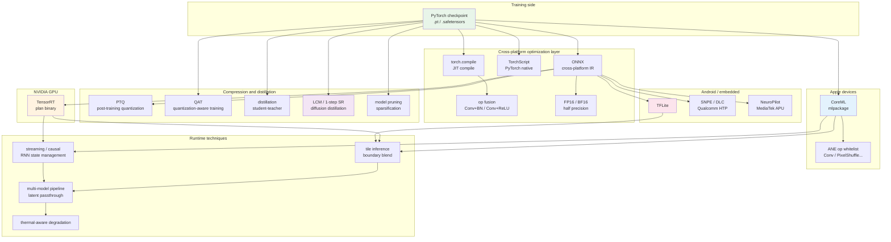
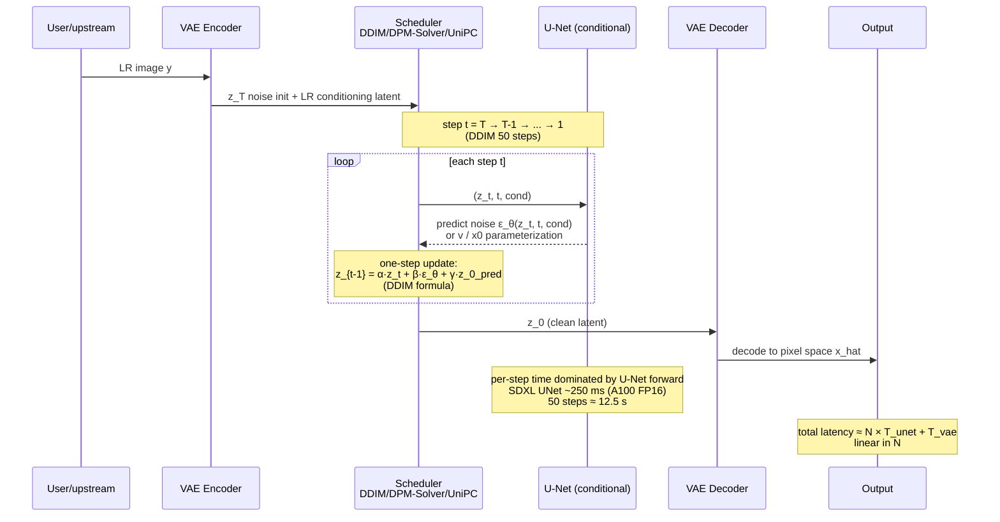
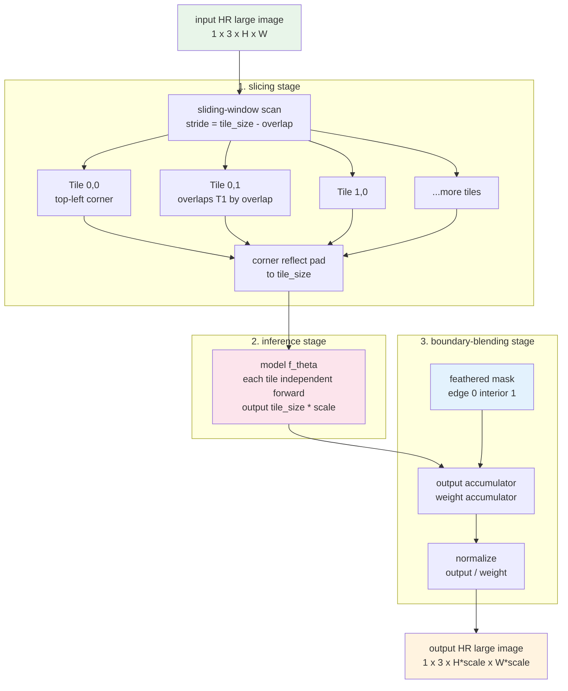

# Chapter 15 · Inference Optimization

> Training a good model is only the beginning.
>
> Pushing it to production - servers, desktop GPUs, mobile, embedded - is a whole separate engineering domain.
>
> This chapter covers quantization, TensorRT, CoreML, torch.compile, tile inference, and streaming.

## 15.0 Setup and terminology

The first fourteen chapters covered the training side: starting from a degradation model and walking through representation spaces, loss functions, evaluation metrics, data synthesis, discriminative and generative architectures, training schedules, video temporality, and controllable generation - all under the assumption that the training machine has ample VRAM, can iterate slowly, and can be interrupted and restarted. This chapter switches viewpoint. **Production environments do not look like that**. The hard constraints in a live service are latency, throughput, VRAM ceilings, power, thermals, bitrate alignment, and alignment with upstream / downstream encoders. A 0.3 dB PSNR lead from an academic eval is essentially invisible online, but blowing the p99 latency budget by 20 ms makes the product instantly unusable.

The harder bit: a training-side good model may not make it to production at all. A SwinIR-Large that trained happily on A100 with batch=8 may, once exported to a device, fall back to CPU on iOS 16 for PixelShuffle, hit an unsupported attention op on a Qualcomm NPU, develop checkerboard artifacts after INT8 quantization, throttle from heat after running 30 minutes continuously on a phone, lack future frames in a video-conferencing context so it can only run causal, and have all its output detail eaten by the H.264 encoder on the way to the wire. None of these issues exist in papers; each one can singlehandedly block a launch.

So this chapter is not a "TensorRT tutorial." It is an **engineering checklist for pushing trained low-level vision models from PyTorch to real terminals**. The structure starts with cross-platform optimizations (export, compilation, half precision, quantization), then splits by deployment target: TensorRT on NVIDIA GPUs, CoreML / ANE on Apple devices, TFLite and vendor SDKs on Android / embedded. Next come three cross-platform techniques: model distillation (including diffusion-school 1-step SR), tile inference for large images, and streaming / real-time video. The chapter closes with pipeline orchestration, monitoring, and cost estimation.

Keep one simple contrast in mind throughout: **academic metrics care about "distance between model output and ground truth"; production metrics care about "whether the product ships."** They are not in conflict, but the optimization paths diverge sharply. Every section in this chapter is helping you translate the second kind of caring into executable code and process.

### Abbreviations and first-appearance terms

To avoid a wall of jargon, the first appearance of each abbreviation is collected here with a full name and one-line definition. We do not re-expand on subsequent use.

- **TensorRT**: NVIDIA's inference engine, which compiles ONNX / PyTorch models into binary plan files optimized for a specific GPU.
- **ONNX** (Open Neural Network Exchange): a cross-framework intermediate model representation; almost every inference engine reads from ONNX.
- **CUDA** (Compute Unified Device Architecture): NVIDIA's general-purpose parallel computing platform and programming model.
- **cuDNN** (CUDA Deep Neural Network library): NVIDIA's GPU deep-learning operator library; both TensorRT and PyTorch depend on it.
- **FP32 / FP16 / BF16**: 32-bit / 16-bit floating point. BF16 (Brain Float 16), introduced by Google, keeps the same exponent bits as FP32 with fewer mantissa bits - wide range, lower precision. Natively supported on A100 and later NVIDIA GPUs.
- **INT8 / INT4**: 8-bit / 4-bit integer. Low-bit representations for quantization, trading speed and VRAM for precision loss.
- **PTQ** (Post-Training Quantization): after training, estimate scale and zero point from calibration data and quantize directly.
- **QAT** (Quantization-Aware Training): insert "fake-quantize" operators into the training loop so the model adapts to quantization error.
- **TorchScript**: PyTorch's scripted intermediate representation, runnable in a C++ runtime without the Python interpreter.
- **torch.compile**: PyTorch 2.0's JIT compilation entry point, dispatching TorchDynamo / TorchInductor behind the scenes to compile the model graph into fused kernels.
- **CoreML**: Apple's device-side inference framework, can dispatch to CPU / GPU / ANE.
- **ANE** (Apple Neural Engine): Apple's low-power neural-network accelerator integrated into A-series and M-series chips.
- **NPU** (Neural Processing Unit): the generic name for mobile / embedded neural accelerators, e.g. Qualcomm HTP, Huawei NPU, MediaTek APU, Apple ANE.
- **HTP** (Hexagon Tensor Processor): the NPU implementation in Qualcomm Snapdragon chips; runs INT8 extremely fast.
- **SNPE** (Snapdragon Neural Processing Engine): Qualcomm's NPU SDK; converts ONNX to DLC format and dispatches to HTP / GPU / CPU.
- **DLC** (Deep Learning Container): SNPE's model container format.
- **NeuroPilot**: MediaTek's NPU SDK for Dimensity APU.
- **TFLite** (TensorFlow Lite): Google's mobile / embedded inference framework, the de facto Android standard.
- **NNAPI** (Neural Networks API): the system-layer NPU abstraction available on Android 8+; TFLite can route through NNAPI to the device NPU.
- **OpenVINO**: Intel's inference toolchain optimized for its own CPU / integrated GPU / VPU.
- **DirectML**: Windows' hardware-abstraction inference API, uniformly covering NVIDIA / AMD / Intel GPU.
- **VAE** (Variational Auto-Encoder): covered in detail in Chapter 7. It comes up repeatedly here because diffusion-school latent encode / decode all go through a VAE, and VAEs are easily overflow-prone at low bit depths.
- **KV cache** (Key-Value cache): the technique of caching previously computed attention keys and values to avoid recomputation during Transformer autoregressive inference. In low-level vision it shows up in video Transformers and on the causal inference path of diffusion Transformers.
- **Flash Attention**: an implementation that splits attention's softmax(QK^T)V into tiled chunks and fuses into a single CUDA kernel - VRAM-thrifty and faster.
- **Tiling**: split a large image into small blocks, infer separately, and stitch back. Section 15.9 covers this.
- **SwinIR-Tile**: the tile inference implementation shipped with the official SwinIR repo; a community reference implementation.
- **Boundary blending**: feathered weighting over overlap regions when stitching tiles back together; avoids visible seams.
- **DDIM** (Denoising Diffusion Implicit Models): a deterministic sampler for diffusion models, allowing sampling with far fewer steps than training.
- **DDIM steps**: the sampling step count when using DDIM; typically 20-50.
- **DPM-Solver / DPM-Solver++**: high-order numerical solvers for the diffusion ODE; reach DDIM-50-quality with 10-20 steps.
- **UniPC** (Unified Predictor-Corrector): one of the diffusion samplers; predictor-corrector structure, 8-15 usable steps.
- **LCM** (Latent Consistency Model): a distillation that compresses a diffusion model into a student that samples in 4-8 steps.
- **LoRA** (Low-Rank Adaptation): a low-rank delta added on top of a pretrained large model's weights; very few trainable parameters.
- **OSEDiff / TSD-SR / AdcSR / SinSR**: four works on the "1-step diffusion SR" path; see Chapter 18.
- **GOP** (Group of Pictures): in video coding, a group of frames starting from one I-frame (keyframe) with subsequent P/B frames depending on neighbors.
- **I / P / B frames**: video frame types. I-frames decode independently, P-frames depend on past frames, B-frames depend on both directions.
- **NAL** (Network Abstraction Layer) units: the transport units H.264 / H.265 cut encoded data into.
- **A/V sync** (Audio/Video sync): audio-video temporal alignment. Humans become sensitive to lipsync errors around ±40 ms.
- **p50 / p90 / p99 latency**: the median / 90th / 99th percentile of the latency distribution.
- **OOM** (Out Of Memory): VRAM exhausted.
- **QPS** (Queries Per Second): throughput metric.
- **GAN** (Generative Adversarial Network): comes up repeatedly when discussing ESRGAN / Real-ESRGAN.
- **RRDB** (Residual-in-Residual Dense Block): the trunk module in ESRGAN / Real-ESRGAN.

Later sections introduce new abbreviations on first appearance but do not repeat the common ones.

### Chapter through-line

The whole chapter can be read as a "diffusion graph" from training artifact to production terminal: the PyTorch weights sit in the middle, deployment targets fan out around them, and every edge is labeled with a set of optimization techniques. The figure below gives a bird's-eye view; later sections fill in the details on individual edges.



The question this diagram answers: "I have this PyTorch checkpoint in hand; which production scenario am I deploying into, and which edge do I take?" Examples: server-side 4K live enhancement → ONNX → TensorRT FP16 + tile + multi-model pipeline; iPhone real-time filter → CoreML + ANE op whitelist + per-channel INT8 + causal streaming; diffusion-school SR going live → LCM or 1-step SR distillation + TensorRT FP16 + tile. Every later section explains the concrete decisions along one of these paths.

## 15.1 Deployment targets for inference optimization

Different platforms place wildly different demands on a model:

| Platform | Latency requirement | VRAM budget | Model size budget | Priority |
|------|---------|---------|-----------|-------|
| **A100 server** | < 1 s/image | 80 GB | a few GB | throughput |
| **Consumer GPU** (4090) | < 100 ms/image | 24 GB | a few GB | user experience |
| **Desktop CPU** | < 5 s/image | 16 GB | < 500 MB | compatibility |
| **Phone NPU** | < 30 ms/frame | < 1 GB | < 50 MB | real-time + power |
| **Embedded (IoT)** | < 100 ms/image | < 100 MB | < 10 MB | strict budget |

Each platform has its own optimization stack. This chapter walks through them platform by platform.

## 15.2 Universal optimizations (every platform needs them)

### 15.2.1 Model export formats

A PyTorch training model has to be exported into an inference format:

```
PyTorch model (.pt)
  ├── ONNX (.onnx)              ← cross-platform intermediate format
  │   ├── TensorRT (.plan)      ← NVIDIA GPU
  │   ├── OpenVINO              ← Intel CPU/GPU
  │   ├── DirectML              ← Windows generic
  │   └── ONNX Runtime          ← generic CPU/GPU
  ├── TorchScript (.pt)         ← PyTorch native
  ├── CoreML (.mlpackage)       ← Apple devices
  ├── TFLite (.tflite)          ← Android / embedded
  └── Custom                    ← vendor SDK
```

**ONNX is the de facto intermediate format**—most inference engines accept it.

```python
# Export a PyTorch model to ONNX
import torch

model.eval()
dummy_input = torch.randn(1, 3, 256, 256)

torch.onnx.export(
    model,
    dummy_input,
    "model.onnx",
    input_names=['input'],
    output_names=['output'],
    dynamic_axes={
        'input':  {0: 'batch', 2: 'height', 3: 'width'},  # dynamic shapes
        'output': {0: 'batch', 2: 'height', 3: 'width'},
    },
    opset_version=17,
)
```

### 15.2.2 Operator fusion

Merge several consecutive ops into one to cut kernel launch overhead and memory traffic:

- `Conv + BatchNorm` → `Conv'` (fold BN into conv weights)
- `Conv + ReLU` → `Conv-ReLU` fused op
- `LayerNorm + Linear` → fused op

PyTorch 2.0+ `torch.compile` does these automatically.

### 15.2.3 torch.compile

The JIT compiler introduced in PyTorch 2.0 automatically optimizes the model:

```python
import torch

model = build_model().eval().cuda()
model = torch.compile(model, mode="reduce-overhead")  # or "max-autotune"

# First call is slow (compilation)
with torch.no_grad():
    _ = model(warmup_input)  # trigger compilation

# Fast afterwards
output = model(real_input)
```

Choosing `mode`:

- `"default"`: safe, 1.5–2× speedup
- `"reduce-overhead"`: cuts Python overhead, good for small batches
- `"max-autotune"`: maximum optimization, slow to compile but fastest at runtime

Measured impact:

- Real-ESRGAN on a 4090: native PyTorch ~200 ms / 256×256, with `torch.compile` ~90 ms

Engineering caveats:

- Changing input shapes triggers **recompilation** and a stall on the first call
- Use `dynamic=True` to prepare the compiler for dynamic shapes
- Compatibility issues: certain custom operators are not supported

### 15.2.4 FP16 / BF16 inference

Training uses FP32 / BF16; inference can drop to FP16 / BF16 to halve VRAM and gain 1.5–2× speed:

```python
model = build_model().eval().cuda().half()  # FP16
output = model(input.half())
```

Watch out for:

- VAE encoder/decoder may overflow under FP16—**keep them in FP32**
- Some ops (softmax, normalization) lose substantial precision in FP16; auto-cast them to FP32
- BF16 has wider range but lower precision—**recommended on A100+**

### 15.2.5 Quantization (INT8 / INT4)

The core of quantization is mapping a high-precision floating-point tensor to a low-bit integer, and at inference time decoding the integer back to an approximate float. The most common symmetric linear quantization formula is:

$$
q = \text{round}\left(\frac{x}{s}\right), \qquad \hat{x} = q \cdot s
$$

where $s$ is the scale and $q$ is the quantized integer (for INT8, $q \in [-128, 127]$). Asymmetric quantization adds a zero point $z$:

$$
q = \text{round}\left(\frac{x}{s}\right) + z, \qquad \hat{x} = (q - z) \cdot s
$$

How you pick the scale $s$ determines the quantization error. The naive choice is to take the tensor's absolute maximum and divide by 127, but max-scale is extremely sensitive to outliers - a single extreme activation can drag the effective precision down to 7 bits. Two improvements common in production:

1. **Percentile**: take the absolute value at the 99.99th percentile as max, discarding extreme outliers.
2. **MSE-minimum**: search on a calibration set for the scale that minimizes $\|\hat{x} - x\|_2^2$.

Dropping weights and activations from FP16 to INT8 or even INT4 has two routes:

- **PTQ** (Post-Training Quantization): after training, use a calibration dataset (a few hundred representative images) to estimate scale and zero point, and quantize directly. Simple flow; the size of the precision loss depends on the model's robustness to quantization error.
- **QAT** (Quantization-Aware Training): insert "fake-quantize" operators (quantize-dequantize pairs) into the forward pass during training so gradients see the quantization error and the model learns to tolerate it. Smaller precision loss but requires retraining, with higher engineering cost.

Potential gains from INT8:

- Model size: 4× (FP32→INT8) or 2× (FP16→INT8)
- Speed: 2–4× on hardware with INT8 support
- VRAM: corresponding savings

The special difficulty for low-level vision: **output pixel precision is sensitive to quantization error**. INT8 quantization can drop PSNR by 0.5–2 dB and produce visible "lattice" artifacts.

Practical experience:

- **Large models** (Restormer/HAT/diffusion UNet): INT8 still works decently
- **Small models** (small NAFNet, ESRGAN-Lite): INT8 visibly degrades; FP16 is enough
- **VAE**: never INT8—it will blow up

```python
# Simplified PyTorch INT8 PTQ
import torch.ao.quantization as quant

model = build_model().eval()

# 1. Prepare calibration data
calibration_data = [load_calibration_batch(i) for i in range(100)]

# 2. Configure quantization scheme
qconfig = quant.get_default_qconfig('fbgemm')  # CPU
# or qconfig = quant.get_default_qconfig('x86') for newer x86

model.qconfig = qconfig
model_prepared = quant.prepare(model)

# 3. Run calibration (with representative data)
with torch.no_grad():
    for batch in calibration_data:
        model_prepared(batch)

# 4. Convert to an INT8 model
model_int8 = quant.convert(model_prepared)
```

INT8 quantization on GPU is more involved—usually done through TensorRT or ONNX Runtime.

## 15.3 NVIDIA GPU deployment: TensorRT

### TensorRT is NVIDIA's inference engine

What it does:

- Accepts ONNX or TF/PyTorch models
- Operator fusion + kernel selection + quantization
- Outputs a **GPU-specific optimized** binary (`.plan` file)
- Provides C++/Python APIs for inference

Why is TensorRT faster than plain PyTorch / ONNX Runtime? Three things:

1. **More aggressive op fusion.** It fuses chains like Conv + BN + ReLU + Add into a single CUDA kernel, eliminating intermediate-tensor VRAM round-trips and kernel-launch overhead. PyTorch eager mode cannot do this, and torch.compile only does part of it conservatively.
2. **Automatic kernel tuning.** For each conv, NVIDIA ships dozens of implementations (different tile sizes, layouts, tensor-core paths); TensorRT benchmarks them on your input shape and picks the fastest. The result is baked into the plan file, so plans cannot move between GPUs - a plan built on A100 will not run on a 4090.
3. **Low-precision paths and tensor cores.** Under FP16 / BF16 / INT8 / FP8, TensorRT directly hits Ampere / Hopper tensor cores; the theoretical throughput is 4-8× higher than CUDA cores. PyTorch eager also uses cuDNN tensor cores, but TensorRT applies them across a wider set of ops.

The cost is slow build time. Building an FP16 plan for an SDXL UNet on A100 takes about 5-15 minutes (depending on the `BUILDER_OPTIMIZATION_LEVEL`); adding INT8 calibration takes longer, up to 30+ minutes. So plans should be cached as CI artifacts, not rebuilt at startup.

### Workflow

```python
import tensorrt as trt

# 1. Build a TensorRT engine from ONNX
def build_engine(onnx_path: str, engine_path: str,
                 fp16: bool = True, int8: bool = False):
    logger = trt.Logger(trt.Logger.WARNING)
    builder = trt.Builder(logger)
    network = builder.create_network(
        1 << int(trt.NetworkDefinitionCreationFlag.EXPLICIT_BATCH)
    )
    parser = trt.OnnxParser(network, logger)

    with open(onnx_path, 'rb') as f:
        if not parser.parse(f.read()):
            for error in range(parser.num_errors):
                print(parser.get_error(error))
            return None

    config = builder.create_builder_config()
    config.set_memory_pool_limit(trt.MemoryPoolType.WORKSPACE, 4 << 30)  # 4 GB

    if fp16:
        config.set_flag(trt.BuilderFlag.FP16)
    if int8:
        config.set_flag(trt.BuilderFlag.INT8)
        config.int8_calibrator = MyCalibrator(...)  # need calibration data

    # Dynamic shape support
    profile = builder.create_optimization_profile()
    profile.set_shape("input",
                     min=(1, 3, 64, 64),
                     opt=(1, 3, 256, 256),
                     max=(1, 3, 1024, 1024))
    config.add_optimization_profile(profile)

    engine = builder.build_serialized_network(network, config)
    with open(engine_path, 'wb') as f:
        f.write(engine)
```

### TensorRT inference

```python
import tensorrt as trt
import pycuda.driver as cuda
import numpy as np

class TRTInferencer:
    def __init__(self, engine_path: str):
        logger = trt.Logger(trt.Logger.WARNING)
        runtime = trt.Runtime(logger)
        with open(engine_path, 'rb') as f:
            self.engine = runtime.deserialize_cuda_engine(f.read())
        self.context = self.engine.create_execution_context()

    def infer(self, input_array: np.ndarray) -> np.ndarray:
        # 1. Set the dynamic input shape, then query the actual output shape
        # Note: an SR model's output shape != input shape (upscaled by `scale`)
        self.context.set_input_shape("input", input_array.shape)
        out_shape = tuple(self.context.get_tensor_shape("output"))

        # 2. Allocate device memory based on the actual shapes
        in_size  = int(np.prod(input_array.shape) * np.dtype(np.float32).itemsize)
        out_size = int(np.prod(out_shape) * np.dtype(np.float32).itemsize)
        d_input  = cuda.mem_alloc(in_size)
        d_output = cuda.mem_alloc(out_size)
        cuda.memcpy_htod(d_input, input_array.astype(np.float32))

        # 3. TensorRT 10+ recommends the name-based API
        self.context.set_tensor_address("input",  int(d_input))
        self.context.set_tensor_address("output", int(d_output))
        stream = cuda.Stream()
        self.context.execute_async_v3(stream.handle)
        stream.synchronize()

        # 4. Copy back to CPU
        output = np.empty(out_shape, dtype=np.float32)
        cuda.memcpy_dtoh(output, d_output)
        return output
```

### TensorRT speedup

| Model | Native PyTorch | TensorRT FP16 | TensorRT INT8 |
|------|-----------|--------------|--------------|
| Real-ESRGAN (RRDB) | 100% | 35% | 18% |
| SwinIR | 100% | 40% | — |
| BasicVSR++ | 100% | 50% | — |
| SDXL UNet | 100% | 45% | — |

**TensorRT FP16 typically yields 2–3× speedup**; INT8 adds another 2× but with real precision risk.

## 15.4 Apple device deployment: CoreML

### What CoreML is

Apple's inference framework, runs on:

- **CPU** (every device)
- **GPU** (M-series chips, iPhone GPU)
- **Apple Neural Engine (ANE)** (M-series Mac + A-series iPhone/iPad, ultra-low power)

### Workflow

```python
import coremltools as ct
import torch

# 1. Trace the PyTorch model
model.eval()
dummy_input = torch.randn(1, 3, 256, 256)
traced = torch.jit.trace(model, dummy_input)

# 2. Convert to CoreML
mlmodel = ct.convert(
    traced,
    inputs=[ct.ImageType(name="input",
                         shape=(1, 3, 256, 256),
                         scale=1/255.0,
                         color_layout=ct.colorlayout.RGB)],
    outputs=[ct.TensorType(name="output")],
    compute_precision=ct.precision.FLOAT16,    # iPhone defaults to FP16
    compute_units=ct.ComputeUnit.ALL,          # CPU + GPU + ANE
    minimum_deployment_target=ct.target.iOS17,
)
mlmodel.save("model.mlpackage")
```

### Apple Neural Engine specifics

- Extremely low power (10× more efficient than CPU)
- But **only supports a limited operator set** (Conv, ReLU, PixelShuffle, and other basics)
- Custom layers and irregular shapes fall back to CPU/GPU

Engineering consequence: **designing for ANE means sticking to its restricted op set**:

- ✓ Conv2d (3×3, 5×5)
- ✓ ReLU / LeakyReLU / GELU
- ✓ BatchNorm
- ✓ PixelShuffle
- ✗ Custom CUDA kernels
- ✗ Dynamic shapes (limited)
- ✗ Complex attention (partial support)

Measured:

- Real-ESRGAN on iPhone 14 ANE, 720p input: ~80 ms
- CoreFormer on the same device: ~150 ms

### CoreML 4-bit quantization

iOS 17+ supports 4-bit weight quantization, which halves model size again:

```python
import coremltools.optimize.coreml as cto

config = cto.OptimizationConfig(
    global_config=cto.OpPalettizerConfig(
        nbits=4,
        granularity="per_grouped_channel",
        group_size=16,
    ),
)
mlmodel_quantized = cto.palettize_weights(mlmodel, config)
```

Measured: model size 50 MB → 12 MB, quality loss < 0.3 dB.

## 15.5 NPU practice: from "it runs" to "it's actually fast"

Section 15.4 gave the ANE op whitelist, but **90% of real-world latency problems are not "this op isn't supported" — they're fallback latency cliffs from partial-fallback subgraphs, the wrong quantization granularity, and tensor-layout-induced implicit reshapes**. This section covers the highest-frequency real traps in on-device NPU deployment.

### 15.5.1 Per-channel vs per-tensor quantization: low-level vision must use per-channel

INT8 quantization maps FP32/FP16 tensors to INT8. The mapping "resolution" (scale) comes in two granularities:

- **Per-tensor**: one (scale, zero_point) for the entire weight tensor. Simple; older mobile NPUs (Qualcomm HTP, early Huawei NPU SDK) default to this.
- **Per-channel**: one scale per output channel — significantly higher weight quantization precision. Activations are usually still per-tensor (per-channel activation has poor hardware support).

**Why low-level vision must use per-channel weights:**

Conv weights in low-level vision have **much larger inter-channel magnitude variation than classification tasks** — some channels learn texture (small magnitude), others learn structure (large magnitude). Under per-tensor with a single shared scale, small-magnitude channels are quantized to just a few INT8 levels, suffering severe precision loss — which **manifests visually as grid / color-banding artifacts**.

Measured comparison (Real-ESRGAN, DIV2K val):

| Quantization scheme | PSNR (dB) | Visual artifacts |
|--------------------|-----------|------------------|
| FP16 | 28.45 | None |
| Per-channel weight INT8 + per-tensor act INT8 | 28.30 (-0.15) | Barely perceptible |
| Per-tensor weight INT8 + per-tensor act INT8 | 27.10 (-1.35) | Obvious grid / banding |

Engineering takeaway: **on-device INT8 quantization must use per-channel weight quant**. If a chip's SDK only supports per-tensor weight quant, either fall back to FP16 or pick another chip.

```python
# Per-channel quantization in CoreML (iOS 16+)
import coremltools.optimize.coreml as cto

cto.linear_quantize_weights(
    mlmodel,
    config=cto.OptimizationConfig(
        cto.OpLinearQuantizerConfig(
            mode="linear_symmetric",
            granularity="per_channel",     # The key parameter
            weight_threshold=2048,
        )
    ),
)
```

### 15.5.2 ANE → CPU fallback latency cliff

ANE op latencies are typically **a few hundred μs** (sub-millisecond). The moment an unsupported op shows up, CoreML falls back that subgraph to GPU or CPU, and **per-op latency jumps to ms-scale** — a 10× to 100× cliff.

Worse, fallback is not just per-op: **switching tensors between ANE and CPU/GPU has milliseconds of overhead by itself** (data must be copied between memory pools). A 30-layer network with three fallback ops can cause six ANE↔CPU switches at a few ms each — total latency jumps from 30ms to 100ms+.

**What you must do:**

1. **Dump compute_unit assignment immediately after export**:

```python
import coremltools as ct

mlmodel = ct.models.MLModel("model.mlpackage")
spec = mlmodel.get_spec()

# After running an inference, use Xcode Instruments' Core ML template to see per-op compute unit
# Or use ct.models.utils.evaluate_classifier / generic helpers
```

The standard practice is to profile one inference with Xcode Instruments → Core ML template, which color-codes each op as ANE / GPU / CPU. **Goal: 100% ANE on the network body, zero switching.**

2. **Force ANE-only validation**:

```python
# Restrict to ANE only — any unsupported op errors out immediately
mlmodel = ct.convert(traced, ..., compute_units=ct.ComputeUnit.CPU_AND_NE)
# Switch back to ALL for actual deployment
```

3. **PixelShuffle is a high-frequency SR trap**: iOS 16 ANE doesn't support PixelShuffle, causing fallback. iOS 17+ supports it partially with size constraints (input channels must be ≤ 256). For iOS 16 compatibility, **use transposed conv or nearest+conv instead of PixelShuffle**.

4. **LayerNorm with dynamic shapes falls back on ANE**: LayerNorm with fixed spatial size is OK; dynamic input sizes may fall back. If your SR model needs to support dynamic resolution, **use GroupNorm (ANE-friendly) instead of LayerNorm**.

### 15.5.3 Implicit layout transformations from reshape / permute

ANE has internal preferred tensor layouts (NCHW vs internal proprietary), and certain reshape / permute ops trigger **a full memory rearrangement of the tensor** — single-op latency jumps from μs to ms. Common triggers:

- `tensor.permute(0, 2, 3, 1)` converting NCHW → NHWC (common in style transfer etc.)
- `tensor.view(B, -1, H, W)` when channel count is not a multiple of 8/16
- Transpose on large spatial sizes (4K+)

Engineering practice:

- **Use ANE-friendly channel counts during training** (multiples of 4/8/16/32)
- **Avoid permute on 4K inputs** — when unavoidable, tile first then permute
- **Use `coremltools.compression.experimental.ane_optimize`** (iOS 18+) to let the converter automatically reorder ops to reduce layout switches

### 15.5.4 The realities of Qualcomm SNPE / MediaTek NeuroPilot

Android-side NPU compatibility is **even more fragmented than ANE** — the same ONNX model can vary by orders of magnitude across different chips.

**Qualcomm SNPE (Snapdragon NPU)**:

- HTP backend (Hexagon Tensor Processor) runs INT8 extremely fast (5× faster than GPU on flagship SoCs)
- **Op whitelist is even narrower than ANE** — SNPE 8.x still doesn't support GroupNorm directly (must decompose into reshape + LN), PixelShuffle, complex attention
- INT8 quantization is sensitive to SDK version: PTQ flow from SNPE 1.x was rewritten in 2.x; old scripts incompatible
- **Required tool**: after `snpe-onnx-to-dlc` conversion, use `--debug 3` to inspect per-layer backend assignment, similar to ANE dump

**MediaTek NeuroPilot (Dimensity APU)**:

- APU performance approaches SDM 8 Gen 3 HTP on Dimensity 9300+/9400 flagships; mid-range chips show large gaps
- **Op compatibility is more fragmented than SNPE** — the same model behaves differently on Dimensity 8000-series vs 9000-series
- Conversion tool: `neuropilot-converter`; quantization calibration data should be 200+ representative images

**Engineering takeaway**: Android releases must **profile on 3–4 representative SoCs** (SDM 8 Gen 3 / Dimensity 9300 / Exynos 2400 / mid-range like SDM 7s Gen 2) before launch — flagship-only profiling is not enough.

### 15.5.5 The on-device deployment profiling flow

Putting all of the above together into an engineering flow:

```
1. Make NPU-friendly choices during training (GroupNorm not LayerNorm, PixelShuffle alternatives, channel counts in 8/16 multiples)
   ↓
2. Export ONNX, convert to CoreML / TFLite / DLC
   ↓
3. Use respective tools to dump op → backend assignment
   ↓
4. Fix fallbacks: either change the model or swap op implementations
   ↓
5. Quantize (per-channel weights)
   ↓
6. Calibration data: 200+ representative images (don't just use DIV2K, include business data)
   ↓
7. Profile on target SoCs: latency p50/p90/p99, power, thermal
   ↓
8. Failure case bank regression tests
```

Without this flow, "real-time on-device enhancement" is basically a demo — production launches will crash.

## 15.6 Android / embedded: TFLite + NNAPI

The de facto standard for Android devices:

```python
# Convert ONNX → TFLite (using onnx-tf)
import onnx
from onnx_tf.backend import prepare

onnx_model = onnx.load("model.onnx")
tf_rep = prepare(onnx_model)
tf_rep.export_graph("model.pb")

# Then use the TF converter to produce TFLite
import tensorflow as tf

converter = tf.lite.TFLiteConverter.from_saved_model("model.pb")
converter.optimizations = [tf.lite.Optimize.DEFAULT]
converter.target_spec.supported_types = [tf.float16]   # or INT8
tflite_model = converter.convert()

with open("model.tflite", "wb") as f:
    f.write(tflite_model)
```

NNAPI (Android 8+) can route TFLite models to the device NPU, but compatibility varies wildly (different chip vendors support different op sets).

In practice: **on Android, vendor-specific SDKs are common**—Qualcomm's SNPE, MediaTek's NeuroPilot, Huawei's HiAI.

## 15.7 Model distillation and pruning: ultra-lightweight

### 15.7.0 Three classes of "make the model smaller"

This section is about distillation, but distillation should be placed in the broader context of model compression. There are three common paths to shrinking a trained model, and they are often mixed in engineering:

1. **Quantization** (Section 15.2.5): drop FP32 / FP16 weights / activations to INT8 / INT4. Model size shrinks linearly; speed depends on hardware. The model structure is unchanged.
2. **Pruning**: remove weights / channels / layers that contribute little to the output. Structured pruning (along channels / heads) directly reduces FLOPs and VRAM; unstructured pruning (per individual weight) achieves higher compression but only yields speed gains on hardware with sparse-op support. In low-level vision, **channel pruning** is the most common: during training add an L1 regularizer to each conv channel → after training sort channels by magnitude → cut the smallest k% → fine-tune for a few epochs on the remaining channels. Real-ESRGAN-Mini's slimming path includes channel pruning + distillation.
3. **Distillation**: train a brand-new small student model from scratch to mimic the large teacher's outputs / intermediate features. The student's structure can differ completely from the teacher's (this is the biggest difference from pruning), so backbone, ops, and depth can all be swapped.

The three can stack: distill a small student → channel-prune → INT8-quantize → push to device. Each step's loss is controllable in isolation (distillation costs ~5% quality, pruning ~2%, quantization ~3%); stacked, total quality drops ~10% but model size can go from 60 MB to 3 MB and speed can improve by 10×+. This is the fundamental reason real-time on-device enhancement is achievable.

Pretrained model too large? Train a **student model** (small) to imitate the teacher's (large) outputs.

### Distillation training objective

```python
def distillation_loss(student_out, teacher_out, hr_target):
    """Distillation loss = mimic teacher + still learn from ground truth."""
    # Mimic teacher output
    distill = F.l1_loss(student_out, teacher_out.detach())
    # Also look at the ground truth so the student doesn't only copy the teacher's mistakes
    gt = F.l1_loss(student_out, hr_target)
    return 0.7 * distill + 0.3 * gt
```

### Distillation flavors that suit low-level vision

- **Feature distillation**: have the student's intermediate features mimic the teacher's
- **Relational distillation**: have the relations among the student's outputs (Gram matrices, etc.) match the teacher's

### Engineering effect of distillation

- Student is 1/4 the size, with ~95% of the teacher's quality
- 3–5× faster inference
- A key technique for on-device deployment

Representative projects:

- **Real-ESRGAN-Mini**: 1.5M-parameter distilled version, ~70% of ESRGAN's performance
- **SwinIR-Lite**: distill a Swin Transformer into a pure CNN

## 15.8 LCM / Turbo distillation (diffusion-general)

Diffusion models are too slow at 50 steps. **Latent Consistency Models (LCM)** distill them down to 4-8 steps.

### Why 50 steps is a problem: get the inference timeline clear first

Before getting into distillation, we should look at how the original multi-step diffusion inference actually spends time. The sequence diagram below shows a standard DDIM inference of a conditional diffusion SR (N = 50 steps): every step does a VAE-conditional outer step, a U-Net forward, and a scheduler update of the latent. The U-Net forward dominates the time per step, and every step takes roughly the same amount of time, so total time is approximately proportional to the number of steps.



With this diagram in mind, the later optimization paths make sense:

- **DDIM → DPM-Solver++ / UniPC**: same quality drops 50 steps to 15-20. The algorithm changes name; per-step time does not change; "fewer steps and still converges" is achieved by the sampler.
- **LCM / Turbo distillation**: further pushes step count to 4-8. The essence is teaching a student network to "predict x_0 in a single step from any t."
- **OSEDiff / TSD-SR and other 1-step diffusion SR**: compress the whole timeline down to one U-Net forward + one VAE decode, ~0.3-0.8 s per image.
- **Orthogonal optimizations**: inside the U-Net, Flash Attention fuses the attention kernel; TensorRT compilation fuses conv / attn kernels at the bottom; FP16 / BF16 halves single-forward time. These compose with "fewer steps."

This is why this chapter splits "distillation for fewer steps" and "general TensorRT / compile / half precision" into two threads: they tackle different bottleneck dimensions and can be applied together.

### Core idea

### Diffusion sampler selection: speed-quality trade-offs of DDIM / DPM-Solver / UniPC

Distillation is not the only acceleration path. **Just switching samplers** can drop 50 steps to 15-20 without retraining any student. This subsection summarizes the trade-offs among the mainstream samplers.

| Sampler | Recommended steps | Order | Convergence | When to use |
|---------|-------------------|-------|-------------|-------------|
| **DDIM** | 30-50 | 1st-order | slow but stable, works on every model | baseline / parameter tuning |
| **DPM-Solver** | 15-25 | 2nd-3rd order | halves step count at same quality | general acceleration |
| **DPM-Solver++** | 10-20 | 2nd-3rd order | more stable at high CFG | large-guidance scenarios |
| **UniPC** | 8-15 | multi-order predictor-corrector | best quality at very few steps | latency-first |
| **Euler / Heun** | 30-50 | 1st-2nd order | simple and stable | teaching / debugging |

Engineering notes:

- **New-project baseline: DDIM 30 steps**, both quality and speed are middle of the road.
- **Production default: DPM-Solver++ 20 steps**, saves 30-50% latency at quality comparable to DDIM 50 steps.
- **Extreme latency: UniPC 10-15 steps**, can halve time again, but at low guidance scales the output goes soft.
- **Step counts below 8**, sampler optimization has diminishing returns; switch directly to LCM / 1-step SR distillation.

Note that switching samplers does not require retraining the model checkpoint - this is the biggest difference from distillation. So the rational optimization order is "swap sampler first, then consider distillation."

### Core idea

Train a student (CM) to predict $x_0$ in one step from any $t$. Then inference can **sample directly in one step**.

### LCM-LoRA

Even lighter: train a LoRA instead of a full model and plug it into any SD model:

```python
# Load LCM-LoRA into an SD pipeline
from diffusers import LCMScheduler, AutoPipelineForImage2Image

pipe = AutoPipelineForImage2Image.from_pretrained(
    "stabilityai/stable-diffusion-xl-base-1.0",
    torch_dtype=torch.float16,
)
pipe.scheduler = LCMScheduler.from_config(pipe.scheduler.config)
pipe.load_lora_weights("latent-consistency/lcm-lora-sdxl")

# 4-step inference
output = pipe(prompt, image=lr_image, num_inference_steps=4, guidance_scale=1.5)
```

Measured:

- Vanilla SDXL, 50 steps: 25 s
- LCM-LoRA, 4 steps: 2 s
- Quality loss: FID rises slightly, LPIPS rises slightly, visually nearly indistinguishable (in 4× enhancement scenarios)

### Single-step diffusion SR: pushing the SUPIR route into production

LCM-LoRA is a **general-purpose** diffusion accelerator. Single-step diffusion SR purpose-trained for SR (OSEDiff / TSD-SR / AdcSR / SinSR; see Section 18.6) goes further — directly training a student that samples in **1 step**:

| Route | Steps | Latency per image (A100) | Quality vs SUPIR |
|-------|-------|---------------------------|------------------|
| Vanilla SUPIR | 50 | 5–10 s | 100% (baseline) |
| LCM-LoRA + SUPIR | 4–8 | 1–2 s | LPIPS +1–3% |
| OSEDiff / TSD-SR | **1** | **0.3–0.8 s** | LPIPS ±2% |

**Why this matters**: 50-step diffusion SR is unusable on-device, in live streams, or in interactive editing. 1-step diffusion SR is the first time "diffusion-school quality" and "real-time latency" coexist in the same system — this is the underlying reason SUPIR has been gradually replaced in production since 2025.

Engineering notes:

- LCM-LoRA is the **lowest-cost** diffusion accelerator (just train a LoRA), but 4-step quality on SR tasks is still weaker than purpose-distilled 1-step models
- New "diffusion-school SR" projects should **default to OSEDiff / TSD-SR rather than starting with SUPIR**
- On-device deployment of this route (running OSEDiff on a phone NPU) is still on the edge — even one-step SDXL UNet is 2–3 GB, requiring further compression of the UNet (distill to a smaller backbone)

## 15.9 Tile inference: handling large images

Section 9.9 discussed tiles for diffusion; here we extend it to all models.

### When tiles are needed

- Input resolution exceeds training resolution (especially 4K/8K)
- Insufficient VRAM (a 24 GB card can OOM on 1080p 4× SR)

### Implementation

```python
import torch
import torch.nn.functional as F


def tile_inference(model, image, tile_size=512, overlap=64, scale=4):
    """
    Generic tile inference.
    image: (1, 3, H, W) input
    returns: (1, 3, H*scale, W*scale) output
    """
    _, _, H, W = image.shape
    out_H, out_W = H * scale, W * scale

    stride = tile_size - overlap
    # Output accumulators
    output = torch.zeros((1, 3, out_H, out_W), device=image.device)
    weight = torch.zeros((1, 1, out_H, out_W), device=image.device)

    # Feathered mask
    mask = torch.ones((1, 1, tile_size * scale, tile_size * scale),
                      device=image.device)
    edge = overlap * scale
    for i in range(edge):
        v = (i + 1) / (edge + 1)
        mask[:, :, i, :]    *= v
        mask[:, :, -i-1, :] *= v
        mask[:, :, :, i]    *= v
        mask[:, :, :, -i-1] *= v

    for top in range(0, max(1, H - tile_size + 1), stride):
        for left in range(0, max(1, W - tile_size + 1), stride):
            # Take a tile
            tile_h = min(tile_size, H - top)
            tile_w = min(tile_size, W - left)
            tile = image[:, :, top:top + tile_h, left:left + tile_w]

            # Pad up to tile_size (for corner tiles)
            pad_h = tile_size - tile_h
            pad_w = tile_size - tile_w
            if pad_h > 0 or pad_w > 0:
                tile = F.pad(tile, (0, pad_w, 0, pad_h), mode='reflect')

            # Inference
            with torch.no_grad():
                out_tile = model(tile)

            # Crop back to original tile size × scale
            out_tile = out_tile[:, :, :tile_h * scale, :tile_w * scale]
            local_mask = mask[:, :, :tile_h * scale, :tile_w * scale]

            # Accumulate
            out_top  = top * scale
            out_left = left * scale
            output[:, :, out_top:out_top + tile_h * scale,
                         out_left:out_left + tile_w * scale] += out_tile * local_mask
            weight[:, :, out_top:out_top + tile_h * scale,
                         out_left:out_left + tile_w * scale] += local_mask

    return output / (weight + 1e-8)
```

### Tile inference data flow

Drawing the code above as a data flow makes the three stages "slice → infer → boundary-blend" concrete. Note the weight map `weight` is not redundant: in overlap regions, two or even four tiles contribute to the same output and we must normalize by their summed weight to get a seamless stitched result.



A few non-negotiable implementation details:

1. **Corner reflect padding rather than zero padding.** Zero padding makes the conv see a black border around tile edges, leaving dark bands at the seams. Reflect keeps the tile-edge statistics close to the interior.
2. **The mask is generated in HR output space, not LR input space.** After tile inference, output space is `tile_size * scale`, and the mask must feather in that scale to be aligned with the output.
3. **Feather shape**: the implementation above uses linear feathering. More refined choices are cosine (`0.5 - 0.5 * cos`) or a Hann window, which give smoother transitions and harder-to-see seams. SwinIR-Tile's official implementation uses cosine.
4. **Empirical overlap**: overlap should be at least "half the model's receptive field." For SwinIR / Restormer-class models with receptive fields of more than a hundred pixels, overlap = 32 produces visible seams; you need 64-128 for stability.

### Tile trade-offs

| Dimension | Large tile | Small tile |
|------|--------|--------|
| VRAM | high | low |
| Speed | fast (fewer tiles) | slow |
| Boundary artifacts | few | many |
| Overlap ratio | low is enough | must be high |

Engineering experience:

- Plenty of VRAM: tile_size = 1024, overlap = 128
- Tight VRAM: tile_size = 512, overlap = 64
- Extremely tight: tile_size = 256, overlap = 32

## 15.10 Streaming video processing

Video processing cannot wait for the whole clip to load—it must be **streaming**, processing and emitting frame by frame.

```python
class StreamingVideoEnhancer:
    """Streaming video enhancement (suitable for live streaming / long video)."""

    def __init__(self, model, num_history: int = 5):
        self.model = model.eval()
        self.history = []                 # keep the last N frames
        self.num_history = num_history

    def process_frame(self, frame: torch.Tensor) -> torch.Tensor:
        """Process one frame, leveraging history."""
        # Append to history
        self.history.append(frame)
        if len(self.history) > self.num_history:
            self.history.pop(0)

        # Run inference on history + current frame (model accepts a sequence)
        if len(self.history) >= 2:
            stacked = torch.stack(self.history, dim=1)  # (B, T, C, H, W)
            with torch.no_grad():
                out = self.model(stacked)
            return out[:, -1]   # only emit the latest frame
        else:
            return frame  # return the first frame as is
```

### Difficulties of streaming

- **Latency vs. consistency**: a sliding window needs "future frames", but real-time settings cannot provide them
- **Hidden state management**: the recurrent state has to be reset over long videos
- **Handling edge cases**: clear hidden state at scene cuts

Engineering practice: state-of-the-art real-time video enhancement is mostly causal—looking only at history, never the future.

## 15.11 Real-time video enhancement engineering

Section 15.10 covered streaming as an architecture concept. But **"streaming" and "real-time" are different things** — streaming is a data-flow shape, real-time is a latency constraint. This section covers the concrete engineering issues for real-time video enhancement (live streaming / video conferencing / short-video real-time filters / VR pass-through enhancement) — issues that are absent from papers but unavoidable in production.

### 15.11.1 Latency budgets

The hard constraint on real-time enhancement is end-to-end latency. Budgets vary wildly across scenarios:

| Scenario | Frame rate | End-to-end budget | Enhancement budget |
|----------|-----------|-------------------|--------------------|
| Live streaming (push) | 30 fps | 33 ms / frame | < 20 ms (rest goes to encoding / network) |
| Video conferencing | 30 fps | 16 ms / frame (RTT 64 ms) | < 10 ms |
| Short-video filter | 30 fps | 33 ms / frame | < 25 ms |
| VR / AR pass-through | 90 fps | 11 ms / frame | < 5 ms |
| "Looks real-time" offline | 30 fps | 100 ms / frame (3-frame buffer) | < 80 ms |

Engineering takeaway: **video conferencing and VR effectively rule out any diffusion model** — single-step diffusion SR on A100 is 0.3–0.8 s, 1–2 orders of magnitude over budget. These scenarios belong to NAFNet / distilled BasicVSR / quantized Restormer territory.

### 15.11.2 Inter-frame stability vs latency

Chapter 13 discussed temporal consistency. **In real-time settings, bidirectional sliding windows (BasicVSR++ uses future frames) cannot get those future frames** — every SOTA VSR paper's metrics drop 0.5–1 dB under causal constraints.

Engineering compromises:

- **Small latency buffer** (3–5 frames): trade 1 dB of quality but users perceive "lag"
- **Pure causal models**: lower quality ceiling, lowest latency
- **Hybrid**: causal main path + one-frame future as oracle hint (effectively impossible in VR; viable in live streaming / conferencing)

Practical experience: **video conferencing → pure causal; live streaming → 1–2 frame buffer**. Audiences don't notice a fixed 33–66 ms buffer, but they clearly notice temporal flicker.

### 15.11.3 Scene-cut detection: RNN hidden-state reset

Recurrent models (BasicVSR / distilled variants) suffer **hidden-state pollution across scene cuts**: features from the previous scene linger in the RNN, producing "ghost" artifacts in the first few frames of the new scene.

```python
def detect_scene_cut(prev_frame, curr_frame, threshold=0.4):
    """Simple scene cut detector: histogram difference."""
    prev_hist = torch.histc(prev_frame.float(), bins=64, min=0, max=1)
    curr_hist = torch.histc(curr_frame.float(), bins=64, min=0, max=1)
    chi_sq = ((prev_hist - curr_hist) ** 2 / (prev_hist + curr_hist + 1e-8)).sum()
    return chi_sq > threshold

# Usage
if detect_scene_cut(prev, curr):
    rnn_state = rnn_state.zero_()        # reset hidden state
```

A more robust approach: detect with CLIP image-embedding distance — but adds 2–5 ms latency, **infeasible when streaming / conferencing budgets are tight**. Production typically uses histogram / frame-diff + IoU.

### 15.11.4 GOP-aware: aligning with the encoder

Live streaming / video flows go through H.264/H.265/AV1 encoders, **organized into GOPs (Group of Pictures)**:

```
I P P P P P P P I P P P P P P P I ...
└─── GOP 1 ───┘ └─── GOP 2 ───┘
```

I-frames (keyframes) decode independently; P/B frames depend on neighbors. The enhancement pipeline's hidden-state reset should **align with I-frame boundaries** rather than fire on detected scene cuts, because:

1. Encoders typically insert I-frames at scene cuts already
2. Aligning resets with I-frames keeps downstream decoder and enhancer in sync
3. P/B frames across an I-frame boundary may carry decoder artifacts; resetting prevents the enhancer from amplifying them

Engineering: read frame type from the NAL unit header; force RNN reset when an I-frame arrives.

### 15.11.5 Frame-dropping policy and thermal limits

Real-time systems **always overload eventually** — at some point the CPU/GPU/NPU misses the latency target. Mitigations:

- **Quick degradation**: when latency exceeds budget → switch to a smaller model / drop frames / lower resolution
- **Drop policy**: which frame to drop? Prefer P-frames (B-frames are reference targets and can't drop; I-frames can't drop because P/B depend on them)
- **Thermal throttling**: phones running for 30+ minutes hit thermal limits; CPU/GPU is forced to ≤50% frequency. The enhancement model must be **thermal-aware** — switch to a lighter branch above a temperature threshold

```python
class ThermalAwareEnhancer:
    def __init__(self, full_model, lite_model):
        self.full = full_model
        self.lite = lite_model

    def process(self, frame, thermal_state):
        # iOS: ProcessInfo.thermalState; Android: PowerManager
        if thermal_state in ('critical', 'serious'):
            return self.lite(frame)
        return self.full(frame)
```

Thermal-aware switching is mandatory in video conferencing products — without it, users see lag after a 20-minute call as their phones overheat, and bad reviews spike.

### 15.11.6 A/V sync

The latency added by enhancement must align with audio — humans are sensitive to lipsync errors at ±40 ms. Two principles:

1. **Tell the audio pipeline the fixed latency** the enhancer adds, so it delays audio by the same amount
2. **Don't let enhancement latency jitter** — if model inference jumps between 15–25 ms, lipsync "drifts". p99 latency must be < p50 + 5 ms; otherwise more aggressive scheduling is needed

WebRTC / RTSP SDKs all expose audio-delay-buffer interfaces; register the enhancer's end-to-end latency (including buffer) there.

### 15.11.7 Encoder-aware enhancement

The last commonly overlooked optimization: **the enhanced image will be re-compressed by the encoder**. If the enhancer adds high-frequency detail, the encoder may treat it as noise and crush it — wasted work.

Engineering responses:

- **Add the target encoder's degradation to the training pipeline**: enhancer output → H.264 encode → decode → loss against HR. The model learns "which details the encoder eats; don't bother learning them"
- **Bitrate-aware enhancement**: at low bitrate (< 2 Mbps), reduce high-frequency strength to avoid banding; at high bitrate (> 8 Mbps), turn it on fully
- **Avoid checkerboard / blocking artifacts**: H.264 is especially sensitive to block-boundary artifacts and will further mangle them

Often overlooked — under a pure-PSNR view, sharper enhancement always looks better, but post-encoding PSNR can actually drop. **Live streaming / video conferencing A/B tests must measure post-encoding metrics, not the model's direct output.**

### Summary: a real-time video enhancement engineering checklist

```
[ ] Latency budget: per-frame total budget, model's share
[ ] Causality: pure causal or small future buffer
[ ] Scene-cut detection: histogram / frame-diff / GOP I-frame
[ ] GOP-aware: reset RNN in sync with the encoder
[ ] Drop policy: drop P-frames, not I/B
[ ] Thermal awareness: thermal_state → switch to lighter branch
[ ] A/V sync: fixed latency + bounded jitter
[ ] Encoder-aware: include target encode in training pipeline
[ ] Failure-case bank: include scene cuts, low bitrate, thermal limits
```

None of these items appear in BasicVSR++ / RIFE papers, but **missing any one of them keeps your real-time video enhancement product off the shelf**.

## 15.12 Multi-model pipeline optimization

Real products are often combinations of multiple models (denoise → SR → colorization → frame interpolation). Optimization angles:

### Pipelining

```
Stage 1 (denoise) ┐
Stage 2 (SR)      ├── three GPUs in parallel
Stage 3 (color)   ┘
```

If the three models live on separate GPUs:

- GPU 1 denoises frame N
- GPU 2 super-resolves frame N-1
- GPU 3 recolors frame N-2

Throughput 3×.

### Passing intermediate representations

Don't decode to RGB and re-encode to latent at every stage. If two models share a VAE, **keep the latent and pass it across models**:

```python
# Bad: every stage goes through the VAE
img1 = vae.decode(latent_denoise)
latent_sr = vae.encode(img1)
img2 = vae.decode(model_sr(latent_sr))

# Good: pass the latent directly
img2 = vae.decode(model_sr(latent_denoise))
```

## 15.13 Inference monitoring

Production needs monitoring for:

- **Latency distribution** (p50/p90/p99)
- **Throughput** (QPS)
- **GPU utilization**
- **OOM rate**
- **Failure rate** (NaN outputs, timeouts)
- **Quality metrics** (online no-reference metrics like NIQE)

```python
import time
from collections import deque

class InferenceMonitor:
    def __init__(self, window=1000):
        self.latencies = deque(maxlen=window)
        self.failures = 0
        self.total = 0

    def record(self, fn):
        def wrapped(*args, **kwargs):
            self.total += 1
            t0 = time.time()
            try:
                result = fn(*args, **kwargs)
                self.latencies.append(time.time() - t0)
                return result
            except Exception as e:
                self.failures += 1
                raise
        return wrapped

    def stats(self):
        if not self.latencies:
            return {}
        sorted_lats = sorted(self.latencies)
        n = len(sorted_lats)
        return {
            'p50':  sorted_lats[n // 2],
            'p90':  sorted_lats[int(n * 0.9)],
            'p99':  sorted_lats[int(n * 0.99)],
            'failure_rate': self.failures / max(1, self.total),
        }
```

## 15.14 Cost estimation

Engineering decisions need cost data. Some reference values (April 2026):

| Platform | Unit cost |
|------|---------|
| AWS A100 (8×) | ~$32/hour |
| RunPod A100 | ~$1.5/hour |
| GCP TPU v5p | ~$5/hour |
| Apple Neural Engine | one-time hardware cost |
| Phone NPU | one-time hardware cost |

Cost computed per task:

```
Input: 1080p video → 4K enhancement
Model: BasicVSR++ TensorRT FP16
Device: A100
Latency: 80 ms/frame (4K output)
30 fps video: 30 × 80 ms = 2.4 s of compute per second of video
Throughput: 0.42× real-time

Cost: A100 ($1.5/h) × (1/0.42) = $3.6 per hour of video
```

## 15.15 Deployment checklist

Checklist before pushing a model to production:

- [ ] Export ONNX, validate operator compatibility
- [ ] Build TensorRT/CoreML/TFLite engines
- [ ] Run benchmarks (latency, throughput, VRAM)
- [ ] Run end-to-end quality tests (PSNR/LPIPS vs. PyTorch baseline)
- [ ] Extreme-input tests (small images, big images, pure white, pure black, noise)
- [ ] Endurance test (10 000 images in a row, watch for memory leaks)
- [ ] Multi-thread concurrency test
- [ ] Device thermal/power test (mobile)
- [ ] Compatibility across input resolutions
- [ ] OOM handling (auto fall back to tiles)
- [ ] Monitoring instrumentation
- [ ] Rollback plan

## 15.16 Summary

1. **Different platforms have different optimization stacks**: A100 uses TensorRT, Apple uses CoreML, Android uses TFLite + vendor SDK
2. **ONNX is the de facto intermediate format**—accepted by most inference engines
3. **torch.compile is a free lunch starting from PyTorch 2.0**—a few lines of code yield 1.5–2× speedup
4. **FP16/BF16 inference** is essentially lossless and should be on by default
5. **INT8 quantization** is sensitive in low-level vision—use cautiously
6. **TensorRT FP16 + INT8 give 4–6× speedup**, the de facto standard for NVIDIA deployment
7. **CoreML on ANE is extremely power-efficient** but operator-restricted
8. **Three core NPU practice traps**: per-channel weight quant is mandatory; ANE → CPU fallback is a 100× latency cliff; reshape/permute can trigger layout rearrangement
9. **Android NPU compatibility is fragmented**: profile on multiple representative SoCs (SDM / Dimensity / Exynos) before release
10. **Distillation (LCM/Turbo + single-step diffusion SR) is the key to diffusion-school deployment**: OSEDiff / TSD-SR drop 50 steps to 1
11. **Tile inference handles large images**: tile_size + overlap + blend mask
12. **Streaming video** uses causal models to avoid latency
13. **Real-time video enhancement engineering**: latency budget, GOP-aware reset, thermal-aware degradation, A/V sync, encoder-aware training — missing any one keeps your product off the shelf
14. **Production monitoring**: latency distribution, failure rate, quality metrics

The next chapter covers real-world cases—applying everything from previous chapters to concrete product scenarios.

---

> Next chapter: [Real-world cases](16-cases.md) → pipelines for old-photo restoration, low-light enhancement, UGC, 4K live streaming, and on-device ISP enhancement.
