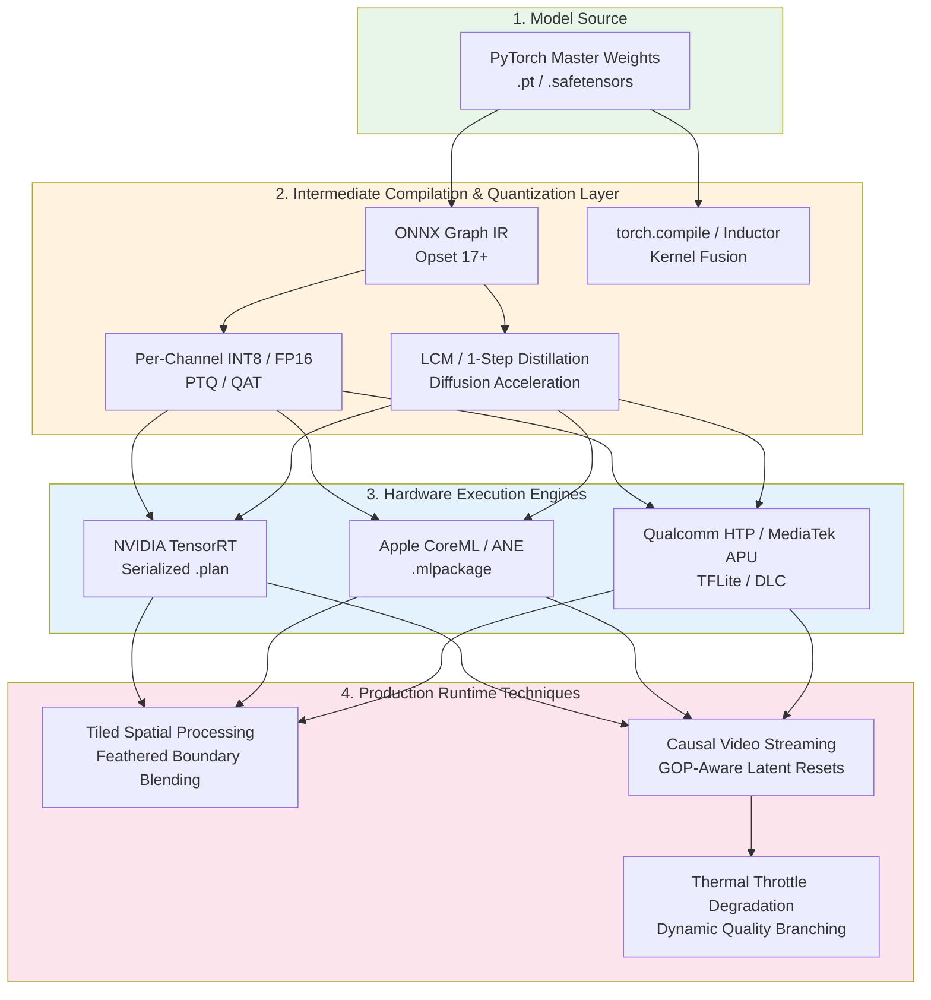
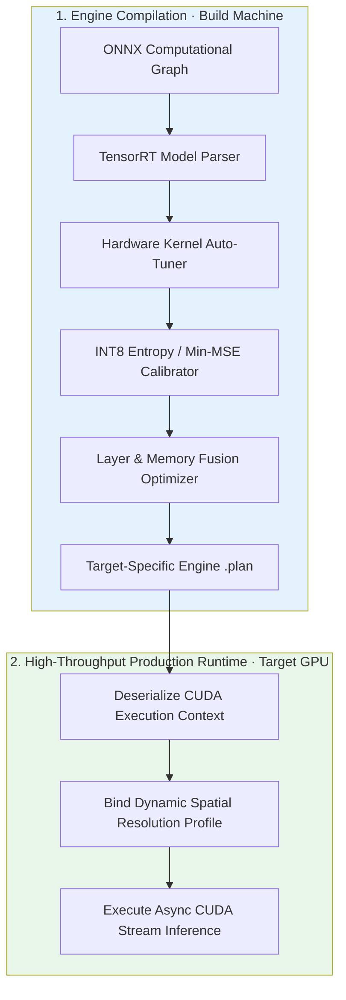
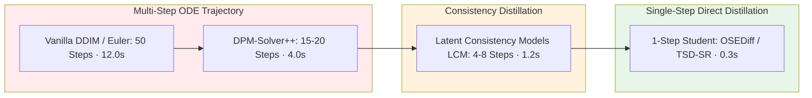
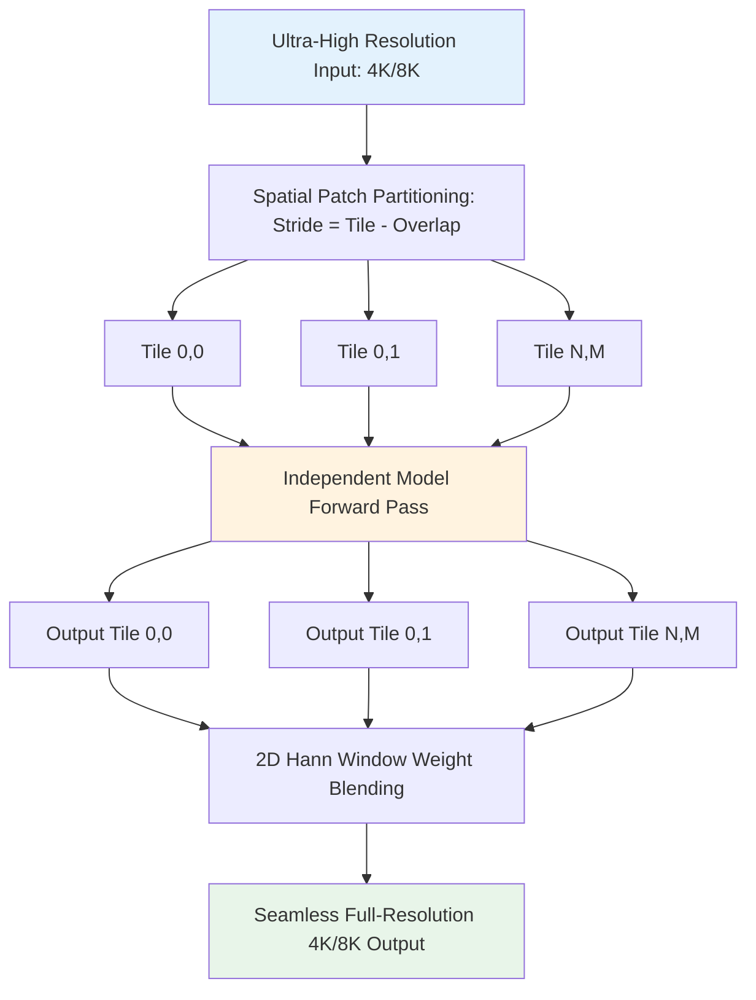
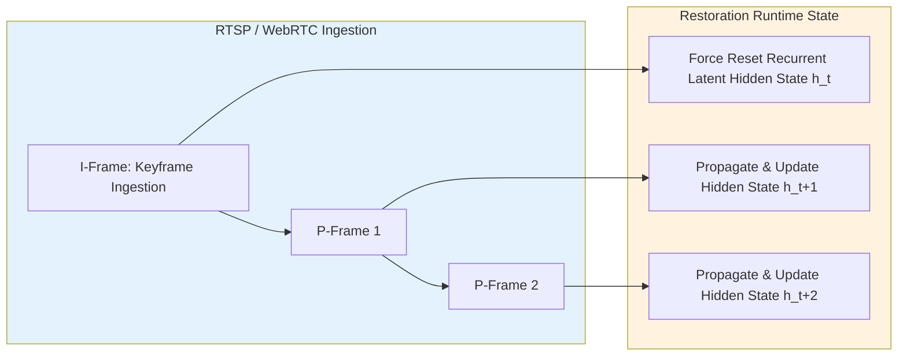

# Chapter 15 · Production Inference Optimization and Edge Deployment

> Transitioning deep restoration models from research prototypes to production infrastructure represents a distinct engineering discipline.
>
> Server-side microservices, mobile applications, and embedded video pipelines operate under rigid constraints: $P_{99}$ latency thresholds, strict VRAM allocations, thermal envelopes, and hardware operator compatibility.
>
> This chapter provides a rigorous systems guide to modern inference acceleration: compilation graphs, FP16/INT8 quantization, TensorRT pipelines, Apple Neural Engine (ANE) optimization, tiled processing, and low-latency streaming.

## 15.0 Reading Notes

Low-level vision inference diverges from classification and large language models: spatial tensor dimensions scale quadratically with resolution, memory bandwidth easily bottlenecks convolutional feature maps, and sub-pixel quantization errors induce visible spatial artifacts.

Key objectives:

- Master model export protocols: ONNX intermediate representations, TorchScript compilation, and PyTorch 2.0 `torch.compile` kernel fusion.
- Implement precision calibration: FP16/BF16 mixed-precision and Per-Channel Quantization-Aware Training (QAT) vs. Post-Training Quantization (PTQ).
- Build high-throughput TensorRT execution engines with dynamic spatial optimization profiles.
- Optimize for the Apple Neural Engine (ANE) and mobile NPUs: avoiding operator fallback cliffs and memory layout overheads.
- Accelerate generative restoration via Latent Consistency Model (LCM) distillation and single-step diffusion SR.
- Implement seamless sliding-window tiled inference with Hann window boundary blending for arbitrary-resolution inputs (4K/8K).
- Design causal, GOP-aligned streaming pipelines for real-time video communications (< 33ms per frame).

**Prerequisites.** Model architectures from Chapters 6-9, video temporal mechanics from Chapters 13-14, and evaluation metrics from Chapter 4.

**Key Terminology Introduced in This Chapter:**

- **TensorRT**: NVIDIA high-performance deep learning inference optimizer and runtime compiling ONNX models into GPU-specific serialized execution plans.
- **PTQ** (Post-Training Quantization): Direct calibration technique deriving scale and zero-point parameters from representative validation batches without weight fine-tuning.
- **QAT** (Quantization-Aware Training): Optimization curriculum inserting simulated quantization operators into forward passes, allowing backpropagation to adapt to low-bit truncation noise.
- **ANE** (Apple Neural Engine): Dedicated low-power NPU hardware on Apple Silicon optimized for fixed-pattern convolutional and matrix operations.
- **Tiled Inference**: Spatial partitioning technique dividing oversized feature maps into overlapping sub-blocks, executing local inference, and performing feathered linear recombination.
- **FlashAttention**: IO-aware exact attention algorithm computing softmax tiled across SRAM blocks, eliminating intermediate $N \times N$ attention matrix memory round-trips.



## 15.1 Universal Inference Optimizations

### 15.1.1 Standardized ONNX Export Protocols

ONNX provides a cross-platform intermediate representation for compiling downstream runtime engines:

```python
import torch

def export_restoration_to_onnx(
    model: torch.nn.Module,
    output_path: str = "restoration_model.onnx",
    sample_shape: tuple = (1, 3, 256, 256)
):
    """Exports PyTorch restoration network to ONNX with dynamic spatial axes."""
    model.eval().cuda()
    dummy_input = torch.randn(*sample_shape, device='cuda')

    torch.onnx.export(
        model,
        dummy_input,
        output_path,
        export_params=True,
        opset_version=17,
        do_constant_folding=True,
        input_names=['input_lr'],
        output_names=['output_sr'],
        dynamic_axes={
            'input_lr': {0: 'batch_size', 2: 'height', 3: 'width'},
            'output_sr': {0: 'batch_size', 2: 'height_out', 3: 'width_out'}
        }
    )
```

### 15.1.2 PyTorch 2.0 `torch.compile` Optimization

PyTorch 2.0+ `torch.compile` utilizes TorchDynamo and TorchInductor to perform automatic vertical operator fusion (e.g., Conv + BatchNorm + ReLU), eliminating intermediate global memory read/writes:

```python
import torch

def compile_inference_model(model: torch.nn.Module) -> torch.nn.Module:
    """Wraps model in TorchInductor compiler with memory-efficient CUDA graph capture."""
    model.eval().cuda()
    # "reduce-overhead" utilizes CUDA graphs to eliminate Python runtime launch overheads
    compiled_model = torch.compile(
        model,
        mode="reduce-overhead",
        dynamic=True
    )
    return compiled_model
```

### 15.1.3 Precision Standards: FP16, BF16, and INT8 Quantization

| Precision Level | Memory Footprint | Dynamic Exponent Range | Numerical Underflow Risk | Recommended Deployment Context |
|-----------------|------------------|------------------------|--------------------------|--------------------------------|
| **FP32** | 4 Bytes / Param | 8 Bits ($10^{\pm 38}$) | Zero | Baseline golden reference |
| **BF16** | 2 Bytes / Param | 8 Bits ($10^{\pm 38}$) | Zero | Modern NVIDIA server GPUs (A100, H100) |
| **FP16** | 2 Bytes / Param | 5 Bits ($10^{\pm 5}$) | Moderate (Requires scaling) | Consumer GPUs & Mobile ANE engines |
| **Per-Channel INT8** | 1 Byte / Param | Discrete Uniform | High (Requires calibration) | Real-time edge inference & Mobile NPUs |

#### Quantization Mechanics in Low-Level Vision

Linear symmetric quantization maps continuous floating-point activations and weights to discrete integer grids:

$$
q = \text{clamp}\left( \left\lfloor \frac{x}{s} \right\rceil, -128, 127 \right), \quad \hat{x} = q \cdot s
$$

Where scale factor $s = \frac{\max(|x|)}{127}$.

In low-level vision, **per-channel weight quantization** is mandatory. Unlike classification networks where activation magnitudes distribute uniformly across feature channels, image enhancement convolutional weights exhibit vast inter-channel scale variance. Single per-tensor scales truncate subtle high-frequency texture channels into zero, creating severe spatial banding and grid artifacts.

## 15.2 NVIDIA GPU Acceleration: TensorRT

NVIDIA TensorRT maximizes GPU throughput via kernel auto-tuning, vertical and horizontal layer fusion, and specialized Tensor Core execution.



### TensorRT Execution Wrapper Implementation

```python
import tensorrt as trt
import pycuda.driver as cuda
import numpy as np

class TensorRTInferenceEngine:
    """Production wrapper for TensorRT execution engines with dynamic resolution support."""
    def __init__(self, plan_path: str):
        self.logger = trt.Logger(trt.Logger.WARNING)
        self.runtime = trt.Runtime(self.logger)

        with open(plan_path, "rb") as f:
            self.engine = self.runtime.deserialize_cuda_engine(f.read())
        self.context = self.engine.create_execution_context()

    def execute(self, lr_tensor: np.ndarray, scale: int = 4) -> np.ndarray:
        """Executes asynchronous TensorRT inference.

        Args:
            lr_tensor: Input image array of shape (1, 3, H, W) in float32.
            scale: Upscaling factor.
        """
        B, C, H, W = lr_tensor.shape
        out_shape = (B, C, H * scale, W * scale)

        # Set dynamic spatial input dimension
        self.context.set_input_shape("input_lr", (B, C, H, W))

        # Allocate contiguous GPU memory buffers
        d_input = cuda.mem_alloc(lr_tensor.nbytes)
        out_bytes = int(np.prod(out_shape) * np.dtype(np.float32).itemsize)
        d_output = cuda.mem_alloc(out_bytes)

        # Asynchronous data transfer and execution
        stream = cuda.Stream()
        cuda.memcpy_htod_async(d_input, np.ascontiguousarray(lr_tensor), stream)

        self.context.set_tensor_address("input_lr", int(d_input))
        self.context.set_tensor_address("output_sr", int(d_output))

        self.context.execute_async_v3(stream.handle)

        # Retrieve output buffer
        hr_output = np.empty(out_shape, dtype=np.float32)
        cuda.memcpy_dtoh_async(hr_output, d_output, stream)
        stream.synchronize()

        return hr_output
```

## 15.3 Apple Silicon and Mobile NPU Deployment

Deploying models to the Apple Neural Engine (ANE) and mobile NPUs (Qualcomm Snapdragon HTP, MediaTek APU) requires adhering to strict architectural invariants to avoid fallback latency cliffs.

### 1. Avoiding the ANE CPU Fallback Cliff

ANE operations execute at sub-millisecond latencies. However, when an unsupported operator is encountered, CoreML falls back the respective subgraph to the CPU or GPU. Inter-device tensor synchronization adds massive overhead ($5\text{ to }30\text{ ms}$ per round-trip).

Key ANE architectural guidelines:
- **Normalization Selection**: Use GroupNorm or InstanceNorm rather than LayerNorm with dynamic spatial resolutions.
- **Upsampling Operator**: Avoid unconstrained PixelShuffle on legacy runtimes (iOS $\le 16$). Utilize nearest-neighbor interpolation followed by $3 \times 3$ convolution, or ensure input channels satisfy $C_{\text{in}} \le 256$.
- **Tensor Layout Integrity**: Maintain 16-byte aligned channel dimensions (multiples of 8, 16, or 32) to prevent implicit internal memory transposition kernels.

```python
import coremltools as ct
import coremltools.optimize.coreml as cto

def convert_to_optimized_coreml(
    traced_pytorch_model,
    output_mlpackage_path: str = "SuperResolution.mlpackage"
):
    """Converts and quantizes low-level vision model for 100% ANE residency."""
    # Convert base model targeting ANE
    model = ct.convert(
        traced_pytorch_model,
        inputs=[ct.ImageType(name="input_lr", shape=(1, 3, 256, 256), scale=1.0/255.0)],
        outputs=[ct.TensorType(name="output_sr", dtype=np.float16)],
        compute_precision=ct.precision.FLOAT16,
        compute_units=ct.ComputeUnit.ALL,
        minimum_deployment_target=ct.target.iOS17
    )

    # Apply per-channel symmetric weight quantization
    config = cto.OptimizationConfig(
        global_config=cto.OpLinearQuantizerConfig(
            mode="linear_symmetric",
            granularity="per_channel"
        )
    )
    quantized_model = cto.linear_quantize_weights(model, config)
    quantized_model.save(output_mlpackage_path)
```

## 15.4 Accelerating Generative Models: LCM and 1-Step Distillation

Standard multi-step diffusion restoration models (e.g., SUPIR executing 50 DDIM reverse steps) exhibit latency profiles of $5\text{ to }15\text{ seconds}$ per image, rendering interactive or streaming deployment infeasible.

### Latency Acceleration Taxonomy



1. **Latent Consistency Models (LCM)**: Distills the multi-step diffusion ODE trajectory into a student parameterization enforcing consistency across arbitrary timesteps ($f_\theta(z_t, t) = f_\theta(z_{t'}, t')$), enabling high-fidelity 4-step sampling.
2. **Single-Step Diffusion Super-Resolution (OSEDiff / TSD-SR)**: Directly optimizes an end-to-end generator to map degraded conditioning inputs to target high-resolution distributions in a single U-Net forward pass, reducing latency to $< 400\text{ ms}$ on modern server GPUs.

## 15.5 Tiled Spatial Inference for Ultra-High Resolution

When processing 4K ($3840 \times 2160$) or 8K imagery, memory consumption of intermediate attention and convolutional activations exceeds physical GPU VRAM. Tiled inference partitions large feature spaces into overlapping sub-patches and reconstructs the output using smooth boundary blending.



```python
import torch
import torch.nn.functional as F

def execute_tiled_inference(
    model: torch.nn.Module,
    input_tensor: torch.Tensor,
    tile_size: int = 512,
    overlap: int = 64,
    scale: int = 4
) -> torch.Tensor:
    """Executes memory-bounded tiled inference with feathered Hann boundary blending.

    Args:
        model: PyTorch restoration model.
        input_tensor: Image tensor of shape (1, 3, H, W).
        tile_size: Input spatial patch size.
        overlap: Margin of overlap between adjacent tiles.
        scale: Upscaling factor.
    """
    _, _, H, W = input_tensor.shape
    stride = tile_size - overlap
    out_H, out_W = H * scale, W * scale

    output_canvas = torch.zeros((1, 3, out_H, out_W), device=input_tensor.device)
    weight_canvas = torch.zeros((1, 1, out_H, out_W), device=input_tensor.device)

    # Generate 2D Hann blending window for output tile
    tile_out_size = tile_size * scale
    hann_1d = torch.hann_window(tile_out_size, periodic=False, device=input_tensor.device)
    hann_2d = torch.outer(hann_1d, hann_1d).unsqueeze(0).unsqueeze(0)  # (1, 1, H_out, W_out)

    for top in range(0, H, stride):
        for left in range(0, W, stride):
            # Compute bounded tile coordinates
            bottom = min(top + tile_size, H)
            right = min(left + tile_size, W)
            actual_top = max(0, bottom - tile_size)
            actual_left = max(0, right - tile_size)

            tile_in = input_tensor[:, :, actual_top:bottom, actual_left:right]

            with torch.no_grad():
                tile_out = model(tile_in)

            # Accumulate blended results
            top_out = actual_top * scale
            left_out = actual_left * scale
            bottom_out = bottom * scale
            right_out = right * scale

            output_canvas[:, :, top_out:bottom_out, left_out:right_out] += tile_out * hann_2d
            weight_canvas[:, :, top_out:bottom_out, left_out:right_out] += hann_2d

    return output_canvas / (weight_canvas + 1e-8)
```

## 15.6 Real-Time Video Streaming Engineering

In interactive video environments (video conferencing, live broadcasts), restoration engines must satisfy hard real-time latency budgets ($< 33\text{ ms}$ for 30 FPS, $< 16\text{ ms}$ for 60 FPS).

### 1. Enforcing Strict Causality

Bidirectional networks (e.g., BasicVSR++) cannot execute in live communications because future frames are unavailable. Production streaming utilizes **causal recurrent networks** maintaining historical hidden states without future lookahead buffers:

$$
h_t = \mathcal{R}\left( F_t, \mathcal{A}(h_{t-1}, f_{t-1 \to t}) \right), \quad \hat{I}_t = \mathcal{G}(F_t, h_t)
$$

### 2. Encoder Alignment and GOP Synchronization



1. **GOP-Aware Hidden State Resets**: Recurrent video networks accumulate state drift across scene transitions, causing ghosting. The runtime parses NAL unit headers and automatically resets $h_t = 0$ upon receiving an intra-coded I-frame.
2. **Thermal-Aware Quality Throttling**: On mobile clients experiencing prolonged thermal load, the engine monitors system thermal states and seamlessly switches to lightweight distilled sub-branches to prevent frame drops.

## 15.7 Chapter Summary

1. **Precision Calibration Hierarchy**: FP16/BF16 mixed-precision should serve as the default production standard; INT8 quantization requires per-channel weight scaling to prevent visual spatial artifacts.
2. **Hardware Kernel Fusion**: TensorRT and TorchInductor eliminate global memory latency cliffs by fusing convolutional, normalization, and activation layers into single CUDA kernels.
3. **NPU Operator Compliance**: Deploying to Apple Silicon ANE and mobile NPUs requires avoiding dynamic LayerNorm and unconstrained PixelShuffle layers to eliminate CPU fallback penalties.
4. **Diffusion Latency Compression**: Single-step distillation (OSEDiff / TSD-SR) reduces diffusion restoration latency from $10\text{ seconds}$ to $< 400\text{ ms}$.
5. **Memory-Bounded Scalability**: Tiled spatial processing with 2D Hann window blending enables arbitrary 4K/8K resolution inference under fixed GPU VRAM budgets.
6. **Streaming Operational Invariants**: Real-time video restoration requires causal recurrent architectures synchronized to codec I-frame boundaries and governed by thermal throttling loops.

---

> Next: [End-to-End Production Case Studies](16-cases.md) presents practical architectures: archival photo restoration, extreme low-light video enhancement, and mobile ISP pipelines.
