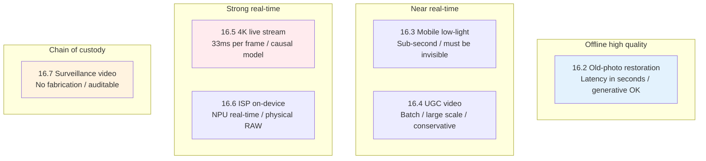
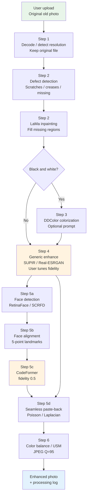
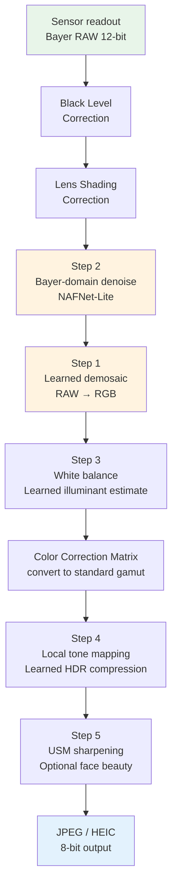
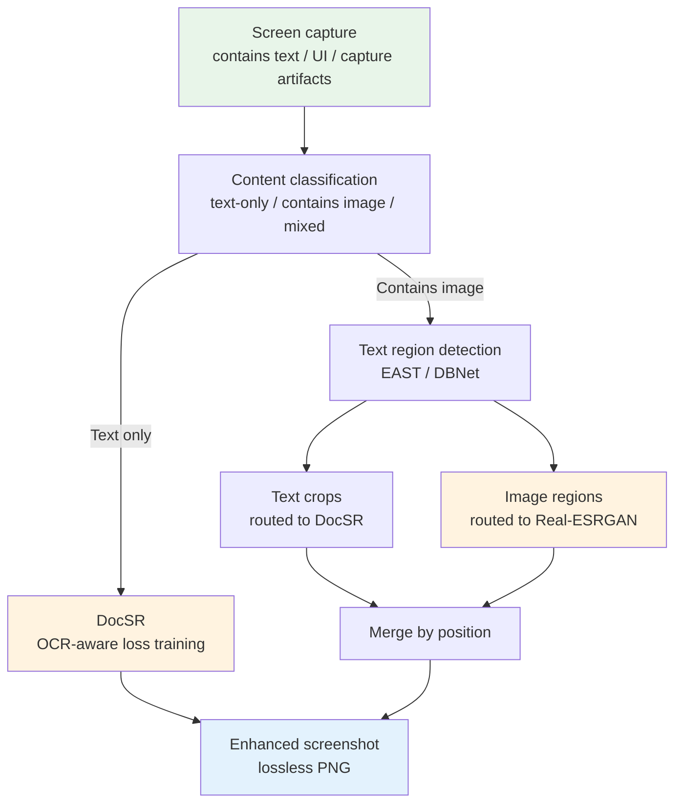

# Chapter 16 · Real-world cases

> The first 15 chapters covered models, losses, data, training, and deployment.
>
> This chapter **applies all of that to concrete scenarios**—each case provides a complete engineering pipeline and the reasoning behind each decision.
>
> This is the chapter closest to a "product manual" in the book.

## 16.0 Chapter prologue

Up to this point, most chapters of the book have lived at a "local optimum" viewpoint: Chapters 6-7 covered how a single network architecture encodes priors, Chapters 11-12 covered how a single training loop converges stably, and Chapter 15 covered how a single inference call runs efficiently on hardware. But any image-enhancement system that is actually shipped to users is never one model behind one call. It is **a pipeline composed of multiple models, multiple discriminative branches, and multiple fall-back paths**. This pipeline accepts an uncontrollable input (an image or video that the user simply dropped in), passes it through detection, routing, specialized processing, fusion, post-stage color and encoding control, and finally returns a result that fits back into the product.

The question this chapter answers is: **given a concrete business scenario, how do you assemble the loose tools from earlier chapters into a pipeline that can actually ship?** After reading this chapter you should be able to:

- Take a new image-enhancement requirement and first identify which class of scenario it belongs to (offline consumer product, on-device real-time, batch UGC, low-latency live streaming, sensor-embedded, evidentiary surveillance)
- Given that scenario, list the priority order of the key constraints (quality, latency, cost, interpretability) and pick the backbone model and supporting modules accordingly
- Draw an end-to-end flow chart and identify the failure points of each step along with the corresponding fall-back branches
- Not drop the top-1 academic benchmark model directly into production, but use the trade-off framework given in this chapter for engineering selection

**Prerequisites.** This chapter assumes the reader has finished Chapter 1's degradation model, Chapter 2's representation spaces, Chapter 5's degradation synthesis, Chapters 9-10's diffusion school and face specialization, Chapters 13-14's video and temporal modeling, and Chapter 15's deployment optimization. Each case explicitly cites the relevant section numbers when referencing earlier chapters.

**Quick-reference abbreviations.** The following abbreviations recur throughout this chapter. They are listed here so you can find them quickly:

- **UGC** (User-Generated Content): content uploaded by ordinary users, as opposed to professionally produced content (PGC), typically images or videos
- **ISP** (Image Signal Processor): the integrated hardware-plus-software pipeline inside a camera that turns raw sensor readouts into a visible image
- **HDR** (High Dynamic Range): images or video that can express a wider luminance range than the standard 8-bit display
- **SDR** (Standard Dynamic Range): the luminance range that traditional 8-bit displays target
- **Bayer**: the most common color-filter layout on a color sensor, with each 2×2 block arranged as RGGB (red, green, green, blue)
- **CFA** (Color Filter Array): the general term for color-filter layouts on a sensor; Bayer is one specific instance
- **NPU** (Neural Processing Unit): on phones and embedded platforms, dedicated hardware accelerators for neural networks, e.g. Apple ANE, Huawei Da Vinci, Qualcomm Hexagon
- **NVDEC / NVENC** (NVIDIA Video Decoder / Encoder): hardware video decoder/encoder on NVIDIA GPUs that can decode or encode H.264 / H.265 directly on the GPU without going through the CPU
- **OCR** (Optical Character Recognition): the task of recognizing text in an image as editable characters
- **A/B testing**: randomly splitting users into two groups, each getting a different version, and comparing metrics to decide whether to ship the new one
- **OOD** (Out-Of-Distribution): inputs that fall outside the training distribution; model behavior on such inputs is unpredictable

## 16.1 Structure of this chapter

Each case contains:

1. **Scenario**: who the user is, what problem they want solved
2. **Key constraints**: quality, speed, device, cost
3. **Complete pipeline**: from input to output
4. **Key decisions**: why each step is the way it is
5. **Failure modes**: the pitfalls encountered in real deployments

Six cases:

```
16.2  Old-photo restoration (consumer product)
16.3  Low-light enhancement (mobile photography)
16.4  UGC video enhancement (short-video platforms)
16.5  4K live-streaming real-time enhancement
16.6  On-device ISP enhancement (mobile post-processing)
16.7  Surveillance video enhancement (security)
```

These six cases cover almost every typical form of image-enhancement deployment. They can be roughly placed on two axes, "latency constraint × quality constraint":



Keep this picture in your head as you read the six sections below. Each section is really the same question answered under different constraints: **how bold are you letting the model be?**

## 16.2 Case: old-photo restoration

### Scenario

A user has a photo from decades ago—black and white or yellowed, scratched, with a blurry face, possibly creased. They want it restored so it "looks like it was shot with a modern camera."

### Key constraints

- **Offline processing**: a few seconds of waiting after upload is acceptable
- **Quality first**: one bad result and the user never returns
- **Don't be too "creative"**: faces must remain recognizable as the same person

### Pipeline

```
Original old photo
  ↓
┌────────────────────────────┐
│ Step 1: Generic preprocess │
│ - Keep the original file   │
│ - Decode to a lossless     │
│   working format           │
│   (PNG/TIFF or tensor)     │
│ - Detect resolution to     │
│   pick downstream strategy │
└────────────────────────────┘
  ↓
┌────────────────────────────┐
│ Step 2: Local defect repair│
│ - Detect scratches /       │
│   creases / missing parts  │
│ - Inpaint with a model     │
│   (LaMa / SD-Inpaint)      │
└────────────────────────────┘
  ↓
┌────────────────────────────┐
│ Step 3: Colorize (if B&W)  │
│ - DeepRemaster / DDColor   │
│ - Optional style prompt    │
└────────────────────────────┘
  ↓
┌────────────────────────────┐
│ Step 4: General enhance    │
│         (background)       │
│ - SUPIR / Real-ESRGAN      │
│ - 4× super-resolution      │
│ - User-tunable fidelity    │
└────────────────────────────┘
  ↓
┌────────────────────────────┐
│ Step 5: Face-specific      │
│         (detect faces)     │
│ - face detector            │
│ - CodeFormer per face      │
│   fidelity_weight = 0.5    │
│ - Paste back into the image│
└────────────────────────────┘
  ↓
┌────────────────────────────┐
│ Step 6: Post-processing    │
│ - Color balance (Lab space)│
│ - Sharpening (USM, tunable)│
│ - High-quality JPEG (Q=95) │
└────────────────────────────┘
  ↓
Restored photo
```

### Pipeline data-flow diagram

Drawing the six steps as an end-to-end diagram makes the relationship between the main branch and the face sub-branch clearer:



A few key engineering details to notice:

1. **Step 2 inpainting and Step 4 generic enhancement are serial, not parallel.** Missing structure must be filled in first so that generic SR works on a complete image; otherwise SR will treat "damaged" regions as texture to be magnified.
2. **The Step 5 face sub-branch and the main branch share the same enhanced background.** The face crops come from the original image (to preserve clean boundaries and alignment), and the enhanced face is pasted back onto the SR output (so the surrounding background has already been processed).
3. **Step 6 color balance comes after all generative steps.** Because SUPIR, DDColor, and CodeFormer can each introduce tone drift, the final stage pulls everything back into alignment (see Section 17.9).

### Key decisions

**Step 2 uses LaMa, not diffusion inpainting**:
- LaMa (Large Mask inpainting, a fast-Fourier-convolution-based large-mask inpainting model) is fast and works well on small scratches; a single 4K image takes a few hundred milliseconds on an A10
- Diffusion inpainting is slow and tends to "create" content—it can synthesize half a face in a region where no person exists; that kind of "surprise" is a production incident in the old-photo scenario

**Step 3 uses DDColor for colorization**:
- DDColor (Dual Decoder Colorization, a 2023 automatic colorization model with two decoders) is pretrained on ImageNet and COCO and has reasonable priors for people, clothing, and indoor scenes common in old photos
- The user can supply a prompt (e.g. "sepia tone", "natural daylight") to control the overall tone, avoiding the model coercing every photo into the same modern look

**Step 4 lets the user tune fidelity**:
- 0.3: lean on the diffusion prior, the old-photo grain is replaced with "modern texture"
- 0.7: keep the original grain and period feel
- Different users have different preferences—don't hard-code. The most common backend A/B-tested default sits around 0.55

**Step 5 processes face crops individually**:
- General SR is poor on faces (Chapter 10), because the face prior is quite different from the natural-image prior
- Detect faces, align to the 512×512 standard position used during CodeFormer training, run the model, then paste back with Poisson blending or Laplacian pyramid blending to avoid visible seams
- fidelity_weight = 0.5: the balance point between identity preservation and moderate generation. This is the product default tuned through human-evaluation A/B testing, not the value recommended in the paper

### Failure modes

- **Multi-face scenes**: the detector misses some faces, and those faces stay blurry
- **Profile or extreme angles**: the face detector fails and CodeFormer's alignment assumption no longer holds
- **Old photos with stamps or handwriting**: the model treats them as "defects" and removes them
- **Clothing patterns**: the model "modernizes" them, losing period feel
- **OOD faces in group portraits** (Out-Of-Distribution, e.g. children, the elderly, non-European/non-American ethnicities): CodeFormer's restoration "looks like a different person"; see Section 17.11

Mitigation: provide UI for the user to **manually mark the priority restoration regions** instead of going fully automatic; and explicitly label the result page with "AI restoration may differ from the original details".

### Representative products

- Topaz Photo AI
- Tencent ARC (based on GFPGAN/CodeFormer)
- Microsoft Bringing Old Photos Back to Life

## 16.3 Case: mobile low-light enhancement

### Scenario

A photo taken at night looks dark, noisy, color-shifted, with low dynamic range. The user wants it to "look like iPhone Night Mode."

### Key constraints

- **On-device, real-time**: the result has to appear right after the shot
- **iPhone 14 ANE**: < 200 ms / 12 MP image
- **No "over-processed" look**: the user expects "naturally good"

### Pipeline

```
RAW / multi-frame RGB
  ↓
┌────────────────────────────┐
│ Step 1: Multi-frame fusion │
│         (HDR+)             │
│ - Burst 4–8 frames at shot │
│ - Inter-frame alignment    │
│   (optical flow)           │
│ - Average + weighted       │
│   (luminance-adaptive)     │
└────────────────────────────┘
  ↓
┌────────────────────────────┐
│ Step 2: Tone mapping       │
│ - Compress HDR to 8-bit    │
│ - Learned LUT (small CNN   │
│   predicts)                │
└────────────────────────────┘
  ↓
┌────────────────────────────┐
│ Step 3: Denoise            │
│ - On-device small NAFNet   │
│ - Physical noise model     │
│   (Section 5.7)            │
└────────────────────────────┘
  ↓
┌────────────────────────────┐
│ Step 4: Color restoration  │
│ - White balance correction │
│   (sensor → standard D65)  │
│ - Color saturation LUT     │
└────────────────────────────┘
  ↓
┌────────────────────────────┐
│ Step 5: Local enhance      │
│         (optional)         │
│ - Faces: light GFPGAN-Lite │
│ - Text / signs: legibility │
└────────────────────────────┘
  ↓
8-bit RGB image for display
```

### Key decisions

**Multi-frame fusion instead of single-frame enhancement**:
- A single ISO (International Organization for Standardization; in photography ISO denotes sensor sensitivity, where a higher value means a higher amplification factor and more noise) 6400 frame is overwhelmingly noisy; denoising loses significant detail
- Multi-frame fusion is equivalent to "more exposure"—it raises SNR at the source. In theory, fusing $N$ frames brings read noise down to $1/\sqrt{N}$, which is a physical improvement, not a post-hoc guess
- This is the core idea behind Google Pixel HDR+ (High Dynamic Range Plus, Google's multi-frame HDR pipeline) and iPhone Night Mode

**On-device NAFNet instead of Restormer**:
- **NAFNet** (Non-linear Activation Free Network, a minimalist residual network that replaces nonlinear activations with gating multiplications) has no self-attention, so it is friendly to the ANE (Apple Neural Engine, Apple's neural network accelerator), and both quantization and compilation go smoothly
- Distilled to 1M parameters, single 12 MP (12 Megapixel) frame inference ~100 ms
- Restormer has channel attention; on-device NPU compilers support it inconsistently, so cross-device stability is poor

**Color restoration** matters more than "quality boost":
- Users can tolerate mild noise but cannot tolerate color shifts
- White balance drifts heavily under low light and must be corrected. The common approach is to use a small CNN to estimate the scene illuminant's color temperature and tint (gain factors), then apply an inverse correction
- The reason this step is "good when invisible" is that the human eye is extremely sensitive to color cast and almost insensitive to a 0.5 dB PSNR gain

### Failure modes

- **Camera moves during the burst**: multi-frame alignment fails → ghosting
- **Fast-moving objects in the scene**: incorrect fusion of moving objects
- **Extreme low light (< 1 lux)**: noise dominates—no number of frames will save it
- **Mixed light sources**: white balance is unsolvable (warm + cool light in the same frame)

### Representative implementations

- iPhone Night Mode (automatic multi-frame)
- Google Pixel Night Sight
- Huawei / Xiaomi AI night mode

## 16.4 Case: UGC video enhancement (short-video platforms)

### Scenario

Users upload low-quality videos (shot on phones, recompressed several times). The platform wants to improve quality automatically so the audience sees a clearer video.

### Key constraints

- **Offline batch processing**: must finish within minutes of upload
- **Massive scale**: millions of videos per day
- **Cost-sensitive**: per-second-of-video processing cost has to be controllable
- **Don't be too aggressive**: users expect "looks better", not "looks different"

### Pipeline

```
Original 720p 30fps video
  ↓
┌────────────────────────────┐
│ Step 1: Content analysis   │
│ - Classify content (face / │
│   landscape / animation)   │
│ - Decide enhancement path  │
│ - Detect low-quality clips │
└────────────────────────────┘
  ↓
┌────────────────────────────┐
│ Step 2: Denoise + de-      │
│         compression art.   │
│ - BasicVSR++ (small)       │
│ - Trained with temporal    │
│   consistency loss         │
└────────────────────────────┘
  ↓
┌────────────────────────────┐
│ Step 3: SR up to 1080p     │
│ - Same BasicVSR++ at 1.5×  │
│ - (Not 4×; perception is   │
│   sufficient)              │
└────────────────────────────┘
  ↓
┌────────────────────────────┐
│ Step 4: Color / brightness │
│ - Simple LUT grading       │
│ - Don't go "beauty filter" │
└────────────────────────────┘
  ↓
┌────────────────────────────┐
│ Step 5: Re-encode          │
│ - H.265 high quality       │
│ - Bitrate adaptive to      │
│   content                  │
└────────────────────────────┘
  ↓
1080p 30fps enhanced video
```

### Key decisions

**1.5× instead of 4× SR**:
- Users watch on phones; 1080p is plenty
- 4× compute is the square of 4× (output pixels are 16× the input); 1.5× only increases the pixel count by 2.25×
- "Sharpening" 1080p → 1080p is perceptually close to 4× SR, because removing compression artifacts and raising local sharpness matters more subjectively than raw physical resolution

**BasicVSR++ instead of SUPIR**:
- Video cannot fabricate; the consistency issue was covered in detail in Chapter 13: a diffusion-based model samples each frame independently, and the slight differences across adjacent frames produce flicker
- BasicVSR++ (the second-generation BasicVSR, adding second-order propagation and flow-guided deformable convolution) is fast: a single 720p frame takes less than 50 ms on an A100
- Cost: a one-minute 30fps clip (1800 frames) takes about 90 seconds of GPU time on an A100; at hourly rates this comes out to well under one cent per minute of video processed

**Front-load content classification**:
- Landscape video: weaken denoising (preserve texture)
- Face-dominant: enable face enhancement
- Animation: skip SR (animation is already vector-styled; super-resolving it introduces "natural-image-style texture" that breaks the art style)
- Screen recordings (instructional video, recorded game streams): take a dedicated screenshot-enhancement branch, because text and UI edges have entirely different statistics

### Failure modes

- **Source video is already high quality**: the model adds artifacts
- **Stylized video** (anime, oil painting): the model treats it as "low quality" and destroys the style
- **Very low frame-rate sources** (10 fps surveillance): SR makes it look worse
- **Heavy-motion scenes**: temporal consistency breaks
- **HDR source video** (High Dynamic Range): the statistics learned on SDR training data don't match HDR, and the luminance mapping can be off

Mitigation: **the model must be able to recognize "no enhancement needed" and bypass**. Concretely, at Step 1 content analysis, also run a lightweight NR-IQA model (such as MANIQA-Lite) over the source frames; clips whose scores exceed a threshold (e.g. 0.7) skip SR entirely and only go through re-encoding. The "don't enhance" decision saves a lot of compute and avoids ruining already-good content.

### Representative implementations

- TikTok / Douyin video post-processing (built-in SR)
- YouTube video upscaling
- Bilibili 4K restoration

## 16.5 Case: real-time 4K live-stream enhancement

### Scenario

A live-streaming platform wants to enhance hosts' 1080p feeds to 4K in real time so members see higher quality.

### Key constraints

- **Real-time**: < 33 ms/frame (30 fps)
- **Low latency**: end-to-end latency under 2 s (the live-streaming tolerance)
- **Cost**: per-stream GPU cost must amortize down
- **Stable**: must not crash under long-running operation

### Pipeline

```
1080p 30fps live feed
  ↓
┌────────────────────────────┐
│ Step 1: Decode (NVDEC)     │
│ - GPU hardware H.264 decode│
└────────────────────────────┘
  ↓
┌────────────────────────────┐
│ Step 2: Streaming denoise  │
│         + SR               │
│ - Distilled BasicVSR-Mini  │
│ - TensorRT FP16            │
│ - Causal model (history    │
│   only)                    │
│ - Keeps 2-frame hidden     │
│   state                    │
└────────────────────────────┘
  ↓
┌────────────────────────────┐
│ Step 3: Encode (NVENC)     │
│ - GPU hardware H.265 encode│
└────────────────────────────┘
  ↓
4K 30fps live feed (members)
```

### Key decisions

**Distillation + TensorRT are mandatory**:
- Vanilla BasicVSR++ 50 ms/frame → distilled 18 ms/frame → TensorRT 8 ms/frame
- Each A100 can serve 4–6 real-time streams (cost amortized)

**Causal model, no sliding window**:
- A sliding window needs "future frames", which adds latency
- Causal models look at history + current only
- ~0.3 dB PSNR loss, but latency drops from +166 ms to +0 ms

**Full GPU pipeline with NVDEC + NVENC**:
- Decode → enhance → encode all on GPU
- Never goes through CPU memory
- End-to-end latency < 100 ms

### Failure modes

- **Sudden scene cut**: the recurrent model's hidden state is wrong; the first frame breaks
- **Network jitter causing irregular input frames**: the model's real-time guarantee is destroyed
- **Heavy motion** (esports, racing streams): visible temporal inconsistency

Mitigation: **scene-cut detection + hidden-state reset**:

```python
def detect_scene_change(prev_frame, curr_frame, threshold=0.3):
    """Simplified scene-cut detection."""
    diff = (prev_frame - curr_frame).abs().mean()
    return diff > threshold

# Streaming loop
for frame in video_stream:
    if detect_scene_change(prev_frame, frame):
        model.reset_hidden_state()
    enhanced = model(frame)
    prev_frame = frame
    yield enhanced
```

## 16.6 Case: on-device ISP enhancement

### Scenario

A phone vendor wants its phones' photos to "look better than same-priced competitors out of the box." The intervention happens at the ISP (Image Signal Processor) level, not as post-processing.

### Key constraints

- **Sensor RAW input** (not RGB). RAW is the unprocessed data read off the sensor before demosaicing and color processing—typically a single-channel image under a **Bayer** color-filter encoding. Bayer is the most common CFA (Color Filter Array) layout, where each 2×2 block consists of four filter cells arranged RGGB (red, green, green, blue); green occupies two slots to match the human eye's higher sensitivity to green.
- **Multiple cameras** (main / ultra-wide / telephoto / macro), each with a different sensor size, optics, and noise distribution
- **On-device NPU** (Qualcomm Hexagon, Huawei Da Vinci, Apple ANE). NPUs differ in their operator support, so the model must be compiled and quantized separately for each platform
- **Ultra-low power**: shooting 1000 photos cannot drain the battery. This means the per-inference energy budget is only tens of millijoules, and both model and tensor encoding must be optimized at the millisecond level

### Pipeline (simplified phone ISP)

```
Sensor RAW (Bayer pattern, 12-bit)
  ↓
┌────────────────────────────┐
│ Pre-processing             │
│ - Black level correction   │
│ - Lens shading correction  │
└────────────────────────────┘
  ↓
┌────────────────────────────┐
│ Step 1: Learned demosaic   │
│ - Replaces classic         │
│   demosaicing              │
│ - Light on-device CNN      │
│ - RAW → full-res RGB       │
└────────────────────────────┘
  ↓
┌────────────────────────────┐
│ Step 2: Learned denoise    │
│ - Trained with physical    │
│   noise model              │
│ - On-device NAFNet variant │
└────────────────────────────┘
  ↓
┌────────────────────────────┐
│ Step 3: White balance +    │
│         color matrix       │
│ - Learned white balance    │
│ - Color matrix to standard │
│   color space              │
└────────────────────────────┘
  ↓
┌────────────────────────────┐
│ Step 4: Tone mapping       │
│ - Local tone mapping       │
│ - Learned HDR compression  │
└────────────────────────────┘
  ↓
┌────────────────────────────┐
│ Step 5: Sharpen + beauty   │
│         (optional)         │
│ - USM or learned local     │
│   sharpening               │
│ - Face beautification      │
│   (toggleable)             │
└────────────────────────────┘
  ↓
8-bit JPEG / HEIC
```

### ISP end-to-end data-flow diagram

Drawing the ASCII pipeline above as a mermaid diagram makes the data-format transitions from RAW to RGB to JPEG easier to track:



Note that in this pipeline, **Bayer-domain denoising happens before demosaicing**. The reason is that Bayer-domain noise is i.i.d. Gaussian + Poisson (each photo-site is independent); after demosaicing, the noise becomes cross-channel correlated and spatially correlated, which raises the denoising difficulty by an order of magnitude.

### Key decisions

**Learned demosaicing instead of classic**:
- Classic demosaicing (Malvar; AHD, Adaptive Homogeneity-Directed) produces zipper artifacts at edges (rainbow-colored, zipper-like color smears along edges)
- Learned demosaicing avoids them and can fuse in denoising at the same time
- But it must be trained per sensor; when sensors change generation, the model has to be retrained

**Bayer-domain vs. RGB-domain denoising**:
- Bayer domain (before demosaic): noise is i.i.d., denoising is simple, but resolution is limited (each channel is sub-sampled)
- RGB domain (after demosaic): noise is correlated, denoising is harder
- Vendors choose differently; the mainstream is Bayer-domain denoising followed by learned demosaicing

**Face beautification must be toggleable**:
- Preferences differ across regions and cultures
- Legal risk (EU GDPR, General Data Protection Regulation, sets strict limits on biometric processing)
- Provide a user toggle in settings

### Failure modes

- **New sensor generation**: the model degrades on new sensors and must be retrained
- **Extreme scenes** (direct sunlight, near-darkness): training data is sparse, the model is OOD
- **Fast motion**: denoising and sharpening conflict
- **Rare objects**: the CNN's training data is limited

### Representative implementations

- Qualcomm Snapdragon ISP + Spectra
- Apple Photonic Engine
- Huawei XMAGE
- Google Pixel Camera

## 16.7 Case: surveillance video enhancement (security)

### Scenario

Footage from public-space cameras used for after-the-fact investigation. Source video is low quality (long-range, low light, heavily compressed); the goal is to enhance it to make details readable.

### Key constraints

- **No fabrication allowed** (forensic / legal-evidence grade)
- **Interpretable**: every processing step must be auditable
- **Chain of custody**: the processed video must be provably "the same clip" as the source

### Pipeline

```
Original low-quality surveillance video
  ↓
┌────────────────────────────┐
│ Step 1: Hash & archive     │
│ - SHA256 of original video │
│ - Timestamped digital sig. │
└────────────────────────────┘
  ↓
┌────────────────────────────┐
│ Step 2: Discriminative SR  │
│         (no diffusion)     │
│ - HAT / SwinIR             │
│ - Generative models banned │
└────────────────────────────┘
  ↓
┌────────────────────────────┐
│ Step 3: Denoise (mild)     │
│ - Conservative; prefer     │
│   noise over information   │
│   loss                     │
└────────────────────────────┘
  ↓
┌────────────────────────────┐
│ Step 4: Region-of-interest │
│ - User-selected region     │
│   (face / license plate)   │
│ - Region-specific          │
│   enhancement              │
└────────────────────────────┘
  ↓
┌────────────────────────────┐
│ Step 5: Processing record  │
│ - Log every model /        │
│   parameter used           │
│ - Output SHA256 + log      │
└────────────────────────────┘
  ↓
Enhanced video + processing log
```

### Key decisions

**Absolutely no diffusion models**:
- Diffusion synthesizes "plausible but nonexistent" detail
- "The model generated a license plate ABC123" is a courtroom incident, with no one able to explain why the model "saw" it
- Discriminative models only (the discriminative paradigm—directly outputting a single best answer from the input—represented by CNNs and non-generative Transformers)

**Conservative SR ratios**:
- 4× SR distorts severely degraded inputs
- Surveillance commonly uses 2× or even 1.5× (sharpening, not enlarging); the goal is to surface information that is already present but unclear

**Specialized for plates / faces**:
- General SR helps little with plate character recognition
- Use OCR-aware SR (Chapter 10), adding an OCR text-similarity loss during training
- Use face SR with identity-preserving losses (ArcFace embedding distance; ArcFace is a loss function and the corresponding feature extractor that trains face recognition with an additive angular margin)

### Failure modes

- **Extreme distance** (face < 20 pixels): unrecoverable by information theory
- **Extreme low light (< 0.1 lux)**: noise dwarfs signal
- **Heavy compression (< 200 kbps)**: too much information is lost

**The most important engineering discipline**: clearly tell users that **the model cannot create information out of thin air**—enhancement only makes existing information clearer.

### Representative implementations

- Hikvision / Dahua AI enhancement
- Forensic video tools used by law enforcement
- Adobe Premiere's Detail Boost (labeled "AI enhancement", not used as evidence)

## 16.7b Case: screen-capture enhancement

### Scenario

A user takes a screenshot of computer or phone content (a chat log, web page, document, slide deck) for sharing or archiving. The source may come from a low-resolution screen, has been recompressed, has moiré (common when a phone photographs a screen), or fonts have aliased under scaling. The user wants the result to have crisper text and cleaner UI edges.

### Key constraints

- **Font fidelity**: every character must remain readable; the model cannot turn "目" into "日"
- **Sharp UI lines**: icon edges and button outlines are straight lines, not natural texture
- **Speed**: typically embedded in a share flow with sub-second response

### Pipeline



### Key decisions

**Output PNG, not JPEG**:
- Screen captures contain many "hard edges" (text, UI lines), and JPEG's ringing artifacts at hard edges are particularly visible
- PNG is lossless, so output quality is consistent

**Text regions must use a dedicated model**:
- Generic Real-ESRGAN treats text as natural texture and tends to smooth out strokes
- After text detection, run a dedicated DocSR (Document Super-Resolution) trained with OCR-aware loss to ensure character recognition stays consistent

**Front-load moiré detection**:
- When photographing a screen, moiré (periodic interference patterns between screen pixels and camera sampling) is a universal problem
- When moiré is detected, run a demoiré model (such as DMCNN, Demoire CNN) first, then continue with later enhancement

### Failure modes

- **Very small fonts** (< 8 pixels tall): information has already been lost
- **Special symbols / emoji / math formulas**: DocSR's training data is biased toward printed text and performs poorly on these OOD inputs
- **Screenshots that are themselves second-hand captures** (a forwarded screenshot of a screenshot): the layered compression artifacts are too complex for the model to disentangle

## 16.7c Case: medical endoscopy enhancement

### Scenario

Video from an endoscope (gastrointestinal, respiratory, joint cavity). Because of the optical structure and small sensor, the picture is often dark, has strong specular reflections and lens fog, and shows pronounced motion blur. Clinicians want enhancement that lets them see tissue texture and small lesions more clearly.

### Key constraints

- **Absolutely no generation allowed.** Any "guessed" detail in a clinical-medical setting is a malpractice risk.
- **Real-time**: real-time playback is needed during the procedure; latency above 100 ms makes precision operation hard for the clinician.
- **Interpretable**: the physical meaning of each enhancement step must be clear, to support regulatory approval.

### Pipeline


### Key decisions

**Specular reflections and fog are detected separately**:
- Specular reflection is a severe interference in medical imagery and must be detected and treated with limited inpainting (small area, using a discriminative model like LaMa; no diffusion)
- Fog goes through classical dark channel prior dehazing (Kaiming He's 2009 work)—interpretable and not dependent on training data

**Retinexformer instead of a diffusion-school model**:
- Section 18.10 expands on this; Retinexformer takes the Retinex physical model (image = reflectance × illumination) as its inductive bias, which matches the medical scenario's requirement for physical interpretability
- The diffusion school is unusable in the medical setting because "generation" behavior is uncontrollable

**USM strength is dialed down to conservative**:
- USM (Unsharp Mask: subtract a blurred copy from the original to get the high frequencies, then add them back to enhance edges) is classical and interpretable
- Too aggressive and it would amplify noise as edges; in medical settings, prefer the "soft" side

### Failure modes

- **Extreme low light** (below candle light): Retinex's "smooth illumination" assumption fails
- **Large bleeding or strong reflection**: the detector fails
- **Motion-dominated** (operating too fast): denoising and motion blur are in conflict

The engineering discipline for medical scenes is even stricter than for surveillance: all processing must have a complete log, all models must pass regulatory approval (FDA, NMPA, etc.), and any model upgrade must go through full clinical validation.

## 16.8 General engineering takeaways

Engineering takeaways aggregated across cases:

### 1. There is no "universal best model"

- Old photos → diffusion-based SUPIR
- Live streaming → distilled BasicVSR-Mini
- Surveillance → discriminative SwinIR
- ISP → on-device NAFNet

Every scenario has its own best choice.

### 2. Pipeline > single model

Real products are always combinations:

- Detect → classify → enhance → evaluate
- A single model rarely covers every scenario

### 3. User-tunable parameters are mandatory

- Let the user choose fidelity
- Don't hard-code "the best" parameters
- A/B test the default

### 4. Failure handling matters more than success optimization

- A model performs well on 95% of scenarios
- How it handles the 5% breakage decides product experience
- "Graceful degradation on failure" beats "icing on the cake on success"

### 5. Continuous iteration

- Collect user failure cases
- Add to training data / failure-case set
- Iterate models on a quarterly cadence

## 16.9 Some anti-patterns

Common mistakes seen in real engineering:

### Anti-pattern 1: Drop in academic SOTA directly

Academic SOTA scores 33 dB on Set5; ported to a product, it may be worse than Real-ESRGAN—because of academic dataset bias.

### Anti-pattern 2: Ignore special scenarios

Optimize only for "typical natural images", ignoring text, barcodes, QR codes—but these constitute 10–20% of user uploads.

### Anti-pattern 3: Bigger model is better

Use SUPIR for real-time live streaming—5 seconds of latency. The user is gone.

### Anti-pattern 4: Skip end-to-end testing

The model is perfect on GPU PyTorch, but after deploying to ONNX Runtime certain ops degrade—quality drop only discovered after launch.

### Anti-pattern 5: Metrics ≠ user experience

PSNR went up by 1 dB, but users like it less—because contrast dropped.

## 16.10 Summary

1. **Each scenario has its own best model combination**—a universal optimum does not exist
2. **Old photos**: diffusion-based (SUPIR) + face-specific (CodeFormer) + user-tunable fidelity
3. **Low light**: multi-frame fusion + physical-noise denoising + color restoration
4. **UGC video**: distilled BasicVSR-Mini + temporal consistency + 1.5× SR
5. **Live streaming**: ultra-light + TensorRT + causal model + full-GPU pipeline
6. **ISP**: Bayer-domain denoising + learned demosaic + on-device NPU
7. **Surveillance**: discriminative + absolutely no diffusion + auditable processing log
8. **Pipeline > single model**: real products are multi-stage combinations
9. **User tuning is mandatory**: fidelity / style / strength
10. **Failure handling decides product experience**

The next chapter focuses on failure modes—the typical ways enhancement models fail in production.

---

> Next chapter: [Failure cases](17-failures.md) → typical ways enhancement models fail in production: fabrication, amplifying adversarial noise, identity drift, video flicker, quantization collapse.
