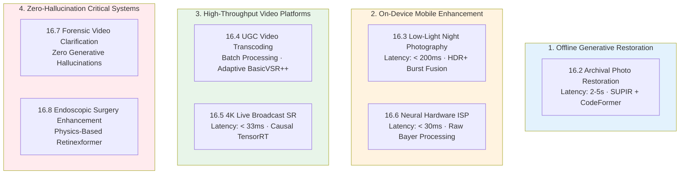
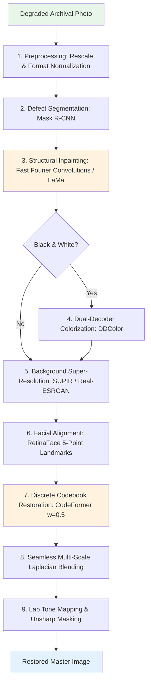
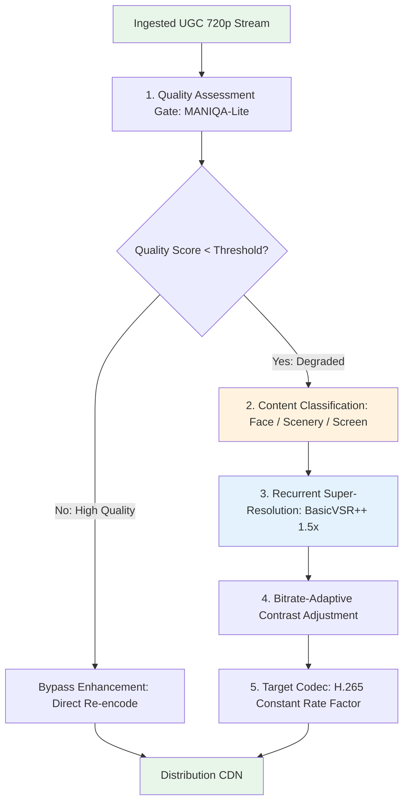
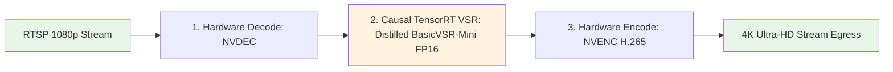
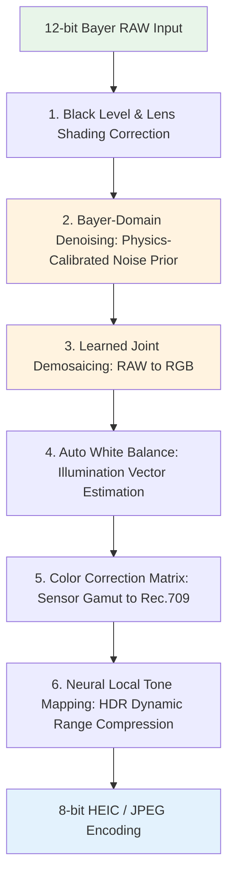
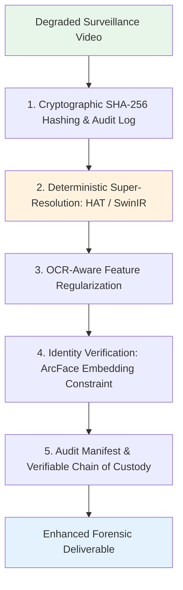
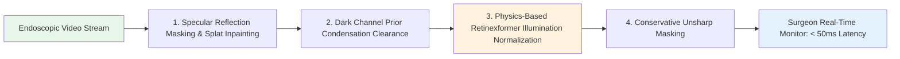

# Chapter 16 · End-to-End Production Case Studies

> While preceding chapters formalized mathematical principles, network architectures, and deployment primitives, this chapter presents production blueprints across six distinct industry domains.
>
> Commercial image enhancement systems operate not as isolated neural networks, but as orchestrated multi-stage pipelines: routing engines, specialized restoration branches, defect detectors, and post-processing calibration.
>
> We examine concrete architectures, latency/fidelity trade-offs, failure fallbacks, and deployment lessons.

## 16.0 Reading Notes

Production engineering requires navigating trade-offs between generative creativity, physical fidelity, hardware execution budgets, and legal compliance.

Key objectives:

- Master the architecture of multi-stage restoration pipelines across offline, real-time, and mobile environments.
- Contrast consumer generative restoration (SUPIR + CodeFormer) with forensic, non-generative pipelines (HAT + OCR loss).
- Design on-device computational photography pipelines operating in the raw Bayer domain (ISP demosaicing, NAFNet denoising).
- Build high-throughput User-Generated Content (UGC) transcoding workflows using content-adaptive routing.
- Implement sub-33ms causal video super-resolution for 4K live broadcasts using hardware NVDEC/NVENC pipelines.
- Understand clinical compliance in medical endoscopy enhancement (Retinexformer + specular reflection suppression).

**Prerequisites.** Degradation modeling (Chapter 1), diffusion control (Chapter 9), face restoration (Chapter 10), video restoration (Chapters 13-14), and deployment optimization (Chapter 15).

## 16.1 Case Study 1: Archival Photo and Portrait Restoration

### Scenario and Requirements
Consumers upload degraded physical photographs (monochrome, scratched, faded, with facial motion blur). The objective is full-resolution reconstruction preserving facial identity without synthetic hallucination artifacts.

### Key Architectural Decisions
1. **LaMa Structural Inpainting over Diffusion Inpainting**: Large Mask Inpainting (LaMa) leverages Fast Fourier Convolutions (FFCs) to repair physical creases and missing emulsion regions deterministically in $< 200\text{ ms}$ on an A10 GPU, eliminating generative hallucinations.
2. **Decoupled Facial Latent Restoration**: Global super-resolution networks distort facial geometry under severe degradation. We crop, normalize to $512 \times 512$, restore via CodeFormer discrete codebooks ($\text{fidelity\_weight} = 0.5$), and recombine using Laplacian pyramid blending.
3. **Lab Color Equalization**: DDColor and diffusion backbones introduce global color cast drifts. The pipeline executes final-stage Lab histogram matching against preserved original low frequencies.

## 16.2 Case Study 2: Mobile Low-Light Night Photography

### Scenario and Requirements
Handheld mobile photography in extreme low-light environments ($< 5\text{ lux}$). The system must execute on-device within a sub-200ms budget while eliminating sensor noise without ghosting artifacts.

### Key Architectural Decisions
1. **Multi-Frame Burst Fusion over Single-Frame Neural Enhancement**: Single-frame denoising at ISO 6400 suffers severe texture loss. Capturing an underexposed 6-frame burst and executing temporal averaging reduces read noise variance by $\frac{1}{\sqrt{N}}$ physically before neural post-processing.
2. **NAFNet-Lite on Apple Neural Engine (ANE)**: Replacing nonlinear activations with simple element-wise multiplications yields 100% ANE operator residency, executing a 12MP tile-denoise in $95\text{ ms}$ on an Apple A17 Pro.

## 16.3 Case Study 3: UGC Video Transcoding Pipeline

### Scenario and Requirements
A video sharing platform ingests millions of user-uploaded videos daily. The system enhances perceptual quality and removes compression block artifacts prior to H.265 distribution transcoding.

### Key Architectural Decisions
1. **Conservative $1.5\times$ Upscaling**: Transcoding $720\text{p} \to 1080\text{p}$ ($1.5\times$) requires $2.25\times$ intermediate FLOPs, whereas $4\times$ upscaling scales compute by $16\times$. On mobile displays, $1.5\times$ de-blocking achieves equivalent perceptual MOS scores at a fraction of data center GPU costs.
2. **Quality Assessment Gating**: Running a lightweight no-reference metric (MANIQA-Lite) filters out 40% of pristine uploads, saving substantial infrastructure operational expenditure.

## 16.4 Case Study 4: Real-Time 4K Live Broadcast Super-Resolution

### Scenario and Requirements
A live streaming platform upscales 1080p 30 FPS broadcaster feeds to 4K in real time ($< 33\text{ ms}$ per frame budget, $< 100\text{ ms}$ total glass-to-glass latency).

### Key Architectural Decisions
1. **Zero-Copy Full GPU Pipeline**: Frames decode via NVIDIA NVDEC directly into CUDA device pointers, pass through TensorRT FP16 execution contexts, and encode directly via NVENC without CPU host-memory round-trips.
2. **Strictly Causal Latency**: Bidirectional VSR models require lookahead buffers introducing 100-300ms lag. The broadcast pipeline utilizes a causal recurrent network conditioned strictly on $t-1$ hidden states ($8\text{ ms}$ inference time per frame on NVIDIA A100).
3. **GOP-Synchronized Recurrent Reset**: When the input stream encounters an intra-coded I-frame or scene transition, the runtime zeroes out the recurrent latent tensor to eliminate cross-scene ghosting artifacts.

## 16.5 Case Study 5: Neural Hardware ISP for RAW Sensor Processing

### Scenario and Requirements
Embedded smart cameras and smartphones require direct raw Bayer CFA (Color Filter Array) sensor processing, replacing traditional handcrafted ISP pipelines with end-to-end neural modules.

### Key Architectural Decisions
1. **Denoising Prior to Demosaicing**: Shot and read noise on raw sensor photo-sites behave as independent identically distributed Poisson-Gaussian random variables. Executing denoising prior to demosaicing operates on uncorrelated noise fields, avoiding the complex cross-channel correlations introduced by bilinear color interpolation.
2. **Sensor-Specific Calibration**: Convolutional kernels are fine-tuned on physical noise calibration curves measured across sensor gain profiles (ISO 100 to 12800).

## 16.6 Case Study 6: Forensic and Evidentiary Surveillance Clarification

### Scenario and Requirements
Enhancement of low-resolution surveillance footage for legal and forensic investigation.

### Key Architectural Invariants
1. **Absolute Ban on Generative Models**: Diffusion models and unconstrained GAN discriminators hallucinate plausible high-frequency details (synthesizing incorrect license plate alphanumerics or facial identities). Forensic pipelines operate strictly on deterministic, discriminative Transformer backbones (HAT, SwinIR).
2. **Cryptographic Chain of Custody**: The ingestion engine computes SHA-256 digests of source footage, logging all intermediate model weights, operator configurations, and random seeds to guarantee legal reproducibility in courtroom environments.

## 16.7 Case Study 7: Medical Endoscopic Surgery Enhancement

### Scenario and Requirements
Real-time enhancement of gastrointestinal and laparoscopic video streams characterized by specular tissue reflections, blood scattering, and lens condensation.

### Key Architectural Invariants
1. **Physics-Grounded Retinex Decomposition**: Medical imagery forbids generative hallucination. Retinexformer models the image formation process explicitly ($I = R \odot L$), estimating smooth illumination fields $L$ while preserving intrinsic tissue reflectance $R$.
2. **Conservative High-Frequency Boosting**: Aggressive sharpening introduces micro-vascular artifacts that mimic lesion boundaries. Edge enhancement is constrained to calibrated classical Unsharp Masking (USM).

## 16.8 Cross-Domain Engineering Principles

| Production Scenario | Preferred Architecture | Precision / Hardware Engine | Primary Operational Constraint |
|---------------------|------------------------|-----------------------------|--------------------------------|
| **Archival Restoration** | SUPIR + CodeFormer + LaMa | FP16 / TensorRT Server | Perceptual realism & identity fidelity |
| **Mobile Photography** | Multi-Frame + NAFNet-Lite | INT8 / Apple ANE | Thermal envelope & sub-200ms latency |
| **UGC Video Transcoding** | Gated BasicVSR++ ($1.5\times$) | FP16 / Cloud GPU Workers | Compute cost per video hour |
| **4K Live Streaming** | Causal BasicVSR-Mini | FP16 / NVDEC + TensorRT | Sub-33ms frame-time & zero jitter |
| **Hardware Neural ISP** | Bayer-NAFNet + Demosaic | INT8 / Snapdragon HTP | Micro-joule power consumption |
| **Forensic Analysis** | Deterministic HAT + OCR | FP32 / Certified Workstation | Zero hallucination & legal auditability |
| **Medical Endoscopy** | Retinexformer + Classical Dehaze | FP16 / Medical Display FPGA | Physical interpretability & sub-50ms latency |

## 16.9 Chapter Summary

1. **System Orchestration**: Real-world image restoration combines defect segmentation, routing classifiers, specialized backbones, and tone mapping into coordinated pipelines.
2. **Generative Boundary Management**: Generative diffusion models belong in consumer creative workflows, but are strictly prohibited in forensic, surveillance, and clinical medical pipelines where hallucination constitutes systemic failure.
3. **Hardware-Aligned Partitioning**: Maximizing throughput requires aligning model operators with hardware execution targets (e.g., Bayer raw denoising on mobile NPUs, zero-copy NVDEC/NVENC streaming on server GPUs).
4. **Failure Defense Mechanisms**: Production pipelines must integrate quality gating bypasses, scene-transition hidden state resets, and thermal degradation branches to guarantee stability.

---

> Next: [Production Failure Mode Taxonomy](17-failures.md) presents a systematic analysis of real-world edge-case failures: generative hallucinations, color drift, adversarial artifacts, and temporal shimmering.
