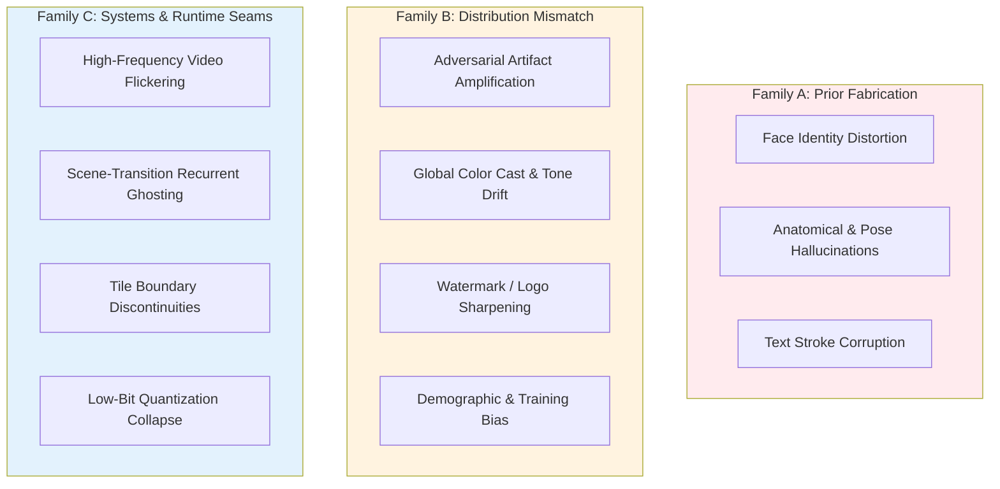
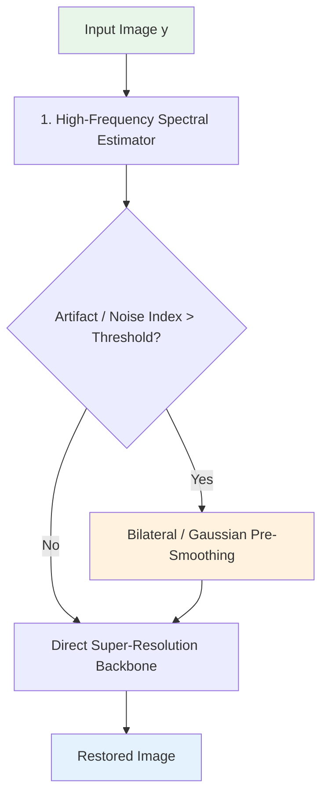
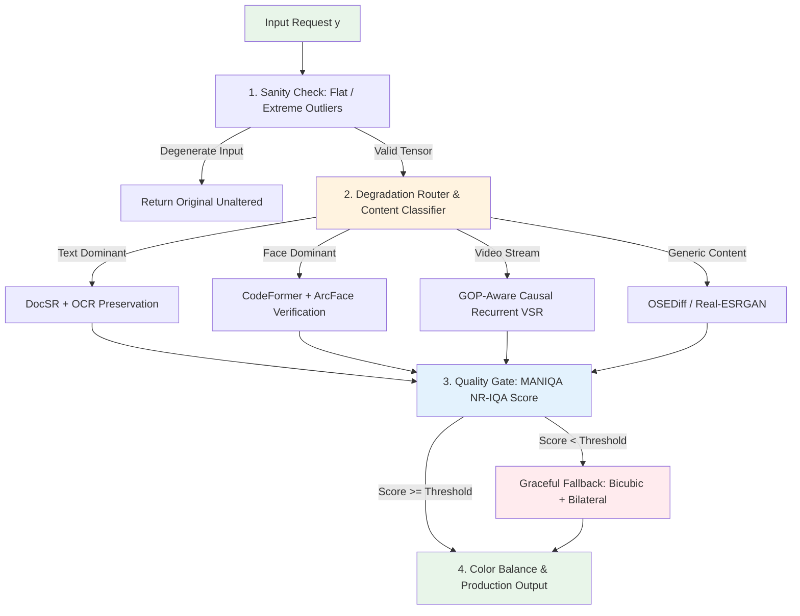

# Chapter 17 · Production Failure Mode Taxonomy

> While academic benchmarks evaluate average metrics across clean validation sets, real-world deployment is defined by edge cases and failure modes.
>
> In production, user trust is destroyed not by a 0.2 dB deficit in average PSNR, but by catastrophic anomalies: facial identity distortion, text corruption, temporal flickering, and color cast drift.
>
> This chapter provides a battle-tested diagnostic taxonomy of 15 recurring production failure modes, analyzing their mathematical root causes, detection heuristics, and engineering defenses.

## 17.0 Reading Notes

Production restoration architectures require defensive engineering: input sanity checking, conditional routing, post-hoc verification, and graceful degradation paths.

Key objectives:

- Understand the three root-cause families: Prior Fabrication (Family A), Train-Inference Distribution Mismatch (Family B), and Systems Assembly Seams (Family C).
- Implement defensive safeguards against generative hallucination in facial, hand, and anatomical restoration.
- Prevent adversarial noise amplification, compression block exacerbation, and watermark distortion.
- Mitigate temporal flickering, scene-transition breakdown, and recurrent state divergence in video streams.
- Resolve numerical quantization collapse and spatial tile boundary discontinuities.
- Build continuous CI failure-case regression test suites and automated triage feedback loops.

**Prerequisites.** Loss function constraints from Chapter 3, degradation modeling from Chapter 5, face restoration from Chapter 10, temporal consistency from Chapters 13-14, and inference execution from Chapter 15.



## 17.1 Root-Cause Diagnostic Hierarchy

Production failure modes originate from three structural failure planes:

| Root-Cause Family | Mathematical Origin | Manifested Production Symptoms | Primary Engineering Countermeasure |
|-------------------|---------------------|--------------------------------|------------------------------------|
| **Family A: Prior Fabrication** | Under-constrained posterior sampling $p(x \mid y)$ under extreme degradation | Facial identity swap, synthetic hair bundling, extra fingers | Discrete codebook constraints (CodeFormer), ArcFace identity gating, user fidelity knobs |
| **Family B: Distribution Mismatch** | Out-of-Distribution (OOD) test inputs exceeding synthetic degradation support | Candy-wrapper artifacts, color shifts, contrast collapse | High-order synthetic pipelines, front-loaded degradation routers, color histogram matching |
| **Family C: Systems Assembly Seams** | Single-frame model execution wired into stateful or partitioned pipelines | Video temporal boiling, scene-cut tearing, tile grid seams | Causal recurrent propagation, Hann window tile feathering, GOP-aligned state resets |

## 17.2 Generative Hallucination Failures (Family A)

### 1. Facial Identity Drift and Age/Demographic Shift
- **Symptom**: Low-resolution facial crops are restored with altered identity, racial characteristics, or smoothed age features.
- **Mathematical Root Cause**: When observation $y$ carries low mutual information with true ground truth $x$, conditional diffusion models sample from the prior mode $p(x)$ dominated by dataset demographics (e.g., FFHQ Caucasian youth bias).
- **Production Defense**: Enforce identity verification via ArcFace cosine similarity gating. If similarity drops below threshold $\tau = 0.40$, fall back to conservative bilateral upsampling:

```python
import torch
import torch.nn.functional as F

def verify_and_gate_face_restoration(
    lr_face: torch.Tensor,
    restored_face: torch.Tensor,
    arcface_model: torch.nn.Module,
    threshold: float = 0.40
) -> torch.Tensor:
    """Verifies facial identity preservation; falls back to conservative interpolation on drift."""
    with torch.no_grad():
        emb_lr = arcface_model(F.interpolate(lr_face, size=(112, 112), mode='bilinear'))
        emb_res = arcface_model(F.interpolate(restored_face, size=(112, 112), mode='bilinear'))
        sim = F.cosine_similarity(emb_lr, emb_res, dim=1).item()

    if sim < threshold:
        # Fall back to conservative non-generative bicubic interpolation
        return F.interpolate(lr_face, size=restored_face.shape[-2:], mode='bicubic', align_corners=False)
    return restored_face
```

### 2. Anatomical and High-Frequency Texture Hallucination
- **Symptom**: Hands exhibit extra digits; hair strands coalesce into synthetic plastic sheets; teeth form continuous white ribbons.
- **Mathematical Root Cause**: Fine structures lack strong topological priors in standard 2D convolutional or diffusion backbones. Downsampling removes structural boundary lines completely.
- **Production Defense**: Inject structural conditioning via ControlNet keypoints or restrict generative sampling to conservative low Classifier-Free Guidance ($\text{CFG} \le 1.5$) paired with multi-scale detail blending.

## 17.3 Distribution Mismatch and Artifact Amplification (Family B)

### 1. Adversarial Noise and Over-Sharpening Amplification
- **Symptom**: Pre-sharpened images or JPEG compression halos transform into aggressive high-frequency "candy-wrapper" crystalline textures.
- **Mathematical Root Cause**: Synthetic training pipelines model Gaussian blur and Poisson noise. High-pass filter halos violate degradation assumptions, causing the network to misinterpret high-frequency noise as valid structural edges.
- **Production Defense**: Implement front-loaded degradation classification to route pre-sharpened inputs to dedicated smoothing passes:



### 2. Global Tone Drift and Color Cast Shifts
- **Symptom**: Warm atmospheric sunsets or deliberate artistic color grading are neutralized into sterile cool daylight tones.
- **Mathematical Root Cause**: Training datasets predominantly contain daylight-balanced photography, inducing a regression bias toward canonical white balance.
- **Production Defense**: Decouple luminance detail restoration from chrominance statistics using Lab space color reconstruction:

```python
def preserve_chrominance_tone(
    restored_rgb: torch.Tensor,
    original_rgb: torch.Tensor
) -> torch.Tensor:
    """Retains high-frequency luminance from restored image while locking chrominance to original."""
    restored_lab = rgb_to_lab(restored_rgb)
    original_lab = rgb_to_lab(original_rgb)

    # Low-pass filter original chrominance channels (a*, b*)
    orig_ab_blur = F.avg_pool2d(original_lab[:, 1:, :, :], kernel_size=21, stride=1, padding=10)
    rest_ab_blur = F.avg_pool2d(restored_lab[:, 1:, :, :], kernel_size=21, stride=1, padding=10)

    # Re-align chrominance residual
    calibrated_ab = restored_lab[:, 1:, :, :] + (orig_ab_blur - rest_ab_blur)
    corrected_lab = torch.cat([restored_lab[:, 0:1, :, :], calibrated_ab], dim=1)

    return lab_to_rgb(corrected_lab)
```

## 17.4 Systems Integration and Runtime Seams (Family C)

### 1. High-Frequency Video Temporal Boiling
- **Symptom**: Independent frame-by-frame super-resolution exhibits severe temporal shimmering across flat surfaces and detailed textures.
- **Mathematical Root Cause**: Lack of inter-frame temporal regularization allows high-frequency generative stochasticity to fluctuate across consecutive frames.
- **Production Defense**: Enforce bidirectional recurrent feature propagation (BasicVSR++) or apply optical-flow-warped exponential smoothing filters across the output stream.

### 2. Scene-Cut Recurrent State Pollution
- **Symptom**: The first 3-5 frames immediately following an editorial cut exhibit severe tearing and ghosting from the preceding scene.
- **Mathematical Root Cause**: Recurrent hidden states $h_{t-1}$ carry latent features completely uncorrelated with the new camera shot.
- **Production Defense**: Detect scene transitions via frame-difference metrics and force-reset recurrent hidden states to zero ($h_t = \mathbf{0}$).

### 3. Tiled Processing Boundary Seams
- **Symptom**: High-resolution image outputs show visible grid seams along sub-tile boundaries.
- **Mathematical Root Cause**: Receptive fields near patch edges lose spatial context, causing localized boundary prediction divergence.
- **Production Defense**: Apply minimum 64-pixel patch overlaps combined with 2D Hann window linear blending and reflect padding.

## 17.5 End-to-End Defensive Production Architecture



## 17.6 Automated CI Regression Testing Framework

```python
class RestorationRegressionSuite:
    """Automated continuous integration suite validating model defense invariants."""
    def __init__(self, model_under_test: torch.nn.Module, arcface_model: torch.nn.Module):
        self.model = model_under_test
        self.arcface = arcface_model

    def test_pure_black_input(self) -> bool:
        """Validates numerical stability on zero-activation inputs."""
        zero_in = torch.zeros(1, 3, 256, 256).cuda()
        with torch.no_grad():
            out = self.model(zero_in)
        return not torch.isnan(out).any() and out.std().item() < 0.01

    def test_facial_identity_constraint(self, face_lr: torch.Tensor) -> bool:
        """Validates facial identity preservation against reference crops."""
        with torch.no_grad():
            out = self.model(face_lr)
            emb_in = self.arcface(F.interpolate(face_lr, (112, 112)))
            emb_out = self.arcface(F.interpolate(out, (112, 112)))
            sim = F.cosine_similarity(emb_in, emb_out).item()
        return sim >= 0.40

    def test_energy_bounded_oversharpening(self, oversharp_in: torch.Tensor) -> bool:
        """Ensures the network does not amplify pre-existing adversarial high frequencies."""
        with torch.no_grad():
            out = self.model(oversharp_in)
        # Compute high-frequency Laplacian energy ratio
        laplacian_kernel = torch.tensor([[[[0, 1, 0], [1, -4, 1], [0, 1, 0]]]], dtype=torch.float32).cuda()
        energy_in = F.conv2d(oversharp_in.mean(dim=1, keepdim=True), laplacian_kernel).abs().mean()
        energy_out = F.conv2d(out.mean(dim=1, keepdim=True), laplacian_kernel).abs().mean()
        return energy_out <= energy_in * 1.5
```

## 17.7 Chapter Summary

1. **Failure Plane Categorization**: Production failures partition into Prior Fabrication (hallucinations), Distribution Mismatch (unseen degradation artifacts), and Systems Assembly Seams (temporal/spatial seams).
2. **Identity-Gated Fallbacks**: Face and text enhancement must integrate automated downstream verification (ArcFace cosine distance, OCR character consistency), triggering conservative fallbacks on failure.
3. **Decoupled Color Preservation**: Generative color cast shifts are mitigated by locking output chrominance ($a^*, b^*$) to low-pass-filtered input statistics.
4. **State-Synchronized Video Streaming**: Recurrent video networks require automated hidden-state resets at scene boundaries to eliminate cross-shot ghosting.
5. **Continuous Defensive CI**: Deployable models must pass regression suites evaluating pure-black stability, boundary tile consistency, and energy-bounded noise amplification before launch.

---

> Next: [SOTA Reference Guide and Model Selection](18-sota.md) summarizes state-of-the-art architectures, benchmarks, and a practical selection decision tree for production systems.
