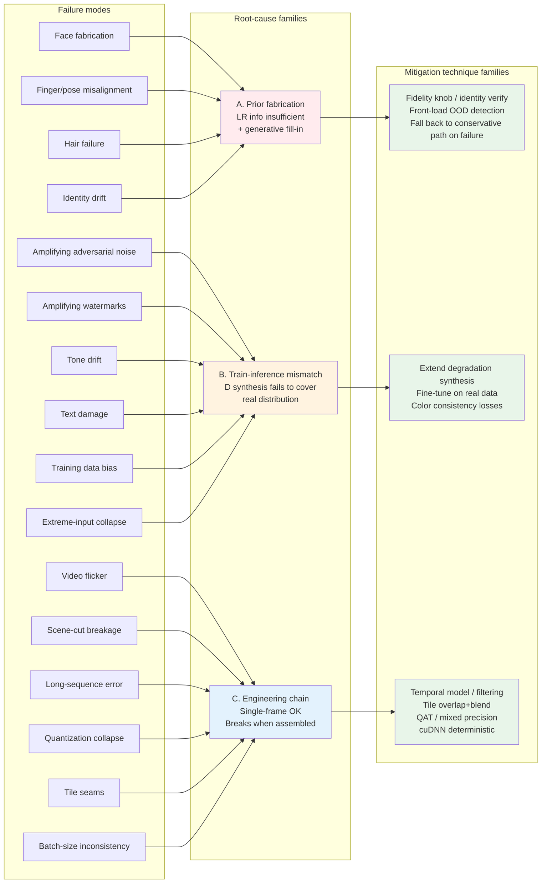
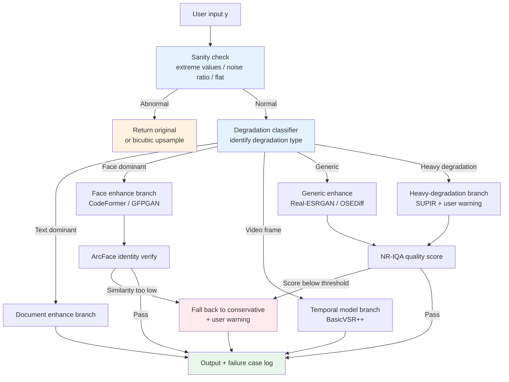
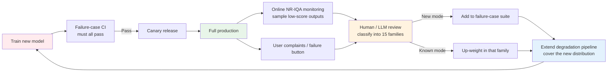

# Chapter 17 · Failure case collection

> A model with great average metrics still fails in production.
>
> This chapter collects the **most common failure modes** in image enhancement over the past few years - each with a concrete scenario, root cause, and mitigation.
>
> This is the most "battle-tested" chapter in the book and the one most worth re-reading.

## 17.0 Chapter prologue

After 16 chapters, you have the full toolchain for a complete enhancement system: mathematical definitions, representation spaces, loss design, evaluation metrics, data synthesis, network architectures, training dynamics, video temporal modeling, and deployment optimization. In theory, this toolkit is sufficient to train a model that performs respectably on most public benchmarks.

But there is an asymmetric fact in the engineering world: once an enhancement model ships, **what users remember is not how much you improved the average metric over the previous version, but the catastrophic failure on one specific image**. A face turned into candy wrap, a video that flickers across a scene cut, a document where "日" is rewritten as "目"—any one of these can erase all the PSNR gains. The failure cases that propagate on social media are never the inverse of "average PSNR up by 0.2 dB"; they are dramatic errors on OOD inputs (out-of-distribution samples—inputs whose distribution was not seen during training).

This chapter is a catalog of these dramatic errors. Every entry in the catalog comes from a real product incident: screenshots from social media, user complaints, red lines in internal regression tests. They are the pitfalls the field has stepped into over the past decade, and the navigational chart left behind after others paid the cost. Reading this chapter is unlike reading any earlier one: the earlier ones told you how to build a car, this one tells you which intersections will flip it.

Each failure mode follows the same template: a concrete product scenario first (so you can "see" the problem), then root-cause analysis (so you understand why it happens), and finally a set of actionable mitigations (so you know what defenses to add in your own system). None of the three sections is dispensable. Reading only the scenario without the root cause leads you to think the problem is "the model isn't good enough"; reading the root cause without mitigations leaves you stuck on complaint rather than improvement; jumping to mitigations while skipping the root cause leads to wasted effort (the patches are applied in the wrong place).

At the end of the chapter we also do two things: distill all the failure modes into five general mitigation principles, and operationalize the test set as a regression suite that plugs into CI. The first helps you know where to look when a new failure mode appears; the second ensures that problems discovered today won't quietly come back in the next version.

## 17.0.1 Notes on abbreviations and terminology

The following abbreviations recur in this chapter and across neighboring chapters; they are listed here for quick reference:

- **OOD** (Out-Of-Distribution): inputs not covered by the training distribution. Model behavior on OOD inputs has no theoretical guarantee; most failure modes are essentially this.
- **PSNR** (Peak Signal-to-Noise Ratio): the log of pixel-level MSE; the dominant academic benchmark metric.
- **SSIM** (Structural Similarity): a metric that combines luminance, contrast, and structure.
- **LPIPS** (Learned Perceptual Image Patch Similarity): perceptual distance computed from deep network features (VGG / AlexNet).
- **MANIQA / CLIP-IQA / Q-Align**: no-reference IQA (Image Quality Assessment) models.
- **FFHQ** (Flickr-Faces-HQ): the 70K high-resolution face dataset used to train StyleGAN, mostly sourced from Flickr, skewed toward Caucasian and young subjects.
- **ArcFace**: the most widely used face recognition model in industry, mapping faces to a 512-dimensional angularly separable hyperspherical embedding.
- **CodeFormer**: a face restoration model that uses a VQ codebook as a strong prior, with a tunable fidelity parameter.
- **SUPIR / OSEDiff / TSD-SR / SinSR / DiffBIR / PASD / SeeSR / ResShift / StableSR / AdcSR**: different engineering approaches in the diffusion-school SR lineage. The next chapter walks through each one; in this chapter you only need to know that their common failure pattern is "guessing too freely".
- **SDXL** (Stable Diffusion XL): a 2.6B-parameter text-to-image base model; most diffusion-school SR systems attach a ControlNet or LoRA fine-tune on its UNet.
- **SD3 / SD3.5 / FLUX** (the next-generation DiT backbones from 2024-2025): MM-DiT text-to-image base models; some newer diffusion SR systems replace SDXL with these as backbones.
- **ControlNet**: a side-network that injects extra visual conditions (edge maps, depth maps, low-quality images, etc.) into a pretrained UNet.
- **LLaVA** (Large Language and Vision Assistant): a multimodal large model that produces natural-language descriptions of an image; SUPIR uses it to auto-generate prompts for input images.
- **QAT / PTQ** (Quantization-Aware Training / Post-Training Quantization): quantization during training vs. after training.
- **HDR / SDR** (High / Standard Dynamic Range): HDR refers to image/video formats whose brightness range exceeds 0-255.
- **WCG** (Wide Color Gamut): color spaces whose gamut exceeds Rec.709 (the HDTV standard), e.g. Rec.2020, DCI-P3.
- **ACES** (Academy Color Encoding System): the standardized color pipeline used in the film industry.
- **CFA / Bayer / RGGB** (Color Filter Array / Bayer Pattern / Red-Green-Green-Blue Pattern): the color filter array on a camera sensor; most phone cameras use RGGB.
- **OCR** (Optical Character Recognition): recognizing text in an image as editable characters.
- **CDN** (Content Delivery Network): images are often recompressed by edge nodes when traveling through CDNs; this is the last stop of the real-world D chain.
- **CFG** (Classifier-Free Guidance): the prompt-strength knob in diffusion sampling.
- **VAE** (Variational AutoEncoder): the network the diffusion school uses to encode images into latent space.
- **ROI** (Region of Interest): a sub-region of an image that needs special processing, e.g. face boxes, text-line boxes.

## 17.0.2 A classification view of failure modes

The 15 concrete failure modes fall into three families by "root-cause level"; understanding this taxonomy is more useful than memorizing each mode individually:

**Family A: prior fabrication.** When LR information is severely insufficient, diffusion- and GAN-school models sample "plausible" details from the training distribution to fill in. This family includes face fabrication, hair failure, finger misalignment, pose deformation, and identity drift. The essence is that the model is executing its training task (sampling the most plausible $\hat{x}$), but that "plausible" conflicts with the user's expectation of "faithful".

**Family B: train-inference mismatch.** The degradation distribution the model learned on synthetic data does not cover the real input. This family includes amplifying adversarial noise, amplifying watermarks, tone drift, text damage, training data bias, and extreme-input collapse. The essence is that the synthesis pipeline for D does not cover the degradations actually seen in the wild.

**Family C: engineering-chain.** The model itself works fine on single-frame static tests but fails when wired into the engineering chain. This family includes video flicker, scene cuts, long-sequence error accumulation, quantization collapse, tile seams, and batch-size inconsistency. The essence is that seams appear when a single-frame model is assembled into a larger system.

Putting the three families on one diagram:



This diagram is the "map" of the chapter. The 15 sections that follow are ordered by phenomenon (for easy lookup), but when reasoning about root causes, remember which family each one belongs to. Failure modes in the same family often share the same mitigation patterns.

## 17.1 Why we need this chapter

Section 12.15 introduced "failure case suite" as an evaluation method. This chapter is the content version - **a systematic catalog of failure modes that recur in the field**.

Rule of thumb:

> An industrial-grade enhancement model's maturity is not measured by how high its PSNR is on Set5, but by how large its failure case suite is.
>
> SOTA papers optimize average metrics. Production optimizes **the worst 5%**.

Below are 15 classes of failure modes, each with scenario, cause, and mitigation. As you read, keep the three-family classification from Section 17.0.2 in your head: when you reach "diffusion model rewrites a baby's face into someone else", remind yourself this is Family A (prior fabrication) and it shares roots with "extra finger" and "identity drift" further down; when you reach "video flicker", remind yourself this is Family C (engineering chain) and shares mitigation patterns with "scene-cut breakage" and "long-sequence error".

## 17.2 Failure mode 1: diffusion models fabricate content

### Scenario

When restoring an old photo, the diffusion model turns "a blurry baby's face" into "a sharp face that doesn't look like the same person" - grandpa holds the photo and says, "this isn't my son." This is one of the highest-frequency failure modes of the past three years and one of the most damaging to product reputation; "AI restoration turned grandma into someone else" has gone viral on social media more than once.

### Cause

Diffusion models perform **generation**, not recovery, on heavily degraded faces:

- The LR information is insufficient, so the model samples a "plausible face" from the training distribution
- That sampled face is **visually realistic** but **not the original face**
- FFHQ (Flickr-Faces-HQ, the 70K high-resolution face dataset) in the training data is mostly Caucasian; the "plausible face" distribution for other ethnicities is biased

A more precise look at the mathematics. A diffusion model estimates $p(x | y)$—the posterior over high-quality $x$ given low-quality observation $y$. When $y$ is not informative enough to "tighten" this posterior, the mode of the distribution (the most likely sample) sits near the "average face" of the training set, and the specific sample drawn is determined by the noise. Grandpa's son and the face the model sampled are both, mathematically, "plausible posterior samples of $y$". The model did not "make a mistake"; it is executing the sampling task it was trained for. What is wrong is **the mismatch between user expectation (recovery) and model behavior (sampling)**.

### Mitigation

1. **Expose fidelity to the user**: CodeFormer's `w` parameter allows tuning
2. **Detect heavy-degradation regions and disable generative models**: if LR is too poor, fall back to bicubic upsampling
3. **Identity verification post-processing**: use ArcFace to compare original and enhanced; warn the user if similarity is too low
4. **Clear product positioning**: state "AI enhancement may change details" so users have realistic expectations

```python
def safe_face_enhance(lr_face, model, identity_threshold=0.4):
    enhanced = model(lr_face)
    
    # Compare with ArcFace
    sim = arcface_similarity(lr_face, enhanced)
    
    if sim < identity_threshold:
        # Warn the user (or fall back to a conservative method)
        return {
            'output': bicubic_upscale(lr_face, 4),
            'warning': 'Insufficient detail in the original; AI restoration may differ significantly from the source.',
        }
    return {'output': enhanced, 'warning': None}
```

## 17.3 Failure mode 2: amplifying adversarial noise / artifacts

### Scenario

A user uploads a photo that has been over-sharpened by a Photoshop plugin, then runs Real-ESRGAN on it—the artifacts get amplified into a "candy-wrapper" texture.

### Cause

The model has learned a "low-quality to high-quality" mapping. The "low-quality" training data does not include over-sharpened images, so the model treats the sharpening artifacts **as detail to recover**—and sharpens them further.

More generally: the model's behavior is unpredictable on degradation distributions not covered by training.

### Mitigation

1. **Front-load degradation detection**: a classifier predicts the input's "degradation type"
2. **Multi-branch model**: different degradation types route to different enhancement models
3. **Augment the training data**: add more "weird degradations" (over-sharpening, oversaturation, over-denoising)

```python
def adaptive_enhance(image, classifier, models):
    """Pick a model based on the detected degradation type."""
    degradation_type = classifier(image)
    
    if degradation_type == 'normal_lr':
        return models['real_esrgan'](image)
    elif degradation_type == 'oversharpened':
        return models['mild_smooth_then_sr'](image)
    elif degradation_type == 'oversaturated':
        return models['color_normalize_then_sr'](image)
    else:
        return models['safe_baseline'](image)
```

## 17.4 Failure mode 3: face identity drift

### Scenario

A video conferencing enhancement model "beautifies" each frame, but coworkers notice that **the user looks like a different person**.

### Cause

Section 10.3 covered identity-preserving losses, but in training their weight was too low:

- Pixel loss dominates → the model learns the statistics of the "standard face"
- At inference the model "standardizes" every face—distinctive features (nose shape, mouth corners, etc.) are smoothed away

### Mitigation

1. **Increase identity-preserving loss weight**: from 0.1 to 0.5
2. **Diversify training data**: add IMDB-Face, Asian Face, etc., on top of FFHQ
3. **Identity guidance at inference**: each call provides a "reference face embedding" as an extra input

```python
class IdentityGuidedEnhancer(nn.Module):
    """Enhance with the user's reference face as a guide."""

    def __init__(self, base_model, arcface):
        super().__init__()
        self.base_model = base_model
        self.arcface = arcface.eval()

    def forward(self, lr_face, reference_face):
        with torch.no_grad():
            ref_embedding = self.arcface(reference_face)
        # Inject the embedding into base_model as a condition
        return self.base_model(lr_face, condition=ref_embedding)
```

## 17.5 Failure mode 4: video flicker

### Scenario

Use Real-ESRGAN to process a video frame by frame; in the output, textures, flat regions, and face details are all "boiling"—painful to watch.

### Cause

Discussed in Section 13.1: a single-frame model does not consider temporal consistency. The same texture appears slightly different in adjacent LR inputs → the model produces slightly different details → flicker.

### Mitigation

1. **Use temporal models** (BasicVSR++ / VRT) instead of single-frame models
2. **Post-process: temporal filtering**

```python
def temporal_filter_post(frames: list, alpha: float = 0.7) -> list:
    """Apply exponential moving average over enhanced video to reduce flicker.
    Cost: loses some detail and adds a slight 'motion blur' feel.
    """
    smoothed = [frames[0]]
    for t in range(1, len(frames)):
        # Align the previous frame with optical flow first
        flow = estimate_flow(frames[t], smoothed[-1])
        warped_prev = warp_with_flow(smoothed[-1], flow)
        # Weighted average
        s = alpha * frames[t] + (1 - alpha) * warped_prev
        smoothed.append(s)
    return smoothed
```

3. **Training data: video pairs + temporal-consistency losses**—the root-cause fix

## 17.6 Failure mode 5: quantization collapse

### Scenario

A model gives 33 dB PSNR in PyTorch FP32 but drops to 26 dB after INT8 conversion for on-device deployment—candy-wrapper artifacts are visible.

### Cause

Low-level vision is sensitive to quantization (Section 15.2.5):

- **Activation distribution outliers**: certain layers have wide activation ranges (max far exceeds mean), so INT8 loses a lot
- **First / last layers are sensitive**: the image → feature and feature → image transitions are particularly delicate
- **Convs after PixelShuffle**: produce visible checkerboard artifacts after quantization

### Mitigation

1. **Mixed-precision quantization**: keep first conv, last conv, and normalization layers in FP16/FP32

```python
quant_config = {
    'first_conv':       'fp16',     # don't quantize the input conv
    'pixel_shuffle_conv': 'fp16',   # don't quantize before upsampling
    'last_conv':        'fp16',     # don't quantize the output conv
    'others':           'int8',
}
```

2. **QAT (Quantization-Aware Training)**: inject quantization perturbation during training
3. **Per-channel quantization**: not per-tensor; per-channel is more accurate

4. **Just skip INT8**: in many low-level vision settings FP16 is good enough; there's no reason to take the precision risk

## 17.7 Failure mode 6: tile boundary seams

### Scenario

A 4K image is split into 1024 tiles for processing; the output has visible **seams** along tile boundaries—like a square jigsaw.

### Cause

Tiles are processed independently:

- Pixels near the boundary **see only the context within their tile**
- Adjacent tiles **see different contexts**
- Outputs are discontinuous across boundaries

### Mitigation

1. **Overlap + blend** (Section 15.9): mandatory, not optional
2. **Larger overlap**: 256-pixel overlap looks better than 64 pixels (but is slower)
3. **Mirror padding at edges**: edge tiles use reflect padding instead of constant padding
4. **Shared noise (diffusion)**: all tiles share the same noise seed for structural continuity

## 17.8 Failure mode 7: extreme inputs cause collapse

### Scenario

A user uploads a **pure black** / **pure white** / **pure random noise** image. The enhancement model's output is some kind of abstract art.

### Cause

The model never saw extreme OOD inputs in training:

- Pure black: all activations near zero, normalization layers div-by-zero
- Pure white: saturation, abnormal activations
- Noise: high-frequency components dominate, the model treats them as "details" to amplify

### Mitigation

1. **Validate inputs**: bypass the model on extreme inputs

```python
def safe_inference(model, image):
    # Input feature checks
    mean = image.mean()
    std = image.std()
    
    if std < 1e-3:                  # nearly flat
        return image                # return as-is, no enhancement
    
    if mean < 0.02 or mean > 0.98:  # extreme bright/dark
        return image                # skip enhancement
    
    # Check noise ratio
    high_freq_ratio = compute_high_freq_ratio(image)
    if high_freq_ratio > 0.7:        # noise dominates
        # Take the "denoise then enhance" branch
        return enhance_after_denoise(image)
    
    # Normal path
    return model(image)
```

2. **Augment training data**: include extreme samples (pure black, pure white, Gaussian noise) when synthesizing

## 17.9 Failure mode 8: tone drift / color cast

### Scenario

A user's warm-toned (sunset) photo is enhanced and **comes out cooler**—the sunset atmosphere is gone.

### Cause

The training data is biased toward "standard white balance" images:

- Training HRs went through "beautified white balance"
- The model pulls every input toward that distribution
- Warm tones are corrected away as "color temperature deviation"

### Mitigation

1. **Color consistency loss** (Section 3.8): use it during training
2. **Post-processing: color matching**

```python
def color_match(enhanced: torch.Tensor, original: torch.Tensor) -> torch.Tensor:
    """Match enhanced's tone to original's.
    Keep enhanced's detail, borrow original's color statistics.
    """
    # Convert to Lab color space
    enhanced_lab = rgb_to_lab(enhanced)
    original_lab = rgb_to_lab(original)
    
    # Use enhanced for the L channel (detail)
    l = enhanced_lab[:, 0:1]
    # Heavily blur a, b channels and use original (color)
    enhanced_ab_blur = F.avg_pool2d(enhanced_lab[:, 1:], 21, stride=1, padding=10)
    original_ab_blur = F.avg_pool2d(original_lab[:, 1:], 21, stride=1, padding=10)
    
    # Color "shift"
    color_diff = original_ab_blur - enhanced_ab_blur
    matched_ab = enhanced_lab[:, 1:] + color_diff
    
    matched_lab = torch.cat([l, matched_ab], dim=1)
    return lab_to_rgb(matched_lab)
```

3. **Diversify training data**: cover a wide range of white balances

## 17.10 Failure mode 9: text / OCR damage

### Scenario

After enhancing a document image, characters that were once readable become unreadable—e.g., "日" turns into "目", or strokes get smoothed out.

### Cause

Section 10.7 covered this: general SR learns "natural-image priors", which conflict with text structure.

### Mitigation

1. **Front-load text detection**: detected text regions go to a specialized model
2. **Train a specialized model with OCR-guided loss**
3. **Conservative strategy**: do only minimal enhancement (deblur, no SR) on text regions

```python
def hybrid_enhance(image, text_detector, sr_model, doc_sr_model):
    text_boxes = text_detector(image)
    
    if len(text_boxes) == 0:
        # Pure image -> general SR
        return sr_model(image)
    
    # Has text -> region-by-region processing
    background = sr_model(image)
    
    for box in text_boxes:
        text_crop = crop(image, box)
        enhanced_text = doc_sr_model(text_crop)
        background = paste(background, enhanced_text, box)
    
    return background
```

## 17.11 Failure mode 10: training data bias

### Scenario

The model performs well on Caucasian / young faces but poorly on Asian elderly / children's faces—the enhanced face does not look like the original person.

### Cause

The FFHQ dataset:

- 70K faces, mostly from Flickr
- Age distribution skewed young (20–40)
- Race distribution skewed Caucasian
- Gender distribution relatively balanced

The model learns the "average face" of this distribution and performs poorly on out-of-distribution faces (elderly, children, specific ethnicities).

### Mitigation

1. **Diversify the dataset**: add IMDB-Face, Asian Face, African Face, etc.
2. **Fairness testing**: report metrics separately per demographic
3. **Failure-case suite**: explicitly tag bias scenarios and re-evaluate regularly

### This is not an "algorithm problem"; it is a **data problem + engineering discipline problem**

The root cause of many AI fairness issues lies in the data. **Reporting metrics by group** is the minimum engineering discipline.

## 17.12 Failure mode 11: video scene cuts

### Scenario

A video cuts between two scenes (an edit). After enhancement, the first frame of the second scene **breaks badly**—much worse than the stable steady state that follows.

### Cause

Recurrent models (BasicVSR++) rely on hidden state:

- Hidden state is propagated from the previous frame
- After a scene cut, the previous hidden state corresponds to **completely different visuals**
- The first frame is enhanced with the "wrong" context

### Mitigation

1. **Scene-cut detection + hidden-state reset** (the code at the end of Section 16.5)
2. **Add scene cuts to training data**: introduce random cuts during synthesis so the model learns to handle them

```python
class SceneAwareVideoModel(nn.Module):
    def __init__(self, base_model):
        super().__init__()
        self.base_model = base_model
        self.scene_threshold = 0.3

    def forward(self, frame, hidden_state, prev_frame=None):
        if prev_frame is not None:
            diff = (frame - prev_frame).abs().mean()
            if diff > self.scene_threshold:
                hidden_state = self.base_model.init_hidden(frame.shape)
        out, new_hidden = self.base_model(frame, hidden_state)
        return out, new_hidden
```

## 17.13 Failure mode 12: long-sequence error accumulation

### Scenario

After a few minutes of video processing, enhancement quality **degrades gradually**—great at the start, blurry by the end.

### Cause

Recurrent models keep accumulating hidden state:

- A small error each frame propagates to the next
- Over time, accumulated errors become significant
- It can even diverge

### Mitigation

1. **Periodically reset hidden state**: every N frames (e.g. 60)
2. **Bidirectional RNN (BasicVSR++) + end-to-end training on long sequences**
3. **Detect anomalies and fall back**: monitor output statistics; switch to a single-frame model when anomalous

## 17.14 Failure mode 13: amplifying watermarks / logos

### Scenario

A user uploads an image with a watermark, and after enhancement the watermark is **clearer and more prominent**.

### Cause

The model treats the watermark as "image content"—equally weighted, equally enhanced.

### Mitigation

1. **Front-load watermark detection**: localize the watermark first
2. **Special handling for watermark regions**: choose to ignore / enhance / remove (removal carries copyright risk)
3. **Training data**: add watermark augmentation so the model learns "watermark stays a watermark, don't sharpen it"

## 17.15 Failure mode 14: pose / finger / hair structure changes

### Scenario

For images of people in motion (fitness, dance), diffusion enhancement **moves a hand**, or **adds an extra finger**. Same family of failures includes hair turned into tangled plastic strands (hair failure), wrong number of teeth in a smile (teeth failure), asymmetric glasses frames on a glasses-wearing subject, and clothing folds that no longer correspond to the original.

### Cause

Diffusion's well-known weakness in structural understanding:

- Hand variability in training data is much smaller than for other objects
- Hand "details" are not "recovery" for the model—they are "generation"
- Generation tends to violate structure (extra/missing fingers, misalignment)

Hair failures share the same root: each strand of hair is a sub-pixel-thin line that disappears completely after LR downsampling, and when the model "fills in" hair at HR there is no geometric constraint telling it "this strand starts here and ends there". The "statistical average" of hair in SDXL's training data is a roughly smooth hair bundle without a per-strand tracking inductive bias, so the sampled detail looks like CG rather than real hair. Teeth and frames fail for the same reason—they are fine structures on a low-dimensional manifold, very sensitive to position and shape errors.

### Mitigation

1. **Avoid using diffusion for heavily degraded hands**
2. **If diffusion is required, inject pose with ControlNet** (hand keypoints / OpenPose skeleton as extra condition)
3. **Post-processing: hand detection + replace with a discriminative model**
4. **Down-weight hair / teeth regions**: weight the loss with a mask during training; at inference, lower the CFG strength in these regions
5. **Multi-step diffusion preserves refinement opportunities**: single-step diffusion is structurally worse than multi-step; key ROIs (Region of Interest) can preserve 4–8 resampling steps

## 17.16 Failure mode 15: batch-size inference differences

### Scenario

The model produces normal output at `batch_size=1`, but at `batch_size=8` the **output differs slightly**—accumulated over a long video, this produces visible flicker.

### Cause

CUDA kernel / cuDNN nondeterminism:

- Different batch sizes take different kernel paths
- Some operations (reductions) order results based on batch size
- Floating-point non-associativity yields slightly different outputs

### Mitigation

1. **Pin the inference batch size**: once the production batch size is chosen, do not let it fluctuate with load; whether it matches the training batch size **is not what matters**—what matters is **stability in production**
2. **Set cuDNN deterministic**:

```python
torch.backends.cudnn.deterministic = True
torch.backends.cudnn.benchmark = False
```

Cost: slightly slower, but reproducible.

3. **Apply temporal filtering at the end of the production pipeline**—mask the small inconsistencies

## 17.17 A unified mitigation philosophy

Distilling 15 failure modes into general principles:

### Principle 1: handling edge cases > average optimization

Adding 0.1 dB on 95% of scenarios doesn't matter. Going from broken to usable on 5% of scenarios matters more.

### Principle 2: detect + route

Don't try to make a single model handle every input. Front a classifier/detector that routes different inputs to different processing paths.

### Principle 3: graceful degradation on failure

When the model breaks, it must not output garbage—fall back to a conservative method (bicubic, original image). **There is always a "safety net" path.**

### Principle 4: training data is the root of failure

The vast majority of failure modes trace back to **training data not covering the relevant distribution**. More data > tuning the model.

### Principle 5: UI design helps manage failure

- Expose tunable parameters (fidelity)
- Surface a warning instead of silently outputting on failure
- Design retry / undo affordances

### Composing the five principles into one decision flow

The five principles above can be composed into one inference-time decision flow that maps directly to code. The key idea is "detect before calling the big model, verify after calling it, and always have a fall-back along every path":



Key engineering points in this picture:

1. **Sanity check goes first**: extreme inputs (pure black / pure white / pure noise) do not enter the model, avoiding div-by-zero in normalization layers.
2. **Degradation classifier is the router**: one lightweight classifier (MobileNet-class is enough) suffices to route inputs to the few main paths.
3. **Post-verification is not optional**: ArcFace for faces, NR-IQA for generic (MANIQA / CLIP-IQA / Q-Align). Failed verification must not be force-output.
4. **Failure case logging**: every fall-back must be written to disk as material for the next round of training data expansion. This is the feedback loop from production back into training.
5. **No path may be without a fall-back**: every path from $y$ to output must degrade in the worst case to "original or bicubic". Under no circumstance should a "model gone wrong" garbage image be handed out.

## 17.18 Operationalizing the failure-case suite

Translate this chapter into an executable test suite:

```python
class FailureCaseSuite:
    """Failure-case regression tests."""

    def __init__(self):
        self.cases = [
            # (name, input_loader, expected_property)
            ('extreme_lr_face',  load_extreme_lr_face,  self.identity_preserved),
            ('oversharpened',    load_oversharp_image,  self.no_amplified_noise),
            ('pure_black',       load_pure_black,        self.no_artifacts),
            ('text_document',    load_text_doc,          self.ocr_consistent),
            ('non_white_face',   load_non_white_face,    self.identity_preserved),
            # ... dozens of cases
        ]

    def identity_preserved(self, input_face, output_face):
        sim = arcface_similarity(input_face, output_face)
        return sim > 0.4

    def no_amplified_noise(self, input_img, output_img):
        return high_freq_energy(output_img) < 1.5 * high_freq_energy(input_img)

    def ocr_consistent(self, input_doc, output_doc):
        return ocr(input_doc) == ocr(output_doc)

    def no_artifacts(self, input_img, output_img):
        return output_img.std() < 0.05  # pure-black input should produce nearly pure-black output

    def run(self, model):
        results = {}
        for name, loader, check in self.cases:
            input_img = loader()
            output = model(input_img)
            results[name] = {
                'pass': check(input_img, output),
                'output': output,
            }
        return results
```

Every new model version must run this suite. **A PSNR bump alone is not ship-ready** - every failure case must pass.

## 17.18.1 The failure-to-fix feedback loop

Putting the failure-case suite into CI only solves the "known failure modes won't regress" problem. The mechanism that actually lowers the failure rate over the long run is to push new failure modes surfaced in production back into training. This is a closed loop:



Key engineering points in this loop:

1. **Online low-score samples must be auto-sampled**: relying on user complaints to gather failure cases covers far too little (complaint rates are typically < 0.1%); only NR-IQA monitoring (MANIQA / CLIP-IQA / Q-Align) yields enough samples.
2. **The triage step is the bottleneck**: early on it can be human; at scale, use an LLM (GPT-4V / Claude / Gemini) to classify "which family does this failure belong to", with human spot checks.
3. **Extending the degradation pipeline is the real lever**: covering new failure modes in the training pipeline is far more effective than tweaking network structure. This connects directly to Section 1.7 and Chapter 5.
4. **The loop cycle time determines the team's "reaction speed"**: ideally 2–4 weeks per round (sample → review → extend pipeline → retrain → CI → ship); slower than 8 weeks means you are basically taking customer hits as they come.

## 17.19 Summary

15 common failure modes:

1. **Diffusion fabrication**: tunable fidelity + identity verification
2. **Amplified adversarial noise**: detection classifier + branch routing
3. **Identity drift**: increase identity loss + reference guidance
4. **Video flicker**: temporal model + temporal post-filter
5. **Quantization collapse**: mixed precision + QAT
6. **Tile seams**: overlap + blend + shared noise
7. **Extreme-input collapse**: input validation + bypass
8. **Tone drift**: color consistency loss + color matching
9. **Text damage**: detection-based routing + specialized model
10. **Training data bias**: diversity + fairness testing
11. **Scene cuts**: cut detection + hidden-state reset
12. **Long-sequence error**: periodic reset + bidirectional RNN
13. **Watermark amplification**: detection + special handling
14. **Pose / hand corruption**: avoid diffusion / use ControlNet pose
15. **Batch-size inconsistency**: pin batch size + cuDNN determinism

Unified mitigation philosophy:

- Handling edge cases > average optimization
- Detect + route to split traffic
- Graceful degradation on failure
- Training data is the root cause
- UI helps manage failure

This chapter is worth re-reading—every enhancement model you build will hit at least half of these failure modes. **Knowing in advance, mitigating in advance, and testing in advance** is much cheaper than firefighting after launch.

In the final chapter, we look at the SOTA models worth tracking in 2026 as a "quick reference" to the book.

---

> Next chapter: [SOTA models](18-sota.md) → 7 academic SOTA models worth using in 2026 + a selection decision tree.
