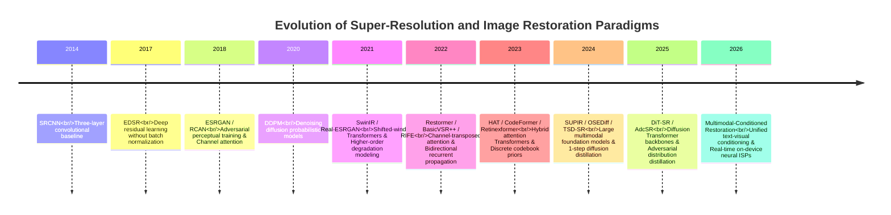
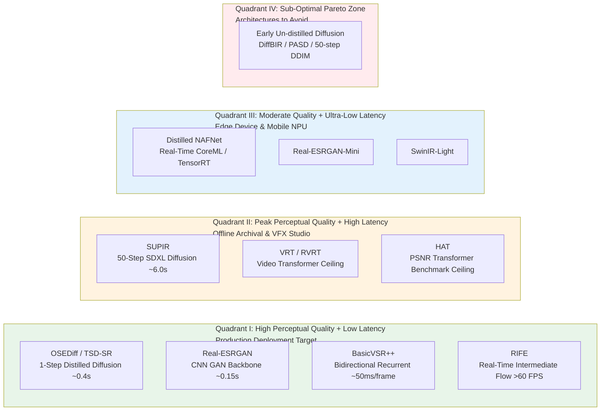
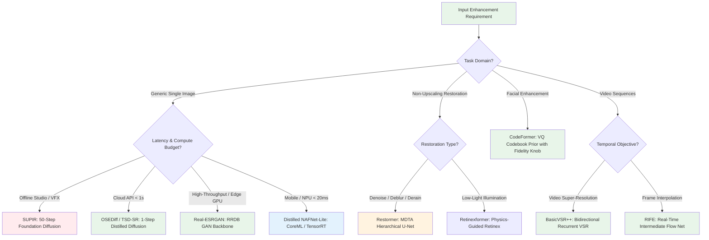

# Chapter 18 · SOTA Reference Guide and Model Selection

> Academic benchmark leaders and production-grade restoration models rarely coincide.
>
> While paper leaderboards optimize for 0.1 dB incremental gains on synthetic validation sets at extreme computational expense, industrial deployments require robustness across unknown degradations, bounded execution latency, low memory footprint, and numerical stability.
>
> This chapter provides an authoritative reference catalog of 9 foundational state-of-the-art architectures, their core structural mechanisms, Pareto-optimal operational envelopes, and an architectural decision tree for production systems.

## 18.0 Reading Notes

This reference chapter synthesizes the theoretical and engineering principles established throughout the book into an actionable selection guide.

Key objectives:

- Analyze the 9 foundational SOTA architectures spanning generative diffusion, vision Transformers, deep CNNs, and recurrent video backbones.
- Map models across speed, compute latency, visual fidelity, and distortion metrics.
- Understand why single-step distilled diffusion (OSEDiff, TSD-SR) represents the primary engineering paradigm shift over multi-step sampling.
- Evaluate task-specific standards across face restoration (CodeFormer), video super-resolution (BasicVSR++), frame interpolation (RIFE), and low-light enhancement (Retinexformer).
- Apply a principled decision tree to select optimal architectures based on hardware, latency, and fidelity constraints.

**Prerequisites.** Comprehensive grounding in loss functions (Chapter 3), metrics (Chapter 4), CNNs (Chapter 6), Transformers (Chapter 7), Diffusion models (Chapters 8-9), video restoration (Chapters 13-14), and deployment optimization (Chapter 15).

## 18.1 Pareto Frontier: Speed vs. Quality Quadrants

Restoration architectures fall into four distinct operational quadrants based on perceptual quality versus execution latency on an NVIDIA A100 GPU (1080p output):

## 18.2 Architectural Profiles of 9 Foundational SOTA Models

### 1. SUPIR: Multimodal Foundation Diffusion Super-Resolution
- **Core Mechanism**: Harnesses the generative generative prior of SDXL (2.6B parameters) modulated via ZeroSFT (zero-initialized spatial feature transform) layers driven by ControlNet conditioning and LLaVA-generated textual scene descriptions.
- **Primary Strength**: Outstanding generative detail synthesis on severely degraded archival imagery lacking high-frequency structural remnants.
- **Key Limitations**: High compute cost (50 sampling steps; ~6s per 1024x1024 image on A100); stochastic hallucination risk on forensic or text-dense inputs.
- **Production Guidance**: Reserved for offline studio restoration and non-real-time consumer photo enhancement where perceptual plausibility supercedes pixel-level fidelity.

### 2. OSEDiff / TSD-SR: 1-Step Distilled Generative Diffusion
- **Core Mechanism**: Compresses multi-step diffusion sampling trajectories into a single forward pass via Variational Score Distillation (VSD) or Target Score Distillation (TSD), initializing directly from low-resolution latent encodings.
- **Primary Strength**: Delivers generative visual realism comparable to 50-step diffusion models while reducing runtime latency by 10x-20x (~0.4s on A100).
- **Key Limitations**: Fixed compute budget per forward pass (lacks multi-step runtime adjustment); requires 3GB+ VRAM under FP16/INT8 precision.
- **Production Guidance**: The modern default for cloud-based generative image super-resolution pipelines.

### 3. Real-ESRGAN: Higher-Order Pure Synthetic Degradation Modeling
- **Core Mechanism**: Pairs a deep Residual-in-Residual Dense Block (RRDB) network with a comprehensive second-order degradation simulation pipeline modeling anisotropic Gaussian blurs, generalized Poisson-Gaussian noise, JPEG ringing, and sinc filtering.
- **Primary Strength**: Exceptional empirical robustness against complex real-world artifacts without severe generative hallucinations. Deterministic, fully exportable to TensorRT, CoreML, and ONNX.
- **Key Limitations**: Fixed receptive field limits hallucination capability on completely obliterated textures compared to foundation diffusion backbones.
- **Production Guidance**: The industry de facto workhorse for general-purpose image super-resolution across e-commerce, user-generated content, and video streaming transcoding.

### 4. HAT (Hybrid Attention Transformer): Objective Distortion Benchmark Ceiling
- **Core Mechanism**: Combines Window-based Multi-Head Self-Attention (W-MSA / SW-MSA) with channel attention blocks (CAB) and Overlapping Cross-Attention Blocks (OCAB) to aggregate spatial and channel-wise correlations.
- **Primary Strength**: Establishes the empirical upper bound for fidelity metrics (33.0-33.4 dB PSNR on Set5 4x benchmark).
- **Key Limitations**: Trained primarily on synthetic bicubic downsampling; lacks robustness against real-world sensor noise and compression artifacts. Computationally heavy (~40M parameters, ~80ms on A100 for 256x256 tiles).
- **Production Guidance**: Optimal as a high-capacity teacher network for knowledge distillation into lightweight edge backbones; unsuitable for direct real-world blind enhancement without fine-tuning.

### 5. Restormer: Channel-Transposed Universal Restoration Backbone
- **Core Mechanism**: Replaces standard spatial self-attention with Multi-Dconv Head Transposed Attention (MDTA), shifting quadratic complexity from spatial dimensions $\mathcal{O}((HW)^2)$ to channel dimensions $\mathcal{O}(C^2 \cdot HW)$. Combined with Gated-Dconv Feed-Forward Networks (GDFN) in a 4-level hierarchical U-Net.
- **Primary Strength**: Unified, highly efficient restoration backbone for denoising (Gaussian/raw sensor), motion deblurring, defocus deblurring, and deraining. Linear computational scaling with spatial resolution.
- **Key Limitations**: Does not natively perform sub-pixel super-resolution upsampling without auxiliary reconstruction heads.
- **Production Guidance**: The gold-standard baseline for non-upscaling restoration tasks. Frequently paired upstream of super-resolution networks.

### 6. CodeFormer: Discrete Codebook-Prior Facial Restoration
- **Core Mechanism**: Projects degraded facial features into a discrete, learned high-quality vector-quantized (VQ) codebook space via Transformer-based autoregressive prediction, incorporating a continuous fidelity parameter $w \in [0, 1]$.
- **Primary Strength**: Prevents continuous GAN artifact drift; enables flexible runtime trade-offs between prior-driven reconstruction ($w=0$) and strict low-resolution fidelity ($w=1$).
- **Key Limitations**: Requires accurate facial alignment and bounding box localization; restricted to facial regions.
- **Production Guidance**: The universal industry standard for blind portrait enhancement, video conferencing clarity, and historical photo face recovery.

### 7. BasicVSR++: Second-Order Bidirectional Recurrent Video Super-Resolution
- **Core Mechanism**: Couples bidirectional recurrent propagation with second-order temporal connections and flow-guided deformable convolutional alignment (DCN v2), enabling long-range temporal feature aggregation and error resilience.
- **Primary Strength**: Outstanding temporal coherence and detail recovery across continuous video sequences (~32.4 dB on REDS4 4x).
- **Key Limitations**: Standard bidirectional configuration is non-causal (requires future frames); recurrent state divergence on long continuous sequences without periodic resets.
- **Production Guidance**: Standard backbone for offline high-end video remastering and transcoding. Causal variants (BasicVSR-Mini) are utilized for real-time live broadcasting.

### 8. RIFE: Real-Time Intermediate Flow Estimation Frame Interpolation
- **Core Mechanism**: Employs Intermediate Flow Net (IFNet) to directly regress bidirectional motion flow fields from the target intermediate timestamp ($t+0.5$) toward adjacent anchor frames ($t, t+1$), bypassing intermediate flow inversion.
- **Primary Strength**: Ultra-fast inference (>60 FPS at 1080p on consumer GPUs); minimal memory footprint with native end-to-end differentiability.
- **Key Limitations**: Susceptible to edge tearing under extreme motion displacements exceeding receptive fields.
- **Production Guidance**: De facto standard for video frame rate doubling (30 to 60 FPS, 60 to 120 FPS), slow-motion generation, and real-time display refresh rate adaptation.

### 9. Retinexformer: Physics-Guided Low-Light Enhancement Transformer
- **Core Mechanism**: Embeds classical Retinex physical decomposition ($I = R \odot L$) as an inductive architectural bias into an Illumination-Guided Transformer backbone.
- **Primary Strength**: Accurately restores underexposed shadow regions while preventing color balance distortion and highlight clipping.
- **Key Limitations**: Performance degrades in extreme zero-lux environments ($<0.1\text{ lux}$) where sensor Poisson noise obliterates underlying reflectance signals.
- **Production Guidance**: Recommended for low-light photography enhancement, nighttime surveillance pre-processing, and consumer computational photography pipelines.

## 18.3 Architectural Decision Tree for Production Systems

## 18.4 Comprehensive SOTA Comparison Matrix

| Model | Category | Architectural Core | Parameter Count | Latency (A100, 1080p) | Real-World Robustness | Edge Deployability | Production Role |
|---|---|---|---|---|---|---|---|
| **SUPIR** | Generative SR | SDXL + ControlNet + ZeroSFT | ~3.0 B | 5.0-8.0s | High (Generative) | Infeasible | Offline Studio Ceiling |
| **OSEDiff / TSD-SR** | Generative SR | 1-Step Distilled UNet | ~1.5 B | 0.3-0.6s | High (Generative) | Partial (INT8 GPU) | Cloud Generative Default |
| **Real-ESRGAN** | Blind SR | Higher-Order RRDB | ~16.7 M | ~0.15s | High (Structural) | Full (TensorRT / CoreML) | Production Workhorse |
| **HAT** | Objective SR | Hybrid W-MSA + CAB + OCAB | ~40.8 M | ~0.80s (Tiled) | Low (Bicubic Bias) | Infeasible | Distillation Teacher |
| **Restormer** | General Restoration | Channel-Transposed MDTA U-Net | ~26.1 M | ~0.20s | High (Denoise/Deblur) | Partial | Universal Restoration |
| **CodeFormer** | Face Restoration | VQ Codebook + Transformer | ~75.3 M | ~0.10s | High (Facial Domain) | Full (ONNX / TensorRT) | Face Restoration Standard |
| **BasicVSR++** | Video SR | 2nd-Order Bi-RNN + Flow DCN | ~7.3 M | ~50ms / frame | Medium-High | Partial | Video Remastering Standard |
| **RIFE** | Frame Interpolation | Intermediate Flow Estimation | ~10.2 M | ~15ms / frame | Medium-High | Full (TensorRT FP16) | Frame Rate Doubling Standard |
| **Retinexformer** | Low-Light | Retinex Decomposition + Transformer | ~1.6 M | ~45ms | Medium (Illumination) | Full (CoreML / ONNX) | Low-Light Standard |

## 18.5 Production SOTA Migration Criteria

Upgrading or replacing an active production model should only occur when all five validation criteria are satisfied:

1. **Empirical Domain Validation**: The candidate model demonstrates statistically significant gains ($p < 0.01$ via Wilcoxon signed-rank test) on in-distribution production telemetry data, rather than public synthetic benchmarks (Set5, Set14).
2. **Defensive CI Invariant Compliance**: Passes 100% of automated failure-case regression tests (pure-black stability, boundary tile smoothness, energy-bounded Laplacian sharpness).
3. **Bounded Latency and Memory Envelope**: Total inference execution time and peak GPU memory allocation remain within 1.25x of the existing production baseline under full system concurrency.
4. **Export and Quantization Fidelity**: Supports clean ONNX / TensorRT / CoreML intermediate graph representation without unsupported custom operator fallbacks, preserving $\Delta \text{PSNR} \le 0.1\text{ dB}$ under FP16/INT8 execution.
5. **Open Source and Maintenance Governance**: Accompanied by verifiable, fully reproducible training codebases, clear dataset provenance, and active community maintenance.

## 18.6 Series Epilogue: Core Engineering Tenets

As you architect, train, and deploy image and video enhancement systems, keep these ten first-principles invariants in focus:

1. **Restoration is an Ill-Posed Inverse Problem**: Enhancement algorithms estimate under-determined posterior distributions; models generate plausible hypotheses rather than deterministic ground truth.
2. **Data Pipeline Quality Dominates Architecture Design**: A standard architecture trained on comprehensive second-order degradation pipelines consistently outperforms advanced architectures trained on naive bicubic downsampling.
3. **The Perception-Distortion Trade-Off is Structurally Invariant**: Minimizing pixel-level distortion ($L_1$, PSNR) enforces regressive blur; maximizing perceptual realism (GAN, Diffusion) inherently sacrifices exact pixel fidelity.
4. **Compound Multi-Objective Optimization is Mandatory**: Production loss objectives must combine pixel fidelity, perceptual feature alignment, adversarial discrimination, and explicit color space preservation.
5. **Compute in Compressed Latent and Feature Representations**: High-resolution processing requires spatial compression (downsampled VAE latents, transposed channel attention) to avoid quadratic memory cliffs.
6. **Generative Prior Power Entails Hallucination Risk**: Generative models require automated downstream verification (ArcFace cosine gating, OCR character validation) to prevent identity and semantic drift.
7. **Production Engineering Optimizes the Worst 5%**: Real-world adoption is governed by failure containment, graceful fallbacks, and outlier routing rather than incremental average metric gains.
8. **Temporal Coherence is an Independent Dimension**: Video processing requires native spatio-temporal alignment and recurrent feature propagation; independent single-frame processing inevitably yields temporal boiling.
9. **Edge Deployment Dictates Hardware-Aware Constraints**: Mobile and embedded NPU inference requires operator residency optimization, layout transposition elimination, and per-channel mixed-precision quantization.
10. **There is No Universal Architecture**: Every deployment scenario requires a tailored composition of specialized modules operating within bounded compute and latency budgets.

---

> End of Book.
>
> Companion guides in this series:
> - [The Complete Guide for LLM Training Engineers](https://github.com/yingwang/llm-tutorial): Large Language Model Pre-Training, Alignment, and Systems Architecture
> - [Thinking in LLM](https://github.com/yingwang/thinking-in-llm): Engineering Philosophy, Cognitive Architectures, and Agentic Systems Design
