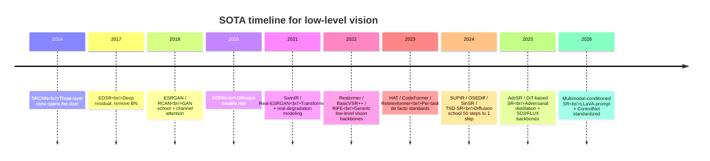
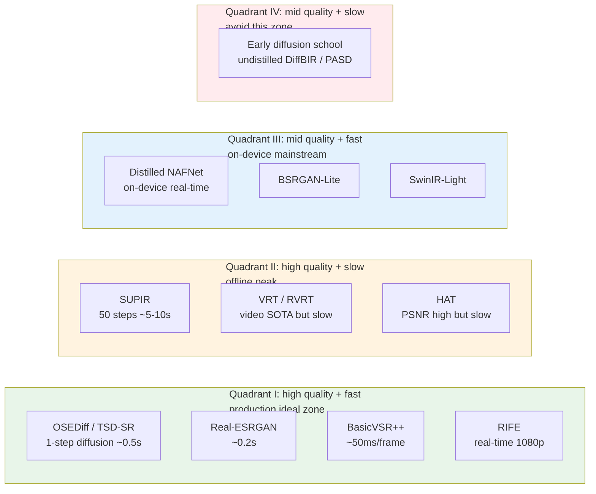
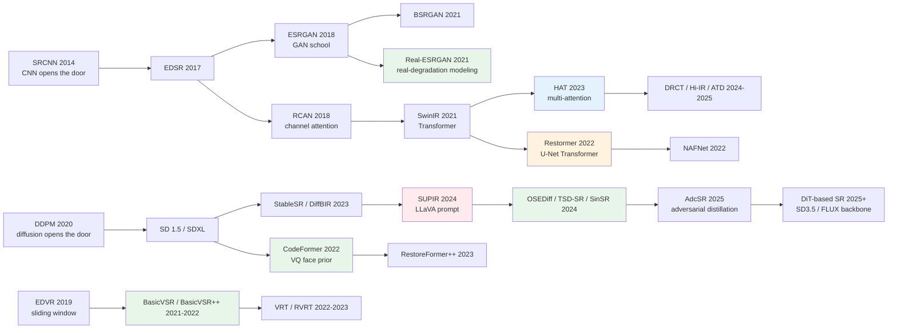

# Chapter 18 · SOTA models

> This chapter is the book's "quick reference" - 9 SOTA models worth remembering plus a selection decision tree.
>
> The models themselves will go out of date; **the ideas will not** - so for each model we cover: core idea, when to use, when not to use, and who succeeds it.

## 18.0 Chapter prologue

By this chapter, the previous 17 have explained "why", "how", "how to evaluate", and "how it breaks". This chapter takes a step back and answers a very concrete engineering question: **at the moment of 2026, if you have to build an enhancement system from scratch today, which models should you choose as the foundation?**

The hard part of answering this question is not "which model is highest on the benchmark"; it is that **the academic SOTA and the engineering SOTA almost never coincide**. The "top-scoring" model of each year's top conference, once dropped into a product, often turns out to be too slow, hard to deploy, not robust to real-world degradation distributions, or with stalled community maintenance—and never makes it into production. Conversely, the models that are actually widely deployed in industry (Real-ESRGAN, CodeFormer, BasicVSR++) were not necessarily the highest scorers when their papers came out, but their engineering qualities—robustness, deployability, community activity, maintainability—made them the de facto standards on a five-year time scale.

The 9 models selected in this chapter were filtered by the "engineering odds" standard. Each of them satisfies at least two of the following three: widely deployed in production, with long-term open-source maintenance, and reasonable coverage of real-world degradation distributions. They are not a subset of the paper leaderboards but **the best concrete realization of every argument made in the first 17 chapters**.

The models themselves will go out of date. SUPIR was the flagship of the diffusion school in 2024 and has by 2025 been succeeded by a series of single-step distillations; HAT was once the ceiling of the PSNR school, but DRCT, Hi-IR, and ATD now trade wins across benchmarks. This "half-life" in low-level vision is roughly 12–18 months. So beyond introducing each model, this chapter also writes "current standing" and "succeeded by whom" after each, so that when you reread it two years from now you can tell which sections are out of date and which are still alive. The last section lays out the engineering discipline for "switching SOTA": when should you swap your production model, and when should you stand still.

The recommended way to read this chapter is: first read it through in order to build a panorama of "in 2026, the default choice for each subtask"; then, when you hit a specific project, come back to the relevant section to read "when to use / when not to use / key parameters". The 9 models collectively cover more than 90% of enhancement scenarios; the remaining 10% has an outlet in Section 18.13 "SOTAs not on this list".

## 18.0.1 Notes on abbreviations and terminology

The abbreviations in this chapter span four families (generative, Transformer, video, specialized) and are listed here for quick reference:

- **SR** (Super-Resolution): upsample a low-resolution image to high resolution.
- **VSR** (Video Super-Resolution).
- **NR-IQA** (No-Reference Image Quality Assessment).
- **PSNR / SSIM / LPIPS / DISTS**: common IQA metrics, covered in Chapter 4.
- **MANIQA / CLIP-IQA / Q-Align**: the mainstream NR-IQA models today.
- **DDPM / DDIM** (Denoising Diffusion Probabilistic / Implicit Model): two foundational sampler families for diffusion models.
- **SD / SDXL / SD3 / SD3.5 / FLUX** (Stable Diffusion lineage and contemporaneous DiT backbones): text-to-image base models. SDXL is a 2.6B-parameter UNet backbone; SD3 / SD3.5 / FLUX are the 2024–2025 MM-DiT (Multi-Modal Diffusion Transformer) backbones.
- **ControlNet**: a side-network that injects extra visual conditions (edges / depth / LR image) into a pretrained UNet, giving the diffusion school the ability to "align with the input image".
- **LoRA** (Low-Rank Adaptation): low-rank adapters that train only a low-rank residual on top of frozen base weights, used to specialize a base model cheaply.
- **LLaVA** (Large Language and Vision Assistant): open-source multimodal large model; SUPIR uses it to auto-generate prompts as text conditions from the input image.
- **VAE** (Variational AutoEncoder): the network the diffusion school uses to encode images into a 4× or 8× downsampled latent space.
- **ZeroSFT** (Zero-init Spatial Feature Transform): SUPIR's zero-initialized spatial modulation layer, injecting ControlNet features into the SDXL backbone without disrupting pretrained weights.
- **CFG** (Classifier-Free Guidance): the prompt-strength knob during diffusion sampling.
- **SUPIR / OSEDiff / TSD-SR / SinSR / DiffBIR / PASD / SeeSR / ResShift / StableSR / AdcSR**: different engineering approaches in the diffusion-school SR lineage; this chapter and the previous one cover them repeatedly.
- **VSD / TSD** (Variational / Target Score Distillation): two representative losses for distilling multi-step diffusion into a single step.
- **GAN** (Generative Adversarial Network): adversarial training between discriminator and generator.
- **ESRGAN / Real-ESRGAN / BSRGAN**: representatives of the GAN-school SR; Real-ESRGAN's core contribution is the degradation synthesis pipeline.
- **HAT / SwinIR / DRCT / Hi-IR / ATD**: PSNR-oriented Transformer SR models.
- **Restormer / NAFNet / MAXIM / Uformer**: generic low-level vision backbones (denoise / deblur / derain).
- **CodeFormer / GFPGAN / GPEN / RestoreFormer++**: face restoration models.
- **BasicVSR++ / VRT / RVRT / EDVR**: video super-resolution models.
- **RIFE / FILM / AMT / VFIformer**: frame interpolation models.
- **Retinexformer / LLFormer / SCI / EnlightenGAN**: low-light enhancement models.
- **HDR / SDR** (High / Standard Dynamic Range): HDR refers to formats whose brightness range exceeds 8-bit SDR, typically 10-bit or 12-bit.
- **WCG** (Wide Color Gamut): color spaces with gamut wider than Rec.709.
- **Rec.709 / Rec.2020**: the HDTV and UHD (4K / 8K) gamut and electro-optical transfer function (EOTF) standards.
- **ACES** (Academy Color Encoding System): the film industry's unified color pipeline.
- **ProRes**: Apple's visually lossless intermediate encoding format, commonly used in film post-production.
- **Bayer / CFA / RGGB** (Color Filter Array / Red-Green-Green-Blue Pattern): the color filter array on camera sensors.
- **CDN** (Content Delivery Network): edge nodes often recompress images during network delivery.
- **TensorRT / CoreML / ONNX**: common inference engines and intermediate representations.
- **QAT / PTQ** (Quantization-Aware Training / Post-Training Quantization): quantization during training vs. after training.
- **OCR** (Optical Character Recognition).

## 18.1 Selection overview

```
General enhancement SOTA (5)
  ┌─ SUPIR              — diffusion / creative upscaling (full 50 steps)
  ├─ OSEDiff / TSD-SR   — diffusion / one-step distillation (production real-time)
  ├─ Real-ESRGAN        — real-degradation-modeling school
  ├─ HAT                — Transformer non-diffusion school
  └─ Restormer          — denoise / deblur / derain general backbone

Task-specific (4)
  ┌─ CodeFormer   — face restoration
  ├─ BasicVSR++   — video super-resolution
  ├─ RIFE         — frame interpolation
  └─ Retinexformer — low-light enhancement
```

Nine models, each representing a school of thought. SUPIR and OSEDiff/TSD-SR are two engineering positions of the same diffusion school - the former chases peak quality at 50 steps, the latter pushes one-step inference for product deployment.

## 18.1.1 Timeline: from SRCNN to single-step diffusion

Laying the key nodes of the past decade of low-level vision on one timeline reveals a clear two-stage evolution: 2014–2020 belongs to the discriminative school, from SRCNN to SwinIR is the evolution of network architectures; from 2021 onward, real-degradation modeling (Real-ESRGAN) and the diffusion school (StableSR / DiffBIR / SUPIR) split the field; from 2024, single-step distillation lets the diffusion school become production-deployable for the first time, and the DiT backbone (SD3 / FLUX) begins to replace SDXL.



A few observations from this timeline worth remembering:

1. **The marginal return of architectural innovation is decreasing**: from SRCNN to SwinIR is an exploration of depth and attention forms, with each generation gaining about 0.5–1 dB PSNR; after 2021, pure architectural improvements rarely exceed 0.2 dB.
2. **The marginal return of data innovation is rising**: Real-ESRGAN closes a 3–5 dB train-inference gap that no architecture change can match. This echoes Section 1.7.
3. **The generative school took about 4 years to go from "research" to "production"**: DDPM was proposed in 2020, and only in 2024 did single-step distillation make it truly deployable.
4. **The DiT backbone replacement is in progress**: SDXL dominated the diffusion school SR in 2023–2024; from 2025 onward MM-DiT backbones like SD3.5 / FLUX appear as new backbones, but the ecosystem maturity still lags SDXL by a generation.
5. **Multimodal conditioning has become standard**: after SUPIR used LLaVA to auto-generate prompts, "text-visual dual conditioning" became the default in newer diffusion SR.

## 18.1.2 Speed-quality trade-off quadrants

Another perspective that helps most directly in selection: place the candidate models on a 2D plane of "speed × quality". Quality on the x-axis (subjective / NR-IQA score), speed on the y-axis (1080p single-image inference time; smaller is faster). The quadrants correspond to different product positions:



Engineering takeaways from the picture:

- **Quadrant I is the product ideal zone**: from 2025 on, single-step distilled diffusion (OSEDiff / TSD-SR) and the real-degradation school (Real-ESRGAN) jointly occupy this zone. Default to picking from here when starting a new project.
- **Quadrant II is the offline-peak zone**: when latency constraints relax (film post-production, high-end print, "batch mode" for premium users), SUPIR / VRT still hold an irreplaceable quality ceiling.
- **Quadrant III is the on-device mainstream zone**: the de facto standard for phone/embedded deployment; quality is below Quadrant I but they run in real time on phone SoCs.
- **Quadrant IV is the zone to avoid**: models that are neither at the quality peak nor fast tend to be squeezed out by same-generation competitors; these are the first candidates for "switch SOTA".
- **Multi-step to single-step diffusion is a jump from Quadrant II to Quadrant I**: this is the most important engineering displacement of 2024–2025; OSEDiff / TSD-SR / SinSR's core value lies in this cross-quadrant jump.

## 18.2 SUPIR: diffusion-based creative upscaling

### Core idea

Stitch the generative power of SDXL (a 2.6B-parameter text-to-image model) **onto the SR task**:

```
LR Image
  ↓ ControlNet injection
  ↓ SDXL UNet (frozen) + ZeroSFT modulation
  ↓ LLaVA auto-generates prompt as text condition
  ↓ Restoration-Guided Sampling
HR Image (creatively rich)
```

### One-line takeaway

"Use the world knowledge of a text-to-image model to guess the most plausible high-resolution version of a beat-up image."

### When to use

- **Heavily degraded old photos** (blurry faces, lost textures)
- **Applications optimizing for visual realism** (artistic upscaling, social-media restoration)
- **5–10 seconds per image inference is acceptable**

### When not to use

- Strict fidelity required (forensics, surveillance)
- Real-time required (video, live streaming)
- On-device deployment

### Key parameters

```python
{
    'num_inference_steps': 50,      # default 50
    'guidance_scale': 7.5,          # CFG strength
    'control_scale': 0.7,           # ControlNet strength
    's_stage1': -1,                 # adaptive noise start
    'restoration_guidance': True,   # use restoration-guided sampling
}
```

### Current standing

The flagship of diffusion-based SR in 2024. The 2025–2026 direction is moving toward **single-step / distilled**—TSD-SR, AdcSR, and other **one-step** works push diffusion-based SR from 50 steps down to 1–4 steps, with quality approaching SUPIR but speed an order of magnitude or two faster. For new projects in production, look at these distilled successors first rather than full SUPIR.

### Paper and code

- Paper: Yu et al. "SUPIR: Scaling Up Image Super-Resolution" (CVPR 2024)
- Code: [github.com/Fanghua-Yu/SUPIR](https://github.com/Fanghua-Yu/SUPIR)
- Distillation follow-ups: TSD-SR, AdcSR, OSEDiff, etc. (from 2025)

## 18.3 Real-ESRGAN: real-degradation-modeling school

### Core idea

Compared with ESRGAN, **the network barely changes** (still RRDB); **the contribution is entirely in the data**:

- Second-order degradation pipeline (Section 5.4)
- Complex noise synthesis (Gaussian + Poisson + real sensor)
- sinc filtering to simulate over-sharpening artifacts

### One-line takeaway

"The same network, but feeding training with real-world degradations transforms results."

### When to use

- **Generic enhancement in production**—balanced quality, speed, and stability
- **GAN fabrication is unacceptable** (Real-ESRGAN does use a GAN loss, but is far more conservative than diffusion)
- **Must run on a regular GPU / on-device**

### When not to use

- Heavy degradation (diffusion-based is more suitable)
- Ultra-light on-device (use the distilled Real-ESRGAN-Mini)

### Current standing

The de facto industry standard for enhancement models. Topaz Photo AI, CapCut, and many photo apps run on Real-ESRGAN or its variants under the hood.

### Paper and code

- Paper: Wang et al. "Real-ESRGAN: Training Real-World Blind Super-Resolution with Pure Synthetic Data" (ICCVW 2021)
- Code: [github.com/xinntao/Real-ESRGAN](https://github.com/xinntao/Real-ESRGAN)

## 18.4 HAT: non-diffusion Transformer SOTA

### Core idea

On top of SwinIR, **add more attention modules** to better exploit input information:

- Window Self-Attention (W-MSA + SW-MSA) — inherited from SwinIR
- **Channel Attention Block (CAB)** — adds RCAN-style channel attention
- **Overlapping Cross-Attention Block (OCAB)** — direct cross-window exchange

### One-line takeaway

"Push Transformer capacity to the limit—the current ceiling of the PSNR school."

### When to use

- **Academic benchmark competitions** (PSNR/SSIM-priority)
- **Need objective fidelity** and tolerate slow inference
- **As a teacher for knowledge distillation** (distill HAT into a small model)

### When not to use

- Real-degradation scenarios (HAT is trained on bicubic degradation and is not robust to real degradation)
- Real-time applications
- Resource-constrained settings

### Key numbers

- HAT-L on Set5 4×: **about 33.0–33.4 dB** (depending on training setup / ImageNet pretraining)
- ~40M parameters
- Inference: a single 256×256 takes ~80 ms on A100

### Current standing

The representative baseline for PSNR-oriented Transformer SR. **Not the only current SOTA**—models like DRCT and Hi-IR (2024–2025) trade wins with HAT across benchmarks. But HAT remains a good choice for teaching, distillation teachers, and comparison baselines. Rarely used in production—the field's "engineering ceiling" and "benchmark ceiling" are different things.

### Paper and code

- Paper: Chen et al. "Activating More Pixels in Image Super-Resolution Transformer" (CVPR 2023)
- Code: [github.com/XPixelGroup/HAT](https://github.com/XPixelGroup/HAT)

## 18.5 Restormer: denoise / deblur / derain U-Net Transformer

### Core idea

Chapter 7.5 covered MDTA (Multi-Dconv Head Transposed Attention) — moving self-attention from the spatial dimension to the channel dimension drops complexity from $O(N^2)$ to $O(C^2)$, friendly for large images. Combined with GDFN (Gated-Dconv Feed-Forward Network), the overall architecture is a 4-level U-Net:

```
Input
  ↓ Encoder (4 levels of MDTA + GDFN)
  ↓ Latent (deep MDTA + GDFN)
  ↓ Decoder (4 levels, with skip connections)
Output
```

The same architecture serves multiple tasks; only the training data changes: Gaussian / real-noise denoising, motion deblurring, defocus deblurring, deraining.

### One-line takeaway

"Channel-wise attention + multi-task general U-Net backbone — the de-facto baseline for **everything except SR** in low-level vision."

### When to use

- **Denoising** (Gaussian, real sensor, synthetic noise)
- **Deblurring** (motion, defocus)
- **Deraining / dehazing / demoiré**
- **Large-image inference** (MDTA is memory-friendly; a 1080P image fits whole through the model)
- **Single-frame baseline for video low-level tasks** (paired with BasicVSR++ comparisons)

### When not to use

- **Pure SR** (HAT / SwinIR / DRCT win on SR benchmarks; Restormer was not designed for upsampling)
- **Extreme lightweight on-device** (inference is on the slower side, ~26M params, distillation needed)
- **Tasks that include upscaling** — either modify Restormer with a sub-pixel head, or pick an SR-school model directly

### Key numbers

- GoPro deblur: 32.92 dB / 0.961 SSIM
- SIDD real denoising: 40.02 dB / 0.960 SSIM
- ~26M parameters
- A100 256×256 inference ~50ms

### Where it stands now

From 2022 through 2026, Restormer is **the de-facto baseline for denoise / deblur / derain** — any low-level vision paper working on these tasks must compare against it. The MDTA module itself has been adopted in many follow-up works (including some video and diffusion-school implementations). **HAT represents the SR school; Restormer represents the restoration school** — the two positions don't conflict, and engineering teams often deploy them together (one for deblur/denoise, one for upsample).

Follow-up work like GRL, X-Restormer, and PromptIR slightly outperforms Restormer on some benchmarks, but none has fully replaced it.

### Paper and code

- Paper: Zamir et al., "Restormer: Efficient Transformer for High-Resolution Image Restoration" (CVPR 2022)
- Code: [github.com/swz30/Restormer](https://github.com/swz30/Restormer)

## 18.6 OSEDiff / TSD-SR: one-step diffusion SR

### Core idea

Full diffusion SR (e.g. SUPIR) takes 50 steps and 5–10 seconds per image — **the biggest barrier to production deployment is latency**. The 2024–2025 wave of single-step diffusion distillation broke this barrier:

```
LR Image
  ↓ VAE encode (once)
  ↓ Pre-trained UNet (LoRA fine-tuned for SR)
  ↓ One forward pass, no iterative denoising
  ↓ VAE decode
HR Image
```

Distillation target: train a student network to predict clean $x_0$ in **one step** from any noise level. Combined with score distillation / variational score distillation / target score distillation losses.

### Representative methods

- **OSEDiff** (NeurIPS 2024): variational score distillation (VSD), single-step sampling, VAE-LR as initialization
- **TSD-SR** (2024): target score distillation (TSD), distribution correction tailored to SR
- **SinSR** (CVPR 2024): single-step distillation built on top of ResShift
- **AdcSR** (2025): adversarial distillation of diffusion into a single-step generator, quality close to SUPIR

### One-step vs. multi-step diffusion: intuition and trade-off

One-step diffusion looks "counter-intuitive": the core argument for diffusion is that a hard one-step generation is split into thousands of small steps; how can it be compressed back to one step? The key is that "what we distill is not the sampling procedure, but the teacher network's score function across noise levels". The student learns: given any noise level and a noisy sample, directly predict the final clean image. This does not replace the mathematical justification for multi-step diffusion; it uses a larger model on a narrower input distribution to do a harder task, moving the "difficulty budget" from iteration count to model capacity.

In SR, this is especially reasonable. The input $y$ provides the model with a very strong conditioning signal (unlike unconditional text-to-image, which starts from pure noise), so the solution space is already squeezed onto a relatively low-dimensional manifold. Approximating the center of that manifold in one step is feasible, and multiple steps do not bring qualitative improvement—they only smooth out small perturbations around the sample. That is why OSEDiff / TSD-SR can match or surpass the multi-step baseline on SR, while the same distillation route on text-to-image still needs 4–8 steps to preserve quality—SR's conditioning density is far higher than pure text-to-image.

The engineering trade-off can be summed up in one line: **multi-step diffusion is a knob trading time for quality; single-step diffusion is a fixed choice trading model capacity for time**. The former is flexible (steps can be tuned at inference for different user tiers) but slow; the latter is fast but loses the steps-as-knob freedom (a "high quality tier" can only be served by switching to another model). Production systems mostly pick the latter and keep a multi-step diffusion model as the backup behind a "high quality mode" button for users.

### One-line takeaway

"Diffusion school from 50 steps to 1 - finally letting the SUPIR route into production environments."

### When to use

- **Production diffusion SR** — the default since 2025
- **Real-time / near-real-time enhancement** (< 1s per image)
- Scenarios that **like SUPIR's visual quality but can't accept its latency**

### When not to use

- **Extreme degradation + creativity priority** (full SUPIR still has a marginal quality edge in some cases; industry can keep it as an offline option)
- **Strict fidelity** (the diffusion school's "guessing" nature hasn't changed — only become faster — still unsuitable for forensics / surveillance)

### Key numbers

- Inference: A100 single image ~0.3–0.8s (vs SUPIR 50 steps 5–10s)
- Quality: DIV2K val LPIPS within ±2% of SUPIR; MANIQA on par or slightly better
- Model size: ≈ SDXL UNet + small LoRA, ~3GB after on-device 8-bit quantization

### Where it stands now

**The engineering mainstream of diffusion SR in 2025–2026.** SUPIR remains the "full version" benchmark for research and teaching, but new projects should **default to starting from a one-step distilled route, not SUPIR**. The under-appreciated engineering value of this line: the diffusion school for the first time has the latency to plausibly replace Real-ESRGAN in general enhancement workflows.

### Papers and code

- OSEDiff: Wu et al. "One-Step Effective Diffusion Network for Real-World Image Super-Resolution" (NeurIPS 2024) — [github.com/cswry/OSEDiff](https://github.com/cswry/OSEDiff)
- TSD-SR: Dong et al. "TSD-SR: One-Step Diffusion with Target Score Distillation" (2024)
- SinSR: Wang et al. "SinSR: Diffusion-Based Image Super-Resolution in a Single Step" (CVPR 2024)
- AdcSR: 2025-onward adversarial distillation direction (AdcSR and others)

## 18.7 CodeFormer: face restoration

### Core idea

**Discretize** local face features into a number of codes in a codebook; predict the code sequence with a Transformer:

```
LR Face
  ↓ Encoder
  ↓ Transformer (predict discrete code indices)
  ↓ Codebook lookup
  ↓ Decoder
HR Face
```

Plus a tunable `fidelity_weight ∈ [0, 1]` so the user can choose between "strict fidelity" and "fully lean on the prior".

### One-line takeaway

"Use a VQ codebook—not a StyleGAN—as the strong face prior; the tunable fidelity is the key engineering highlight."

### When to use

- **Any face enhancement scenario**—this is the de facto standard
- **Old-photo faces** (fidelity = 0.5)
- **Video conferencing** (fidelity = 0.7, conservative, doesn't change appearance)

### When not to use

- **Forensic evidence** (no fabrication allowed)
- **Tiny faces** (< 32×32 pixels, no prior can recover them)

### Key parameters

```python
{
    'fidelity_weight': 0.5,      # 0 = pure prior, 1 = pure LR; 0.5 default balances
    'face_align': True,          # alignment is required first
    'crop_size': 512,            # pretraining uses 512 input
}
```

### Current standing

The engineering standard for face restoration. GFPGAN is still in use, but CodeFormer's tunability makes it more popular in products.

### Paper and code

- Paper: Zhou et al. "Towards Robust Blind Face Restoration with Codebook Lookup Transformer" (NeurIPS 2022)
- Code: [github.com/sczhou/CodeFormer](https://github.com/sczhou/CodeFormer)

## 18.8 BasicVSR++: video super-resolution

### Core idea

Bidirectional recurrence + second-order propagation + flow-guided DCN (covered in Section 14.3):

```
All-frame features
  ↓ Forward RNN (second-order propagation)
  ↓ Backward RNN (second-order propagation)
  ↓ Aggregate (concat + conv)
  ↓ Upsample
HR video
```

### One-line takeaway

"Bidirectional recurrence lets each frame use past and future information; second-order propagation routes around optical-flow error accumulation."

### When to use

- **VSR tasks** (de facto standard)
- **Video deblurring, video denoising** (same architecture, different training data)
- **Quality-first, no real-time requirement**

### When not to use

- Real-time live streaming (even BasicVSR++ is too slow; needs a distilled version)
- Extremely long videos (hidden-state error accumulation)

### Key numbers

- REDS4 4× VSR: 32.4 dB (previous SOTA EDVR was 31.1 dB)
- Inference: ~50 ms / 720p frame on A100

### Current standing

The engineering standard for VSR from 2022 to 2026. RVRT/VRT score higher PSNR but are much slower.

### Paper and code

- Paper: Chan et al. "BasicVSR++: Improving Video Super-Resolution with Enhanced Propagation and Alignment" (CVPR 2022)
- Code: [github.com/open-mmlab/mmagic](https://github.com/open-mmlab/mmagic) (inside MMEditing)

## 18.9 RIFE: frame interpolation

### Core idea

Don't explicitly estimate flow between the two end frames; **directly predict the flow from the middle frame to each end**:

```
F_t, F_{t+1}
  ↓ IFNet (Intermediate Flow Net)
  ↓ flow_to_t, flow_to_{t+1}, fusion_mask
  ↓ warp F_t with flow_to_t → warped_t
  ↓ warp F_{t+1} with flow_to_{t+1} → warped_t+1
  ↓ blend = mask * warped_t + (1-mask) * warped_t+1
F_{t+0.5}
```

### One-line takeaway

"Predict flow from the middle frame to the two ends directly, side-stepping the paradox that the middle frame doesn't yet exist."

### When to use

- **Any frame-interpolation task** (de facto standard)
- **30 fps → 60 fps, 60 fps → 120 fps**
- **Slow motion** (24 fps → 240 fps)
- **Real-time interpolation** (RIFE can hit 30+ FPS on 1080p)

### When not to use

- Extreme displacements (FILM is more robust)
- Severe-occlusion scenes (AMT is better)

### Key parameters

```python
{
    'scale': 1.0,        # 1 = 4K, 0.5 = more stable for 4K
    'tta': False,        # test-time augmentation, slow but more accurate
}
```

### Current standing

The de facto frame-interpolation standard. Successors (FILM, AMT) each have strengths, but RIFE has the best price-performance.

### Paper and code

- Paper: Huang et al. "Real-Time Intermediate Flow Estimation for Video Frame Interpolation" (ECCV 2022)
- Code: [github.com/megvii-research/ECCV2022-RIFE](https://github.com/megvii-research/ECCV2022-RIFE)

## 18.10 Retinexformer: low-light enhancement

### Core idea

Combine the classical Retinex theory (image = reflectance × illumination) with a Transformer:

```
Low-light image
  ↓ Decompose into Reflectance + Illumination (classical Retinex)
  ↓ Transformer (Illumination-Guided Transformer)
  ↓ Combine into the enhanced image
Enhanced image
```

### One-line takeaway

"Use the Retinex physical model as an inductive bias so the model focuses on learning reflectance invariance."

### When to use

- **Low-light photos** (night scenes, dim interiors)
- **Overexposure correction** (partial support)
- **Auxiliary for HDR tone mapping**

### When not to use

- Noise-dominated, very-dark scenes (< 0.1 lux)—the Retinex assumption fails
- Mixed light sources—Retinex simplifies the lighting model

### Current standing

A representative low-light enhancement model. Other choices:

- LLFormer (an earlier Transformer method)
- SCI (a lighter CNN method, on-device-friendly)

### Paper and code

- Paper: Cai et al. "Retinexformer: One-stage Retinex-based Transformer for Low-light Image Enhancement" (ICCV 2023)
- Code: [github.com/caiyuanhao1998/Retinexformer](https://github.com/caiyuanhao1998/Retinexformer)

## 18.11 Selection decision tree

Recommendations by scenario:

```
What's the task?
  │
  ├─ General SR
  │   │
  │   ├─ Offline + peak quality + no latency limit → SUPIR (50 steps)
  │   ├─ Real-time diffusion (default since 2025) → OSEDiff / TSD-SR (1 step)
  │   ├─ Real-world + engineering stability (CNN/GAN school) → Real-ESRGAN
  │   └─ Academic benchmark / PSNR competition → HAT
  │
  ├─ Denoise / deblur / derain (no upscaling) → Restormer  ←─ default
  │
  ├─ Face enhancement → CodeFormer (user-tunable fidelity)
  │
  ├─ Video super-resolution → BasicVSR++
  │   ├─ Real-time live streaming → distilled BasicVSR-Mini + TensorRT
  │   └─ Offline high quality → BasicVSR++ or RVRT
  │
  ├─ Frame interpolation → RIFE
  │   ├─ Large displacements → FILM
  │   └─ Severe occlusion → AMT
  │
  ├─ Low-light enhancement → Retinexformer
  │
  ├─ Document enhancement → specialized DocSR + OCR-aware loss (Section 10.7)
  │
  └─ On-device real-time → distilled NAFNet + CoreML/TensorRT FP16
```

## 18.12 Academic SOTA vs. engineering SOTA

A theme that recurs throughout the book:

> The 9 models in this chapter are not "the highest-scoring".
>
> They are **the most worth deploying**—balancing quality, speed, stability, and maintainability.

Academic benchmark SOTA tends to:

- Improve over the baseline by 0.1–0.3 dB
- But have 5–10× worse parameters / inference speed
- Show no obvious gain in real-world scenarios

Engineering cares about:

- **Robustness** (doesn't break on common inputs)
- **Stability** (consistent results across hardware)
- **Deployability** (can be exported to ONNX, quantized, tiled)
- **Maintainability** (official code, ongoing maintenance, community)

These 9 models lead their categories on these dimensions.

## 18.13 SOTAs not on this list

Worth knowing but not given a dedicated section (by category):

### General SR families

- **DiffBIR**: diffusion-based, predates SUPIR, CLIP image cross-attention idea
- **SeeSR**: diffusion-based + semantic prior, more controllable
- **ResShift**: efficient sampling for diffusion-based (distilled into single-step by SinSR)
- **AdcSR / SinSR**: same-generation single-step diffusion competitors (same direction as Section 18.6)
- **DRCT / Hi-IR / ATD**: HAT-era and follow-up PSNR-school Transformer SR
- **BSRGAN**: contemporaneous with Real-ESRGAN

### Faces

- **GFPGAN**: StyleGAN2-prior route, a 2021 classic
- **GPEN**: an early work from Tencent ARC
- **RestoreFormer++**: an evolution of CodeFormer

### Video

- **VRT / RVRT**: Transformer-based VSR
- **EDVR**: classic sliding-window approach
- **ProPainter**: representative video inpainting

### Frame interpolation

- **FILM**: from Google, strong on large displacements
- **AMT**: 2023 SOTA, strong on occlusion
- **VFIformer**: Transformer-based

### Low light

- **LLFormer**: early Transformer
- **SCI**: lightweight CNN
- **EnlightenGAN**: GAN-based

### Task-specific

- **DocSR / TextZoom**: text-SR datasets and baselines
- **SwinIR-Light, ESRGAN-Lite**: lightweight on-device

Each subfield has 5–10 models worth tracking. This chapter selected the **most representative and most engineering-friendly** ones.

## 18.14 When to switch SOTA

New models come out every month. **When should you swap your production model?**

Rule of thumb: only consider switching when all of the following hold:

1. **The new model is clearly better on your real test set** (not Set5/14)
2. **No regression on the failure-case suite** (doesn't introduce new problems)
3. **Acceptable inference speed** (no more than 1.5× the current)
4. **Training code and data are available** (reproducible, fine-tunable)
5. **There is active community maintenance** (not a single-paper drop with abandoned code)

Most paper SOTAs do not satisfy these 5—so **be conservative about switching models** is engineering wisdom.

> The cost of swapping a production model is far higher than "training a new one".
>
> A stable old SOTA usually beats an unstable new SOTA.

## 18.14.1 Side-by-side comparison of the 9 models

A single table puts all 9 core models of this chapter side by side for cross-reference:

| Model | Category | School | Params | A100 inference | Real-degradation robust | On-device deployable | Current standing |
|------|------|------|--------|-----------|--------------|------------|----------|
| SUPIR | Generic SR | Diffusion 50-step | ~3B (SDXL+ControlNet) | 5–10s/image | Strong | No | Offline peak benchmark |
| OSEDiff / TSD-SR | Generic SR | Diffusion 1-step | ~3B + LoRA | 0.3–0.8s | Strong | Partial (~3GB after INT8) | 2025–2026 engineering mainstream |
| Real-ESRGAN | Generic SR | GAN + real degradation | ~17M | ~0.2s | Strong | Yes | Industry de facto standard |
| HAT | Generic SR | Transformer PSNR | ~40M | ~80ms (256²) | Weak (bicubic-trained) | No | Academic baseline |
| Restormer | Denoise/deblur | U-Net Transformer | ~26M | ~50ms (256²) | Medium-strong | No (needs distillation) | Restoration de facto standard |
| CodeFormer | Face restoration | VQ codebook | ~75M | ~100ms | Strong (face mask) | Yes | Face de facto standard |
| BasicVSR++ | Video SR | Bi-directional recurrence + second-order propagation | ~7M | ~50ms/720p frame | Medium | Partial | VSR de facto standard |
| RIFE | Frame interpolation | IFNet intermediate flow | ~10M | 1080p real-time 30+ FPS | Medium-strong | Yes | Frame interp de facto standard |
| Retinexformer | Low-light enhance | Retinex + Transformer | ~1.6M | ~50ms (256²) | Medium (fails at extreme dark) | Yes | Low-light representative |

Quick conclusions from this table:

1. **Parameter count and quality are not strictly correlated**: CodeFormer's 75M beats generic models with 100M+ on faces because its prior is more specialized.
2. **A100 inference times span three orders of magnitude**: from RIFE real-time to SUPIR 10 seconds, nearly 1000×. This is a direct illustration of how the latency constraint drives model selection.
3. **The "on-device deployable" column is mostly "yes" or "partial"**: only SUPIR / HAT / Restormer are pure "no", and each has distillation efforts producing on-device variants.
4. **The "current standing" column reveals one fact**: of the 9 models, 6 hold a "de facto standard" or "mainstream" position; only SUPIR and HAT are "benchmark / baseline" - which confirms that engineering-strong models have longer half-lives.

## 18.14.2 Lineage chart

Finally, a lineage chart placing every model in this chapter alongside its ancestors and successors, to help you understand the internal evolutionary logic of each line:



A few threads in this picture worth highlighting:

- **The ESRGAN line**, after Real-ESRGAN, turned toward "data is king" and diverged from the PSNR-school SwinIR / HAT lineage.
- **SwinIR is simultaneously the ancestor of HAT and Restormer**: the former continues on SR, the latter pivots to generic restoration backbones. This is the same Transformer thinking branching across tasks.
- **The diffusion line from DDPM to OSEDiff is a fast-evolving line**: from foundational paper to production-deployable in 5 years - the fastest-evolving sub-direction in low-level vision history.
- **The DiT backbone replacement is still in progress**: the "DiT-based SR" node represents the 2025+ trend; there is no flagship work like SUPIR yet, but SD3.5 / FLUX replacing SDXL as the new backbone is a settled direction.

## 18.15 Closing

The book has covered:

- Part I: understanding the why (central equation, representation spaces, losses, evaluation, data)
- Part II: understanding the how (CNN, Transformer, diffusion, diffusion control, specialization)
- Part III: training and evaluation (stability, methodology)
- Part IV: video
- Part V: engineering deployment (inference, cases, failures)
- Part VI: reference (this chapter)

**Recap of the core viewpoints**:

1. Image enhancement is an **inverse problem**; the model is guessing, not recovering
2. Data > network (the core lesson of Real-ESRGAN)
3. PSNR school vs. perception school is a **theoretical inevitability**, not an engineering flaw
4. Loss functions in enhancement models are **almost never single-term**
5. Modern methods do not work in pixel space (latent space, feature space)
6. Diffusion models' "creating something from nothing" is both an advantage and a danger
7. In engineering, "failure handling" matters more than "average optimization"
8. Video is not just images × N; temporal consistency is an independent problem
9. On-device deployment requires a completely different optimization stack
10. **There is no universal optimum**—each scenario has its own best model combination

After reading this book, I hope you can:

- Look at a beat-up image and know which model combination to use
- Read a new paper and immediately tell which essential problem it tackles
- Design your own enhancement system knowing the trade-off behind each decision
- When something breaks in production, know where to look

The image enhancement field will keep evolving. Architectures will change, models will iterate, benchmarks will be refreshed. But the **thinking framework** this book covers—degradation models, representation spaces, loss design, evaluation methods, training dynamics, deployment constraints, failure modes—will remain valid.

Good luck. I hope this book serves you well.

---

> End of series.
>
> If you want to keep learning: companion books to this one:
> - [The Complete Guide for LLM Training Engineers](https://github.com/yingwang/llm-tutorial) — how to build LLMs
> - [Thinking in LLM](https://github.com/yingwang/thinking-in-llm) — how to use LLMs
